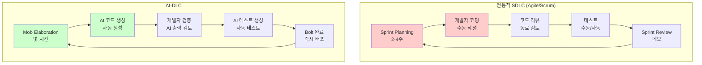
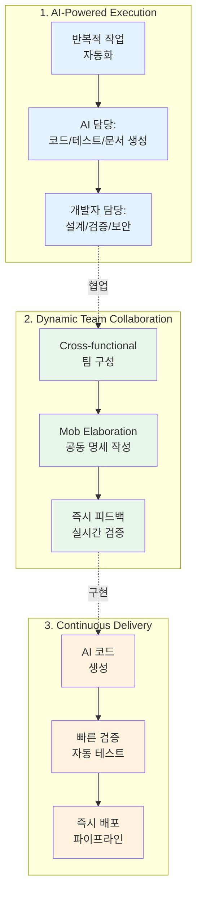
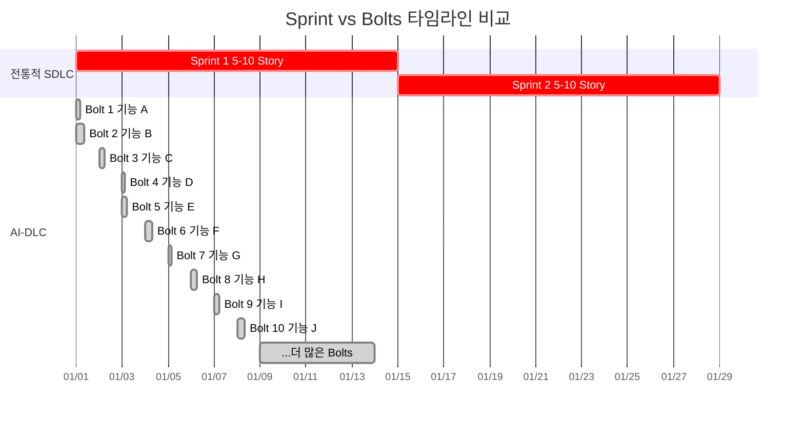
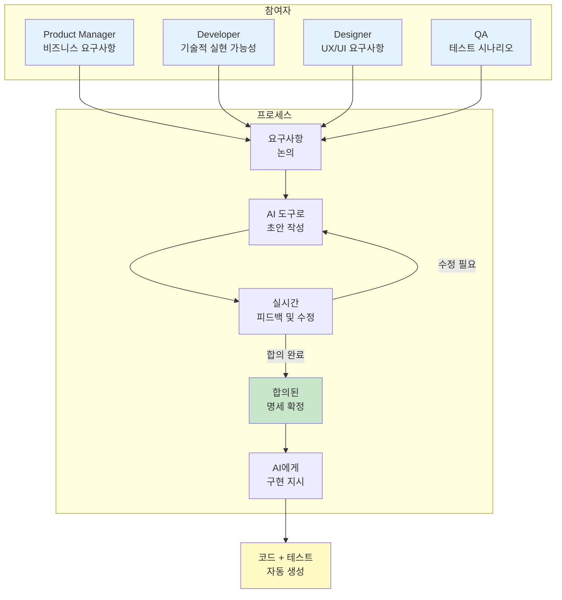
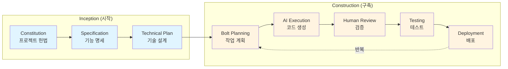
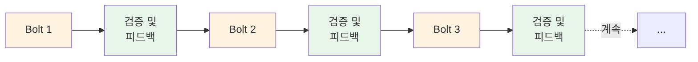
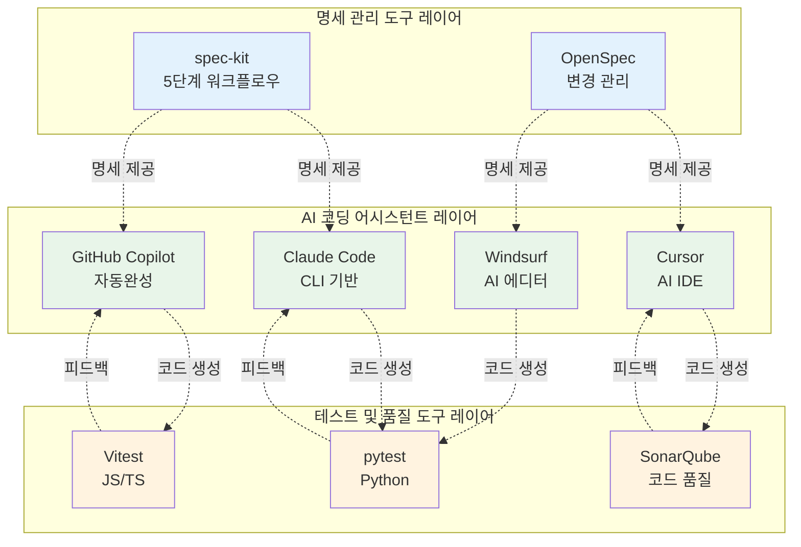

# AI-DLC 개요

## AI-DLC란?

**AI-DLC(AI-Driven Development Life Cycle)**는 AI 기반 도구와 에이전트를 소프트웨어 개발 생명주기의 핵심으로 통합하는 새로운 개발 방법론입니다. 전통적인 SDLC(Software Development Life Cycle)를 AI 시대에 맞게 재구성하여, 개발 속도와 품질을 동시에 향상시킵니다.

### 배경 및 등장 이유

1. **AI 코딩 어시스턴트의 급속한 발전**
   - GitHub Copilot, Claude, GPT-4 등 강력한 AI 도구 등장
   - 단순 코드 자동완성을 넘어 전체 기능 구현 가능

2. **개발 속도의 혁신적 향상**
   - Wipro의 사례: 20시간 만에 애플리케이션 개발 (기존 3-4개월 소요)
   - 코드 생성 속도 10-100배 증가

3. **기존 방법론의 한계**
   - 전통적 Agile/Scrum은 AI 도구 활용을 고려하지 않음
   - Sprint 단위 계획이 AI의 빠른 실행 속도와 맞지 않음

## 전통적 SDLC vs AI-DLC

### 비교표

| 구분 | 전통적 SDLC (Agile) | AI-DLC |
|------|---------------------|--------|
| **개발 주기** | Sprint (2-4주) | Bolts (몇 시간 ~ 며칠) |
| **작업 단위** | User Story | Units of Work |
| **계획 방식** | Sprint Planning | Mob Elaboration |
| **실행 주체** | 개발자 중심 | AI + 개발자 협업 |
| **속도** | 점진적 개선 | 급속한 실행 |
| **품질 관리** | Manual Review | AI-Assisted + Manual Review |
| **문서화** | 최소화 (Working Software) | AI가 자동 생성 + 인간 검증 |

### 워크플로우 비교 다이어그램

**다이어그램 설명:** 전통적 SDLC와 AI-DLC의 개발 사이클을 비교합니다. 전통적 SDLC는 2-4주 Sprint 단위로 개발자가 직접 코딩하는 반면, AI-DLC는 몇 시간 단위의 Bolt로 AI가 코드를 생성하고 개발자는 검증에 집중합니다.



### 주요 차이점

#### 1. **개발 속도**
- **전통적 SDLC**: 2주 Sprint에 5-10개 Story 완료
- **AI-DLC**: 하루에 수십 개 기능 구현 가능 (Bolts 단위: 몇 시간~며칠)

#### 2. **역할 변화**
- **전통적 SDLC**: 개발자가 직접 코드 작성
- **AI-DLC**: 개발자는 명세 작성 및 검증, AI가 코드 생성

#### 3. **문서화**
- **전통적 SDLC**: "작동하는 소프트웨어가 문서보다 중요" (Agile Manifesto)
- **AI-DLC**: 명세가 곧 코드, 문서화가 필수 (AI가 명세를 읽고 구현)

## AI-DLC의 핵심 원칙

AWS가 제시한 AI-DLC는 다음 핵심 원칙을 따릅니다:

### 1. AI-Powered Execution (AI 기반 실행)

AI가 반복적이고 예측 가능한 작업을 자동화하여, 개발자는 고차원적 의사결정에 집중합니다.

**예시:**
- AI가 담당: 코드 생성, 테스트 작성, 문서화
- 개발자가 담당: 아키텍처 설계, 비즈니스 로직 검증, 보안 검토

### 2. Dynamic Team Collaboration (동적 팀 협업)

Cross-functional 팀이 AI 도구를 활용하여 실시간으로 협업합니다.

**특징:**
- **Mob Elaboration**: 여러 역할(개발자, PM, 디자이너)이 함께 명세 작성
- **즉시 피드백**: AI가 명세를 코드로 변환하여 바로 검증 가능
- **역할 유연성**: AI 도구 덕분에 개발자가 아니어도 기능 구현 가능

### 3. Continuous Delivery (지속적 배포)

AI가 생성한 코드를 빠르게 검증하고 배포하는 파이프라인을 구축합니다.

**다이어그램 설명:** AI-DLC의 3가지 핵심 원칙을 시각화합니다. AI-Powered Execution(파란색)은 AI가 코드를 자동 생성하고 개발자는 검증, Dynamic Team Collaboration(초록색)은 다양한 역할이 협업하여 명세 작성, Continuous Delivery(주황색)는 빠른 검증과 배포 파이프라인을 나타냅니다.



## AI-DLC의 주요 용어

### Bolts (볼트)

전통적인 Sprint를 대체하는 AI-DLC의 작업 단위입니다.

**특징:**
- **기간**: 몇 시간 ~ 며칠 (Sprint의 2-4주보다 훨씬 짧음)
- **목표**: 하나의 완결된 기능 또는 가치 제공
- **유연성**: 고정된 기간이 아니라, 작업의 복잡도에 따라 조정

**예시:**
- Bolt 1 (4시간): 사용자 로그인 기능 구현
- Bolt 2 (8시간): 대시보드 UI 및 데이터 시각화
- Bolt 3 (2시간): 이메일 알림 기능 추가

**다이어그램 설명:** 전통적 Sprint와 AI-DLC Bolts의 타임라인을 비교합니다. Sprint는 2주 단위로 5-10개 스토리를 완료하는 반면, Bolts는 동일 기간에 수십 개의 기능을 빠르게 완료할 수 있습니다. 빨간색은 Sprint, 초록색은 Bolt를 나타냅니다.



### Units of Work (작업 단위)

Bolt 내에서 AI가 실행할 구체적인 작업입니다.

**특징:**
- **세분화**: 한 번에 AI가 처리할 수 있는 크기
- **명세 기반**: 명확한 입력/출력 정의 필요
- **검증 가능**: 완료 여부를 자동으로 확인 가능

**예시:**
```
Unit of Work: "사용자 로그인 API 엔드포인트 구현"

Input:
- Email, Password (POST 요청 body)

Output:
- JWT 토큰 (성공 시)
- 에러 메시지 (실패 시)

Acceptance Criteria:
- 유효한 자격증명으로 200 OK 반환
- 잘못된 자격증명으로 401 Unauthorized 반환
- 입력 검증 실패 시 400 Bad Request 반환
```

### Mob Elaboration (몹 엘라보레이션)

여러 역할이 함께 모여 명세를 작성하고 정제하는 활동입니다.

**참여자:**
- Product Manager (비즈니스 요구사항)
- Developer (기술적 실현 가능성)
- Designer (UX/UI 요구사항)
- QA (테스트 시나리오)

**프로세스:**
1. 요구사항 논의
2. AI 도구로 초안 작성
3. 실시간 피드백 및 수정
4. 합의된 명세 확정
5. AI에게 구현 지시

**다이어그램 설명:** Mob Elaboration의 협업 프로세스를 나타냅니다. PM, Developer, Designer, QA가 함께 모여 요구사항을 논의하고 AI가 초안을 생성하면, 실시간으로 피드백하며 명세를 정제합니다. 최종 합의된 명세를 AI가 구현합니다.



## AI-DLC의 단계

AWS AI-DLC는 크게 **Inception(시작)**과 **Construction(구축)** 두 단계로 나뉩니다.

**다이어그램 설명:** AI-DLC의 전체 흐름을 보여줍니다. Inception 단계에서 프로젝트 헌법, 명세, 기술 설계를 정의한 후, Construction 단계에서 Bolt 단위로 반복적으로 개발합니다. 파란색은 Inception, 주황색은 Construction을 나타냅니다.



### Inception (시작 단계)

프로젝트의 방향성과 아키텍처를 정의하는 단계입니다.

**주요 활동:**
1. **Constitution 작성**: 프로젝트 헌법 (코드 스타일, 아키텍처 원칙 등)
2. **High-Level Specification**: 전체 기능 명세
3. **Technical Plan**: 기술 스택 및 아키텍처 선정

**산출물:**
- Constitution 문서
- 기능 명세서 (Specification)
- 기술 계획서 (Plan)
- 초기 프로젝트 구조

### Construction (구축 단계)

실제 기능을 구현하고 반복적으로 개선하는 단계입니다.

**주요 활동:**
1. **Bolt Planning**: Bolt 단위로 작업 계획
2. **Unit of Work Breakdown**: AI가 실행할 작업으로 세분화
3. **AI Execution**: AI 도구를 활용한 코드 생성
4. **Human Review**: 개발자가 코드 검토 및 검증
5. **Integration & Testing**: 통합 및 테스트
6. **Deployment**: 배포 및 모니터링

**반복 주기:**

**다이어그램 설명:** Construction 단계의 Bolt 반복 주기를 나타냅니다. 각 Bolt 완료 후 검증 및 피드백을 거쳐 다음 Bolt로 진행되며, 이 사이클이 계속 반복됩니다. 주황색은 Bolt, 초록색은 검증 단계입니다.



## 실제 사례

### 사례 1: Wipro의 AI-DLC 활용

**출처**: [AWS DevSphere 2025 공식 발표](https://www.aboutamazon.in/news/aws/aws-launches-new-ai-methodology-devsphere)

**프로젝트**: 프로덕션 모듈 개발
**기간**: 하루 이내 (기존: 수 주~수 개월)

**성과:**
- **개발 속도**: AI-DLC와 Amazon Q Developer를 활용하여 **4개의 프로덕션 모듈을 하루 이내**에 개발
- **워크플로우 혁신**: 전통적 Sprint(2-4주) 대신 Bolts(몇 시간~며칠) 단위로 작업
- **AI 활용**: 요구사항, 스토리, 설계, 코드, 테스트를 AI가 신속하게 생성 및 개선

**AWS DevSphere 2025에서 공개된 사례로, S&P Global, HackerRank, Dhan 등 글로벌 기업들도 AI-DLC를 활용하여 개발 프로세스를 월 단위에서 일/시간 단위로 단축**

### 사례 2: Hashrocket의 OpenSpec 실증 테스트

**출처**: [Hashrocket 블로그](https://hashrocket.com/blog/posts/openspec-vs-spec-kit-choosing-the-right-ai-driven-development-workflow-for-your-team)

**배경**: 소프트웨어 컨설팅 회사의 도구 비교 테스트
**목표**: spec-kit과 OpenSpec의 실제 성능 비교

**테스트 결과:**
1. **실행 속도**
   - OpenSpec이 spec-kit보다 명세 파일의 노이즈가 적어 **구현 단계가 눈에 띄게 빠름**
   - 적은 작업 수로 인한 처리 속도 향상

2. **테스트 성공률**
   - RSpec: 327/328 통과 (1개 실패는 기존 이슈)
   - Cucumber: 54/59 통과 (5개 실패는 기존 이슈)
   - **AI가 플래키 테스트를 식별**하고 변경과 무관함을 확인

3. **산출물 효율성**
   - OpenSpec: 약 250줄의 간결한 마크다운 (3개 파일)
   - spec-kit: 동일 단계에서 약 800줄 생성
   - **3배 이상 간결한 명세로 동일한 결과 달성**

**실제 프로덕션 환경에서 검증된 사례로, 기존 프로젝트 개선 시나리오에서 특히 효과적**

## AI-DLC의 장점

### 1. 개발 속도 향상
- AI가 반복적인 코드 작성 자동화
- 몇 주 걸리던 작업을 몇 시간으로 단축

### 2. 품질 향상
- 명세 기반 개발로 요구사항 명확화
- AI가 일관된 코드 스타일 및 패턴 유지
- 자동 테스트 생성으로 버그 사전 발견

### 3. 협업 개선
- Mob Elaboration으로 Cross-functional 팀 시너지
- 명세가 공통 언어 역할, 의사소통 원활

### 4. 진입 장벽 낮춤
- 초보 개발자도 AI 도움으로 복잡한 기능 구현 가능
- 비개발자(PM, 디자이너)도 프로토타입 제작 가능

## AI-DLC의 도전 과제

### 1. 명세 작성 능력 필요
- AI는 명세가 명확해야 제대로 동작
- 개발자는 명세 작성 훈련 필요

### 2. AI 의존도 증가
- AI가 생성한 코드를 맹목적으로 신뢰하면 위험
- 개발자의 코드 리뷰 및 검증 역량 여전히 중요

### 3. 보안 및 윤리 문제
- AI가 생성한 코드에 보안 취약점 포함 가능
- 라이선스 침해 위험 (AI 학습 데이터 문제)

### 4. 도구 생태계 미성숙
- spec-kit, OpenSpec 등 도구가 아직 초기 단계
- 표준화 부족, 도구 간 호환성 문제

## AI-DLC를 위한 도구

### 1. 명세 관리 도구
- **spec-kit**: GitHub에서 개발한 5단계 워크플로우 도구
- **OpenSpec**: 경량화된 spec-driven 프레임워크

### 2. AI 코딩 어시스턴트
- **Claude Code**: Anthropic의 CLI 기반 AI 코딩 도구
- **GitHub Copilot**: GitHub의 코드 자동완성 도구
- **Cursor**: AI 기반 IDE
- **Windsurf**: Codeium의 AI 코딩 에디터

### 3. 테스트 및 품질 도구
- **pytest**: Python 테스트 프레임워크 (AI가 자동 생성)
- **Vitest**: JavaScript/TypeScript 테스트 프레임워크
- **SonarQube**: 코드 품질 분석 도구

**다이어그램 설명:** AI-DLC 도구 생태계의 전체 구조를 나타냅니다. 명세 관리 도구(spec-kit, OpenSpec)가 중심에 있으며, AI 코딩 어시스턴트가 명세를 읽어 코드를 생성하고, 테스트 도구가 품질을 검증합니다. 각 레이어가 유기적으로 연결되어 AI-DLC를 실현합니다.



## 다음 단계

AI-DLC의 개념을 이해했다면, 이제 실제 도구를 비교하고 선택해봅시다:

📚 [도구 비교: spec-kit vs OpenSpec](./tools-comparison.md)

## 참고 자료

### 공식 문서
- [AWS AI-DLC 블로그 (2025)](https://aws.amazon.com/blogs/devops/ai-driven-development-life-cycle/)
- [AWS DevSphere 2025 - AI-DLC 발표](https://www.aboutamazon.in/news/aws/aws-launches-new-ai-methodology-devsphere)
- [AI-DLC: A Critical Yet Hopeful View (Medium)](https://medium.com/data-science-collective/the-ai-driven-development-lifecycle-ai-dlc-a-critical-yet-hopeful-view-edc966173f2f)

### 실증 사례 및 비교
- [Hashrocket: OpenSpec vs spec-kit 실증 테스트](https://hashrocket.com/blog/posts/openspec-vs-spec-kit-choosing-the-right-ai-driven-development-workflow-for-your-team)
- [Agile Manifesto](https://agilemanifesto.org/) - 전통적 Agile 비교
- [GitHub Copilot Research](https://github.blog/2022-09-07-research-quantifying-github-copilots-impact-on-developer-productivity-and-happiness/)

---

**업데이트**: 2025-11-22 | **작성자**: AI-DLC Workshop Team
