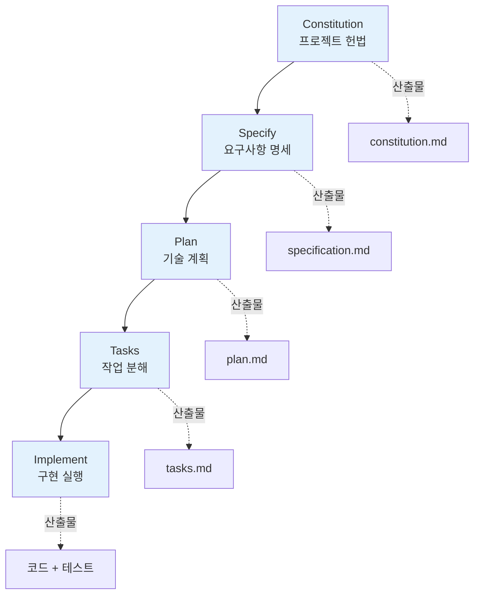
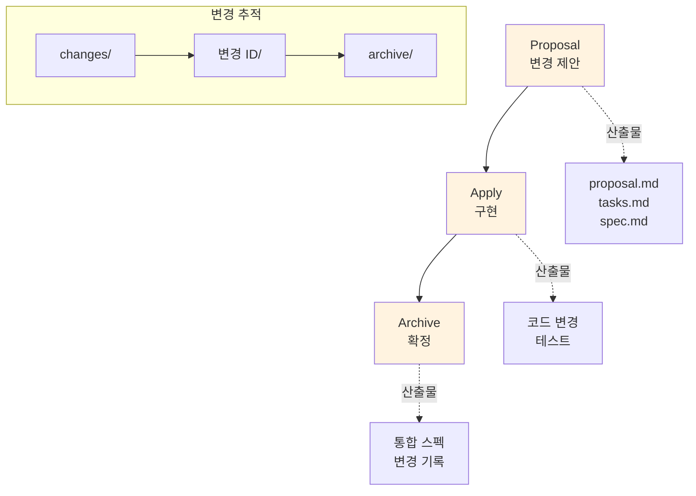
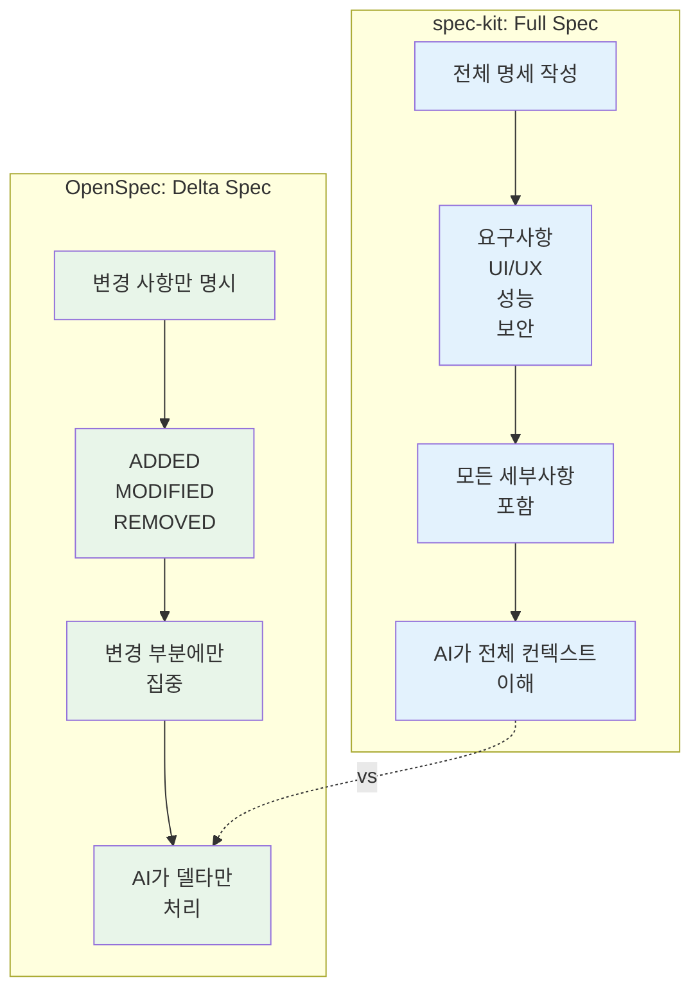
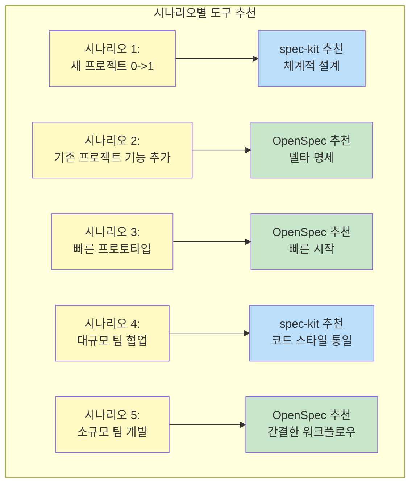
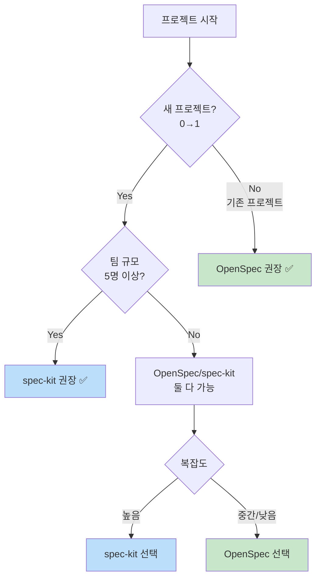
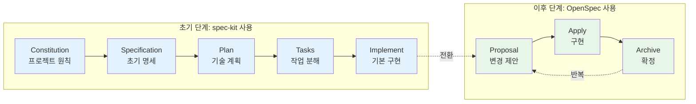

# 도구 비교: spec-kit vs OpenSpec

AI-DLC 방법론을 실제 프로젝트에 적용하려면 명세 관리 도구가 필요합니다. 이 문서에서는 가장 널리 사용되는 두 가지 도구인 **spec-kit**과 **OpenSpec**을 비교하고, 프로젝트 특성에 맞는 도구를 선택하는 방법을 안내합니다.

## spec-kit 개요

**🔗 공식 저장소:** [github/spec-kit](https://github.com/github/spec-kit)

### 소개

**spec-kit**은 GitHub에서 개발한 AI 기반 명세 도구로, 프로젝트 전체 생명주기를 체계적으로 관리하는 5단계 워크플로우를 제공합니다.

**주요 특징:**
- **5단계 워크플로우**: Constitution → Specify → Plan → Tasks → Implement
- **프로젝트 헌법(Constitution)**: 코드 스타일, 아키텍처 원칙 등 프로젝트 원칙 정의
- **AI 통합**: GitHub Copilot, Claude 등 다양한 AI 어시스턴트와 호환
- **메모리 시스템**: `.specify/memory/` 폴더에 모든 명세 저장

### 설치 방법

```bash
# uv를 사용한 설치 (권장)
uv tool install specify-cli --from git+https://github.com/github/spec-kit.git

# 설치 확인
specify --version
```

### 5단계 워크플로우

1. **Constitution**: 프로젝트 헌법 작성 (코드 스타일, 테스트 요구사항 등)
2. **Specify**: 기능 요구사항 명세
3. **Plan**: 기술 스택 및 아키텍처 계획
4. **Tasks**: AI가 실행할 작업으로 세분화
5. **Implement**: AI를 활용한 실제 구현

### 적합한 시나리오

- ✅ **0→1 프로젝트**: 처음부터 새로 시작하는 프로젝트
- ✅ **대규모 프로젝트**: 복잡한 아키텍처와 많은 기능이 필요한 경우
- ✅ **팀 협업**: 여러 개발자가 함께 작업하는 프로젝트
- ✅ **장기 프로젝트**: 명세가 지속적으로 업데이트되는 프로젝트

### 장점

| 장점 | 설명 |
|------|------|
| **체계적 워크플로우** | 5단계 프로세스로 빠짐없이 프로젝트 진행 |
| **Constitution 개념** | 프로젝트 원칙을 명시하여 일관성 유지 |
| **AI 친화적** | AI가 Constitution을 참고하여 일관된 코드 생성 |
| **확장성** | 대규모 프로젝트에도 적용 가능한 구조 |

### 단점

| 단점 | 설명 |
|------|------|
| **초기 설정 복잡** | Constitution, Spec, Plan 등 작성할 문서가 많음 |
| **학습 곡선** | 5단계 워크플로우 숙지 필요 |
| **무거움** | 간단한 프로젝트에는 과도할 수 있음 |
| **아직 초기 단계** | 공식 릴리스 전, 문서 부족 |

---

## OpenSpec 개요

**🔗 공식 저장소:** [Fission-AI/OpenSpec](https://github.com/Fission-AI/OpenSpec)

### 소개

**OpenSpec**은 Fission AI에서 개발한 경량화된 spec-driven 프레임워크로, 기존 프로젝트의 변경 관리에 최적화되어 있습니다.

**주요 특징:**
- **3단계 워크플로우**: Proposal → Apply → Archive
- **변경 중심(Change-Driven)**: 기존 프로젝트에 새 기능 추가 또는 개선
- **Git-like 워크플로우**: 변경 제안을 브랜치처럼 관리
- **델타 기반**: 추가/수정/삭제되는 부분만 명시 (ADDED/MODIFIED/REMOVED)

### 설치 방법

```bash
# npm을 사용한 설치
npm install -g @fission-ai/openspec@latest

# 설치 확인
openspec --version
```

### 3단계 워크플로우

1. **Proposal**: 변경 제안 작성 (동기, 목표, 범위)
2. **Apply**: 승인된 제안 구현 및 코드 변경
3. **Archive**: 완료된 변경 아카이브 및 스펙 업데이트

### 적합한 시나리오

- ✅ **기존 프로젝트 개선**: 이미 운영 중인 프로젝트에 기능 추가
- ✅ **빠른 프로토타이핑**: 최소 명세로 빠르게 구현
- ✅ **변경 추적**: Git처럼 변경 이력 관리 필요
- ✅ **경량화 선호**: 복잡한 설정 없이 바로 시작하고 싶은 경우

### 장점

| 장점 | 설명 |
|------|------|
| **간결함** | 3단계 워크플로우로 빠르게 시작 가능 |
| **변경 추적** | Git-like 워크플로우로 변경 이력 명확 |
| **델타 기반** | 전체 명세가 아닌 변경 부분만 관리 |
| **Claude Code 네이티브 지원** | 슬래시 명령어로 바로 사용 가능 |

### 단점

| 단점 | 설명 |
|------|------|
| **0→1 프로젝트에 약함** | 초기 프로젝트 구조 생성에는 부족 |
| **명세 중복 가능** | 여러 변경이 쌓이면 통합 명세 파악 어려움 |
| **문서화 부족** | 상대적으로 문서 및 예제 적음 |
| **아직 초기 단계** | 커뮤니티 및 플러그인 생태계 미성숙 |

---

## spec-kit vs OpenSpec 비교

### 핵심 비교표

| 구분 | spec-kit | OpenSpec |
|------|----------|----------|
| **워크플로우** | 5단계 (Constitution → Specify → Plan → Tasks → Implement) | 3단계 (Proposal → Apply → Archive) |
| **프로젝트 유형** | 0→1 프로젝트 | 기존 프로젝트 개선 |
| **명세 방식** | 전체 명세 (Full Spec) | 델타 명세 (ADDED/MODIFIED/REMOVED) |
| **초기 설정** | 복잡 (Constitution 등 필요) | 간단 (`openspec init`) |
| **AI 어시스턴트 지원** | Copilot, Claude, Cursor 등 | Claude Code, Cursor 네이티브 |
| **설치** | `uv tool install` (Python) | `npm install -g` (Node.js) |
| **학습 곡선** | 높음 (5단계 이해 필요) | 낮음 (3단계만 숙지) |
| **변경 추적** | 수동 (Git 의존) | 내장 (변경 이력 자동 관리) |
| **적합한 팀 규모** | 중대형 팀 (5명 이상) | 소규모 팀 (1-5명) |

### 워크플로우 비교

#### spec-kit의 5단계

**다이어그램 설명:** spec-kit의 순차적 5단계 워크플로우를 보여줍니다. 각 단계는 명확한 산출물(점선 화살표)을 생성하며, 다음 단계의 입력이 됩니다. 모든 단계를 거쳐야 구현에 도달합니다.



**산출물 구조:**
```
.specify/memory/
├── constitution.md
├── specification.md
├── plan.md
└── tasks.md
```

#### OpenSpec의 3단계

**다이어그램 설명:** OpenSpec의 간결한 3단계 워크플로우를 보여줍니다. Proposal(제안) → Apply(구현) → Archive(확정) 순서로 진행되며, 하단의 서브그래프는 변경 이력이 changes/ 폴더에서 archive/로 이동하는 과정을 나타냅니다.



**산출물 구조:**
```
openspec/
├── project.md                        # 프로젝트 개요
├── changes/
│   └── add-feature-x/                # 변경 ID
│       ├── proposal.md               # 변경 제안
│       ├── tasks.md                  # 작업 목록
│       └── specs/
│           └── feature-x/
│               └── spec.md           # 델타 명세 (ADDED/MODIFIED/REMOVED)
└── specs/                            # 아카이브된 최종 스펙
    └── feature-x/
        └── spec.md
```

### 명세 작성 방식 비교

#### spec-kit: 전체 명세 (Full Spec)

```markdown
## Specification

### 기능: 사용자 로그인

**요구사항:**
- 사용자는 이메일과 비밀번호로 로그인할 수 있어야 함
- 로그인 성공 시 JWT 토큰 발급
- 로그인 실패 시 적절한 에러 메시지 표시
- 비밀번호는 bcrypt로 해싱하여 저장

**UI/UX:**
- 로그인 폼은 이메일, 비밀번호 필드 포함
- "로그인" 버튼 클릭 시 서버에 요청
- 로딩 중 스피너 표시

**성능:**
- 로그인 요청은 200ms 이내 응답
```

#### OpenSpec: 델타 명세 (Delta Spec)

```markdown
## ADDED Requirements

- 사용자는 이메일과 비밀번호로 로그인할 수 있어야 함
- 로그인 성공 시 JWT 토큰 발급

## ADDED UI Components

- LoginForm 컴포넌트 (이메일, 비밀번호 입력, 로그인 버튼)

## ADDED API Endpoints

- POST /api/auth/login
  - Input: { email, password }
  - Output: { token, user }
```

**다이어그램 설명:** spec-kit의 Full Spec(왼쪽, 파란색)은 전체 요구사항을 상세히 기술하는 반면, OpenSpec의 Delta Spec(오른쪽, 초록색)은 ADDED/MODIFIED/REMOVED 형식으로 변경 사항만 명시합니다. Full Spec은 초기 프로젝트에, Delta Spec은 기존 프로젝트 변경에 적합합니다.



---

## 사용 시나리오별 추천

### 시나리오 1: 새로운 프로젝트 시작 (0→1)

**추천: spec-kit**

**이유:**
- Constitution으로 프로젝트 원칙 명확화
- Specification → Plan → Tasks로 체계적 설계
- 초기 아키텍처 설정 시 AI의 도움 극대화

**예시:**
- 새로운 SaaS 애플리케이션 개발
- 사내 도구 처음부터 구축
- MVP(Minimum Viable Product) 개발

### 시나리오 2: 기존 프로젝트에 기능 추가

**추천: OpenSpec**

**이유:**
- Proposal로 변경 영향 분석 용이
- 델타 명세로 변경 부분만 집중
- 변경 이력 자동 관리로 추적 편리

**예시:**
- 운영 중인 웹 앱에 결제 기능 추가
- 레거시 시스템 API 엔드포인트 추가
- 버그 수정 및 성능 개선

### 시나리오 3: 프로토타입 빠르게 만들기

**추천: OpenSpec**

**이유:**
- 3단계 워크플로우로 빠른 시작
- 최소 명세로 AI에게 지시 가능
- Constitution 등 초기 설정 불필요

**예시:**
- 데모 앱 제작
- 아이디어 검증용 프로토타입
- 해커톤 프로젝트

### 시나리오 4: 대규모 팀 협업 프로젝트

**추천: spec-kit**

**이유:**
- Constitution으로 팀 전체 코드 스타일 통일
- Specification이 공통 언어 역할
- 체계적 워크플로우로 역할 분담 명확

**예시:**
- 10명 이상 개발자 참여 프로젝트
- 장기 엔터프라이즈 프로젝트
- 오픈소스 프로젝트 (기여자 많음)

### 시나리오 5: 혼자 또는 소규모 팀 개발

**추천: OpenSpec**

**이유:**
- 간결한 워크플로우로 오버헤드 최소화
- Claude Code 슬래시 명령어로 빠른 실행
- 변경 이력 자동 관리로 Git과 시너지

**예시:**
- 개인 프로젝트
- 스타트업 초기 개발 (2-5명)
- 사이드 프로젝트

**다이어그램 설명:** 5가지 시나리오별로 추천 도구를 매트릭스로 정리합니다. 프로젝트 유형(새 프로젝트, 기존 프로젝트), 팀 규모(대규모, 소규모), 목적(프로토타입)에 따라 spec-kit(파란색) 또는 OpenSpec(초록색)을 추천합니다.



---

## 도구 선택 플로우차트

**다이어그램 설명:** 프로젝트 특성에 따라 spec-kit 또는 OpenSpec을 선택하는 의사결정 트리입니다. 기존 프로젝트는 OpenSpec(초록색), 새 프로젝트에서 대규모 팀은 spec-kit(파란색)을 권장합니다. 소규모 팀은 복잡도에 따라 선택합니다.



### 결정 기준 질문

1. **프로젝트가 처음부터 시작인가요?**
   - Yes → spec-kit 고려
   - No → OpenSpec 고려

2. **팀 규모는 몇 명인가요?**
   - 5명 이상 → spec-kit
   - 5명 미만 → OpenSpec

3. **프로젝트 복잡도는?**
   - 높음 (마이크로서비스, 복잡한 아키텍처) → spec-kit
   - 중간/낮음 → OpenSpec

4. **얼마나 빨리 시작하고 싶나요?**
   - 최대한 빠르게 → OpenSpec
   - 체계적으로 설계 후 시작 → spec-kit

5. **변경 추적이 중요한가요?**
   - 매우 중요 → OpenSpec
   - 보통 → spec-kit (Git과 함께 사용)

---

## 두 도구를 함께 사용하는 전략

### 하이브리드 접근

spec-kit과 OpenSpec을 조합하여 각각의 강점을 활용할 수 있습니다.

**전략 1: 초기는 spec-kit, 이후는 OpenSpec**

1. **프로젝트 시작**: spec-kit으로 Constitution, 초기 Spec, Plan 작성
2. **첫 구현**: spec-kit의 Tasks → Implement 프로세스로 기본 기능 구현
3. **이후 개선**: OpenSpec으로 새 기능 추가 및 변경 관리

**장점:**
- 초기 체계적 설계 + 이후 유연한 변경 관리
- 두 도구의 장점을 모두 활용

**단점:**
- 두 도구를 모두 학습해야 함
- 명세가 두 곳에 분산될 수 있음

**다이어그램 설명:** 하이브리드 워크플로우는 프로젝트 초기에 spec-kit으로 체계적 설계를 하고(파란색), 이후 OpenSpec으로 변경 관리를 하는(초록색) 전략입니다. spec-kit의 Constitution과 초기 명세가 확립되면 OpenSpec의 Proposal → Apply → Archive 사이클로 전환합니다.



### 프로젝트별 선택

여러 프로젝트를 운영한다면, 각 프로젝트 특성에 맞게 선택합니다.

**예시:**
- **프로젝트 A (신규 SaaS)**: spec-kit 사용
- **프로젝트 B (기존 API 개선)**: OpenSpec 사용
- **프로젝트 C (프로토타입)**: OpenSpec 사용

---

## AI 코딩 어시스턴트별 지원

### Claude Code

| 도구 | 지원 방식 | 명령어 예시 |
|------|----------|------------|
| **spec-kit** | 슬래시 명령어 | `/speckit.constitution`, `/speckit.specify` |
| **OpenSpec** | 네이티브 슬래시 명령어 | `/openspec:proposal`, `/openspec:apply` |

**권장:** Claude Code 사용자는 OpenSpec이 더 편리 (네이티브 지원)

### Cursor

| 도구 | 지원 방식 | 활용 방법 |
|------|----------|----------|
| **spec-kit** | `--ai cursor-agent` 옵션 | Rules 기능으로 슬래시 명령어 매핑 |
| **OpenSpec** | Rules 기능 | 커스텀 명령어 작성 |

**권장:** Cursor 사용자는 둘 다 비슷한 수준으로 사용 가능

### GitHub Copilot

| 도구 | 지원 방식 | 활용 방법 |
|------|----------|----------|
| **spec-kit** | 우수 | GitHub에서 개발, Copilot과 시너지 |
| **OpenSpec** | 보통 | 명세를 주석으로 작성하여 Copilot 힌트 제공 |

**권장:** GitHub Copilot 사용자는 spec-kit 권장

---

## 실습 안내

### spec-kit 실습

📚 [spec-kit 설치 및 설정](../tools/spec-kit/)
💻 [실습 1: TODO 앱 명세 작성](../practice/spec-kit-todo-app/)

### OpenSpec 실습

📚 [OpenSpec 설치 및 설정](../tools/openspec/)
💻 [실습 2: 계산기 히스토리 기능 추가](../practice/openspec-calculator/)

---

## 참고 자료

### 공식 문서
- [spec-kit GitHub](https://github.com/github/spec-kit)
- [OpenSpec GitHub](https://github.com/Fission-AI/OpenSpec)
- [spec-kit 공식 블로그 (GitHub)](https://github.blog/ai-and-ml/generative-ai/spec-driven-development-with-ai-get-started-with-a-new-open-source-toolkit/)

### 비교 분석 글
- [OpenSpec vs spec-kit 실증 테스트 (Hashrocket)](https://hashrocket.com/blog/posts/openspec-vs-spec-kit-choosing-the-right-ai-driven-development-workflow-for-your-team)
- [Spec-Driven Development with Cursor (Mad Devs)](https://maddevs.io/writeups/project-creation-using-spec-kit-and-cursor/)
- [Understanding SDD: Kiro, spec-kit, Tessl (Martin Fowler)](https://martinfowler.com/articles/exploring-gen-ai/sdd-3-tools.html)

### 커뮤니티
- [OpenSpec Cursor 통합 논의 (Forum)](https://forum.cursor.com/t/openspec-lightweight-portable-spec-driven-framework-for-ai-coding-assistants/134052)
- [spec-kit Discussions](https://github.com/github/spec-kit/discussions)

---

**업데이트**: 2025-11-22 | **작성자**: AI-DLC Workshop Team
