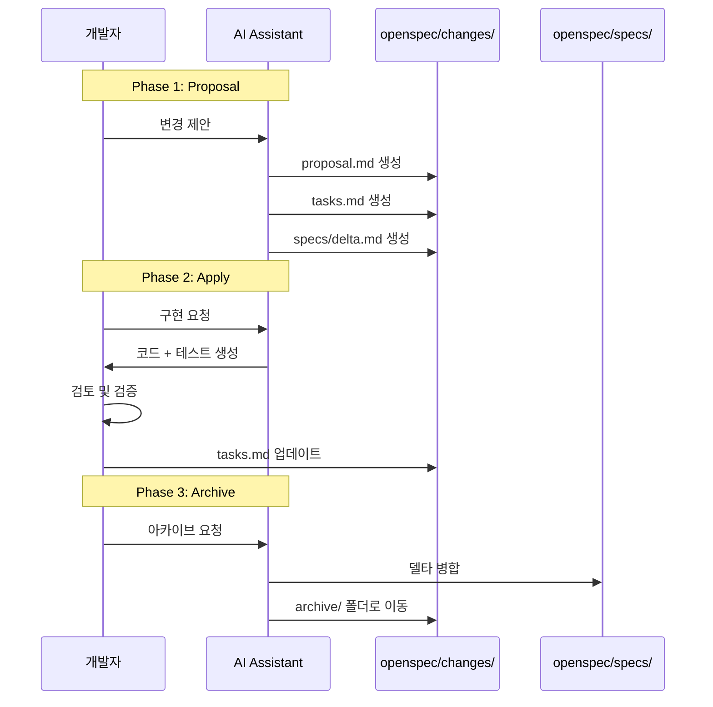

# OpenSpec 워크플로우 가이드

OpenSpec의 3단계 워크플로우를 상세히 설명하고, Claude Code에서 효과적으로 활용하는 방법을 안내합니다.

## 3단계 워크플로우 개요

OpenSpec은 변경 중심(Change-Driven)으로 설계되어, 기존 프로젝트에 새 기능을 추가하거나 개선하는 과정을 다음 3단계로 관리합니다:

**시퀀스 다이어그램 설명:** OpenSpec의 3단계를 시간 순서대로 보여줍니다. Phase 1(Proposal)에서 변경 제안 및 델타 명세를 작성하고, Phase 2(Apply)에서 구현 후, Phase 3(Archive)에서 `changes/` 폴더의 델타를 `specs/`로 병합하고 아카이브합니다.



각 단계는 Git의 브랜치, 커밋, 머지와 유사한 개념으로 이해할 수 있습니다:
- **Proposal** = 브랜치 생성
- **Apply** = 커밋
- **Archive** = 머지

---

## Phase 1: Proposal (변경 제안)

### 목적

새로운 기능 추가 또는 기존 기능 개선의 필요성과 계획을 문서화합니다.

### 산출물

**폴더**: `openspec/changes/<change-id>/`

**주요 파일**:
- `proposal.md` - 변경 제안 (동기, 목표, 범위, 영향 분석)
- `tasks.md` - 구현 작업 목록
- `specs/<feature>/spec.md` - 델타 명세 (ADDED/MODIFIED/REMOVED)

### 명령어

```bash
# CLI에서 실행
openspec propose add-calculator-history

# Claude Code에서 실행
/openspec:proposal "계산기에 히스토리 기능 추가"
```

### Proposal 작성 가이드

**`proposal.md` 구조:**
```markdown
# Proposal: [변경 제목]

## 개요
변경 ID, 제안 일자, 예상 소요 시간

## 배경 및 동기
왜 이 변경이 필요한가?

## 목표
이 변경으로 달성하려는 것은 무엇인가?

## 범위
### 포함 사항
이 변경에 포함되는 것

### 제외 사항
이 변경에 포함되지 않는 것

## 영향받는 컴포넌트
어떤 파일/모듈이 수정되는가?

## 성공 기준
어떻게 완료 여부를 판단하는가?
```

### 델타 명세 (Spec Delta) 작성

OpenSpec의 핵심 개념은 **델타 기반 명세**입니다. 전체 명세가 아닌 변경되는 부분만 작성합니다.

**델타 형식:**
- `ADDED Requirements` - 새로 추가되는 요구사항
- `MODIFIED Requirements` - 수정되는 요구사항
- `REMOVED Requirements` - 제거되는 요구사항

**예시 (`specs/calculator/spec.md`):**
```markdown
# Spec Delta: Calculator History

## ADDED Requirements

### Requirement: History Storage
- Calculator must save calculation history
- Each entry includes: operation, operands, result, timestamp
- Maximum 100 entries (oldest deleted when exceeded)

### Requirement: History Display
- User can view calculation history
- History displayed in reverse chronological order (newest first)
- Format: `<timestamp>: <operand1> <operation> <operand2> = <result>`

### Requirement: History Management
- User can clear all history
- User can delete specific history entry
- User can export history to CSV file

## MODIFIED Requirements

(없음 - 기존 기능 변경 없음)

## REMOVED Requirements

(없음 - 제거되는 기능 없음)
```

### Best Practices

1. **명확한 동기 작성**: 왜 이 변경이 필요한지 설득력 있게 작성
2. **범위 제한**: 한 번에 너무 많은 것을 하지 말고, 작고 완결된 변경
3. **영향 분석**: 이 변경이 다른 기능에 미치는 영향 파악
4. **검증 가능한 성공 기준**: 체크리스트 형태로 명확히 작성

---

## Phase 2: Apply (변경 적용)

### 목적

승인된 Proposal을 실제로 구현합니다. AI를 활용하여 코드를 생성하고, 개발자가 검토합니다.

### 명령어

```bash
# CLI에서 실행
openspec apply add-calculator-history

# Claude Code에서 실행
/openspec:apply
```

**참고**: `/openspec:apply`는 현재 활성화된 변경(가장 최근 Proposal)을 자동으로 적용합니다.

### 구현 프로세스

1. **AI 코드 생성**:
   - AI가 Proposal과 Spec Delta를 읽고 코드 생성
   - 파일 생성 또는 수정

2. **개발자 검토**:
   - 생성된 코드 검증
   - 로직 확인 및 필요 시 수정

3. **테스트 실행**:
   - 작성된 테스트 실행
   - 기존 테스트도 통과하는지 확인 (회귀 테스트)

4. **Tasks 업데이트**:
   - `tasks.md`의 체크리스트 업데이트
   - 완료된 작업 체크

### Apply 단계 예시

**시나리오**: 계산기에 히스토리 기능 추가

**1단계: Claude Code에서 Apply 실행**
```
/openspec:apply
```

**2단계: AI가 생성한 코드 검토**
```python
# src/history.py (AI가 생성)
from datetime import datetime
from typing import List, Dict

class CalculatorHistory:
    def __init__(self, max_entries: int = 100):
        self.history: List[Dict] = []
        self.max_entries = max_entries

    def add_entry(self, operand1: float, operation: str, operand2: float, result: float):
        entry = {
            "timestamp": datetime.now(),
            "operand1": operand1,
            "operation": operation,
            "operand2": operand2,
            "result": result
        }
        self.history.insert(0, entry)
        if len(self.history) > self.max_entries:
            self.history.pop()

    def get_history(self) -> List[Dict]:
        return self.history

    def clear_history(self):
        self.history.clear()

    def delete_entry(self, index: int):
        if 0 <= index < len(self.history):
            del self.history[index]

    def export_to_csv(self, filename: str):
        import csv
        with open(filename, 'w', newline='') as f:
            writer = csv.DictWriter(f, fieldnames=['timestamp', 'operand1', 'operation', 'operand2', 'result'])
            writer.writeheader()
            writer.writerows(self.history)
```

**3단계: 테스트 실행**
```bash
pytest tests/test_history.py
```

**4단계: Tasks 업데이트**
```markdown
# tasks.md

- [x] Task 1: Create CalculatorHistory class
- [x] Task 2: Implement add_entry method
- [x] Task 3: Implement get_history method
- [x] Task 4: Implement clear_history method
- [x] Task 5: Implement delete_entry method
- [x] Task 6: Implement export_to_csv method
- [x] Task 7: Write unit tests
- [ ] Task 8: Integrate with main calculator (진행 중)
```

### Best Practices

1. **점진적 구현**: 모든 기능을 한 번에 하지 말고 작업 단위로 나누어 구현
2. **즉시 테스트**: 각 작업 완료 후 바로 테스트 실행
3. **코드 리뷰**: AI 코드를 맹목적으로 신뢰하지 말고 반드시 검토
4. **Git 커밋**: 작업 완료 후 의미 있는 단위로 커밋

---

## Phase 3: Archive (변경 아카이브)

### 목적

완료된 변경을 확정하고, 델타 명세를 프로젝트 전체 스펙에 통합합니다.

### 명령어

```bash
# CLI에서 실행
openspec archive add-calculator-history

# Claude Code에서 실행
/openspec:archive
```

### Archive 프로세스

1. **변경 완료 확인**:
   - 모든 Tasks가 완료되었는지 확인
   - 테스트가 모두 통과하는지 확인

2. **스펙 통합**:
   - `openspec/changes/<change-id>/specs/` → `openspec/specs/`로 이동
   - 델타 명세를 전체 스펙에 병합

3. **변경 폴더 아카이브**:
   - `openspec/changes/<change-id>/` → `openspec/changes/archive/<change-id>/`로 이동

4. **문서 업데이트**:
   - `project.md`의 "Current Features" 섹션 업데이트

### Archive 후 폴더 구조

**Before Archive:**
```
openspec/
├── project.md
├── changes/
│   └── add-calculator-history/    ← 활성 변경
│       ├── proposal.md
│       ├── tasks.md
│       └── specs/
│           └── calculator/
│               └── spec.md
└── specs/
    └── calculator/
        └── spec.md (기존 스펙)
```

**After Archive:**
```
openspec/
├── project.md (업데이트됨)
├── changes/
│   └── archive/
│       └── add-calculator-history/    ← 아카이브됨
│           ├── proposal.md
│           ├── tasks.md
│           └── specs/
│               └── calculator/
│                   └── spec.md
└── specs/
    └── calculator/
        └── spec.md (델타 병합됨)
```

### 스펙 병합 예시

**기존 스펙 (`openspec/specs/calculator/spec.md`):**
```markdown
# Calculator Spec

## Requirements

### Requirement: Basic Arithmetic
- Add, subtract, multiply, divide operations
- Input validation (division by zero)
```

**델타 명세 (`openspec/changes/add-calculator-history/specs/calculator/spec.md`):**
```markdown
## ADDED Requirements

### Requirement: History Storage
- Save calculation history

### Requirement: History Display
- View calculation history
```

**병합 후 스펙 (`openspec/specs/calculator/spec.md`):**
```markdown
# Calculator Spec

## Requirements

### Requirement: Basic Arithmetic
- Add, subtract, multiply, divide operations
- Input validation (division by zero)

### Requirement: History Storage
- Save calculation history
- Maximum 100 entries

### Requirement: History Display
- View calculation history
- Reverse chronological order
```

### Best Practices

1. **완료 확인 철저히**: 모든 Tasks가 완료되고 테스트 통과 후에만 Archive
2. **문서 업데이트**: project.md의 Current Features를 최신 상태로 유지
3. **변경 이력 보존**: Archive된 변경은 삭제하지 말고 보관 (Git 이력처럼)
4. **다음 변경 준비**: Archive 후 새로운 Proposal 작성 가능

---

## 워크플로우 예시: 전체 사이클

### 시나리오: 계산기에 히스토리 기능 추가

**1단계: Proposal**
```bash
/openspec:proposal "계산기에 히스토리 기능 추가. 계산 기록을 저장하고 조회, 삭제, CSV 내보내기 기능 제공."
```

**생성되는 파일:**
- `openspec/changes/add-calculator-history/proposal.md`
- `openspec/changes/add-calculator-history/tasks.md`
- `openspec/changes/add-calculator-history/specs/calculator/spec.md`

**2단계: Apply**
```bash
/openspec:apply
```

**AI가 수행:**
- `src/history.py` 생성
- `tests/test_history.py` 생성
- 기존 `src/calculator.py` 수정 (히스토리 통합)

**개발자가 수행:**
- 코드 검토 및 수정
- 테스트 실행 (`pytest tests/`)
- Tasks 체크리스트 업데이트

**3단계: Archive**
```bash
/openspec:archive
```

**OpenSpec이 수행:**
- 델타 명세를 `openspec/specs/calculator/spec.md`에 병합
- 변경 폴더를 `archive/`로 이동
- `project.md` 업데이트

**완료!** 이제 다음 변경을 시작할 수 있습니다.

---

## 검증 및 조회 명령어

### openspec validate

변경 제안이 올바른 형식인지 검증합니다.

```bash
openspec validate add-calculator-history

# 예상 출력:
# ✅ proposal.md is valid
# ✅ tasks.md is valid
# ✅ specs/calculator/spec.md is valid
# ❌ Missing: Success Criteria in proposal.md
```

### openspec show

특정 변경의 상세 정보를 표시합니다.

```bash
openspec show add-calculator-history

# 예상 출력:
# Change ID: add-calculator-history
# Status: In Progress
# Proposed: 2025-11-22
# Tasks: 5/8 completed
```

### openspec list

모든 변경 목록을 표시합니다.

```bash
openspec list

# 예상 출력:
# Active Changes:
# - add-calculator-history (In Progress, 5/8 tasks)
#
# Archived Changes:
# - fix-division-by-zero (Completed, 2025-11-20)
```

---

## 다음 단계

OpenSpec 워크플로우를 이해했다면, 실습을 통해 직접 경험해보세요:

💻 [실습: 계산기 히스토리 기능 추가](../../practice/openspec-calculator/)

## 참고 자료

- [OpenSpec GitHub](https://github.com/Fission-AI/OpenSpec)
- [OpenSpec vs spec-kit 비교](../../concepts/tools-comparison.md)

---

**업데이트**: 2025-11-22
