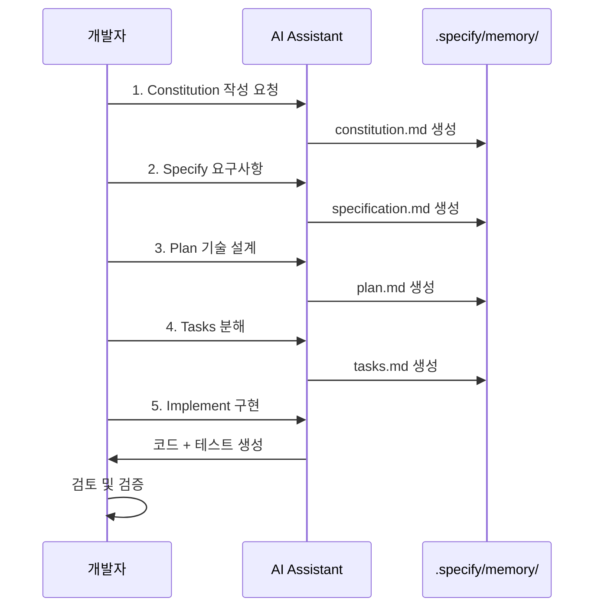

# spec-kit 워크플로우 가이드

spec-kit의 5단계 워크플로우를 상세히 설명하고, Claude Code에서 효과적으로 활용하는 방법을 안내합니다.

## 5단계 워크플로우 개요

spec-kit은 AI-DLC 방법론의 Inception과 Construction 단계를 다음 5단계로 구체화합니다:

**시퀀스 다이어그램 설명:** 개발자와 AI Assistant 간의 상호작용을 시간 순서대로 보여줍니다. 개발자가 각 단계를 요청하면 AI가 `.specify/memory/` 폴더에 해당 문서를 생성합니다. 마지막 Implement 단계에서는 코드를 생성하고 개발자가 검토합니다.



각 단계는 명확한 산출물을 생성하며, 다음 단계의 입력이 됩니다.

---

## Step 1: Constitution (프로젝트 헌법)

### 목적

프로젝트의 기본 원칙, 코드 스타일, 아키텍처 가이드라인을 정의합니다. AI가 코드를 생성할 때 이 헌법을 참고하여 일관성을 유지합니다.

### 산출물

**파일**: `.specify/memory/constitution.md`

**포함 내용:**
- 프로그래밍 언어 및 버전
- 프레임워크 및 라이브러리
- 코드 스타일 가이드
- 아키텍처 패턴
- 테스트 요구사항
- 보안 및 성능 기준

### 명령어

```bash
# CLI에서 실행
specify constitution "프로젝트는 Python 3.12, FastAPI, SQLAlchemy를 사용합니다. 코드는 PEP 8을 따르고, 타입 힌트를 필수로 작성합니다."

# Claude Code에서 실행
/speckit.constitution "프로젝트는 Python 3.12, FastAPI, SQLAlchemy를 사용합니다."
```

### 예시 Constitution

```markdown
# Project Constitution

## Programming Language
- **Python**: 3.12+
- Type hints required for all functions

## Frameworks & Libraries
- **Web Framework**: FastAPI
- **ORM**: SQLAlchemy 2.0+
- **Database**: PostgreSQL
- **Testing**: pytest

## Code Style
- **Linter**: ruff
- **Formatter**: black
- **Style Guide**: PEP 8
- **Max line length**: 100 characters

## Architecture
- **Pattern**: Layered Architecture
  - API Layer (FastAPI routes)
  - Business Logic Layer (services)
  - Data Layer (SQLAlchemy models)
- **Dependency Injection**: Use FastAPI's Depends()

## Testing
- **Unit tests**: 80% coverage minimum
- **Integration tests**: All API endpoints
- **Test naming**: test_<function_name>_<scenario>

## Security
- **Authentication**: JWT tokens
- **Password hashing**: bcrypt
- **SQL Injection**: Use SQLAlchemy ORM (no raw queries)
- **Input validation**: Pydantic models

## Performance
- **Database queries**: Use async SQLAlchemy
- **API response time**: < 200ms for 95th percentile
- **Pagination**: Default 20 items per page, max 100
```

### Best Practices

1. **구체적으로 작성**: "좋은 코드 작성"이 아니라 "PEP 8 준수, 타입 힌트 필수"
2. **AI가 이해할 수 있도록**: AI가 코드를 생성할 때 참고할 명확한 지침 제공
3. **프로젝트 초기 작성**: Constitution은 프로젝트 시작 시 한 번 작성 후 필요시 업데이트
4. **팀 합의**: 여러 개발자가 참여한다면 팀 전체가 동의하는 내용으로 작성

---

## Step 2: Specify (요구사항 명세)

### 목적

프로젝트의 기능 요구사항을 상세히 작성합니다. "무엇을 만들 것인가"를 정의합니다.

### 산출물

**파일**: `.specify/memory/specification.md`

**포함 내용:**
- 기능 목록
- 사용자 스토리
- UI/UX 요구사항
- 비기능 요구사항 (성능, 보안 등)
- Acceptance Criteria (완료 기준)

### 명령어

```bash
# CLI에서 실행
specify specify "TODO 앱은 사용자가 할 일을 추가, 조회, 수정, 삭제할 수 있어야 합니다. 할 일은 제목, 설명, 완료 여부, 생성 날짜를 포함합니다."

# Claude Code에서 실행
/speckit.specify "TODO CRUD 기능 구현"
```

### 예시 Specification

```markdown
# Project Specification: TODO App

## Overview
A simple TODO application that allows users to manage their daily tasks.

## Features

### Feature 1: TODO CRUD Operations

**As a user**, I want to manage my TODO items so that I can track my tasks.

#### Requirements

**Create TODO**
- User can add a new TODO item
- Required fields: title (string, max 100 chars)
- Optional fields: description (string, max 500 chars)
- Auto-generated fields: id (UUID), created_at (timestamp), is_completed (boolean, default false)

**Read TODO**
- User can view all TODO items
- User can view a single TODO item by ID
- TODO list is sorted by created_at (newest first)
- Pagination: 20 items per page

**Update TODO**
- User can edit title and description
- User can mark TODO as completed/uncompleted
- Updated_at timestamp is automatically updated

**Delete TODO**
- User can delete a TODO item
- Soft delete (mark as deleted, not remove from database)
- Deleted items are not shown in list

#### Acceptance Criteria

- ✅ All CRUD operations work correctly
- ✅ Input validation returns clear error messages
- ✅ API responses follow REST conventions
- ✅ Database constraints prevent invalid data

### Feature 2: TODO Filtering

**As a user**, I want to filter TODO items so that I can focus on specific tasks.

#### Requirements

**Filter by Status**
- User can filter by: all, completed, pending
- Default: show all

**Filter by Date**
- User can filter by created date range
- Format: YYYY-MM-DD

**Search by Keyword**
- User can search TODO items by title or description
- Case-insensitive search

#### Acceptance Criteria

- ✅ Filters can be combined
- ✅ Search returns relevant results
- ✅ Empty results return appropriate message

## UI/UX Requirements

**TODO List View**
- Display title, completion status, created date
- Checkbox to mark as completed
- Edit and Delete buttons
- Add New TODO button at top

**TODO Form**
- Title input (required)
- Description textarea (optional)
- Save and Cancel buttons
- Validation errors displayed inline

**Responsive Design**
- Mobile-friendly (works on 320px width)
- Desktop optimized (max-width 1200px)

## Non-Functional Requirements

**Performance**
- API response time: < 200ms (95th percentile)
- Support 1000 concurrent users
- Database queries optimized (no N+1 queries)

**Security**
- All inputs validated server-side
- SQL injection prevention (use ORM)
- CORS configured for frontend domain

**Reliability**
- 99.9% uptime
- Database backups daily
- Error handling with appropriate HTTP status codes

**Scalability**
- Database indexing on frequently queried fields
- Caching for read-heavy operations (future)
```

### Best Practices

1. **사용자 관점 작성**: "시스템은..."보다 "사용자는..."
2. **Acceptance Criteria 명시**: 명확한 완료 기준 제공
3. **비기능 요구사항 포함**: 성능, 보안 등도 중요
4. **UI/UX 상세히 작성**: AI가 프론트엔드 코드도 생성할 수 있도록

---

## Step 3: Plan (기술 계획)

### 목적

"어떻게 만들 것인가"를 정의합니다. 기술 스택, 아키텍처, 데이터 모델 등을 설계합니다.

### 산출물

**파일**: `.specify/memory/plan.md`

**포함 내용:**
- 기술 스택 선정 및 근거
- 시스템 아키텍처
- 데이터 모델 (DB 스키마)
- API 설계
- 폴더 구조

### 명령어

```bash
# CLI에서 실행
specify plan

# Claude Code에서 실행
/speckit.plan
```

**참고:** Plan 단계는 Constitution과 Specification을 기반으로 AI가 자동 생성하므로, 별도 인자 없이 실행합니다.

### 예시 Plan

```markdown
# Technical Plan: TODO App

## Tech Stack

### Backend
- **Language**: Python 3.12
- **Framework**: FastAPI 0.104+
- **ORM**: SQLAlchemy 2.0+ (async)
- **Database**: PostgreSQL 16
- **Validation**: Pydantic 2.0+

**Rationale:**
- FastAPI: High performance, async support, auto-generated OpenAPI docs
- SQLAlchemy 2.0: Modern ORM with async support
- PostgreSQL: Reliable, supports complex queries, full-text search

### Frontend (Future)
- React 18 + TypeScript
- Tailwind CSS for styling

### Testing
- **Unit tests**: pytest
- **Integration tests**: pytest with TestClient
- **Coverage**: pytest-cov

### Development Tools
- **Package manager**: uv
- **Linter**: ruff
- **Formatter**: black
- **Type checker**: mypy

## Architecture

### System Architecture

```
┌─────────────┐
│   Client    │
│ (Browser)   │
└──────┬──────┘
       │ HTTP/HTTPS
       ↓
┌──────────────────┐
│   API Layer      │
│   (FastAPI)      │
│   - Routes       │
│   - Validation   │
└──────┬───────────┘
       │
       ↓
┌──────────────────┐
│  Service Layer   │
│  (Business Logic)│
└──────┬───────────┘
       │
       ↓
┌──────────────────┐
│  Data Layer      │
│  (SQLAlchemy)    │
└──────┬───────────┘
       │
       ↓
┌──────────────────┐
│   PostgreSQL     │
│   (Database)     │
└──────────────────┘
```

### Folder Structure

```
todo-app/
├── src/
│   ├── api/
│   │   ├── __init__.py
│   │   ├── routes/
│   │   │   ├── __init__.py
│   │   │   └── todos.py       # TODO CRUD endpoints
│   │   └── dependencies.py     # FastAPI dependencies
│   ├── services/
│   │   ├── __init__.py
│   │   └── todo_service.py     # Business logic
│   ├── models/
│   │   ├── __init__.py
│   │   └── todo.py             # SQLAlchemy models
│   ├── schemas/
│   │   ├── __init__.py
│   │   └── todo.py             # Pydantic schemas
│   ├── database.py             # Database connection
│   └── main.py                 # FastAPI app entry point
├── tests/
│   ├── __init__.py
│   ├── test_routes.py
│   └── test_services.py
├── pyproject.toml
└── README.md
```

## Data Model

### TODO Table

```sql
CREATE TABLE todos (
    id UUID PRIMARY KEY DEFAULT gen_random_uuid(),
    title VARCHAR(100) NOT NULL,
    description TEXT,
    is_completed BOOLEAN DEFAULT false,
    created_at TIMESTAMP DEFAULT CURRENT_TIMESTAMP,
    updated_at TIMESTAMP DEFAULT CURRENT_TIMESTAMP,
    deleted_at TIMESTAMP NULL
);

-- Indexes
CREATE INDEX idx_todos_created_at ON todos(created_at DESC);
CREATE INDEX idx_todos_is_completed ON todos(is_completed);
CREATE INDEX idx_todos_deleted_at ON todos(deleted_at) WHERE deleted_at IS NULL;
```

**SQLAlchemy Model:**
```python
from sqlalchemy import Column, String, Boolean, DateTime, Text
from sqlalchemy.dialects.postgresql import UUID
from datetime import datetime
import uuid

class TODO(Base):
    __tablename__ = "todos"

    id = Column(UUID(as_uuid=True), primary_key=True, default=uuid.uuid4)
    title = Column(String(100), nullable=False)
    description = Column(Text, nullable=True)
    is_completed = Column(Boolean, default=False)
    created_at = Column(DateTime, default=datetime.utcnow)
    updated_at = Column(DateTime, default=datetime.utcnow, onupdate=datetime.utcnow)
    deleted_at = Column(DateTime, nullable=True)
```

## API Design

### Endpoints

| Method | Path | Description | Request Body | Response |
|--------|------|-------------|--------------|----------|
| GET | /api/todos | List all TODOs | - | `{ "items": [...], "total": 100 }` |
| GET | /api/todos/{id} | Get TODO by ID | - | `{ "id": "...", "title": "...", ... }` |
| POST | /api/todos | Create new TODO | `{ "title": "...", "description": "..." }` | `{ "id": "...", ... }` |
| PUT | /api/todos/{id} | Update TODO | `{ "title": "...", "is_completed": true }` | `{ "id": "...", ... }` |
| DELETE | /api/todos/{id} | Delete TODO | - | `{ "message": "Deleted" }` |

### Request/Response Examples

**Create TODO:**
```http
POST /api/todos
Content-Type: application/json

{
  "title": "Buy groceries",
  "description": "Milk, bread, eggs"
}

Response 201 Created:
{
  "id": "550e8400-e29b-41d4-a716-446655440000",
  "title": "Buy groceries",
  "description": "Milk, bread, eggs",
  "is_completed": false,
  "created_at": "2025-11-22T10:00:00Z",
  "updated_at": "2025-11-22T10:00:00Z"
}
```

**List TODOs with Filters:**
```http
GET /api/todos?is_completed=false&limit=20&offset=0

Response 200 OK:
{
  "items": [
    {
      "id": "...",
      "title": "Buy groceries",
      "is_completed": false,
      "created_at": "2025-11-22T10:00:00Z"
    }
  ],
  "total": 1,
  "limit": 20,
  "offset": 0
}
```

## Deployment Plan

### Development
- Local PostgreSQL via Docker Compose
- uv for dependency management
- Hot reload with FastAPI

### Production (Future)
- Docker container
- PostgreSQL on managed database (e.g., AWS RDS)
- Nginx reverse proxy
- HTTPS with Let's Encrypt
```

### Best Practices

1. **기술 선정 근거 명시**: 왜 그 기술을 선택했는지 설명
2. **다이어그램 포함**: 아키텍처를 시각적으로 표현
3. **구체적 스키마 작성**: AI가 DB 마이그레이션 코드 생성 가능하도록
4. **API 설계 상세히**: Request/Response 예시 포함

---

## Step 4: Tasks (작업 분해)

### 목적

Plan을 AI가 실행 가능한 Units of Work로 분해합니다. 각 작업은 독립적으로 검증 가능해야 합니다.

### 산출물

**파일**: `.specify/memory/tasks.md`

**포함 내용:**
- 작업 목록 (순서화됨)
- 각 작업의 입력/출력
- 의존성
- 예상 소요 시간

### 명령어

```bash
# CLI에서 실행
specify tasks

# Claude Code에서 실행
/speckit.tasks
```

**참고:** Tasks 단계도 Plan을 기반으로 AI가 자동 생성합니다.

### 예시 Tasks

```markdown
# Task Breakdown: TODO App

## Phase 1: Setup & Database

### Task 1.1: Project Setup
**Priority**: P0 (Critical)
**Estimated time**: 15 minutes

**Description:**
Create project structure, initialize uv, and install dependencies.

**Steps:**
1. Create folder structure (`src/`, `tests/`, etc.)
2. Create `pyproject.toml` with dependencies
3. Run `uv sync`

**Acceptance Criteria:**
- [ ] All folders created
- [ ] Dependencies installed
- [ ] `uv run python -c "import fastapi"` succeeds

---

### Task 1.2: Database Setup
**Priority**: P0 (Critical)
**Estimated time**: 20 minutes
**Dependencies**: Task 1.1

**Description:**
Set up PostgreSQL connection and SQLAlchemy models.

**Steps:**
1. Create `src/database.py` with async engine
2. Create `src/models/todo.py` with TODO model
3. Create Alembic migration
4. Run migration

**Acceptance Criteria:**
- [ ] Database connection successful
- [ ] TODO table created
- [ ] Can insert and query TODO

---

## Phase 2: API Implementation

### Task 2.1: Pydantic Schemas
**Priority**: P0 (Critical)
**Estimated time**: 15 minutes
**Dependencies**: Task 1.2

**Description:**
Create Pydantic schemas for request/response validation.

**Files to create:**
- `src/schemas/todo.py`

**Schemas:**
- `TODOCreate`: title, description
- `TODOUpdate`: title, description, is_completed
- `TODOResponse`: id, title, description, is_completed, created_at, updated_at

**Acceptance Criteria:**
- [ ] All schemas defined
- [ ] Validation works (e.g., title max 100 chars)

---

### Task 2.2: Service Layer
**Priority**: P0 (Critical)
**Estimated time**: 30 minutes
**Dependencies**: Task 2.1

**Description:**
Implement business logic for TODO CRUD operations.

**File to create:**
- `src/services/todo_service.py`

**Functions:**
- `create_todo(data: TODOCreate) -> TODO`
- `get_todos(skip: int, limit: int, is_completed: bool | None) -> list[TODO]`
- `get_todo_by_id(id: UUID) -> TODO | None`
- `update_todo(id: UUID, data: TODOUpdate) -> TODO`
- `delete_todo(id: UUID) -> bool`

**Acceptance Criteria:**
- [ ] All CRUD functions implemented
- [ ] Unit tests pass (80% coverage)

---

### Task 2.3: API Routes
**Priority**: P0 (Critical)
**Estimated time**: 30 minutes
**Dependencies**: Task 2.2

**Description:**
Create FastAPI routes for TODO CRUD endpoints.

**File to create:**
- `src/api/routes/todos.py`

**Endpoints:**
- GET /api/todos
- GET /api/todos/{id}
- POST /api/todos
- PUT /api/todos/{id}
- DELETE /api/todos/{id}

**Acceptance Criteria:**
- [ ] All endpoints return correct status codes
- [ ] Request validation works
- [ ] Integration tests pass

---

## Phase 3: Testing & Documentation

### Task 3.1: Integration Tests
**Priority**: P1 (High)
**Estimated time**: 30 minutes
**Dependencies**: Task 2.3

**Description:**
Write integration tests for all API endpoints.

**File to create:**
- `tests/test_routes.py`

**Test cases:**
- Create TODO successfully
- Get TODO list with filters
- Get TODO by ID (success and 404)
- Update TODO
- Delete TODO

**Acceptance Criteria:**
- [ ] All test cases pass
- [ ] Coverage > 80%

---

### Task 3.2: API Documentation
**Priority**: P2 (Medium)
**Estimated time**: 15 minutes
**Dependencies**: Task 2.3

**Description:**
Enhance FastAPI auto-generated docs with examples and descriptions.

**Steps:**
1. Add endpoint descriptions
2. Add request/response examples
3. Configure OpenAPI tags

**Acceptance Criteria:**
- [ ] OpenAPI docs are complete
- [ ] Examples are accurate
```

### Best Practices

1. **우선순위 부여**: P0 (필수), P1 (높음), P2 (중간), P3 (낮음)
2. **의존성 명시**: 어떤 작업이 선행되어야 하는지
3. **Acceptance Criteria 작성**: 작업 완료 여부를 명확히 판단
4. **예상 시간 기록**: 프로젝트 일정 관리에 활용

---

## Step 5: Implement (구현)

### 목적

AI를 활용하여 Tasks를 실제로 구현합니다. 개발자는 AI가 생성한 코드를 검토하고 검증합니다.

### 명령어

```bash
# CLI에서 실행 (전체 구현)
specify implement

# 특정 작업만 구현
specify implement --task "Task 1.1"

# Claude Code에서 실행
/speckit.implement
```

### 프로세스

1. **AI 코드 생성**: AI가 Tasks를 읽고 코드 생성
2. **개발자 검토**: 생성된 코드를 검토 및 수정
3. **테스트 실행**: 작성된 테스트 실행
4. **피드백 반영**: 문제가 있으면 명세 수정 후 재생성
5. **다음 작업**: 한 작업 완료 후 다음 작업 진행

### 예시 워크플로우

```bash
# 1. Task 1.1 구현
/speckit.implement "Task 1.1: Project Setup"

# AI가 생성한 코드 검토
# - pyproject.toml 확인
# - 폴더 구조 확인

# 2. 테스트
uv sync
uv run python -c "import fastapi"

# 3. Task 1.2 구현
/speckit.implement "Task 1.2: Database Setup"

# AI가 생성한 코드 검토
# - database.py 확인
# - models/todo.py 확인

# 4. 테스트
uv run alembic upgrade head
uv run pytest tests/test_database.py

# ... 모든 Task 반복
```

### Best Practices

1. **한 번에 하나씩**: 여러 작업을 동시에 하지 말고 순차적으로
2. **코드 리뷰 필수**: AI 생성 코드를 맹목적으로 신뢰하지 말 것
3. **테스트 우선**: 각 작업 완료 후 즉시 테스트
4. **명세 업데이트**: 구현 중 명세가 불명확하면 즉시 수정

---

## 선택적 명령어

### clarify - 명세 불명확 부분 질문

```bash
specify clarify

# 예상 출력:
# ❓ Specification에서 "TODO 필터링"의 정렬 순서가 명시되지 않았습니다.
# ❓ Plan에서 "캐싱" 언급이 있지만 구체적 방법이 없습니다.
```

### analyze - 명세 분석 및 개선 제안

```bash
specify analyze

# 예상 출력:
# ✅ Constitution이 명확합니다.
# ⚠️ Specification에 에러 처리 요구사항이 부족합니다.
# 💡 Plan에 성능 최적화 전략을 추가하는 것을 권장합니다.
```

### checklist - 체크리스트 생성

```bash
specify checklist

# 예상 출력:
# ## Implementation Checklist
# - [ ] Task 1.1: Project Setup
# - [ ] Task 1.2: Database Setup
# - [ ] Task 2.1: Pydantic Schemas
# ...
```

---

## 다음 단계

spec-kit 워크플로우를 이해했다면, 실습을 통해 직접 경험해보세요:

💻 [실습: TODO 앱 명세 작성](../../practice/spec-kit-todo-app/)

## 참고 자료

- [spec-kit GitHub](https://github.com/github/spec-kit)
- [Spec-Driven Development with Cursor](https://maddevs.io/writeups/project-creation-using-spec-kit-and-cursor/)

---

**업데이트**: 2025-11-22
