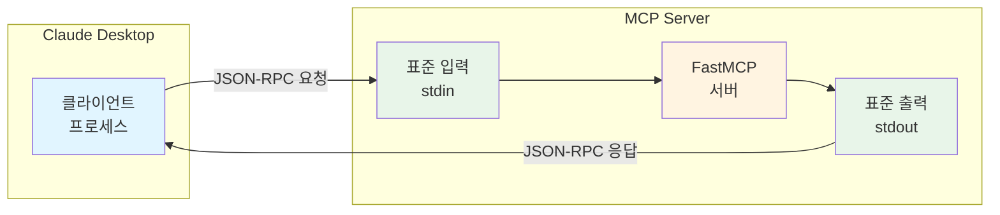
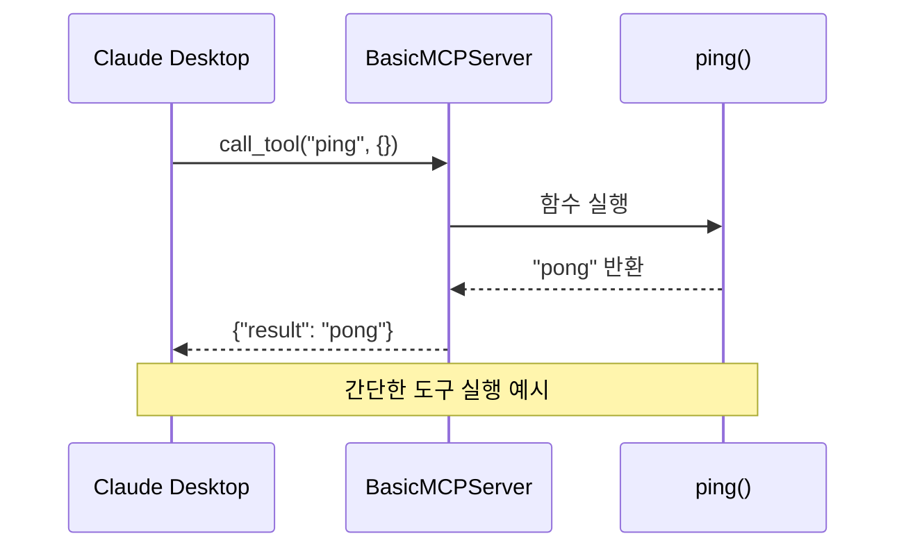

# 01. Basic Server - 기본 MCP 서버 구현

## 개요

FastMCP를 사용하여 가장 기본적인 MCP(Model Context Protocol) 서버를 구현하는 예제입니다.

**난이도**: ⭐ (입문)

**학습 목표**:
- FastMCP의 기본 구조 이해
- MCP 서버 생성 및 실행 방법 학습
- STDIO 전송 방식의 동작 원리 파악

## 주요 개념

### MCP 서버란?

MCP 서버는 AI 모델(Claude 등)이 외부 도구나 데이터에 접근할 수 있도록 하는 인터페이스입니다. 서버는 다음과 같은 기능을 제공할 수 있습니다:
- **Tools**: 특정 작업을 수행하는 함수
- **Resources**: 데이터나 문서 제공
- **Prompts**: 사전 정의된 프롬프트 템플릿

이 예제에서는 서버의 기본 구조만 다루며, 실제 기능은 이후 예제에서 추가합니다.

### FastMCP로 서버 만들기

FastMCP를 사용하면 단 몇 줄의 코드로 MCP 서버를 만들 수 있습니다:

```python
from fastmcp import FastMCP

# 1. 서버 인스턴스 생성
mcp = FastMCP("서버이름")

# 2. 도구 등록
@mcp.tool()
def my_tool(param: str) -> str:
    """도구 설명"""
    return f"결과: {param}"

# 3. 서버 실행
mcp.run()
```

**핵심 구성:**
- `FastMCP(name)`: 서버 생성
- `@mcp.tool()`: 함수를 MCP 도구로 등록
- `mcp.run()`: 서버 시작 (기본: STDIO 전송)

### STDIO 전송 방식

STDIO(Standard Input/Output)는 표준 입출력을 통해 MCP 프로토콜 메시지를 주고받는 방식입니다:
- **장점**: 설정이 간단하고, Claude Desktop 같은 로컬 클라이언트와 쉽게 연동
- **사용 사례**: 로컬 개발 환경, 데스크톱 애플리케이션

아래 다이어그램은 Claude Desktop 클라이언트가 STDIO를 통해 MCP 서버와 어떻게 통신하는지 보여줍니다. 클라이언트는 표준 입력(stdin)으로 요청을 보내고, 표준 출력(stdout)으로 응답을 받습니다.



## 파일 구조

```
01-basic-server/
├── main.py           # MCP 서버 구현
├── README.md         # 이 문서
└── tests/
    └── test_basic_server.py  # 테스트 코드
```

## 실행 방법

### 1. 의존성 설치

프로젝트 루트에서 실행:

```bash
uv sync
```

### 2. 서버 실행

```bash
uv run python 03-mcp-tools/01-basic-server/main.py
```

### 3. 서버 종료

서버가 실행되면 표준 입력을 대기합니다. 종료하려면:
- `Ctrl + C` 또는
- `Ctrl + D` (EOF)

## 기대 결과

서버가 정상적으로 실행되면:
1. 백그라운드에서 STDIO를 통해 MCP 메시지를 대기합니다
2. 별도의 출력은 없습니다 (STDIO는 프로토콜 통신에 사용)
3. Claude Desktop 등의 클라이언트가 연결하면 메시지를 주고받을 수 있습니다

## 코드 설명

```python
from fastmcp import FastMCP

# FastMCP 서버 인스턴스 생성
mcp = FastMCP(
    name="BasicMCPServer",  # 서버 이름
)

@mcp.tool()
def ping() -> str:
    """서버가 정상적으로 응답하는지 확인하는 간단한 도구입니다."""
    return "pong"

def main() -> None:
    """서버를 시작합니다."""
    mcp.run()  # STDIO 기본 전송 방식으로 서버 실행

if __name__ == "__main__":
    main()
```

### 핵심 구성 요소

1. **FastMCP 인스턴스**: `FastMCP(name="...")`로 서버 생성
2. **도구 등록**: `@mcp.tool()` 데코레이터로 함수를 MCP 도구로 등록
3. **서버 실행**: `mcp.run()`으로 STDIO 모드 시작
4. **타입 힌트**: 모든 함수에 반환 타입 명시 (`-> str`, `-> None`)

#### Ping 도구 실행 플로우

가장 간단한 `ping` 도구를 통해 MCP 도구 호출의 기본 흐름을 이해합니다. 클라이언트가 도구를 요청하면 서버가 해당 함수를 실행하고 결과를 반환하는 과정을 보여줍니다.



## 테스트

### 유닛 테스트

```bash
uv run pytest 03-mcp-tools/01-basic-server/tests/
```

### 통합 테스트 (실제 MCP 프로토콜 통신)

MCP 클라이언트를 사용하여 실제로 서버와 통신하는 테스트:

```bash
uv run python 03-mcp-tools/01-basic-server/test_client.py
```

**테스트 결과 예시**:
```
✓ 서버 연결 성공
  서버 정보: BasicMCPServer v2.13.1

✓ 사용 가능한 도구: 1개
  - ping: 서버가 정상적으로 응답하는지 확인하는 간단한 도구입니다.

✓ ping 도구 호출 중...
  응답: pong

✅ 모든 테스트 통과!
```

## 다음 단계

- [02-transport-methods](../02-transport-methods/): STDIO vs HTTP 전송 방식 비교
- [03-tools](../03-tools/): MCP 도구(Tools) 구현

## 참고 자료

- [FastMCP 공식 문서](https://github.com/jlowin/fastmcp)
- [MCP Specification](https://modelcontextprotocol.io/)
