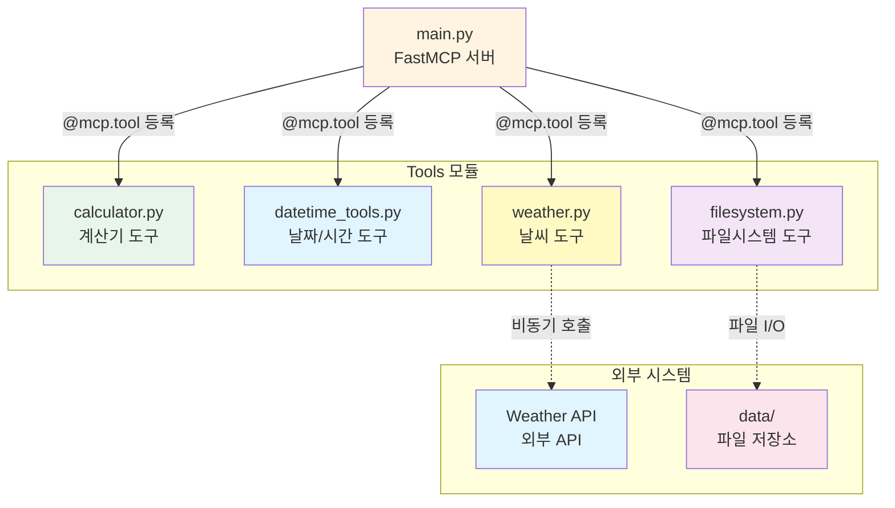
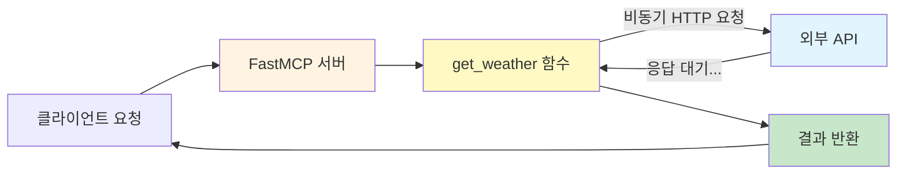
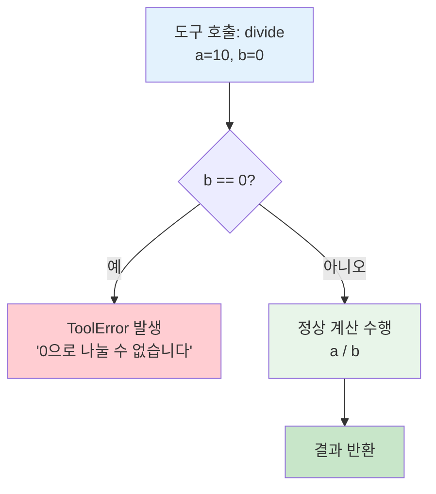
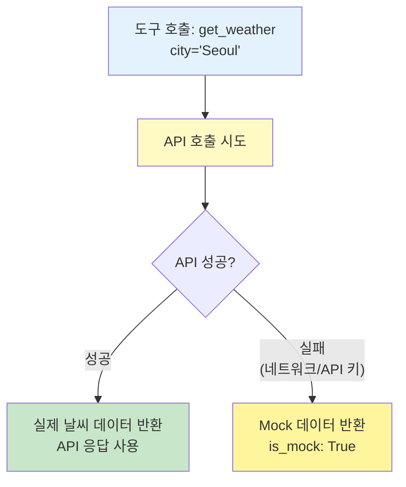
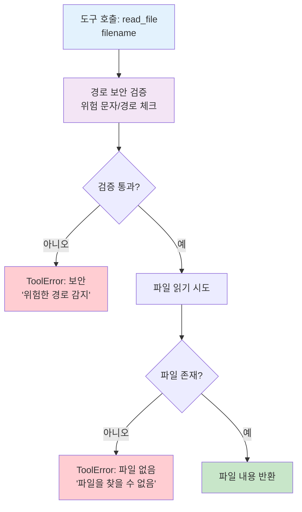
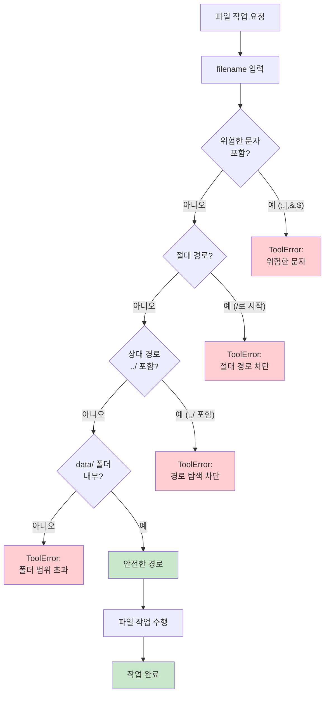

# 02-tools: 다양한 MCP 도구 구현

FastMCP 서버에 여러 종류의 도구를 구현하고 등록하는 방법을 학습합니다.

## 학습 목표

- 동기/비동기 도구 구현 방법 이해
- 외부 API 호출 및 에러 처리 패턴 학습
- 파일 시스템 접근 및 보안 고려사항 이해
- 타입 힌트와 독스트링을 활용한 자동 스키마 생성

## 구현된 도구

### 1. Calculator (계산기) - 동기 도구

기본 산술 연산을 제공하는 동기 도구입니다.

**제공 기능:**
- `add(a, b)`: 덧셈
- `subtract(a, b)`: 뺄셈
- `multiply(a, b)`: 곱셈
- `divide(a, b)`: 나눗셈 (0으로 나누기 에러 처리 포함)
- `power(base, exponent)`: 거듭제곱

**특징:**
- 간단한 동기 함수로 구현
- ToolError를 통한 에러 처리 (divide by zero)
- 타입 힌트를 통한 자동 스키마 생성

### 2. DateTime (날짜/시간) - 동기 도구

현재 날짜와 시간 정보를 제공하는 도구입니다.

**제공 기능:**
- `get_current_datetime(timezone)`: 현재 날짜/시간 조회
- `get_timestamp()`: Unix 타임스탬프 조회

**특징:**
- 다양한 시간대 지원 (기본: Asia/Seoul)
- ISO 8601 형식 제공
- 요일 정보 (한국어)
- LLM의 시간 인식 문제 해결

**반환 정보:**
- datetime, date, time
- year, month, day, hour, minute, second
- weekday, weekday_name (한국어)
- timezone
- Unix timestamp (초/밀리초)

### 3. Weather (날씨) - 비동기 도구

외부 API를 호출하여 날씨 정보를 조회하는 비동기 도구입니다.

**제공 기능:**
- `get_weather(city)`: 현재 날씨 조회
- `get_forecast(city, days)`: 일기예보 조회 (1-7일)

**특징:**
- `async/await` 비동기 패턴 사용
- httpx를 통한 HTTP 요청
- API 키 환경변수 처리 (`WEATHER_API_KEY`)
- API 호출 실패 시 Mock 데이터 폴백
- 입력 검증 및 에러 처리

**Mock 데이터:**
API 키가 없거나 API 호출이 실패하면 자동으로 Mock 데이터를 반환합니다.
- Seoul: 15°C, Cloudy
- Tokyo: 18°C, Sunny
- New York: 12°C, Rainy
- London: 10°C, Foggy

### 4. FileSystem (파일시스템) - 동기 도구

파일 읽기/쓰기 기능을 제공하는 도구입니다.

**제공 기능:**
- `read_file(filename)`: 파일 읽기
- `write_file(filename, content)`: 파일 쓰기
- `list_files()`: 파일 목록 조회
- `delete_file(filename)`: 파일 삭제

**보안 기능:**
- `data/` 폴더로 접근 범위 제한
- 경로 탐색 공격 방지 (path traversal)
- 위험한 파일명 문자 차단
- 상대 경로 방지 (`..`, `.`)

## 도구 비교

각 도구의 특징을 한눈에 비교할 수 있습니다:

| 도구 | 타입 | 외부 의존성 | 주요 사용 사례 | 에러 처리 | 보안 고려사항 |
|------|------|------------|--------------|----------|-------------|
| **Calculator** | 동기 | 없음 | 산술 연산, 간단한 계산 | ToolError (divide by zero) | 입력 검증 |
| **DateTime** | 동기 | zoneinfo | 시간 정보 제공, LLM 시간 인식 | 잘못된 시간대 처리 | 없음 |
| **Weather** | 비동기 | httpx, 외부 API | API 호출, 외부 데이터 조회 | API 실패 시 Mock 폴백 | API 키 환경변수 관리 |
| **FileSystem** | 동기 | 파일 시스템 | 파일 읽기/쓰기, 데이터 저장 | 파일 접근 에러, 경로 검증 | Path traversal 방지, 폴더 제한 |

### 도구별 함수 목록

#### Calculator (5개 함수)

| 함수명 | 파라미터 | 반환값 | 설명 |
|--------|---------|-------|------|
| `add` | a: float, b: float | float | 두 숫자를 더합니다 |
| `subtract` | a: float, b: float | float | 두 숫자를 뺍니다 |
| `multiply` | a: float, b: float | float | 두 숫자를 곱합니다 |
| `divide` | a: float, b: float | float | 두 숫자를 나눕니다 (0 체크) |
| `power` | base: float, exponent: float | float | 거듭제곱을 계산합니다 |

#### DateTime (2개 함수)

| 함수명 | 파라미터 | 반환값 | 설명 |
|--------|---------|-------|------|
| `get_current_datetime` | timezone: str (기본: "Asia/Seoul") | dict | 현재 날짜/시간 정보를 조회합니다 |
| `get_timestamp` | - | dict | Unix 타임스탬프를 조회합니다 |

#### Weather (2개 함수)

| 함수명 | 파라미터 | 반환값 | 설명 |
|--------|---------|-------|------|
| `get_weather` | city: str | dict | 현재 날씨 정보를 조회합니다 |
| `get_forecast` | city: str, days: int (1-7) | dict | 일기예보를 조회합니다 |

#### FileSystem (4개 함수)

| 함수명 | 파라미터 | 반환값 | 설명 |
|--------|---------|-------|------|
| `read_file` | filename: str | str | 파일 내용을 읽습니다 |
| `write_file` | filename: str, content: str | str | 파일에 내용을 씁니다 |
| `list_files` | - | list[str] | 파일 목록을 조회합니다 |
| `delete_file` | filename: str | str | 파일을 삭제합니다 |

## 실행 방법

### 1. 서버 시작

```bash
uv run python 03-mcp-tools/02-tools/main.py
```

서버가 시작되면 다음 도구들이 등록됩니다:
- Calculator: add, subtract, multiply, divide, power
- DateTime: get_current_datetime, get_timestamp
- Weather: get_weather, get_forecast
- FileSystem: read_file, write_file, list_files, delete_file

### 2. 테스트 실행

전체 테스트:
```bash
uv run pytest 03-mcp-tools/02-tools/
```

특정 테스트:
```bash
# 계산기 테스트만
uv run pytest 03-mcp-tools/02-tools/tests/test_calculator.py

# 날짜/시간 테스트만
uv run pytest 03-mcp-tools/02-tools/tests/test_datetime.py

# 날씨 테스트만
uv run pytest 03-mcp-tools/02-tools/tests/test_weather.py

# 파일시스템 테스트만
uv run pytest 03-mcp-tools/02-tools/tests/test_filesystem.py
```

상세 출력:
```bash
uv run pytest 03-mcp-tools/02-tools/ -v
```

### 3. 실습용 데모 클라이언트 (추천!)

인터랙티브하게 모든 도구를 테스트할 수 있는 데모 클라이언트를 실행합니다:

```bash
uv run python 03-mcp-tools/02-tools/demo_client.py
```

이 스크립트는 다음을 수행합니다:
- 📊 **Calculator**: 다양한 산술 연산 시연
- 🕐 **DateTime**: 현재 시간 및 타임스탬프 조회
- 🌤️ **Weather**: 여러 도시의 날씨 및 일기예보 조회
- 📁 **FileSystem**: 파일 읽기/쓰기/삭제 및 보안 테스트

**출력 예시:**
```
╭─────────────────────────────────────╮
│ FastMCP Tools Demo Client           │
│ 모든 도구를 시연합니다.               │
╰─────────────────────────────────────╯

등록된 도구: 13개

📊 Calculator 도구 테스트
┌────────┬────────┐
│ 연산   │ 결과   │
├────────┼────────┤
│ 10 + 5 │ 15.0   │
│ 20 - 8 │ 12.0   │
...
```

## 코드 구조

```
02-tools/
├── main.py                 # 서버 메인 파일
├── demo_client.py          # 실습용 데모 클라이언트
├── tools/                  # 도구 모듈
│   ├── __init__.py
│   ├── calculator.py       # 계산기 도구
│   ├── datetime_tools.py   # 날짜/시간 도구
│   ├── weather.py          # 날씨 도구
│   └── filesystem.py       # 파일시스템 도구
├── tests/                  # 테스트 파일
│   ├── __init__.py
│   ├── test_calculator.py
│   ├── test_datetime.py
│   ├── test_weather.py
│   └── test_filesystem.py
├── data/                   # 파일 저장 공간
│   └── example.txt
└── README.md
```

### 도구 아키텍처

이 서버의 전체 구조를 한눈에 파악할 수 있습니다. 메인 서버가 각 도구 모듈을 등록하고, 일부 도구는 외부 시스템(API, 파일 시스템)과 상호작용하는 것을 보여줍니다.



## 사용 예시

각 도구의 다양한 사용 사례를 확인할 수 있습니다.

### Calculator 사용 예시

| 작업 | 함수 호출 | 파라미터 | 결과 | 비고 |
|------|----------|---------|------|------|
| 덧셈 | `add` | a=5, b=3 | 8.0 | 기본 연산 |
| 뺄셈 | `subtract` | a=20, b=8 | 12.0 | 기본 연산 |
| 곱셈 | `multiply` | a=4, b=7 | 28.0 | 기본 연산 |
| 나눗셈 | `divide` | a=10, b=2 | 5.0 | 정상 케이스 |
| 나눗셈 (에러) | `divide` | a=10, b=0 | ToolError | "0으로 나눌 수 없습니다" |
| 거듭제곱 | `power` | base=2, exponent=8 | 256.0 | 고급 연산 |

**코드 예시:**
```python
# 기본 사용
result = await client.call_tool("add", {"a": 5, "b": 3})
# 결과: 8.0

# 에러 처리
try:
    result = await client.call_tool("divide", {"a": 10, "b": 0})
except ToolError as e:
    print(e)  # "0으로 나눌 수 없습니다"
```

### Weather 사용 예시

#### 현재 날씨 조회

| 도시 | 온도 | 상태 | 습도 | 풍속 | Mock 여부 |
|------|------|------|------|------|----------|
| Seoul | 15°C | Cloudy | 60% | 3.5 m/s | ✓ |
| Tokyo | 18°C | Sunny | 55% | 2.8 m/s | ✓ |
| New York | 12°C | Rainy | 70% | 4.2 m/s | ✓ |
| London | 10°C | Foggy | 80% | 3.0 m/s | ✓ |

**코드 예시:**
```python
# 현재 날씨 조회
result = await client.call_tool("get_weather", {"city": "Seoul"})
# 결과: {
#   "city": "Seoul",
#   "temperature": 15,
#   "condition": "Cloudy",
#   "humidity": 60,
#   "wind_speed": 3.5,
#   "is_mock": True
# }

# 일기예보 조회 (3일)
result = await client.call_tool("get_forecast", {"city": "Tokyo", "days": 3})
# 결과: 3일간의 예보 데이터 배열
```

### FileSystem 사용 예시

#### 파일 작업 시나리오

| 작업 | 함수 | 파일명 | 내용 | 결과 | 보안 검증 |
|------|------|--------|------|------|----------|
| 목록 조회 | `list_files` | - | - | ["example.txt"] | ✓ |
| 파일 읽기 | `read_file` | example.txt | - | 파일 내용 반환 | ✓ |
| 파일 쓰기 | `write_file` | test.txt | "Hello" | 성공 메시지 | ✓ |
| 파일 삭제 | `delete_file` | test.txt | - | 성공 메시지 | ✓ |
| 경로 탐색 (차단) | `read_file` | ../secret.txt | - | ToolError | ✗ |
| 절대 경로 (차단) | `write_file` | /etc/passwd | - | ToolError | ✗ |

**코드 예시:**
```python
# 파일 쓰기 → 읽기 → 삭제 워크플로우
await client.call_tool("write_file", {
    "filename": "test.txt",
    "content": "Hello, MCP!"
})

content = await client.call_tool("read_file", {"filename": "test.txt"})
print(content)  # "Hello, MCP!"

await client.call_tool("delete_file", {"filename": "test.txt"})

# 보안: 상위 디렉토리 접근 차단
try:
    await client.call_tool("read_file", {"filename": "../secret.txt"})
except ToolError as e:
    print(e)  # "위험한 경로가 감지되었습니다"
```

## 주요 개념

### 1. 동기 vs 비동기 도구

**동기 도구** (Calculator, FileSystem):
```python
@mcp.tool
def add(a: float, b: float) -> float:
    """두 숫자를 더합니다."""
    return a + b
```

**비동기 도구** (Weather):
```python
@mcp.tool
async def get_weather(city: str) -> dict:
    """날씨 정보를 조회합니다."""
    async with httpx.AsyncClient() as client:
        response = await client.get(url)
        return await response.json()
```

#### 도구 실행 흐름 비교

동기 도구와 비동기 도구의 차이점을 명확히 이해하는 것이 중요합니다.

**동기 도구 (Calculator) - 즉시 결과 반환:**


**비동기 도구 (Weather) - 외부 API 응답 대기:**



**주요 차이점:**

| 항목 | 동기 도구 | 비동기 도구 |
|------|----------|------------|
| 응답 시간 | 즉시 (밀리초 이내) | 가변적 (외부 시스템 의존) |
| 블로킹 | 계산 중 블로킹 | await로 다른 작업 가능 |
| 사용 사례 | 계산, 로컬 파일 처리 | API 호출, DB 쿼리 |
| 구현 | 일반 함수 `def` | 비동기 함수 `async def` |

### 2. 에러 처리

FastMCP의 `ToolError`를 사용하여 명확한 에러 메시지를 전달합니다:

```python
from fastmcp.exceptions import ToolError

if b == 0:
    raise ToolError("0으로 나눌 수 없습니다")
```

#### 에러 처리 흐름

각 도구가 에러를 처리하는 방식을 시각화했습니다.

**Calculator - 입력 검증 에러:**



**Weather - 폴백 패턴 (에러 시 대체 데이터):**



**FileSystem - 다단계 보안 검증:**



**에러 처리 전략 비교:**

| 도구 | 전략 | 에러 발생 시 동작 | 사용자 경험 |
|------|------|------------------|-----------|
| Calculator | **즉시 실패** | ToolError 발생 | 명확한 에러 메시지 |
| Weather | **폴백** | Mock 데이터 반환 | 기능은 동작, is_mock 표시 |
| FileSystem | **다단계 검증** | 보안/존재 여부 별도 에러 | 구체적인 실패 원인 제공 |

### 3. 타입 힌트와 자동 스키마

타입 힌트와 독스트링을 작성하면 FastMCP가 자동으로 JSON Schema를 생성합니다:

```python
@mcp.tool
def divide(a: float, b: float) -> float:
    """두 숫자를 나눕니다.

    Args:
        a: 첫 번째 숫자 (피제수)
        b: 두 번째 숫자 (제수)

    Returns:
        a를 b로 나눈 결과
    """
    return a / b
```

### 4. 보안 검증 (FileSystem)

파일시스템 도구의 보안 검증 과정을 상세히 보여줍니다:



**보안 검증 예시:**

| 입력 경로 | 검증 결과 | 사유 |
|----------|----------|------|
| `test.txt` | ✓ 통과 | 안전한 파일명 |
| `data/file.txt` | ✓ 통과 | data/ 폴더 내부 |
| `../secret.txt` | ✗ 차단 | 상위 디렉토리 접근 |
| `/etc/passwd` | ✗ 차단 | 절대 경로 |
| `file;rm -rf` | ✗ 차단 | 위험한 문자 포함 |
| `../../home` | ✗ 차단 | 경로 탐색 공격 |

## 학습 포인트

1. **도구 등록 패턴**: `@mcp.tool` 데코레이터를 사용한 간단한 등록
2. **비동기 처리**: I/O 바운드 작업에 `async/await` 활용
3. **에러 처리**: 명확한 에러 메시지와 적절한 예외 처리
4. **보안 고려**: 파일 시스템 접근 제한 및 입력 검증
5. **테스트 작성**: pytest를 활용한 도구 테스트
6. **모듈화**: 기능별로 파일을 분리하여 관리

## Claude Desktop 연동

실제 Claude Desktop 앱에서 이 MCP 서버를 사용할 수 있습니다.

### 설정 방법

1. **Claude Desktop 설정 파일 위치:**
   - macOS: `~/Library/Application Support/Claude/claude_desktop_config.json`
   - Windows: `%APPDATA%\Claude\claude_desktop_config.json`

2. **설정 추가:**
```json
{
  "mcpServers": {
    "tools-server": {
      "command": "uv",
      "args": [
        "--directory",
        "/Users/YOUR_USERNAME/path/to/fastmcp-example",
        "run",
        "python",
        "03-mcp-tools/02-tools/main.py"
      ]
    }
  }
}
```

3. **경로 수정:**
   - `YOUR_USERNAME`을 실제 사용자명으로 변경
   - 프로젝트 절대 경로로 수정

4. **Claude Desktop 재시작**

### 사용 방법

Claude Desktop에서 다음과 같이 사용할 수 있습니다:

- "5 더하기 3은 얼마야?" → Calculator 도구 사용
- "지금 시간이 몇 시야?" → DateTime 도구 사용
- "서울 날씨 알려줘" → Weather 도구 사용
- "example.txt 파일 읽어줘" → FileSystem 도구 사용

### 주의사항

- STDIO 전송 방식만 Claude Desktop과 호환됩니다
- 서버가 올바르게 등록되었는지 Claude Desktop의 설정에서 확인 가능
- 로그는 Claude Desktop의 개발자 도구에서 확인 가능

**더 자세한 연동 가이드는 [05-client-integration](../05-client-integration/)에서 다룹니다.**

## 다음 단계

- [03-transport-methods](../03-transport-methods/): stdio vs HTTP 전송 방식 비교
- [04-resources](../04-resources/): 리소스 제공 패턴 학습
- [05-client-integration](../05-client-integration/): Claude Desktop 연동

## 참고사항

### Weather API 설정 (선택사항)

실제 날씨 API를 사용하려면:

1. [OpenWeatherMap](https://openweathermap.org/)에서 무료 API 키 발급
2. 환경변수 설정:
   ```bash
   export WEATHER_API_KEY="your_api_key_here"
   ```
3. 서버 재시작

API 키가 없어도 Mock 데이터로 학습할 수 있습니다.

### 파일 접근 범위

보안을 위해 파일 시스템 도구는 `03-mcp-tools/02-tools/data/` 폴더 내의 파일만 접근할 수 있습니다.
상위 디렉토리나 시스템 파일에는 접근할 수 없도록 설계되었습니다.
