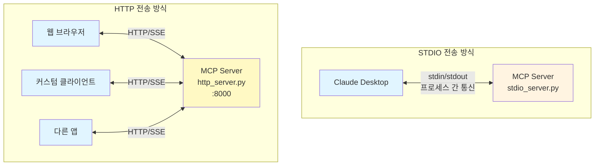
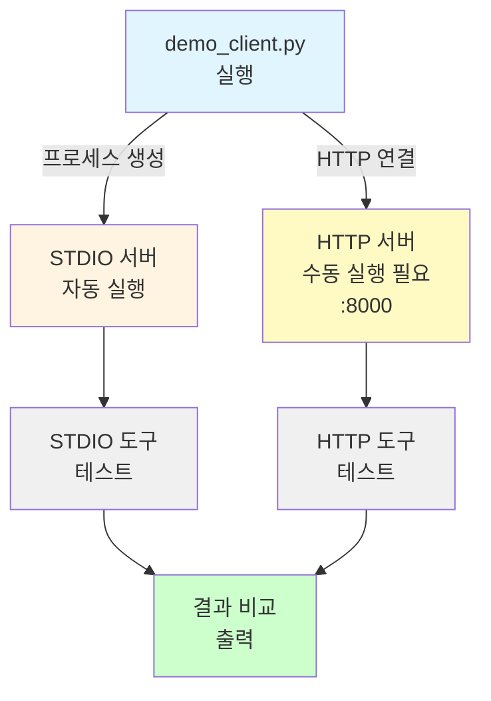
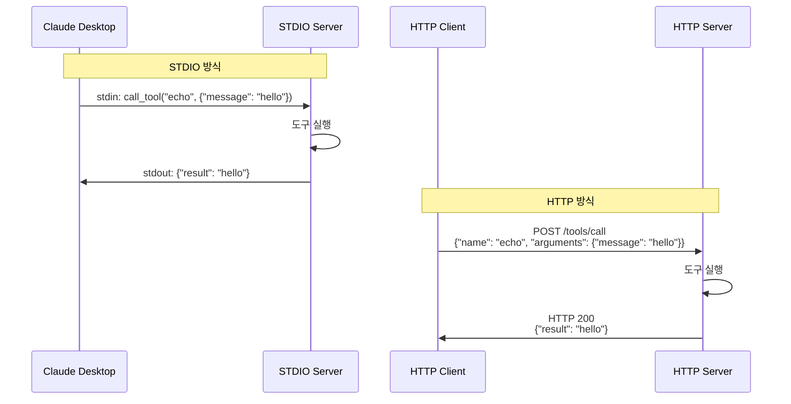

# 03. MCP 전송 방식 (Transport Methods) ⭐⭐

MCP 서버는 다양한 전송 방식(Transport)을 통해 클라이언트와 통신할 수 있습니다. 이 예제에서는 가장 많이 사용되는 두 가지 전송 방식인 **STDIO**와 **HTTP**를 비교합니다.

## 학습 목표

- STDIO와 HTTP 전송 방식의 차이점 이해
- 각 전송 방식의 사용 시나리오 파악
- 동일한 도구를 다른 전송 방식으로 제공하는 방법 습득

## 전송 방식 비교

| 구분 | STDIO | HTTP |
|------|-------|------|
| **통신 방식** | stdin/stdout | HTTP/SSE |
| **주요 용도** | 로컬 클라이언트 (Claude Desktop 등) | 웹 클라이언트, 원격 접근 |
| **네트워크** | 불필요 (프로세스 간 통신) | 필요 (포트 바인딩) |
| **보안** | 로컬 프로세스 격리 | 인증/암호화 필요 |
| **디버깅** | 로그 파일로 확인 | 브라우저/curl로 테스트 가능 |
| **확장성** | 단일 프로세스 | 다중 클라이언트 지원 |
| **설정 복잡도** | 낮음 | 중간 (포트, 호스트 설정) |

### 아키텍처 비교

STDIO와 HTTP 전송 방식의 구조적 차이를 시각적으로 비교합니다. STDIO는 단일 클라이언트와 1:1 통신하지만, HTTP는 여러 클라이언트가 동시에 접속할 수 있습니다.



## 사용 시나리오

### STDIO를 사용해야 하는 경우

- ✅ Claude Desktop과 연동할 때
- ✅ 로컬 개발 환경에서 간단하게 테스트할 때
- ✅ 보안이 중요한 로컬 도구를 제공할 때
- ✅ 네트워크 설정 없이 빠르게 시작하고 싶을 때

### HTTP를 사용해야 하는 경우

- ✅ 웹 브라우저에서 MCP 서버에 접근할 때
- ✅ 여러 클라이언트가 동시에 접속해야 할 때
- ✅ 원격 서버에서 MCP 서비스를 제공할 때
- ✅ REST API처럼 직접 테스트하고 싶을 때

## 파일 구조

```
03-transport-methods/
├── stdio_server.py          # STDIO 전송 방식 서버
├── http_server.py           # HTTP 전송 방식 서버
├── stdio_client.py          # STDIO 클라이언트 (서버 자동 실행)
├── http_client.py           # HTTP 클라이언트 (서버에 연결)
├── demo_client.py           # 통합 데모 (양쪽 전송 방식 비교)
├── README.md                # 이 파일
└── tests/
    ├── test_stdio.py        # STDIO 서버 테스트
    └── test_http.py         # HTTP 서버 테스트
```

## 데모 프로그램 개요

이 예제는 세 가지 클라이언트 프로그램을 제공하여 각 전송 방식을 체험할 수 있습니다.

### 클라이언트별 실행 흐름

각 데모 프로그램의 실행 과정과 특징을 보여줍니다.

#### 1. STDIO 클라이언트

서버를 자동으로 실행하고 종료까지 관리합니다.


**특징:**
- ✅ 서버 자동 실행 및 종료
- ✅ 별도 서버 실행 불필요
- ✅ 가장 간단한 테스트 방법

#### 2. HTTP 클라이언트

이미 실행 중인 HTTP 서버에 연결합니다.


**특징:**
- ⚠️ 서버를 먼저 실행해야 함
- ✅ 실제 HTTP 통신 경험
- ✅ 다중 클라이언트 연결 가능

#### 3. 통합 데모 클라이언트

두 전송 방식을 동시에 테스트하고 비교합니다.



**특징:**
- ⚠️ HTTP 서버는 별도로 실행 필요
- ✅ 두 전송 방식 동시 비교
- ✅ 차이점을 직접 확인 가능

### 각 클라이언트의 특징

| 클라이언트 | 서버 실행 | 주요 용도 | 장점 |
|-----------|----------|---------|------|
| **stdio_client.py** | 자동 | STDIO 방식 이해 | 간단하고 빠른 테스트 |
| **http_client.py** | 수동 | HTTP 방식 이해 | 실제 HTTP 통신 경험 |
| **demo_client.py** | STDIO 자동<br/>HTTP 수동 | 두 방식 비교 | 차이점 직접 확인 |

## 실행 방법

### 권장: 개별 클라이언트 실행

각 전송 방식을 독립적으로 테스트하는 가장 명확한 방법입니다.

#### STDIO 방식

```bash
# 클라이언트 실행 (서버 자동 실행)
uv run python 03-mcp-tools/03-transport-methods/stdio_client.py
```

**특징:**
- 클라이언트가 서버 프로세스를 자동으로 실행
- stdin/stdout으로 직접 통신
- 별도의 서버 실행 불필요

#### HTTP 방식

```bash
# 1. 터미널 1: 서버 실행
uv run python 03-mcp-tools/03-transport-methods/http_server.py

# 2. 터미널 2: 클라이언트 실행
uv run python 03-mcp-tools/03-transport-methods/http_client.py
```

**특징:**
- 서버를 먼저 실행해야 함
- HTTP URL로 연결
- 다중 클라이언트 동시 연결 가능

**포트 변경:**
```bash
# 서버
uv run python 03-mcp-tools/03-transport-methods/http_server.py --port 9000

# 클라이언트
uv run python 03-mcp-tools/03-transport-methods/http_client.py --port 9000
```

### 통합 데모

두 전송 방식을 한번에 비교하려면:

```bash
uv run python 03-mcp-tools/03-transport-methods/demo_client.py
```

데모 클라이언트는 다음을 보여줍니다:
- ✅ STDIO와 HTTP 양쪽 전송 방식의 도구 실행
- ✅ 각 전송 방식의 특징 비교
- ✅ 동일한 도구가 다른 전송 방식에서 동작하는 모습

### 서버 직접 실행 (고급)

#### 1. STDIO 서버 실행

```bash
uv run python 03-mcp-tools/03-transport-methods/stdio_server.py
```

**특징:**
- stdin/stdout으로 JSON-RPC 메시지 주고받음
- Claude Desktop 설정 파일에 등록하여 사용
- 직접 테스트하려면 MCP 클라이언트 라이브러리 필요

**종료:**
- `Ctrl+C` 또는 클라이언트 종료 시 자동 종료

**Claude Desktop 연동:**

STDIO 서버를 Claude Desktop에 등록하려면 설정 파일을 수정합니다:

```bash
# macOS
~/Library/Application Support/Claude/claude_desktop_config.json

# Windows
%APPDATA%\Claude\claude_desktop_config.json
```

**설정 예시:**
```json
{
  "mcpServers": {
    "transport-demo": {
      "command": "uv",
      "args": [
        "run",
        "python",
        "/Users/YOUR_USERNAME/education/fastmcp-example/03-mcp-tools/03-transport-methods/stdio_server.py"
      ]
    }
  }
}
```

**주의사항:**
- `YOUR_USERNAME`을 실제 사용자명으로 변경
- 절대 경로 사용 권장
- 설정 파일 수정 후 Claude Desktop 재시작 필요

**확인 방법:**
1. Claude Desktop 재시작
2. 새 대화 시작
3. 🔌 아이콘 클릭하여 "transport-demo" 서버 확인
4. `echo`, `uppercase` 도구 사용 가능

### 2. HTTP 서버 실행

```bash
# 기본 포트 8000번으로 실행
uv run python 03-mcp-tools/03-transport-methods/http_server.py

# 포트 변경
uv run python 03-mcp-tools/03-transport-methods/http_server.py --port 8080

# 호스트와 포트 모두 변경
uv run python 03-mcp-tools/03-transport-methods/http_server.py --host 0.0.0.0 --port 9000
```

**특징:**
- HTTP API 엔드포인트 제공
- Server-Sent Events (SSE)로 실시간 통신
- 브라우저 또는 curl로 직접 테스트 가능

**종료:**
- `Ctrl+C`

**Claude Desktop 연동:**

HTTP 서버는 Claude Desktop에서 제한적으로 지원됩니다. 다음 방법 중 하나를 선택하세요:

**방법 1: Connectors 사용 (Pro/Max/Team/Enterprise 플랜)**

1. HTTP 서버 실행:
   ```bash
   uv run python 03-mcp-tools/03-transport-methods/http_server.py
   ```

2. Claude Desktop에서 설정:
   - **Settings** > **Connectors** 메뉴 열기
   - **Add Connector** 클릭
   - Server URL 입력: `http://localhost:8000`
   - 이름 지정: "Transport Demo HTTP"

3. 확인:
   - 새 대화에서 🔌 아이콘 클릭
   - "Transport Demo HTTP" 서버 확인

**방법 2: 프록시 사용 (무료 플랜)**

Claude Desktop은 config 파일에서 HTTP를 직접 지원하지 않으므로, HTTP를 STDIO로 변환하는 프록시 도구가 필요합니다.

**옵션 A: supergateway 사용 (JavaScript/TypeScript, 권장)**

```json
// config 파일 수정
// macOS: ~/Library/Application Support/Claude/claude_desktop_config.json
// Windows: %APPDATA%\Claude\claude_desktop_config.json
{
  "mcpServers": {
    "transport-http": {
      "command": "npx",
      "args": [
        "-y",
        "supergateway",
        "--streamableHttp",
        "http://localhost:8000/mcp"
      ]
    }
  }
}
```

**참고:**
- `npx -y`: 자동으로 패키지를 설치하고 실행 (전역 설치 불필요)
- `--streamableHttp`: FastMCP의 HTTP 전송 방식 (Streamable HTTP) 사용
- ⚠️ `--sse`는 사용하지 마세요 (SSE는 2025년 3월부터 deprecated)
- `/mcp` 엔드포인트 경로 필수 (FastMCP 기본 경로)
- OAuth 인증 필요시: `--oauth2Bearer "YOUR_TOKEN"` 추가

**옵션 B: mcp-proxy 사용 (Python)**

```bash
# 1. mcp-proxy 설치
uv tool install mcp-proxy
# 또는
pipx install mcp-proxy
```

```json
// 2. config 파일 수정
{
  "mcpServers": {
    "transport-http": {
      "command": "mcp-proxy",
      "args": [
        "--transport",
        "streamablehttp",
        "http://localhost:8000/mcp"
      ]
    }
  }
}
```

**참고:**
- Python 환경에 익숙하다면 이 옵션 권장
- `--transport streamablehttp`: Streamable HTTP 프로토콜 사용 (권장)
- `--transport sse`: 레거시 SSE 지원 (deprecated)
- 인증 헤더: `--headers Authorization "Bearer TOKEN"`

**제한사항:**
- ⚠️ Claude Desktop의 config 파일(`claude_desktop_config.json`)은 STDIO만 지원
- ⚠️ HTTP/SSE 직접 연결은 Connectors 기능 필요 (유료 플랜)
- ⚠️ 무료 사용자는 프록시 도구를 통한 우회 방법만 가능

**권장 사항:**
- 로컬 테스트: STDIO 방식 사용 (설정 간단)
- 원격 서버: HTTP + Connectors 사용
- 프로덕션: Claude API 또는 다른 MCP 클라이언트 고려

## 제공되는 도구

두 서버 모두 동일한 도구를 제공하여, 전송 방식과 무관하게 같은 기능을 사용할 수 있음을 보여줍니다.

### STDIO 서버 도구

1. **echo**: 메시지를 그대로 반환
2. **uppercase**: 텍스트를 대문자로 변환

### HTTP 서버 도구

1. **echo**: 메시지를 그대로 반환
2. **uppercase**: 텍스트를 대문자로 변환
3. **reverse**: 텍스트를 역순으로 변환

## 코드 비교

### 핵심 차이점

두 서버의 코드는 대부분 동일하며, 실행 부분만 다릅니다:

**STDIO 서버:**
```python
if __name__ == "__main__":
    mcp.run()  # 기본 전송 방식은 STDIO
```

**HTTP 서버:**
```python
if __name__ == "__main__":
    mcp.run(transport="http", host="127.0.0.1", port=8000)
```

## 테스트

```bash
# 모든 테스트 실행
uv run pytest 03-mcp-tools/03-transport-methods/

# 특정 테스트만 실행
uv run pytest 03-mcp-tools/03-transport-methods/tests/test_stdio.py
uv run pytest 03-mcp-tools/03-transport-methods/tests/test_http.py
```

## 주요 개념

### 1. 전송 계층 추상화

FastMCP는 전송 방식을 추상화하여, 도구 구현 코드를 변경하지 않고도 다른 전송 방식을 사용할 수 있습니다. 이는 **관심사의 분리(Separation of Concerns)** 원칙을 잘 보여줍니다.

### 2. 프로토콜 독립성

MCP 프로토콜은 전송 방식과 독립적입니다. STDIO, HTTP, WebSocket 등 어떤 전송 방식을 사용하든 동일한 JSON-RPC 메시지 형식을 사용합니다.

### 3. 유연한 배포

개발 중에는 STDIO로 빠르게 테스트하고, 프로덕션에서는 HTTP로 배포하는 등 환경에 따라 전송 방식을 선택할 수 있습니다.

### 통신 플로우 비교

동일한 `echo` 도구를 호출할 때, STDIO와 HTTP 방식에서 메시지가 어떻게 다르게 전달되는지 보여줍니다. STDIO는 stdin/stdout을 사용하고, HTTP는 POST 요청을 사용합니다.



## 다음 단계

- [04-resources](../04-resources/): 리소스(Resources) 제공 방법 학습
- [05-client-integration](../05-client-integration/): Claude Desktop 연동 실습

## 참고 자료

- [MCP Specification - Transports](https://spec.modelcontextprotocol.io/specification/architecture/#transports)
- [FastMCP Documentation](https://github.com/jlowin/fastmcp)
