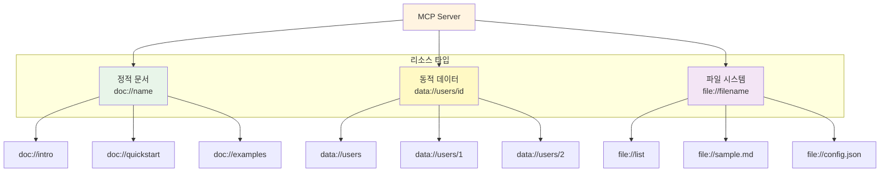
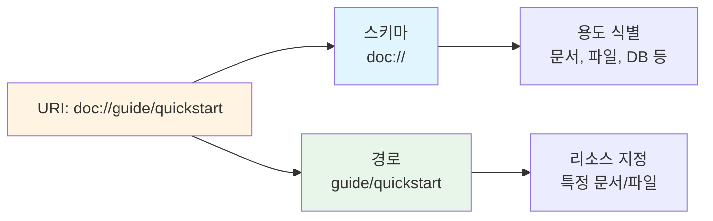
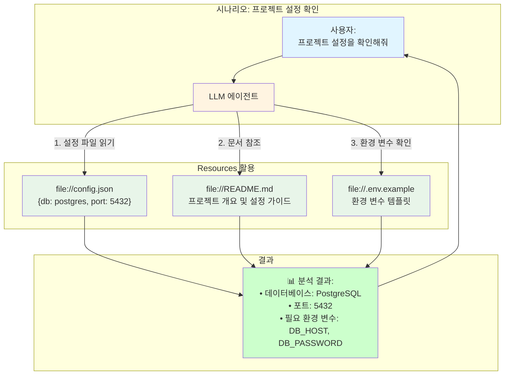
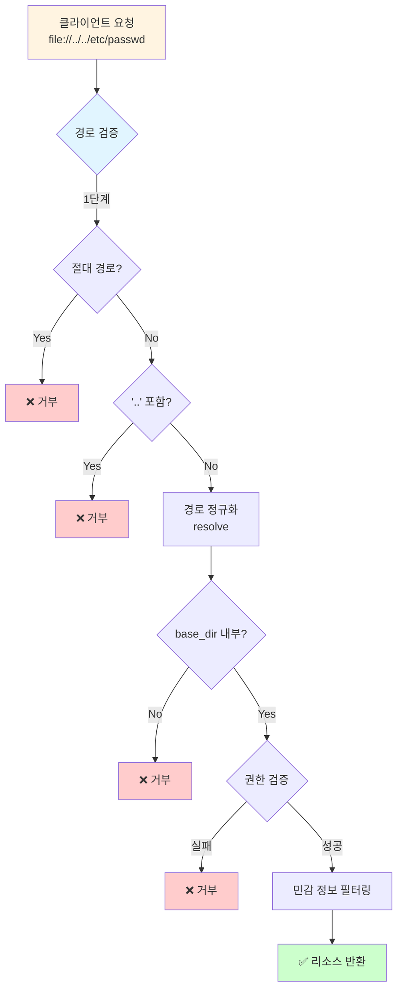
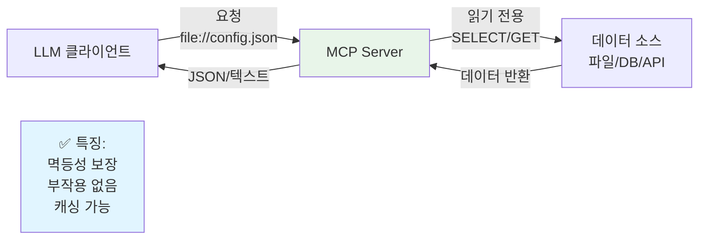
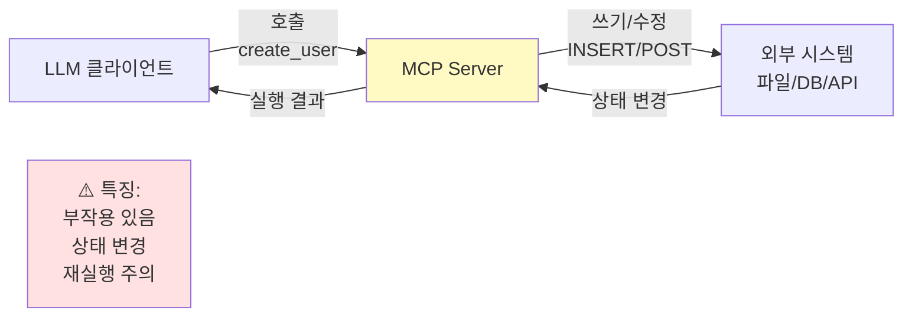
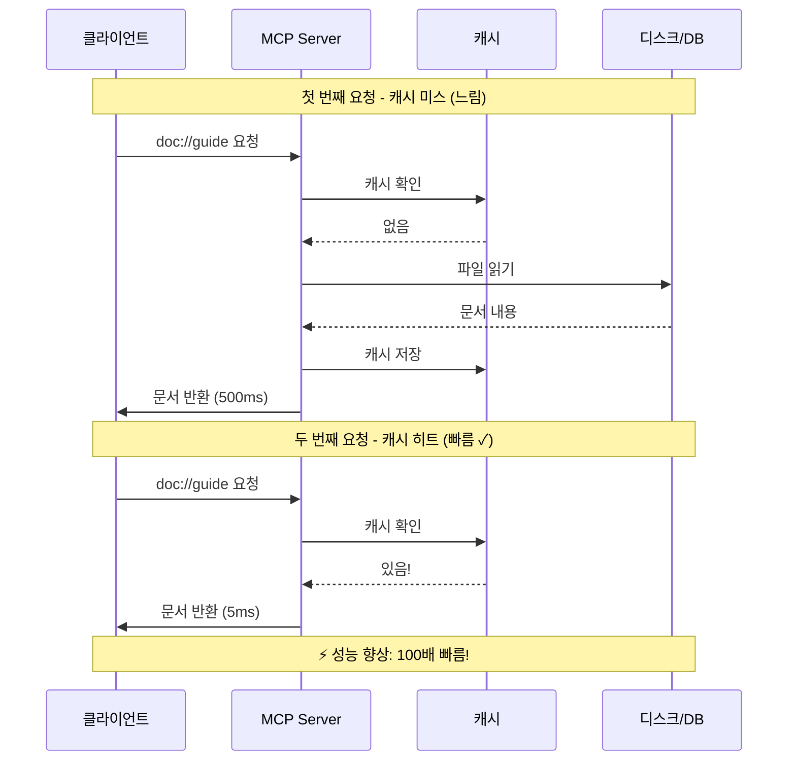
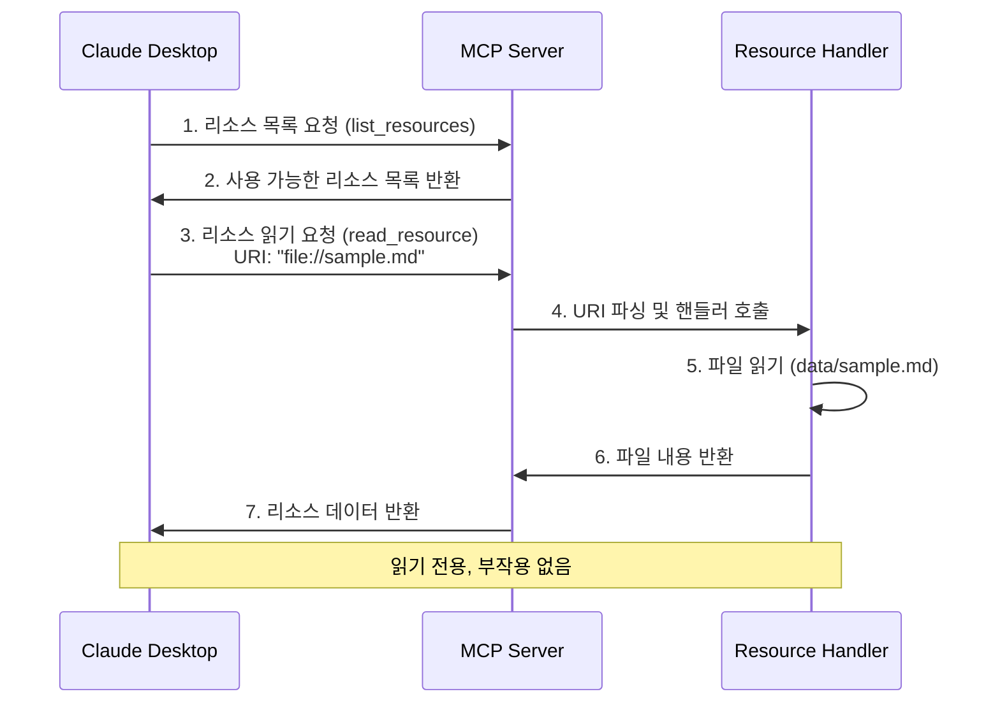

# 04. MCP 리소스(Resources) 제공

**난이도**: ⭐⭐
**학습 시간**: 20-25분

## 개요

### Resources란?

**MCP Resources**는 LLM이 접근할 수 있는 **읽기 전용 데이터 소스**입니다. Tools가 "무언가를 수행"한다면, Resources는 "정보를 제공"하는 역할을 합니다.

**핵심 특징:**

| 특징 | 설명 |
|------|------|
| 📖 **읽기 전용** | 데이터를 조회만 하고 수정하지 않음 (SELECT, GET만 가능) |
| 🔗 **URI 기반** | 웹과 유사한 URI 스키마로 접근 (`doc://`, `file://`, `db://`) |
| 🔄 **멱등성** | 같은 요청은 항상 같은 결과 반환 |
| 💡 **컨텍스트 제공** | LLM이 작업에 필요한 배경 지식을 얻을 수 있음 |

**Tools vs Resources:**

```
Tools (도구)                     Resources (리소스)
-----------------------------------------
create_user(name, email)   →    db://users/123
send_email(to, subject)    →    file://template.html
calculate(a, b)            →    doc://api-reference
파일 쓰기, 상태 변경            파일 읽기, 정보 조회
```

### 이 예제에서 구현하는 내용

이 예제에서는 3가지 유형의 리소스를 구현하여 Resources의 핵심 개념을 학습합니다:

1. **정적 문서 (Static Documents)** - 변하지 않는 고정된 마크다운 문서
   - URI: `doc://intro`, `doc://quickstart`, `doc://examples`
   - 사용 사례: 제품 문서, API 가이드, FAQ

2. **동적 데이터 (Dynamic Data)** - 요청 시점에 생성되는 JSON 데이터
   - URI: `data://users/{id}`, `data://users`
   - 사용 사례: 데이터베이스 조회, 실시간 통계

3. **파일 시스템 (File System)** - 실제 파일의 내용 제공
   - URI: `file://{filename}`, `file://list`
   - 사용 사례: 로컬 파일 읽기, 설정 파일 접근
   - ⚠️ 보안: 경로 검증 필수 (Path Traversal 방지)

## 학습 목표

- MCP 리소스의 개념과 활용 방법 이해
- `@mcp.resource()` 데코레이터로 리소스 등록
- URI 템플릿을 사용한 동적 리소스 구현
- 파일 시스템 접근 시 보안 고려사항 학습

## 프로젝트 구조

```
04-resources/
├── main.py                    # 서버 및 리소스 등록
├── demo_client.py             # 데모 클라이언트 (리소스 테스트)
├── resources/
│   ├── static_docs.py        # 정적 문서 리소스
│   ├── json_data.py          # JSON 데이터 리소스
│   └── file_resources.py     # 파일 시스템 리소스
├── data/                      # 파일 리소스용 데이터 폴더
│   ├── sample.md
│   └── config.json
├── tests/                     # 테스트 코드
└── README.md
```

## 리소스 타입

MCP 서버가 제공하는 세 가지 리소스 유형의 계층 구조를 보여줍니다. 각 리소스 타입은 서로 다른 URI 스키마를 사용하여 구분됩니다.



### 1. 정적 문서 리소스 (Static Documents)

**URI 패턴**: `doc://{name}`

하드코딩된 마크다운 문서를 제공합니다.

**사용 가능한 문서**:
- `doc://intro` - MCP 리소스 소개
- `doc://quickstart` - MCP 빠른 시작 가이드
- `doc://examples` - MCP 리소스 예제

**구현 예시**:
```python
@mcp.resource("doc://{name}")
def get_document(name: str) -> str:
    """정적 마크다운 문서를 제공합니다."""
    return get_static_doc(name)
```

### 2. 동적 JSON 데이터 리소스 (JSON Data)

**URI 패턴**: `data://users/{user_id}` 또는 `data://users`

요청 시점에 JSON 데이터를 생성하여 반환합니다.

**사용 가능한 리소스**:
- `data://users` - 전체 사용자 목록
- `data://users/1` - 사용자 ID 1번 정보
- `data://users/2` - 사용자 ID 2번 정보
- `data://users/3` - 사용자 ID 3번 정보

**구현 예시**:
```python
@mcp.resource("data://users/{user_id}")
def get_user(user_id: str) -> str:
    """사용자 정보를 JSON 형식으로 제공합니다."""
    return get_user_data(user_id)
```

### 3. 파일 시스템 리소스 (File Resources)

**URI 패턴**: `file://{filename}` 또는 `file://list`

실제 파일 시스템의 파일 내용을 제공합니다.

**보안 제한**:
- `data/` 폴더 외부 접근 차단
- 상대 경로 탐색(`..`) 차단
- 절대 경로 차단

**사용 가능한 리소스**:
- `file://list` - 사용 가능한 파일 목록
- `file://sample.md` - data/sample.md 파일 내용
- `file://config.json` - data/config.json 파일 내용

**구현 예시**:
```python
@mcp.resource("file://{filename}")
def get_file(filename: str) -> str:
    """data/ 폴더 내의 파일 내용을 제공합니다."""
    return read_file(filename)
```

## 실행 방법

### 1. 서버 실행

```bash
uv run python 03-mcp-tools/04-resources/main.py
```

**예상 출력**:
```
🚀 MCP 리소스 서버 시작

사용 가능한 리소스:

📄 정적 문서:
  - doc://intro
  - doc://quickstart
  - doc://examples

👤 사용자 데이터:
  - data://users (전체 목록)
  - data://users/1
  - data://users/2
  - data://users/3

📁 파일 리소스:
  - file://list (파일 목록)
  - file://{filename} (data/ 폴더 내 파일)

  현재 사용 가능한 파일: 2개
    - file://sample.md
    - file://config.json

서버 실행 중...
```

### 2. 테스트 실행

```bash
uv run pytest 03-mcp-tools/04-resources/
```

### 3. 데모 클라이언트 실행

모든 리소스를 대화형으로 테스트할 수 있는 데모 클라이언트를 제공합니다.

```bash
uv run python 03-mcp-tools/04-resources/demo_client.py
```

**예상 출력**:
```
FastMCP Resources Demo Client
04-resources 서버의 모든 리소스를 테스트합니다.

서버 연결 중... (03-mcp-tools/04-resources/main.py)
✓ 서버 연결 성공!
총 9개의 리소스 발견

📄 Static Documents 리소스 테스트
[정적 문서 목록 테이블 표시]

📊 JSON Data 리소스 테스트
[사용자 데이터 테이블 표시]

📁 File Resources 테스트
[파일 목록 테이블 표시]

✓ 모든 리소스 테스트 완료!
```

## Resources 상세 가이드

### Resources의 핵심 개념

Resources는 LLM이 읽을 수 있는 구조화된 데이터를 제공하는 MCP의 핵심 기능입니다. Tools가 "무언가를 수행"한다면, Resources는 "정보를 제공"합니다.

#### 1. URI 기반 접근

Resources는 웹과 유사한 URI(Uniform Resource Identifier) 스키마로 접근합니다:

```
doc://introduction          # 문서 리소스
file://config.json          # 파일 리소스
data://users/123            # 동적 데이터
db://products/search?q=...  # 데이터베이스 쿼리
```

**URI 구조:**



#### 2. 읽기 전용 원칙

Resources는 절대 상태를 변경하지 않습니다. 이는 다음을 의미합니다:
- 데이터베이스 수정 불가 (SELECT만 가능, UPDATE/DELETE 불가)
- 파일 쓰기 불가 (읽기만 가능)
- 외부 API 호출 시 GET만 사용
- 멱등성(Idempotency) 보장: 같은 요청은 항상 같은 결과

#### 3. 컨텍스트 제공의 중요성

LLM은 Resources를 통해 작업에 필요한 "배경 지식"을 얻습니다:


### Resources 사용 사례

| 사용 사례 | URI 예시 | 설명 |
|---------|---------|------|
| **문서 제공** | `doc://api-guide`<br/>`doc://troubleshooting` | 제품 문서, API 가이드, FAQ를 LLM에게 제공 |
| **파일 읽기** | `file://README.md`<br/>`file://data/users.csv` | 로컬 파일 시스템의 파일 내용 접근 |
| **데이터베이스 조회** | `db://users/1`<br/>`db://orders?status=pending` | 데이터베이스에서 읽기 전용 쿼리 실행 |
| **API 데이터** | `api://weather/seoul`<br/>`api://github/repos/user/repo` | 외부 API에서 데이터 가져오기 (캐싱 가능) |
| **설정 정보** | `config://database`<br/>`config://features` | 애플리케이션 설정 및 기능 플래그 조회 |

**실전 사용 예시:**



### Resources 구현 패턴

#### 정적 리소스 (Static Resources)

고정된 내용을 반환하는 리소스:

```python
from fastmcp import FastMCP

mcp = FastMCP("Documentation Server")

@mcp.resource("doc://quickstart")
def get_quickstart_guide() -> str:
    """빠른 시작 가이드를 제공합니다."""
    return """
# 빠른 시작 가이드

MCP를 시작하는 방법:
1. FastMCP 설치
2. 서버 생성
3. 도구/리소스 등록
...
"""
```

#### 동적 리소스 (Dynamic Resources)

URI 파라미터를 받아 요청별로 다른 데이터를 반환:

```python
@mcp.resource("file://{filename}")
def read_file(filename: str) -> str:
    """지정된 파일의 내용을 읽습니다."""
    # 보안: 경로 검증 필수!
    safe_path = validate_path(filename)

    with open(safe_path, "r") as f:
        return f.read()

@mcp.resource("db://users/{user_id}")
async def get_user(user_id: str) -> str:
    """사용자 정보를 JSON으로 반환합니다."""
    async with db.connection() as conn:
        user = await conn.fetchone(
            "SELECT * FROM users WHERE id = ?",
            (user_id,)
        )
        return json.dumps(user)
```

#### 리소스 목록 동적 제공

사용 가능한 리소스 목록을 동적으로 생성:

```python
from fastmcp import Resource

@mcp.list_resources()
async def list_available_files() -> list[Resource]:
    """data/ 폴더의 모든 파일을 리소스로 제공합니다."""
    files = Path("data").glob("*")
    return [
        Resource(
            uri=f"file://{file.name}",
            name=file.name,
            description=f"파일: {file.name} ({file.stat().st_size} bytes)",
            mimeType="text/plain" if file.suffix == ".txt" else "application/octet-stream"
        )
        for file in files if file.is_file()
    ]
```

### Resources 보안 고려사항

Resources는 파일 시스템이나 데이터베이스에 접근하므로 보안이 매우 중요합니다:

**보안 검증 플로우:**



#### 1. 경로 검증 (Path Traversal 방지)

```python
from pathlib import Path

def validate_path(filename: str, base_dir: Path) -> Path:
    """안전한 파일 경로 검증"""
    # 1. 절대 경로 차단
    if Path(filename).is_absolute():
        raise ValueError("절대 경로는 허용되지 않습니다")

    # 2. 상위 디렉토리 탐색 차단
    if ".." in filename:
        raise ValueError("상위 디렉토리 접근은 허용되지 않습니다")

    # 3. base_dir 외부 접근 차단
    file_path = (base_dir / filename).resolve()
    file_path.relative_to(base_dir)  # ValueError if outside

    return file_path
```

#### 2. 권한 검증

```python
@mcp.resource("db://admin/{table}")
async def get_admin_data(table: str, context: RequestContext) -> str:
    """관리자 전용 데이터 (권한 검증 필요)"""
    # 사용자 권한 확인
    if not context.user.is_admin:
        raise PermissionError("관리자 권한이 필요합니다")

    # 테이블 화이트리스트 검증
    allowed_tables = {"users", "logs", "settings"}
    if table not in allowed_tables:
        raise ValueError(f"허용되지 않는 테이블: {table}")

    # 안전한 쿼리 실행
    return await db.query(f"SELECT * FROM {table}")
```

#### 3. 민감 정보 필터링

```python
@mcp.resource("config://database")
def get_db_config() -> str:
    """데이터베이스 설정 (비밀번호 제외)"""
    config = load_config()

    # 민감 정보 제거
    safe_config = {
        "host": config["host"],
        "port": config["port"],
        "database": config["database"],
        # "password": config["password"]  ← 절대 노출하지 않음
    }

    return json.dumps(safe_config)
```

### Resources vs Tools 선택 가이드

어떤 상황에서 Resource를 사용하고, 언제 Tool을 사용해야 할까요?

**Resources 동작 흐름 (읽기 전용):**



**Tools 동작 흐름 (실행/변경):**



#### Resources를 사용하세요:
- ✅ 문서나 가이드를 LLM에게 제공할 때
- ✅ 데이터베이스에서 정보를 조회할 때
- ✅ 파일 내용을 읽을 때
- ✅ 외부 API에서 데이터를 가져올 때 (읽기 전용)
- ✅ 설정이나 메타데이터를 제공할 때

#### Tools를 사용하세요:
- ✅ 파일을 생성하거나 수정할 때
- ✅ 데이터베이스에 INSERT/UPDATE/DELETE 할 때
- ✅ 이메일을 보내거나 API를 호출할 때
- ✅ 계산이나 데이터 변환을 수행할 때
- ✅ 외부 시스템의 상태를 변경할 때

#### 비교 예시:

```python
# ✅ Resource: 사용자 정보 조회 (읽기 전용)
@mcp.resource("db://users/{id}")
async def get_user(id: str) -> str:
    return await db.fetchone("SELECT * FROM users WHERE id = ?", (id,))

# ✅ Tool: 사용자 생성 (쓰기)
@mcp.tool()
async def create_user(name: str, email: str) -> str:
    await db.execute("INSERT INTO users (name, email) VALUES (?, ?)", (name, email))
    return f"사용자 '{name}' 생성 완료"
```

### Resources 실전 팁

#### 1. 캐싱으로 성능 최적화

자주 변경되지 않는 리소스는 캐싱하여 성능을 개선합니다:

```python
from functools import lru_cache

@lru_cache(maxsize=100)
@mcp.resource("doc://{name}")
def get_document(name: str) -> str:
    """문서를 캐싱하여 반복 요청 시 빠르게 반환"""
    return load_document(name)  # 파일 읽기는 한 번만
```

**캐싱 효과:**



#### 2. 리소스 메타데이터 제공

리소스의 MIME 타입, 설명 등을 명시하면 LLM이 더 잘 활용합니다:

```python
from fastmcp import Resource

@mcp.list_resources()
def list_docs() -> list[Resource]:
    return [
        Resource(
            uri="doc://api-guide",
            name="API 가이드",
            description="RESTful API 사용 방법 및 예제",
            mimeType="text/markdown"
        ),
        Resource(
            uri="file://config.json",
            name="설정 파일",
            description="애플리케이션 설정 (JSON 형식)",
            mimeType="application/json"
        )
    ]
```

#### 3. 에러 처리

리소스를 찾을 수 없을 때는 명확한 에러 메시지를 제공합니다:

```python
from fastmcp.exceptions import ResourceError

@mcp.resource("file://{filename}")
def read_file(filename: str) -> str:
    try:
        safe_path = validate_path(filename)
        return safe_path.read_text()
    except FileNotFoundError:
        raise ResourceError(f"파일을 찾을 수 없습니다: {filename}")
    except ValueError as e:
        raise ResourceError(f"잘못된 파일 경로: {e}")
```

---

## 리소스 vs 도구(Tools) 요약

| 특성 | 리소스(Resources) | 도구(Tools) |
|------|------------------|------------|
| 목적 | 정보 제공 | 작업 수행 |
| 반환 | 데이터 (문자열, JSON) | 작업 결과 |
| 예시 | 문서, 설정, 파일 | 계산, API 호출, 파일 쓰기 |
| 부작용 | 없음 (읽기 전용) | 있을 수 있음 (쓰기, 수정) |
| 접근 방식 | URI 기반 | 함수 호출 |
| 멱등성 | 보장됨 | 보장되지 않을 수 있음 |

### 리소스 접근 플로우

클라이언트가 리소스를 발견하고 읽는 전체 과정을 단계별로 보여줍니다. 먼저 사용 가능한 리소스 목록을 조회한 후, 특정 리소스의 내용을 읽어옵니다. 도구(Tools)와 달리 리소스는 읽기 전용이며 부작용이 없습니다.



## 주요 학습 포인트

### 1. URI 템플릿

동적 리소스는 URI 템플릿을 사용하여 파라미터를 받습니다:

```python
@mcp.resource("data://users/{user_id}")
def get_user(user_id: str) -> str:
    # user_id는 URI에서 자동으로 추출됩니다
    return get_user_data(user_id)
```

### 2. 에러 처리

리소스가 없을 때는 `ResourceError`를 발생시킵니다:

```python
from fastmcp.exceptions import ResourceError

try:
    return get_static_doc(name)
except KeyError as e:
    raise ResourceError(str(e))
```

### 3. 보안 고려사항

파일 시스템 접근 시 반드시 경로 검증을 수행합니다:

```python
def validate_path(filename: str) -> Path:
    # 절대 경로 차단
    if Path(filename).is_absolute():
        raise ValueError("절대 경로는 허용되지 않습니다")

    # .. 경로 탐색 차단
    if ".." in filename:
        raise ValueError("상위 디렉토리 접근은 허용되지 않습니다")

    # data/ 폴더 외부 접근 차단
    file_path = (base_dir / filename).resolve()
    file_path.relative_to(base_dir)  # ValueError 발생 시 외부 접근

    return file_path
```

## 실습 과제

1. **새로운 정적 문서 추가**
   - `resources/static_docs.py`에 새로운 문서 추가
   - `doc://api-reference` 등 새로운 문서 만들기

2. **동적 데이터 확장**
   - 프로젝트 정보를 제공하는 `data://projects/{id}` 리소스 추가
   - 검색 기능: `data://users/search?name={name}`

3. **파일 리소스 개선**
   - 파일 메타데이터(크기, 수정일) 제공
   - 이미지 파일 지원 (바이너리 데이터)

## 다음 단계

이제 리소스 제공 방법을 학습했습니다. 다음 예제에서는:
- **05-client-integration**: Claude Desktop과 연동하여 실제로 리소스 사용하기
- 디버깅 팁과 일반적인 문제 해결 방법

## 참고 자료

- [FastMCP 공식 문서](https://github.com/jlowin/fastmcp)
- [MCP Specification - Resources](https://spec.modelcontextprotocol.io/specification/server/resources/)
