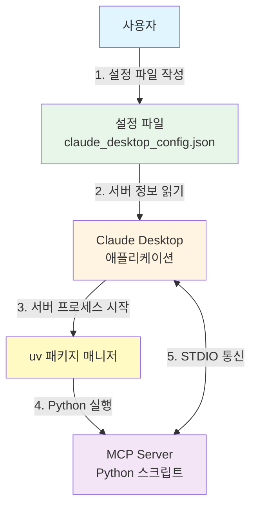
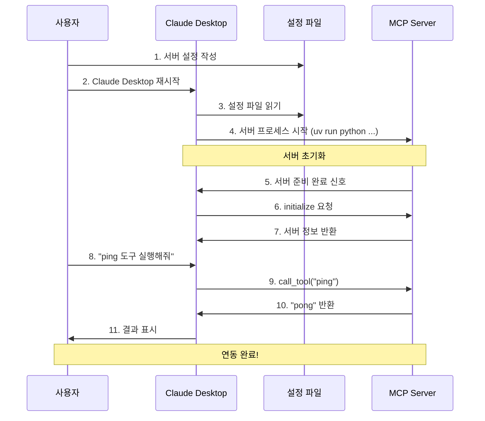
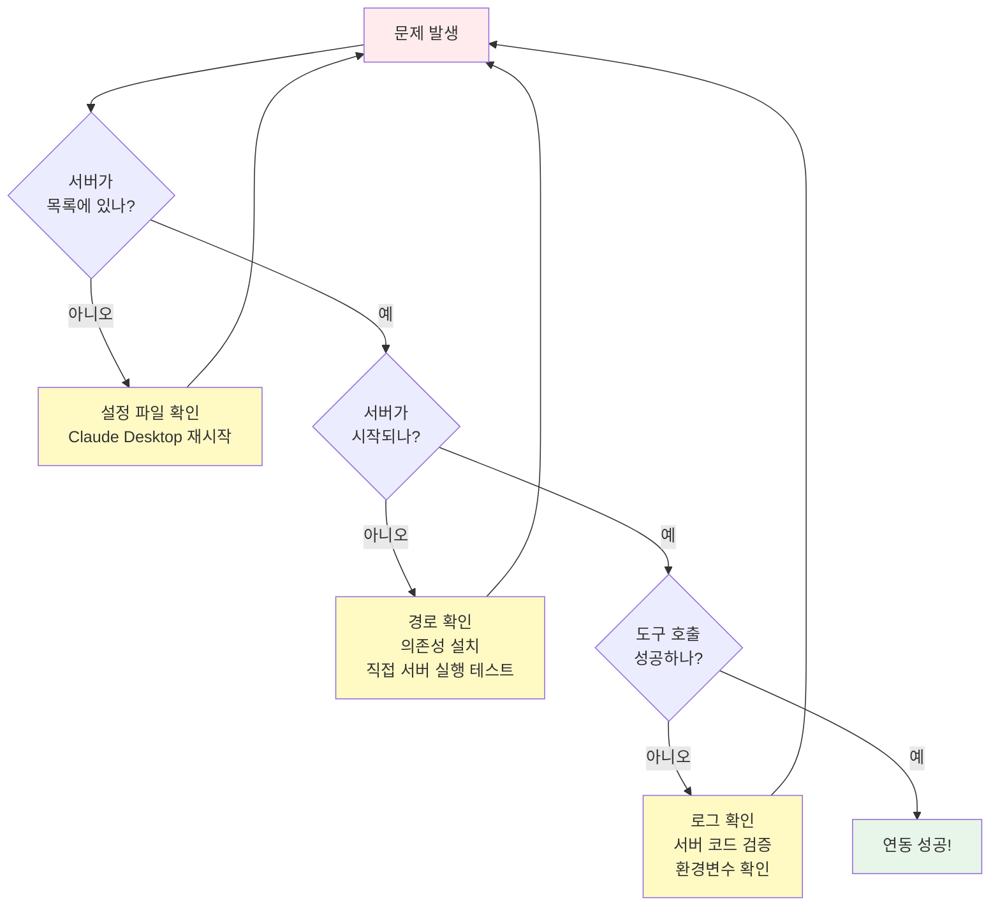

# 05. Claude Desktop 연동 가이드

**난이도**: ⭐⭐⭐
**학습 시간**: 20-25분
**목표**: MCP 서버를 Claude Desktop에 연동하고 실제로 사용하는 방법을 학습합니다.

## 📋 목차

1. [Claude Desktop 설정 방법](#claude-desktop-설정-방법)
2. [MCP 서버 등록](#mcp-서버-등록)
3. [연동 확인](#연동-확인)
4. [일반적인 오류 및 해결책](#일반적인-오류-및-해결책)
5. [로그 분석 및 디버깅](#로그-분석-및-디버깅)
6. [팁 및 모범 사례](#팁-및-모범-사례)

---

## Claude Desktop 설정 방법

### Claude Desktop 연동 개요

Claude Desktop과 MCP 서버를 연동하는 전체 구조를 이해합니다. 사용자가 설정 파일을 작성하면, Claude Desktop이 이를 읽고 uv를 통해 Python 서버를 실행한 후 STDIO로 통신합니다.



### 1. 설정 파일 위치

Claude Desktop은 MCP 서버 설정을 JSON 파일로 관리합니다. 운영체제별 설정 파일 경로는 다음과 같습니다:

| 운영체제 | 설정 파일 경로 |
|---------|--------------|
| **macOS** | `~/Library/Application Support/Claude/claude_desktop_config.json` |
| **Windows** | `%APPDATA%\Claude\claude_desktop_config.json` |
| **Linux** | `~/.config/Claude/claude_desktop_config.json` |

### 2. 설정 파일 열기

**macOS/Linux**:
```bash
# 설정 파일이 없으면 생성
mkdir -p ~/Library/Application\ Support/Claude  # macOS
# 또는
mkdir -p ~/.config/Claude  # Linux

# 텍스트 에디터로 열기
code ~/Library/Application\ Support/Claude/claude_desktop_config.json  # macOS
# 또는
code ~/.config/Claude/claude_desktop_config.json  # Linux
```

**Windows (PowerShell)**:
```powershell
# 설정 폴더로 이동
cd $env:APPDATA\Claude

# 메모장으로 열기
notepad claude_desktop_config.json
```

---

## MCP 서버 등록

### 1. 기본 설정 구조

설정 파일의 기본 구조는 다음과 같습니다:

```json
{
  "mcpServers": {
    "서버이름": {
      "command": "실행명령어",
      "args": ["인자1", "인자2"],
      "env": {
        "환경변수": "값"
      }
    }
  }
}
```

### 2. 예제 서버 등록

`examples/claude_desktop_config.json` 파일을 참고하여 다음과 같이 설정합니다:

```json
{
  "mcpServers": {
    "basic-server": {
      "command": "uv",
      "args": [
        "run",
        "python",
        "/absolute/path/to/fastmcp-example/03-mcp-tools/01-basic-server/main.py"
      ],
      "env": {}
    },
    "tools-server": {
      "command": "uv",
      "args": [
        "run",
        "python",
        "/absolute/path/to/fastmcp-example/03-mcp-tools/02-tools/main.py"
      ],
      "env": {
        "WEATHER_API_KEY": "your-api-key-here-optional"
      }
    },
    "stdio-server": {
      "command": "uv",
      "args": [
        "run",
        "python",
        "/absolute/path/to/fastmcp-example/03-mcp-tools/03-transport-methods/stdio_server.py"
      ],
      "env": {}
    },
    "resources-server": {
      "command": "uv",
      "args": [
        "run",
        "python",
        "/absolute/path/to/fastmcp-example/03-mcp-tools/04-resources/main.py"
      ],
      "env": {}
    }
  }
}
```

> ⚠️ **중요**: `/absolute/path/to/fastmcp-example`를 실제 프로젝트 경로로 변경하세요!

**경로 확인 방법**:
```bash
# 프로젝트 디렉토리에서 실행
pwd
# 출력 예시: /Users/username/education/fastmcp-example
```

### 3. 설정 항목 설명

| 항목 | 설명 | 예시 |
|------|------|------|
| `command` | 실행할 명령어 (반드시 절대 경로 또는 PATH에 있는 명령어) | `"uv"`, `"python"`, `"/usr/bin/python3"` |
| `args` | 명령어에 전달할 인자 배열 (절대 경로 권장) | `["run", "python", "/path/to/server.py"]` |
| `env` | 환경변수 (서버에 전달할 설정값) | `{"API_KEY": "secret"}` |

---

## 연동 확인

### 1. Claude Desktop 재시작

설정 파일을 수정한 후 **반드시 Claude Desktop을 완전히 종료하고 재시작**합니다.

**macOS**:
```bash
# Claude Desktop 완전 종료
killall Claude

# 재시작
open -a Claude
```

**Windows**:
- 작업 관리자에서 Claude 프로세스 종료 후 재실행

**Linux**:
```bash
pkill -f claude
# 재시작
claude-desktop &
```

### 2. MCP 서버 연결 확인

Claude Desktop에서 새 대화를 시작하고 다음을 확인합니다:

1. **도구 아이콘 확인**: 채팅 입력창 옆에 🔌 또는 🔧 아이콘이 표시되는지 확인
2. **서버 목록 확인**: 아이콘을 클릭하면 등록한 MCP 서버 목록이 나타남
3. **도구 사용 테스트**: 다음 프롬프트를 입력하여 테스트

```
"basic-server의 ping 도구를 실행해줘"
```

또는

```
"tools-server의 계산기로 125 + 375를 계산해줘"
```

### 3. 성공 예시

연동이 성공하면 Claude가 다음과 같이 응답합니다:

```
도구를 호출합니다: ping

결과: pong (서버 응답 시간: 0.002초)
```

### 전체 연동 플로우

설정 작성부터 실제 도구 실행까지의 완전한 시퀀스를 보여줍니다. 이 다이어그램을 따라가면 Claude Desktop 연동의 모든 단계를 이해할 수 있습니다.



---

## 일반적인 오류 및 해결책

### ❌ 오류 1: "MCP server not found" 또는 서버가 목록에 나타나지 않음

**원인**:
- 설정 파일 경로가 잘못됨
- JSON 문법 오류
- Claude Desktop 재시작 안 함

**해결책**:
1. 설정 파일 경로 재확인 (위의 "설정 파일 위치" 참고)
2. JSON 문법 검증:
   ```bash
   # Python으로 JSON 검증
   python -m json.tool ~/Library/Application\ Support/Claude/claude_desktop_config.json
   ```
3. Claude Desktop 완전 종료 후 재시작

---

### ❌ 오류 2: "Failed to start MCP server" 또는 서버 시작 실패

**원인**:
- `command` 경로가 잘못됨 (uv가 PATH에 없음)
- 서버 스크립트 경로가 상대 경로로 지정됨
- Python 의존성 미설치

**해결책**:
1. `uv` 설치 확인:
   ```bash
   which uv
   # 출력 예시: /Users/username/.cargo/bin/uv
   ```
   - 출력이 없으면 uv 설치: `curl -LsSf https://astral.sh/uv/install.sh | sh`
2. 서버 스크립트 경로를 **절대 경로**로 변경
3. 의존성 설치:
   ```bash
   cd /path/to/fastmcp-example
   uv sync
   ```

---

### ❌ 오류 3: "Tool execution failed" 또는 도구 실행 중 오류

**원인**:
- 서버 코드에 런타임 에러
- 환경변수 누락
- 권한 문제 (파일 시스템 접근)

**해결책**:
1. 서버를 직접 실행하여 오류 확인:
   ```bash
   uv run python 03-mcp-tools/02-tools/main.py
   ```
2. 환경변수 설정 확인 (예: `WEATHER_API_KEY`)
3. 파일 시스템 접근 권한 확인

---

### ❌ 오류 4: "Server timeout" 또는 서버 응답 없음

**원인**:
- 서버가 비동기 작업에서 블로킹됨
- 네트워크 요청 타임아웃 (Weather API 등)
- 무한 루프 또는 데드락

**해결책**:
1. 서버 로그 확인 (아래 "로그 분석 및 디버깅" 참고)
2. 타임아웃 설정 확인:
   ```python
   # httpx 예시
   async with httpx.AsyncClient(timeout=5.0) as client:
       ...
   ```
3. 서버 재시작

---

## 로그 분석 및 디버깅

### 디버깅 플로우

문제가 발생했을 때 어떤 순서로 확인하고 해결해야 하는지 보여주는 의사결정 트리입니다. 각 단계에서 문제를 진단하고 적절한 해결책을 적용할 수 있습니다.



### 1. Claude Desktop 로그 위치

Claude Desktop은 MCP 서버와의 통신 로그를 저장합니다:

| 운영체제 | 로그 파일 경로 |
|---------|---------------|
| **macOS** | `~/Library/Logs/Claude/mcp.log` 또는 `~/Library/Logs/Claude/mcp-server-{서버이름}.log` |
| **Windows** | `%APPDATA%\Claude\logs\mcp.log` |
| **Linux** | `~/.local/share/Claude/logs/mcp.log` |

### 2. 로그 확인 방법

**실시간 로그 모니터링 (macOS/Linux)**:
```bash
# 전체 MCP 로그
tail -f ~/Library/Logs/Claude/mcp.log

# 특정 서버 로그 (있는 경우)
tail -f ~/Library/Logs/Claude/mcp-server-tools-server.log
```

**최근 오류 검색**:
```bash
# 최근 100줄에서 "error" 검색
tail -n 100 ~/Library/Logs/Claude/mcp.log | grep -i error

# 특정 서버 관련 로그 필터링
tail -n 200 ~/Library/Logs/Claude/mcp.log | grep "tools-server"
```

### 3. 서버 측 로깅 추가

디버깅을 위해 서버 코드에 로깅을 추가할 수 있습니다:

```python
import logging

# 로깅 설정
logging.basicConfig(
    level=logging.DEBUG,
    format="%(asctime)s - %(name)s - %(levelname)s - %(message)s",
    handlers=[
        logging.FileHandler("/tmp/mcp-server-debug.log"),
        logging.StreamHandler()
    ]
)

logger = logging.getLogger(__name__)

@mcp.tool
def my_tool(param: str) -> str:
    logger.info(f"my_tool called with param: {param}")
    try:
        result = process(param)
        logger.debug(f"Result: {result}")
        return result
    except Exception as e:
        logger.error(f"Error in my_tool: {e}", exc_info=True)
        raise
```

**로그 확인**:
```bash
tail -f /tmp/mcp-server-debug.log
```

### 4. 일반적인 로그 메시지

| 로그 메시지 | 의미 | 해결책 |
|------------|------|--------|
| `Server started successfully` | 서버가 정상 시작됨 | 정상 |
| `Connection refused` | 서버 연결 실패 | 서버 경로 및 실행 권한 확인 |
| `Tool not found: {tool_name}` | 도구가 등록되지 않음 | 서버 코드에서 `@mcp.tool` 데코레이터 확인 |
| `Validation error: {details}` | 입력 타입 불일치 | 도구 파라미터 타입 힌트 확인 |
| `Timeout waiting for response` | 서버 응답 시간 초과 | 비동기 작업 타임아웃 설정 |

---

## 팁 및 모범 사례

### ✅ 1. 개발 중에는 서버를 하나씩 등록

처음에는 하나의 서버만 등록하여 테스트한 후, 정상 작동을 확인한 다음 나머지 서버를 추가하세요.

```json
{
  "mcpServers": {
    "basic-server": {
      "command": "uv",
      "args": ["run", "python", "/path/to/01-basic-server/main.py"],
      "env": {}
    }
    // 정상 작동 확인 후 다른 서버 추가
  }
}
```

### ✅ 2. 절대 경로 사용

상대 경로는 작업 디렉토리에 따라 달라지므로, 항상 **절대 경로**를 사용하세요.

❌ **잘못된 예**:
```json
"args": ["run", "python", "03-mcp-tools/01-basic-server/main.py"]
```

✅ **올바른 예**:
```json
"args": ["run", "python", "/Users/username/fastmcp-example/03-mcp-tools/01-basic-server/main.py"]
```

### ✅ 3. 환경변수는 명시적으로 전달

STDIO 방식은 격리된 환경에서 실행되므로, 필요한 환경변수는 `env` 섹션에 명시적으로 전달해야 합니다.

```json
"env": {
  "WEATHER_API_KEY": "your-key",
  "LOG_LEVEL": "DEBUG",
  "DATA_PATH": "/path/to/data"
}
```

### ✅ 4. 서버 이름은 명확하게

서버 이름(`mcpServers`의 키)은 기능을 명확히 설명하도록 작성하세요.

```json
{
  "mcpServers": {
    "calculator-tools": { ... },
    "file-manager": { ... },
    "weather-api": { ... }
  }
}
```

### ✅ 5. 주석 추가 (비공식)

JSON은 공식적으로 주석을 지원하지 않지만, 일부 파서는 `//` 주석을 허용합니다. Claude Desktop이 지원하는 경우 주석을 활용하세요:

```json
{
  "mcpServers": {
    // 기본 MCP 서버 (ping 도구)
    "basic-server": { ... },

    // 계산기, 날씨, 파일시스템 도구
    "tools-server": { ... }
  }
}
```

> ⚠️ 주의: 공식적으로 지원하지 않으므로 오류 발생 시 주석 제거

### ✅ 6. 정기적인 로그 모니터링

개발 중에는 로그를 실시간으로 모니터링하여 문제를 빠르게 파악하세요:

```bash
# 터미널 1: 서버 직접 실행
uv run python 03-mcp-tools/02-tools/main.py

# 터미널 2: MCP 로그 모니터링
tail -f ~/Library/Logs/Claude/mcp.log

# 터미널 3: Claude Desktop 사용
```

### ✅ 7. 버전 관리

MCP 서버 설정 파일을 버전 관리하지 마세요 (개인 설정 및 API 키 포함). `.gitignore`에 추가:

```gitignore
# .gitignore
claude_desktop_config.json
*.log
```

대신 예시 파일(`claude_desktop_config.example.json`)을 제공하세요.

---

## 🎯 연습 과제

1. **기본 연동**
   `01-basic-server`를 Claude Desktop에 등록하고 `ping` 도구를 실행해보세요.

2. **다중 서버 관리**
   4개의 예제 서버를 모두 등록하고 각 서버의 도구를 번갈아 사용해보세요.

3. **오류 디버깅**
   일부러 잘못된 경로를 설정하고, 로그를 분석하여 문제를 찾아보세요.

4. **환경변수 활용**
   `WEATHER_API_KEY`를 설정하여 실제 날씨 API를 호출해보세요 (선택사항).

---

## 📚 추가 자료

- [Claude Desktop 공식 문서](https://claude.ai/docs)
- [MCP Specification](https://spec.modelcontextprotocol.io/)
- [FastMCP GitHub](https://github.com/jlowin/fastmcp)
- [uv 패키지 매니저](https://github.com/astral-sh/uv)

---

## 다음 단계

모든 예제 서버를 Claude Desktop에 연동했다면, 이제 실전 프로젝트에 MCP를 적용할 준비가 되었습니다!

- Part 4: 프로덕션 배포 및 모니터링으로 이동
- 또는 자신만의 MCP 서버를 처음부터 설계해보세요

**수고하셨습니다!** 🎉
