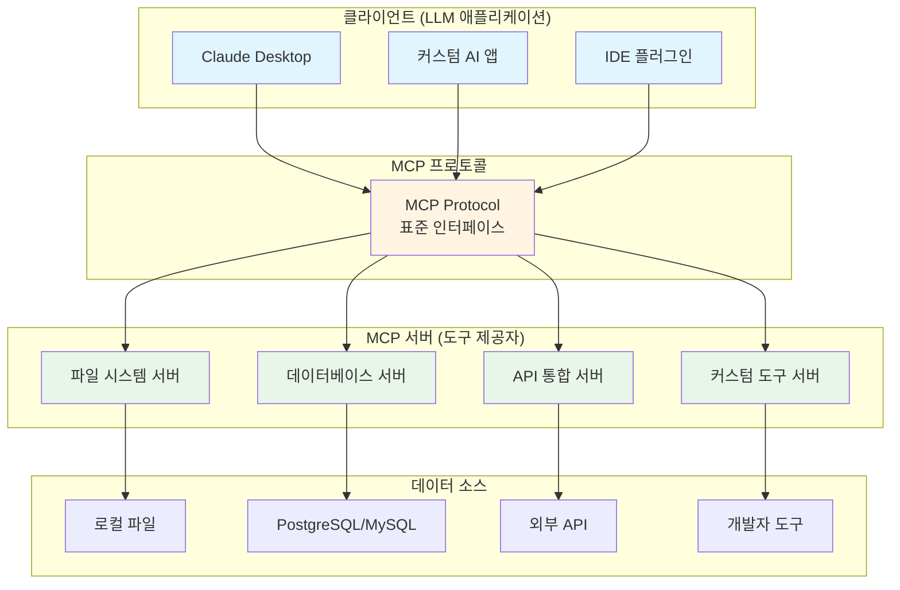
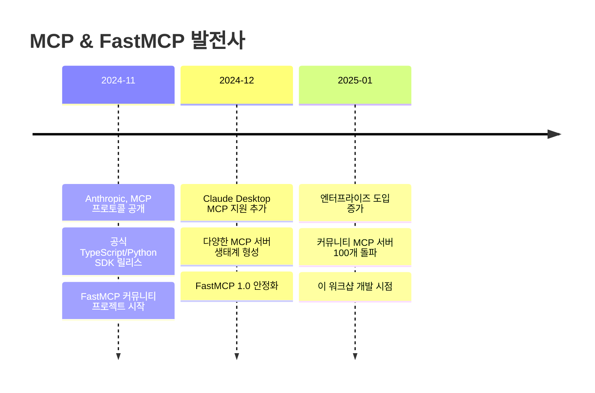
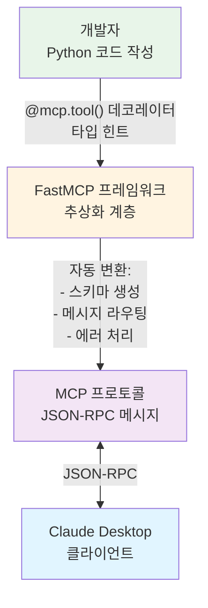
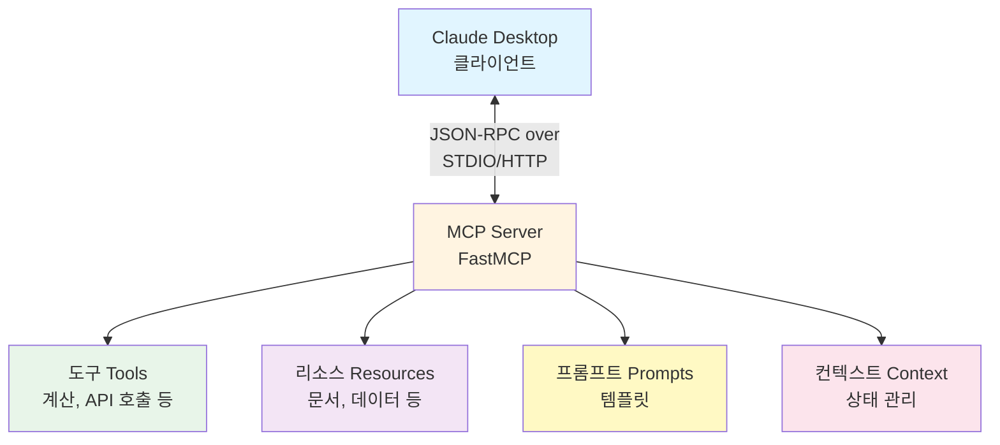
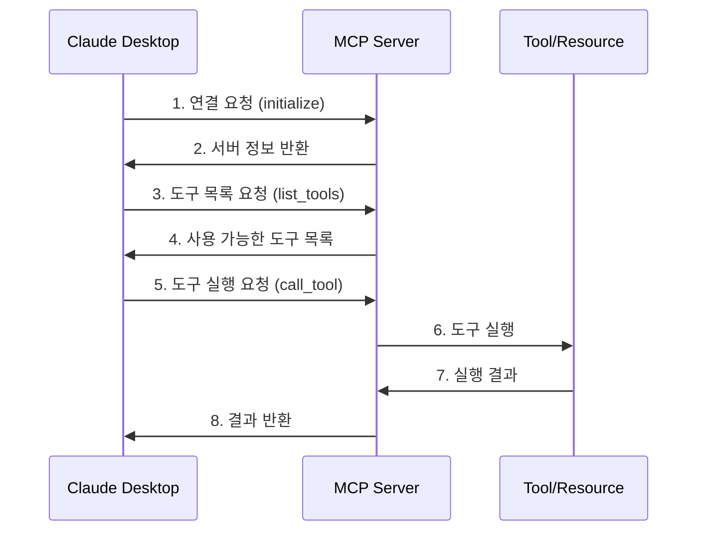

# Part 3: MCP 툴 구현

MCP(Model Context Protocol) 프로토콜의 아키텍처를 이해하고, FastMCP 프레임워크를 활용하여 실전 MCP 서버를 구현합니다. Claude Desktop과 같은 클라이언트와의 연동 및 디버깅 방법까지 학습합니다.

## 학습 시간

**총 2시간** (이론 30분 + 실습 90분)

## 선수 지식

- Python 기초 문법
- 비동기 프로그래밍 기본 개념 (`async`/`await`)
- CLI 도구 사용 경험
- JSON 데이터 구조 이해

## 학습 목표

이 파트를 완료하면 다음 능력을 갖추게 됩니다:

- ✅ MCP 프로토콜의 구조와 동작 원리 이해
- ✅ FastMCP를 활용한 서버 구현 능력
- ✅ 다양한 유형의 도구(Tools) 및 리소스(Resources) 제공
- ✅ Claude Desktop 등 클라이언트와의 연동 및 디버깅
- ✅ 실전 프로덕션 수준의 MCP 서버 개발

## MCP 프로토콜 소개

### MCP란?

**MCP(Model Context Protocol)**는 LLM 애플리케이션이 외부 데이터 소스 및 도구와 안전하고 표준화된 방법으로 통신할 수 있도록 하는 오픈 소스 프로토콜입니다.

#### 탄생 배경

**개발사**: [Anthropic](https://www.anthropic.com/) (Claude AI 개발사)
**공개일**: 2024년 11월
**목적**: AI 에이전트와 외부 시스템 간의 표준화된 통신 규약 제공

#### 왜 만들어졌나요?

MCP는 LLM 애플리케이션의 근본적인 문제를 해결하기 위해 탄생했습니다. 아래 표는 MCP 도입 전후의 차이를 보여줍니다.

| 구분 | MCP 이전 (❌ 문제점) | MCP 이후 (✅ 해결책) |
|------|-------------------|------------------|
| **표준화** | 각 서비스마다 다른 API 방식<br/>→ 파편화된 생태계 | 단일 표준 프로토콜<br/>→ 모든 LLM 앱이 동일한 방식 사용 |
| **재사용성** | 같은 기능을 여러 번 구현<br/>→ 중복 개발 비용 | 한 번 만든 MCP 서버를 재사용<br/>→ 개발 비용 절감 |
| **보안** | 통일된 보안 기준 부재<br/>→ 각자 보안 구현 (취약점 가능) | 검증된 프로토콜 기반 통신<br/>→ 표준화된 보안 |
| **확장성** | 새 도구마다 재구현 필요<br/>→ 확장 어려움 | 새 도구를 쉽게 추가하고 공유<br/>→ 생태계 빠른 성장 |
| **개발자 경험** | 각 플랫폼마다 학습 필요<br/>→ 높은 진입장벽 | 한 번 배우면 모든 곳에 적용<br/>→ 낮은 진입장벽 |

**핵심 메시지:**
MCP는 "LLM 도구 통합"을 **USB처럼 표준화**하여, 개발자가 한 번 만든 도구를 모든 LLM 앱에서 사용할 수 있게 합니다.

#### MCP의 비전

> "MCP는 LLM 애플리케이션을 위한 **USB 표준**과 같습니다.
> USB가 하드웨어 연결을 표준화했듯이, MCP는 AI와 외부 시스템의 연결을 표준화합니다."

**적용 사례:**
- Claude Desktop (Anthropic 공식 앱)
- 다양한 서드파티 AI 애플리케이션
- 엔터프라이즈 AI 시스템
- 개발자 도구 및 IDE 플러그인

#### MCP 생태계

MCP는 다양한 클라이언트가 표준화된 방식으로 여러 MCP 서버에 접근할 수 있는 생태계를 만듭니다.



**핵심 장점:**
- 🔌 **플러그 앤 플레이**: 새로운 서버를 추가해도 클라이언트 코드 변경 불필요
- 🔄 **상호운용성**: 한 번 만든 서버를 모든 MCP 클라이언트에서 사용
- 📦 **생태계 공유**: 커뮤니티가 만든 MCP 서버를 쉽게 재사용

### FastMCP란?

**FastMCP**는 Python으로 MCP 서버를 쉽고 빠르게 구현할 수 있게 해주는 현대적인 프레임워크입니다.

**개발자**: [Marvin (jlowin)](https://github.com/jlowin) - Prefect 창업자
**공개일**: 2024년 11월 (MCP 공개와 동시)
**목적**: Python 개발자가 MCP 서버를 쉽게 만들 수 있도록 추상화 제공
**라이선스**: MIT (오픈 소스)

FastMCP는 MCP 공식 SDK가 아닌 **커뮤니티 주도 프로젝트**지만, Python에서 MCP 서버를 구현하는 사실상의 표준으로 자리잡았습니다.

#### MCP vs FastMCP: 차이점 이해하기

| 구분 | MCP | FastMCP |
|------|-----|---------|
| **정체** | 프로토콜 표준 (규약) | 구현 프레임워크 (라이브러리) |
| **개발사** | Anthropic | 커뮤니티 (jlowin) |
| **역할** | "어떻게 통신할지" 정의 | "어떻게 쉽게 구현할지" 제공 |
| **비유** | HTTP 프로토콜 | Express.js, FastAPI |
| **언어** | 언어 무관 | Python 전용 |
| **문서** | [spec.modelcontextprotocol.io](https://spec.modelcontextprotocol.io/) | [github.com/jlowin/fastmcp](https://github.com/jlowin/fastmcp) |

**관계:**
```
MCP (프로토콜 표준)
    ↓ 구현
FastMCP (Python 프레임워크)
    ↓ 사용
당신의 MCP 서버 (이 워크샵에서 만드는 것)
```

**다른 언어의 MCP 구현:**
- **TypeScript/JavaScript**: `@modelcontextprotocol/sdk`
- **Python (공식)**: `mcp` 패키지
- **Python (FastMCP)**: `fastmcp` (이 워크샵에서 사용)
- **Rust, Go 등**: 커뮤니티 구현체 개발 중

#### MCP 발전 타임라인



**이정표:**
- 📅 **2024년 11월**: MCP 프로토콜 첫 공개
- 🚀 **2024년 12월**: Claude Desktop에 MCP 통합
- 🌍 **2025년**: 글로벌 AI 커뮤니티 채택 확대
- 🎯 **현재**: 다양한 산업 분야에서 활용 중

#### 주요 특징

| 특징 | 설명 |
|------|------|
| 🚀 **간결한 API** | 데코레이터 기반의 직관적인 인터페이스로 몇 줄의 코드만으로 서버 구축 |
| ⚡ **비동기 지원** | `async/await`를 완벽 지원하여 고성능 비동기 도구 구현 가능 |
| 🔧 **자동 스키마 생성** | 타입 힌트와 독스트링을 분석하여 JSON Schema 자동 생성 |
| 🌐 **다중 전송 방식** | STDIO, HTTP 등 다양한 전송 프로토콜 지원 |
| 📦 **제로 설정** | 복잡한 설정 없이 즉시 시작 가능 |

#### FastMCP vs 직접 MCP 구현

```python
# ❌ 직접 MCP 구현 (복잡함)
# - JSON-RPC 프로토콜 수동 구현
# - 메시지 파싱 및 라우팅 로직 작성
# - 스키마 정의 수동 작성
# - 에러 처리 구현
# 수백 줄의 보일러플레이트 코드 필요...

# ✅ FastMCP 사용 (간단함)
from fastmcp import FastMCP

mcp = FastMCP("My Server")

@mcp.tool()
def greet(name: str) -> str:
    """사용자에게 인사합니다."""
    return f"안녕하세요, {name}님!"

mcp.run()
```

#### 왜 FastMCP를 사용하나요?

1. **생산성 향상**: 보일러플레이트 코드 제거로 비즈니스 로직에 집중
2. **타입 안정성**: Python 타입 힌트를 활용한 컴파일 타임 검증
3. **커뮤니티**: 활발한 개발과 지속적인 업데이트
4. **확장성**: 소규모 프로젝트부터 대규모 프로덕션까지 대응

#### FastMCP의 역할

FastMCP는 개발자와 MCP 프로토콜 사이의 추상화 계층으로, 복잡한 프로토콜 구현을 단순한 Python 함수로 변환해줍니다.



**개발자 경험 비교:**

| 계층 | 직접 구현 | FastMCP 사용 |
|------|-----------|-------------|
| 코드 양 | 수백 줄 | 10줄 이내 |
| 복잡도 | 높음 | 낮음 |
| 학습 곡선 | 가파름 | 완만함 |
| 유지보수 | 어려움 | 쉬움 |

### 핵심 구성 요소

| 구성 요소 | 설명 | 예시 |
|-----------|------|------|
| **서버** | 도구, 리소스, 프롬프트를 제공하는 구현체 | 파일 시스템 서버, API 서버 |
| **클라이언트** | MCP 서버와 통신하는 애플리케이션 | Claude Desktop, 커스텀 AI 앱 |
| **도구(Tools)** | LLM이 호출할 수 있는 함수 | 계산기, 파일 읽기, API 호출 |
| **리소스(Resources)** | LLM이 접근할 수 있는 데이터 | 문서, 데이터베이스, 파일 |
| **프롬프트(Prompts)** | 재사용 가능한 프롬프트 템플릿 | 코드 리뷰, 문서 요약 |

### MCP 아키텍처

MCP의 전체 구조를 이해하는 것이 중요합니다. 아래 다이어그램은 클라이언트(Claude Desktop)와 서버(FastMCP) 간의 관계, 그리고 서버가 제공하는 주요 구성요소들을 보여줍니다.



#### 구성요소 상세 설명

| 구성요소 | 역할 | 특징 | 실제 예시 |
|---------|------|------|----------|
| **Client<br/>(클라이언트)** | MCP 서버와 통신하는 애플리케이션 | • LLM과 사용자 인터페이스 제공<br/>• 서버에 요청을 보내고 결과 표시 | • Claude Desktop<br/>• 커스텀 AI 챗봇<br/>• IDE 플러그인 |
| **Server<br/>(서버)** | 도구, 리소스, 프롬프트를 제공하는 중심 허브 | • MCP 프로토콜 구현<br/>• 클라이언트 요청 처리<br/>• 각 구성요소 관리 | • FastMCP 서버<br/>• 파일시스템 서버<br/>• API 통합 서버 |
| **Tools<br/>(도구)** | LLM이 실행할 수 있는 함수 | • **능동적 작업 수행**<br/>• 외부 시스템과 상호작용<br/>• 부작용 가능 (쓰기, 수정) | • `calculate(a, b)`: 계산<br/>• `send_email()`: 이메일 발송<br/>• `create_file()`: 파일 생성 |
| **Resources<br/>(리소스)** | LLM이 읽을 수 있는 데이터 | • **수동적 정보 제공**<br/>• 읽기 전용 (부작용 없음)<br/>• URI로 접근 | • `doc://guide`: 문서<br/>• `file://config.json`: 설정<br/>• `db://users/1`: 데이터 |
| **Prompts<br/>(프롬프트)** | 재사용 가능한 프롬프트 템플릿 | • 일관된 대화 패턴 제공<br/>• 파라미터화 가능<br/>• 워크플로우 표준화 | • "코드 리뷰 템플릿"<br/>• "문서 요약 템플릿"<br/>• "버그 분석 템플릿" |
| **Context<br/>(컨텍스트)** | 대화 상태 및 메타데이터 관리 | • 세션 정보 유지<br/>• 대화 히스토리 관리<br/>• 사용자 설정 저장 | • 대화 기록<br/>• 사용자 선호도<br/>• 임시 데이터 |

**핵심 차이점: Tools vs Resources**

| 비교 항목 | Tools (도구) | Resources (리소스) |
|----------|------------|-----------------|
| 동작 | 능동적 (Action) | 수동적 (Information) |
| 목적 | 작업 실행 | 데이터 제공 |
| 부작용 | 있음 (상태 변경 가능) | 없음 (읽기 전용) |
| 사용 예시 | "이메일 보내줘" | "문서 내용을 알려줘" |
| 접근 방식 | 함수 호출 | URI 기반 |
| 반환 형식 | 임의 (Any) | 주로 문자열/JSON |

**Resources 상세 가이드:**

Resources는 LLM에게 문서, 파일, 데이터베이스 등의 정보를 제공하는 읽기 전용 인터페이스입니다. URI 스키마(`doc://`, `file://`, `db://`)로 접근하며, 멱등성을 보장합니다.

- **핵심 개념**: URI 기반 접근, 읽기 전용, 컨텍스트 제공
- **사용 사례**: 문서 제공, 파일 읽기, 데이터베이스 조회, API 데이터, 설정 정보
- **보안**: 경로 검증, 권한 검증, 민감 정보 필터링
- **실전 팁**: 캐싱, 메타데이터 제공, 에러 처리

📖 **상세 내용은 [04-resources](./04-resources/) 참조**

#### 통신 플로우

실제로 Claude Desktop이 MCP 서버와 어떻게 통신하는지 순서대로 살펴봅니다. 이 시퀀스는 서버 연결부터 도구 실행까지의 전체 과정을 나타냅니다.



## 예제 목록

### 01. 기본 MCP 서버 (난이도: ⭐)

**학습 시간**: 20분

최소한의 MCP 서버를 구현하여 MCP의 기본 구조를 이해합니다.

**학습 내용:**
- FastMCP 서버 생성
- 기본 설정 및 메타데이터
- 서버 실행 및 연결 확인

📁 [예제 바로가기](./01-basic-server/)

---

### 02. 도구(Tools) 구현 (난이도: ⭐⭐)

**학습 시간**: 30분

다양한 유형의 도구를 구현하여 LLM이 실행할 수 있는 함수를 제공합니다.

**학습 내용:**
- 도구 등록 및 스키마 정의
- 매개변수 검증
- 비동기 도구 구현
- 에러 처리

**구현 예제:**
- 계산기 도구
- 날씨 조회 도구
- 파일 시스템 도구

📁 [예제 바로가기](./02-tools/)

---

### 03. 리소스(Resources) 제공 (난이도: ⭐⭐)

**학습 시간**: 30분

LLM이 접근할 수 있는 데이터 리소스를 제공합니다.

**학습 내용:**
- 리소스 등록 및 URI 스키마
- 동적 리소스 목록
- 리소스 내용 제공
- 리소스 템플릿

**구현 예제:**
- 정적 문서 리소스
- 데이터베이스 쿼리 리소스
- API 데이터 리소스

📁 [예제 바로가기](./03-resources/)

---

### 04. 클라이언트 연동 및 디버깅 (난이도: ⭐⭐⭐)

**학습 시간**: 40분

Claude Desktop과 같은 실제 클라이언트와 연동하고 디버깅 방법을 학습합니다.

**학습 내용:**
- Claude Desktop 설정
- MCP 서버 등록
- 연결 디버깅
- 로그 분석
- 일반적인 문제 해결

📁 [예제 바로가기](./04-client-integration/)

---

## 실습 환경 설정

### 1. 의존성 설치

이 워크샵에서는 FastMCP를 사용하여 MCP 서버를 구현합니다.

```bash
# 프로젝트 루트로 이동
cd /path/to/fastmcp-example

# 의존성 설치 (FastMCP 포함)
uv sync
```

**설치되는 주요 패키지:**
- `fastmcp`: MCP 서버 프레임워크
- `httpx`: 비동기 HTTP 클라이언트 (날씨 도구용)
- `pytest`: 테스트 프레임워크

### 2. 예제 실행

```bash
# 기본 서버 실행
uv run python 03-mcp-tools/01-basic-server/main.py

# 테스트 실행
uv run pytest 03-mcp-tools/01-basic-server/tests/
```

### 3. Claude Desktop 연동

1. Claude Desktop 설치 ([다운로드](https://claude.ai/download))
2. MCP 서버 설정 파일 수정 (`~/Library/Application Support/Claude/claude_desktop_config.json` on macOS)
3. 서버 등록 및 재시작

자세한 내용은 [04-client-integration](./04-client-integration/) 참조

## FastMCP 주요 개념

### 서버 생성

```python
from fastmcp import FastMCP

# 서버 인스턴스 생성
mcp = FastMCP("My MCP Server")
```

### 도구 등록

```python
@mcp.tool()
def calculate(operation: str, a: float, b: float) -> float:
    """간단한 계산을 수행합니다."""
    if operation == "add":
        return a + b
    elif operation == "subtract":
        return a - b
    # ...
```

### 리소스 등록

```python
@mcp.resource("file://{path}")
def get_file_content(path: str) -> str:
    """파일 내용을 반환합니다."""
    with open(path, "r") as f:
        return f.read()
```

### 비동기 지원

```python
@mcp.tool()
async def fetch_data(url: str) -> dict:
    """외부 API에서 데이터를 가져옵니다."""
    async with httpx.AsyncClient() as client:
        response = await client.get(url)
        return response.json()
```

## 학습 순서

1. **01-basic-server** (필수): MCP 서버의 기본 구조 이해
2. **02-tools** (필수): 도구 구현 및 등록
3. **03-resources** (권장): 리소스 제공 방법
4. **04-client-integration** (필수): 실전 연동 및 디버깅

**추천 경로:**
```
01 → 02 → 03 → 04
```

각 예제는 독립적이지만, 순서대로 학습하는 것을 권장합니다.

## 문제 해결

### 자주 발생하는 문제

**Q: 서버가 시작되지 않습니다**
```bash
# 포트가 이미 사용 중인지 확인
lsof -i :8000

# 다른 포트로 실행
uv run python main.py --port 8001
```

**Q: Claude Desktop에서 서버를 찾을 수 없습니다**
- 설정 파일 경로 확인
- JSON 구문 오류 확인
- Claude Desktop 재시작

**Q: 도구 호출이 실패합니다**
- 도구 스키마 확인 (타입, 필수 필드)
- 에러 로그 분석
- 매개변수 검증 로직 확인

자세한 문제 해결은 각 예제의 README를 참조하세요.

## 추가 자료

- [MCP 공식 문서](https://modelcontextprotocol.io)
- [FastMCP GitHub](https://github.com/jlowin/fastmcp)
- [Claude Desktop 가이드](https://claude.ai/docs)
- [MCP Specification](https://spec.modelcontextprotocol.io)

## 다음 단계

Part 3을 완료했다면 다음으로 진행하세요:

- **Part 4: 테스트 및 배포** - 바이브코딩 테스트와 Docker 배포
- **Part 5: A2A 에이전트** - Agent-to-Agent 통신 및 mem0

---

**Happy Coding!** 🚀

문의사항이나 피드백은 언제든지 환영합니다!
