# AI-DLC 테스트 방법론 개요

## AI-DLC vs 전통적 SDLC 테스트 비교

### 테스트 접근법 차이

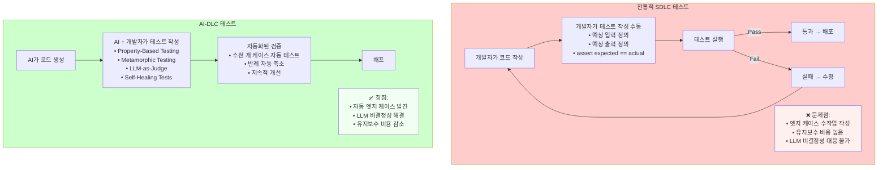

---

## AI-DLC 테스트 기법 상세 비교

### 1. TDD/BDD with AI

#### 전통적 TDD

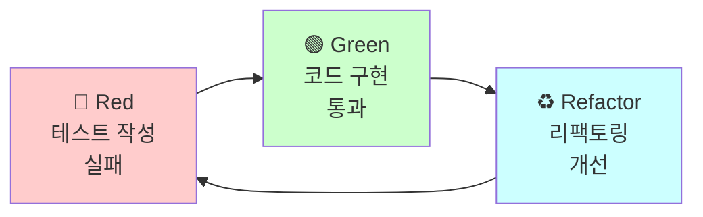

#### AI-Powered TDD

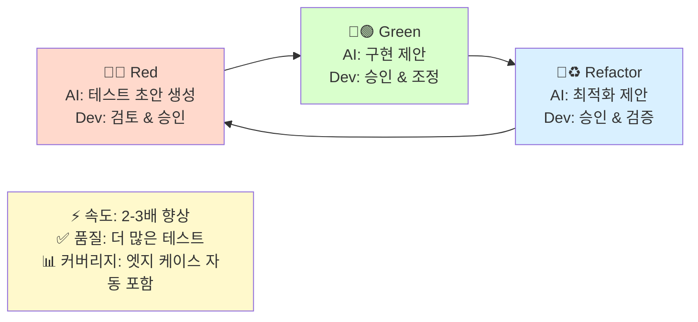

---

### 2. Metamorphic Testing

#### 핵심 아이디어
정확한 출력을 예측할 수 없어도, **입력 변환 시 출력 간 관계**는 검증 가능!

##### 1. 순열 불변성 (Permutation Invariance)

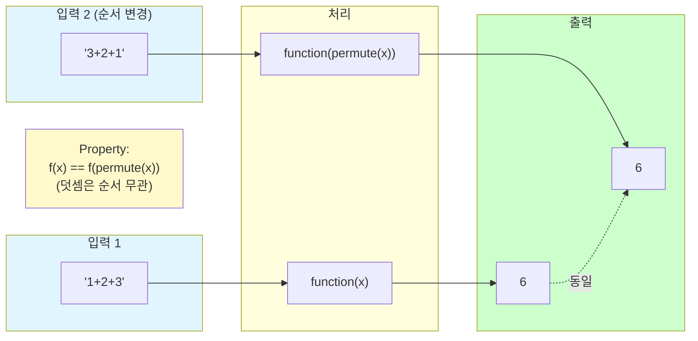

##### 2. 가산 단조성 (Additive Monotonicity)

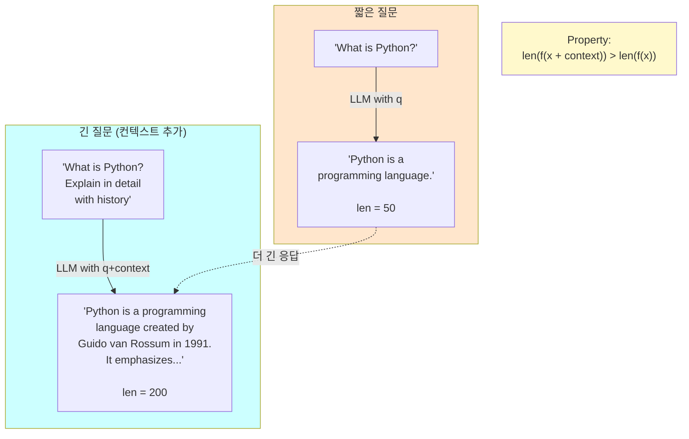

##### 3. 부정 반전 (Negation Inversion)

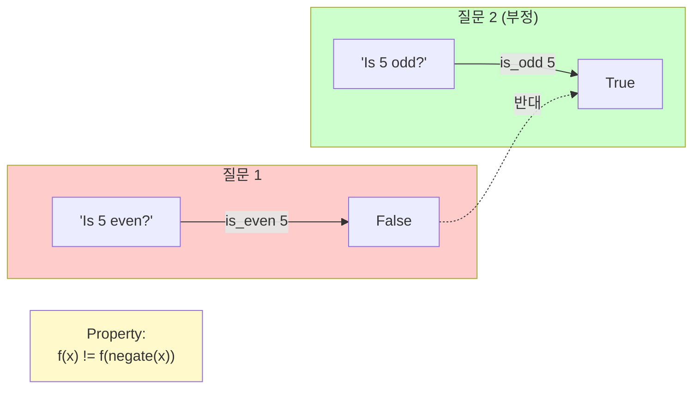

#### 실전 적용: LLM 테스트

**시나리오**: AI 번역기 테스트
**문제**: 번역 결과가 매번 다를 수 있어 정확한 예상 출력 불가
**해결**: Metamorphic Relations 사용!

##### Relation 1: 역번역 일관성 (Back-translation Consistency)

```mermaid
graph TB
    Original["한글 원문:<br/>'안녕하세요'"]
    English["영어 번역:<br/>'Hello'"]
    BackToKorean["역번역 한글:<br/>'안녕하세요'<br/>(원문과 유사)"]

    Original -->|translate ko to en| English
    English -->|translate en to ko| BackToKorean

    BackToKorean -.의미 유사도 > 0.8.-> Original

    Property["Property:<br/>semantic_similarity(original, back_translated) > 0.8"]

    style Original fill:#e1f5ff
    style English fill:#ffe6cc
    style BackToKorean fill:#ccffcc
    style Property fill:#fff9cc
```

##### Relation 2: 패러프레이즈 일관성 (Paraphrase Consistency)

```mermaid
graph TB
    subgraph Inputs["유사한 의미의 입력"]
        In1["'How are you?'"]
        In2["'How's it going?'"]
    end

    subgraph Outputs["번역 출력"]
        Out1["'어떻게 지내세요?'"]
        Out2["'어떻게 지내?'"]
    end

    In1 -->|translate en to ko| Out1
    In2 -->|translate en to ko| Out2

    Out1 -.의미 유사도 > 0.7.-> Out2

    Property["Property:<br/>semantic_similarity(out1, out2) > 0.7"]

    style Inputs fill:#e1f5ff
    style Outputs fill:#ccffcc
    style Property fill:#fff9cc
```

---

### 3. Property-Based Testing (Hypothesis)

#### 작동 원리

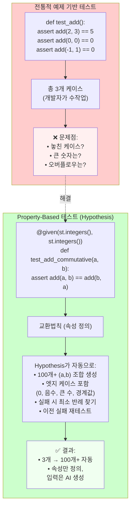

#### Hypothesis 실행 흐름

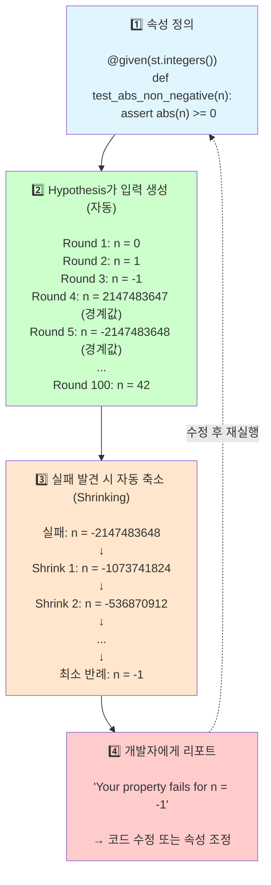

---

### 4. Self-Healing Tests

#### 문제: UI 변화로 인한 테스트 깨짐

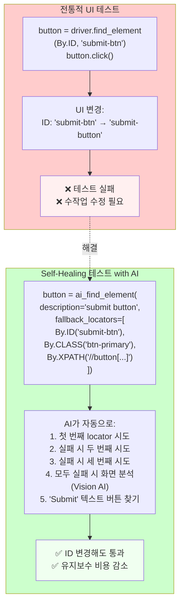

---

### 5. LLM-as-Judge

#### LLM으로 코드/테스트 품질 평가

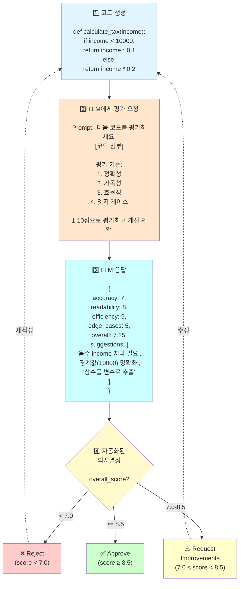

---

## AI-DLC 테스트 실전 적용 가이드

### 단계별 도입 로드맵

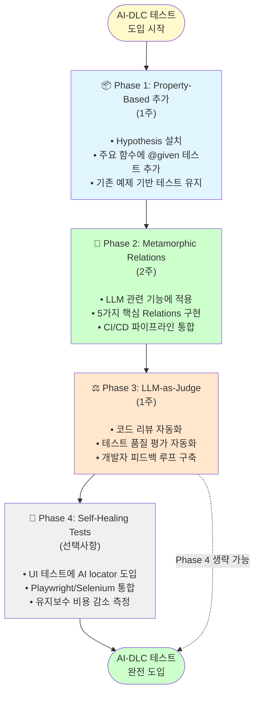

---

**다음 단계**: 각 테스트 기법의 실습 예제를 `examples/` 디렉토리에서 확인하세요!
