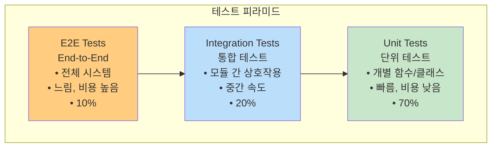
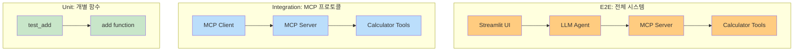
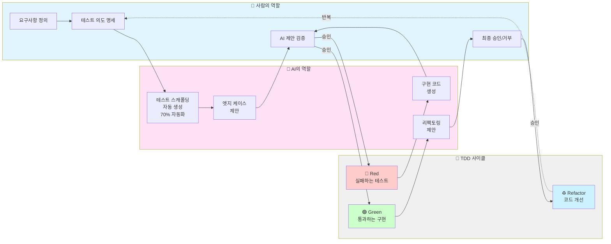
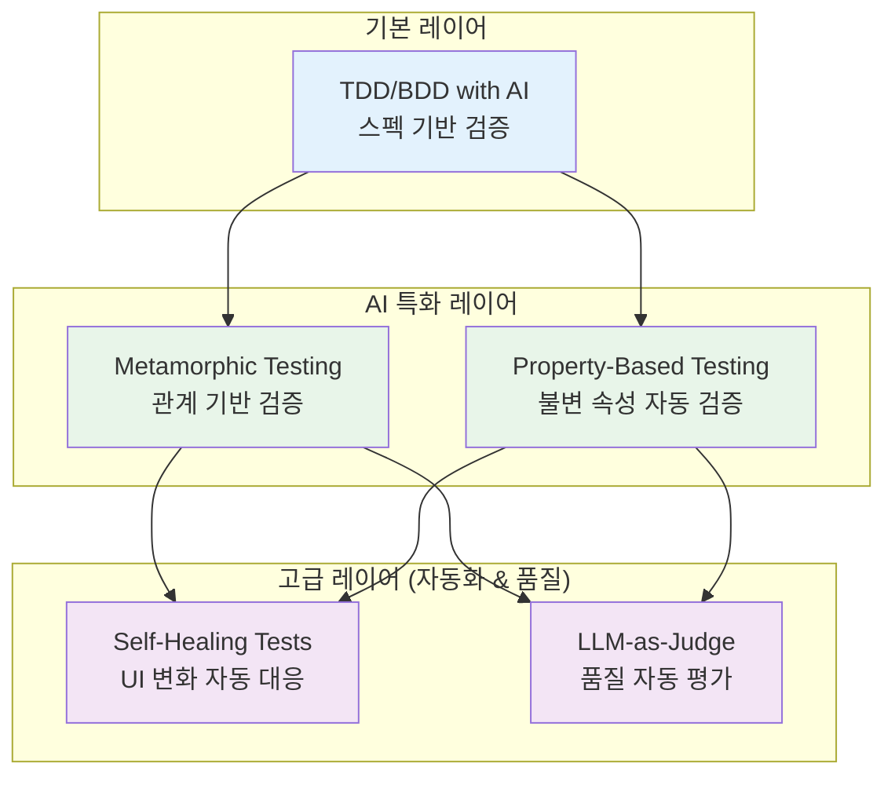
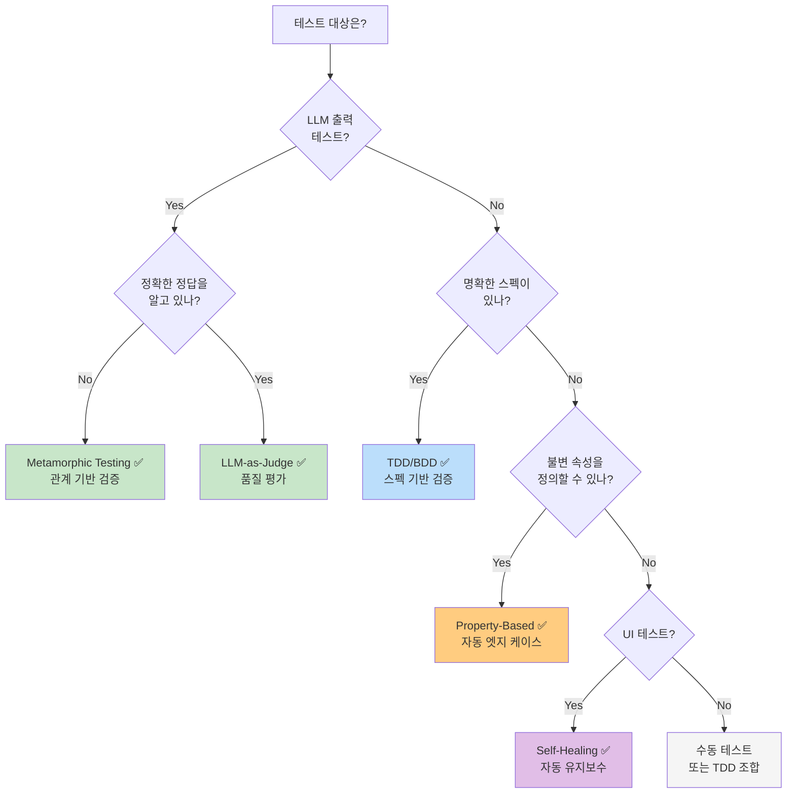
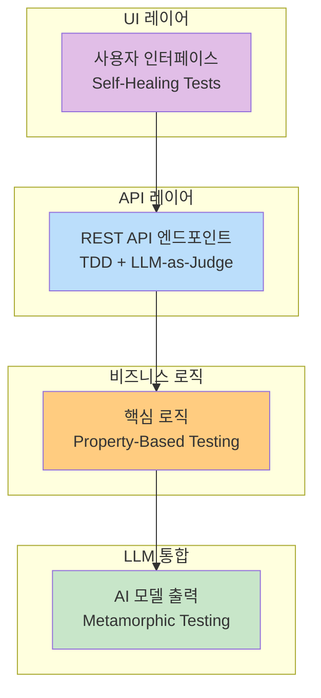

# 01: AI-DLC 테스트 방법론

바이브코딩(Agentic AI 기반 개발)으로 생성된 코드를 어떻게 검증할 것인가? 이 섹션에서는 AI-DLC (AI-Driven Development Life Cycle)에 적합한 테스트 방법론을 학습합니다.

## 학습 시간

**40-50분** (이론 15분 + 실습 25-35분)

## 학습 목표

- ✅ TDD/BDD를 AI 도구와 함께 적용하는 방법 이해
- ✅ Metamorphic Testing으로 LLM 생성 코드의 일관성 검증
- ✅ Property-Based Testing으로 불변 속성 자동 테스트
- ✅ Part 3 MCP 서버에 대한 실제 테스트 작성

---

## 왜 AI-DLC 테스트가 필요한가?

### 전통적인 개발 vs 바이브코딩

| 구분 | 전통적인 개발 | 바이브코딩 (AI 중심) |
|------|-------------|-------------------|
| **코드 생성** | 개발자가 직접 작성 | AI가 생성, 개발자가 검증 |
| **테스트 작성** | 개발자가 수동 작성 | AI가 초안 생성, 개발자가 보완 |
| **검증 초점** | 코드가 스펙을 만족하는가? | AI 출력이 일관적이고 신뢰할 수 있는가? |
| **오류 패턴** | 로직 오류, 버그 | 환각(Hallucination), 불일치 |

### AI 생성 코드의 특수성

1. **비결정적 출력**: 같은 프롬프트에도 다른 코드 생성 가능
2. **환각(Hallucination)**: 존재하지 않는 API나 함수 사용
3. **미묘한 오류**: 문법적으로 정확하나 의미적으로 틀림
4. **컨텍스트 의존성**: 대화 히스토리에 따라 결과 변화

→ **기존 테스트 방법론으로 충분하지 않음!**

---

## 기본 테스트 유형

AI-DLC 테스트 방법론을 배우기 전에, 소프트웨어 테스트의 기본 유형들을 이해해야 합니다.

**다이어그램 설명:** 소프트웨어 테스트의 3가지 기본 유형을 피라미드로 표현합니다. 하단의 단위 테스트(초록색)가 가장 많고 빠르며, 중간의 통합 테스트(파란색), 상단의 E2E 테스트(주황색)로 갈수록 적고 느립니다. 각 레벨의 비율과 특징을 함께 표시합니다.



### 1. 단위 테스트 (Unit Test)

**정의:** 개별 함수나 클래스를 독립적으로 테스트

**특징:**
- ⚡ 매우 빠름 (밀리초 단위)
- 🎯 명확한 실패 원인
- 🔄 자주 실행 가능
- 🧩 외부 의존성 없음

**예시:**
```python
def test_add():
    """Calculator의 add 함수만 테스트"""
    assert add(5, 3) == 8
    assert add(-5, 3) == -2
    assert add(0, 0) == 0
```

**AI-DLC 적용:**
- AI가 생성한 개별 함수 검증
- TDD/BDD의 Red-Green-Refactor 사이클
- Property-Based Testing으로 엣지 케이스 자동 발견

---

### 2. 통합 테스트 (Integration Test)

**정의:** 여러 모듈/컴포넌트가 함께 작동하는지 테스트

**특징:**
- 🔗 모듈 간 상호작용 검증
- 🌐 외부 시스템 연결 (DB, API)
- ⏱️ 중간 속도 (초 단위)
- 🛠️ 설정 복잡

**예시:**
```python
async def test_mcp_server_integration():
    """MCP 서버 + 클라이언트 통합 테스트"""
    # 실제 MCP 서버 시작
    server = await start_mcp_server()

    # 클라이언트로 연결
    client = MCPClient(server)
    tools = await client.get_tools()

    # 도구 호출
    result = await tools["add"].invoke({"a": 5, "b": 3})
    assert result == 8
```

**AI-DLC 적용:**
- AI 생성 코드의 MCP 프로토콜 준수 검증
- Metamorphic Testing으로 서버 응답 일관성 확인
- LLM-as-Judge로 API 응답 품질 평가

---

### 3. E2E 테스트 (End-to-End Test)

**정의:** 사용자 관점에서 전체 시스템을 처음부터 끝까지 테스트

**특징:**
- 🌍 전체 시스템 검증
- 👤 실제 사용자 시나리오
- 🐌 느림 (분 단위)
- 💰 유지보수 비용 높음

**예시:**
```python
def test_chat_application_e2e():
    """Streamlit 채팅 앱 전체 흐름"""
    # 1. 앱 시작
    app = launch_streamlit_app()

    # 2. 사용자 입력
    app.type_message("서울 날씨 알려줘")

    # 3. MCP 서버 호출
    # 4. LLM 응답 생성
    # 5. UI 렌더링

    # 최종 결과 확인
    assert "서울" in app.get_response()
    assert "날씨" in app.get_response()
```

**AI-DLC 적용:**
- Self-Healing Tests로 UI 변화 자동 대응
- LLM-as-Judge로 최종 사용자 경험 평가
- Metamorphic Testing으로 시나리오 변형 검증

---

### 테스트 유형 비교표

| 구분 | 단위 테스트 | 통합 테스트 | E2E 테스트 |
|------|----------|-----------|-----------|
| **범위** | 함수/클래스 | 모듈 간 상호작용 | 전체 시스템 |
| **속도** | ⚡ 매우 빠름 (ms) | ⏱️ 중간 (sec) | 🐌 느림 (min) |
| **외부 의존성** | ❌ 없음 | ✅ 있음 (Mock 가능) | ✅ 모두 실제 |
| **실패 시 디버깅** | 🟢 쉬움 | 🟡 중간 | 🔴 어려움 |
| **유지보수 비용** | 💚 낮음 | 💛 중간 | 💔 높음 |
| **비율** | 70% | 20% | 10% |
| **AI-DLC 적용** | TDD, Property-Based | Metamorphic, LLM-Judge | Self-Healing, E2E Judge |

### MCP 서버 테스트 예시

**다이어그램 설명:** MCP 서버 테스트의 3가지 레벨을 보여줍니다. 단위 테스트(초록색)는 Calculator 함수만, 통합 테스트(파란색)는 MCP 서버+클라이언트, E2E 테스트(주황색)는 Streamlit UI부터 MCP 서버까지 전체 흐름을 검증합니다.



**실전 적용:**

```python
# 1️⃣ 단위 테스트 (70%)
def test_add():
    assert add(5, 3) == 8  # ⚡ 0.001초

# 2️⃣ 통합 테스트 (20%)
async def test_mcp_integration():
    server = await start_server()
    result = await server.call_tool("add", {"a": 5, "b": 3})
    assert result == 8  # ⏱️ 0.5초

# 3️⃣ E2E 테스트 (10%)
def test_streamlit_chat_e2e():
    app.send_message("5 + 3 계산해줘")
    assert "8" in app.get_response()  # 🐌 5초
```

📁 [MCP 서버 테스트 실습 보기](./examples/mcp-testing/)

---

## AI-DLC 테스트 방법론 개요

### 1. TDD/BDD with AI

**전통적인 TDD (Test-Driven Development)**를 AI 시대에 맞게 변형:



**AI가 하는 일:**
- ✨ 테스트 스캐폴딩 생성 (70% 자동화)
- 💡 엣지 케이스 제안 (사람이 놓친 시나리오)
- 🔧 구현 코드 자동 생성
- 📐 리팩토링 제안

**사람이 하는 일:**
- 🎯 테스트 의도 정의
- ✅ 엣지 케이스 검증
- ⚖️ AI 제안 수용/거부 판단
- 🔍 최종 품질 보증

📁 [TDD 예제 보기](./examples/tdd/)

---

### 2. Metamorphic Testing

**핵심 아이디어**: 정확한 정답을 모를 때, 입력 변환에 따른 출력 관계를 검증

**예시: 번역 프로그램**
```python
# 정확한 번역 결과를 모르지만...
translate("Hello", "ko") != translate("Hello", "ko")  # 불확실

# 변환 관계는 알 수 있음
len(translate("Hello", "ko")) > 0  # 항상 참
translate(translate("Hello", "ko"), "en") ≈ "Hello"  # 왕복 번역
```

**LLM에 적용:**
```python
# 동일한 프롬프트 → 유사한 의미의 출력
response1 = llm("What is Python?")
response2 = llm("What is Python?")
assert semantic_similarity(response1, response2) > 0.8

# 부정어 추가 → 의미 반전
response_positive = llm("Python is good for beginners")
response_negative = llm("Python is NOT good for beginners")
assert sentiment(response_positive) != sentiment(response_negative)
```

📁 [Metamorphic Testing 예제 보기](./examples/metamorphic/)

---

### 3. Property-Based Testing

**핵심 아이디어**: 모든 입력에 대해 성립해야 하는 불변 속성을 정의하고, 무작위 입력으로 자동 테스트

**hypothesis 라이브러리 사용:**
```python
from hypothesis import given, strategies as st

@given(st.integers(), st.integers())
def test_addition_commutative(a, b):
    # 덧셈은 교환법칙을 만족해야 함
    assert a + b == b + a

# hypothesis가 수천 개의 입력을 자동 생성하여 테스트
```

**AI 생성 코드에 적용:**
```python
@given(st.text())
def test_llm_sanitize_input(user_input):
    # 모든 입력에 대해
    sanitized = sanitize(user_input)

    # 1. SQL 인젝션 패턴이 제거되어야 함
    assert "DROP TABLE" not in sanitized.upper()

    # 2. 원본보다 길어지지 않아야 함
    assert len(sanitized) <= len(user_input)
```

📁 [Property-Based Testing 예제 보기](./examples/property-based/)

---

### 4. Self-Healing Tests (보너스)

**핵심 아이디어**: AI가 UI 변화를 감지하고 테스트를 자동으로 업데이트

**예시:**
```python
# 버튼의 ID가 변경되었을 때
# 기존: <button id="submit">Submit</button>
# 변경: <button id="submit-button">Submit</button>

# Self-Healing Test는 자동으로 감지하고 업데이트
def test_submit_button():
    # AI가 의도(Submit 버튼 클릭)를 이해하고
    # 새 ID를 자동으로 찾아서 테스트 업데이트
    button = find_element_by_intent("submit button")
    button.click()
```

*시간이 있을 때 추가 학습 권장*

---

### 5. LLM-as-Judge (보너스)

**핵심 아이디어**: 더 강력한 LLM을 judge로 사용하여 출력 품질 평가

**예시:**
```python
def test_code_quality_with_llm_judge():
    generated_code = ai_generate_code("Create a REST API")

    # Judge LLM (GPT-4, Claude Opus 등)에게 평가 요청
    evaluation = judge_llm.evaluate(
        code=generated_code,
        criteria=["security", "performance", "readability"]
    )

    assert evaluation.security_score >= 8
    assert evaluation.performance_score >= 7
    assert evaluation.readability_score >= 9
```

*시간이 있을 때 추가 학습 권장*

---

## 실습 예제

### TDD 예제: 계산기 구현

**Red-Green-Refactor 사이클을 AI와 함께 경험합니다.**

```bash
cd examples/tdd
uv run pytest test_calculator.py -v
```

**학습 내용:**
1. 실패하는 테스트 작성
2. AI에게 구현 요청 (Claude Code 사용 추천)
3. 테스트 통과 확인
4. AI와 함께 리팩토링

📁 [상세 가이드](./examples/tdd/README.md)

---

### Metamorphic Testing 예제: LLM 출력 검증

**LLM 출력의 일관성과 관계를 검증합니다.**

```bash
cd examples/metamorphic
uv run pytest test_llm_output.py -v
```

**학습 내용:**
1. Metamorphic Relations 정의
2. 의미적 유사도 측정 (sentence-transformers)
3. 감정 분석으로 출력 검증

📁 [상세 가이드](./examples/metamorphic/README.md)

---

### Property-Based Testing 예제: 불변 속성 테스트

**hypothesis로 자동 테스트 케이스를 생성합니다.**

```bash
cd examples/property-based
uv run pytest test_properties.py -v
```

**학습 내용:**
1. hypothesis 전략(strategy) 정의
2. 불변 속성 명세
3. 실패 케이스 축소(shrinking)

📁 [상세 가이드](./examples/property-based/README.md)

---

### Part 3 MCP 서버 테스트 (실전)

**실제 Part 3에서 구현한 MCP 서버들을 테스트합니다.**

```bash
cd examples/mcp-testing

# Part 3 서버가 실행 중이어야 합니다
# (별도 터미널에서)
cd ../../../../03-mcp-tools/02-tools
uv run python main.py

# 테스트 실행
uv run pytest test_basic_server.py -v
uv run pytest test_tools.py -v
```

**테스트 내용:**
- 01-basic-server 연결 테스트
- 02-tools 도구 호출 테스트
- 04-resources 리소스 조회 테스트

📁 [상세 가이드](./examples/mcp-testing/README.md)

---

## 테스트 방법론 비교

**📚 출처:**
- [Metamorphic Testing for LLMs (Chen et al., 2024, arXiv)](https://arxiv.org/abs/2406.06864)
- [AI-Powered TDD 2025 (NOP Accelerate)](https://www.nopaccelerate.com/test-driven-development-guide-2025/)
- [LLM Testing Methods (Confident AI, 2024)](https://www.confident-ai.com/blog/llm-testing-in-2024-top-methods-and-strategies)
- [AWS AI-DLC Best Practices](https://aws.amazon.com/blogs/devops/ai-driven-development-life-cycle/)

### 5가지 방법론 개요

AI-DLC에서 사용하는 테스트 방법론들은 각기 다른 문제 영역을 다룹니다:

| 방법론 | 한 줄 요약 |
|--------|-----------|
| **TDD/BDD with AI** | AI가 테스트 스캐폴딩과 구현을 자동 생성하는 전통적 TDD 진화형 |
| **Metamorphic Testing** | 정확한 정답 없이 입출력 관계로 LLM 일관성 검증 |
| **Property-Based Testing** | 불변 속성을 정의하고 무작위 입력으로 엣지 케이스 자동 발견 |
| **Self-Healing Tests** | AI가 UI 변화를 감지하고 테스트를 자동으로 수정 |
| **LLM-as-Judge** | 더 강력한 LLM이 출력 품질을 자동으로 평가 |

**다이어그램 설명:** AI-DLC 테스트 방법론 5가지를 계층별로 정리한 구조도입니다. 기본 레이어(파란색)의 TDD/BDD를 베이스로, AI 특화 레이어(초록색)에서 Metamorphic/Property-Based Testing으로 AI 특성을 검증하고, 고급 레이어(보라색)에서 Self-Healing/LLM-as-Judge로 자동화와 품질을 강화합니다.



### 핵심 특징 비교

| 방법론 | 검증 대상 | 언제 사용? | AI 특화도 |
|--------|----------|-----------|---------|
| **TDD/BDD** | 스펙 준수 | 명확한 요구사항이 있을 때 | ⭐⭐ (AI가 보조) |
| **Metamorphic** | 입출력 관계 | 정답을 모르지만 관계를 알 때 | ⭐⭐⭐⭐⭐ (LLM 전용) |
| **Property-Based** | 불변 속성 | 모든 입력에 성립하는 규칙 | ⭐⭐⭐⭐ (엣지 케이스) |
| **Self-Healing** | UI 안정성 | 자주 변경되는 UI 테스트 | ⭐⭐⭐ (유지보수) |
| **LLM-as-Judge** | 출력 품질 | 주관적 평가가 필요할 때 | ⭐⭐⭐⭐⭐ (품질 평가) |

### 종합 비교표

**5가지 방법론을 다양한 기준으로 비교합니다:**

| 기준 | TDD/BDD | Metamorphic | Property-Based | Self-Healing | LLM-as-Judge |
|------|---------|-------------|----------------|--------------|--------------|
| **주요 목적** | 스펙 준수 검증 | LLM 일관성 검증 | 엣지 케이스 발견 | UI 테스트 자동화 | 품질 평가 |
| **AI 특화도** | ⭐⭐ | ⭐⭐⭐⭐⭐ | ⭐⭐⭐⭐ | ⭐⭐⭐ | ⭐⭐⭐⭐⭐ |
| **속도** | 빠름 | 중간 | 느림 | 매우 느림 | 매우 느림 |
| **학습 곡선** | 쉬움 | 중간 | 어려움 | 어려움 | 쉬움 |
| **CI/CD 적합도** | ✅ 매우 적합 | ✅ 적합 | ⚠️ 제한적 | ❌ 부적합 | ⚠️ 제한적 |
| **비용** | 낮음 | 낮음 | 낮음 | 높음 (인프라) | 높음 (API) |
| **자동화 수준** | 70% | 50% | 90% | 95% | 80% |
| **실패 디버깅** | 쉬움 | 중간 | 어려움 | 어려움 | 중간 |
| **유지보수** | 중간 | 낮음 | 낮음 | 매우 낮음 | 낮음 |
| **적용 범위** | 모든 코드 | LLM 출력 | 입력 검증 로직 | UI 테스트 | 주관적 품질 |

### 상세 비교표

| 방법론 | 장점 | 단점 | 도구/라이브러리 | 실전 사례 |
|--------|------|------|---------------|---------|
| **TDD/BDD** | • 스펙 준수 보장<br/>• 리팩토링 안전성<br/>• AI가 70% 자동화 | • 초기 투자 시간<br/>• 테스트 유지보수 | pytest, unittest, behave | REST API 테스트, 비즈니스 로직 |
| **Metamorphic** | • LLM 환각 감지<br/>• 정답 불필요<br/>• 일관성 검증 | • 관계 정의 어려움<br/>• 도메인 지식 필요 | sentence-transformers | 번역 API, 요약 기능, 챗봇 응답 |
| **Property-Based** | • 자동 엣지 케이스<br/>• 수천 개 입력 생성<br/>• 버그 조기 발견 | • 속성 정의 필요<br/>• 실행 시간 김<br/>• 학습 곡선 | hypothesis, Faker | 입력 검증, 암호화, 정렬 알고리즘 |
| **Self-Healing** | • 유지보수 비용↓<br/>• UI 변화 자동 대응<br/>• 테스트 안정성↑ | • 추가 인프라<br/>• 설정 복잡<br/>• AI 모델 필요 | Selenium + AI, Playwright | E2E 테스트, 리그레션 테스트 |
| **LLM-as-Judge** | • 유연한 품질 평가<br/>• 주관적 판단 자동화<br/>• 다양한 기준 적용 | • LLM API 비용<br/>• 속도 느림<br/>• 평가 일관성 문제 | OpenAI, Anthropic API | 코드 리뷰, 문서 품질, UX 평가 |

**📊 CI/CD 적합도 기준:**
- ✅ 매우 적합: 빠르고 안정적, 매 커밋마다 실행 가능
- ✅ 적합: 중간 속도, Pull Request 시 실행
- ⚠️ 제한적: 느림, 야간 배치나 릴리스 전에만
- ❌ 부적합: 매우 느리거나 환경 설정 복잡

### 방법론 선택 가이드

**다이어그램 설명:** 테스트 시나리오에 따라 적합한 방법론을 선택하는 의사결정 트리입니다. LLM 출력 테스트는 Metamorphic/LLM-as-Judge(초록색), 스펙 기반 테스트는 TDD/BDD(파란색), 엣지 케이스 발견은 Property-Based(주황색), UI 테스트는 Self-Healing(보라색)을 권장합니다.



### 실전 적용 예시

**다이어그램 설명:** 실제 프로젝트에서 각 방법론이 적용되는 계층을 보여줍니다. UI 레이어(Self-Healing), API 레이어(TDD + LLM-as-Judge), 비즈니스 로직(Property-Based), LLM 통합(Metamorphic)으로 계층별 최적 방법론을 제시합니다.



### 권장 조합 전략

**프로젝트 규모별 추천:**

| 프로젝트 규모 | 권장 조합 | 비율 |
|------------|---------|------|
| **소규모** (개인 프로젝트) | TDD + Metamorphic | 80% TDD, 20% Metamorphic |
| **중규모** (스타트업) | TDD + Metamorphic + Property-Based | 70% TDD, 20% Metamorphic, 10% Property |
| **대규모** (엔터프라이즈) | 전체 조합 | 60% TDD, 20% Metamorphic, 10% Property, 10% Self-Healing |

**기본 권장 조합:**
```
✅ 기본: TDD/BDD (70%)
   → 모든 명확한 스펙에 적용

✅ LLM 출력: Metamorphic Testing (20%)
   → AI 생성 코드, 번역, 요약 등

✅ 엣지 케이스: Property-Based Testing (10%)
   → 입력 검증, 보안, 경계 조건
```

---

## 실습 문제

시간이 남으면 다음 실습 문제를 풀어보세요:

1. **[Exercise 1: TDD 실습](./exercises/exercise-1-tdd.md)**
   - 문자열 역순 함수를 TDD로 구현

2. **[Exercise 2: Metamorphic Testing](./exercises/exercise-2-metamorphic.md)**
   - 번역 API의 일관성 검증

3. **[Exercise 3: Property-Based](./exercises/exercise-3-property-based.md)**
   - 정렬 함수의 불변 속성 테스트

해답은 `./exercises/solutions/` 참조

---

## 추가 자료

### 논문 및 연구
- [Metamorphic Testing for LLMs (arXiv)](https://arxiv.org/abs/2406.06864)
- [Rethinking Verification for LLM Code Generation](https://arxiv.org/abs/2507.06920)
- [Vibe Coding vs Agentic Coding](https://arxiv.org/html/2505.19443v1)

### 실용 가이드
- [AI-Powered TDD 2025](https://www.nopaccelerate.com/test-driven-development-guide-2025/)
- [LLM Testing Methods](https://www.confident-ai.com/blog/llm-testing-in-2024-top-methods-and-strategies)
- [AWS AI-DLC](https://aws.amazon.com/blogs/devops/ai-driven-development-life-cycle/)

### 도구
- [pytest](https://docs.pytest.org/) - Python 테스트 프레임워크
- [hypothesis](https://hypothesis.readthedocs.io/) - Property-Based Testing
- [sentence-transformers](https://www.sbert.net/) - 의미적 유사도

---

## 다음 단계

테스트 방법론을 학습했다면:

- **[02-mcp-chat-client](../02-mcp-chat-client/)**: Streamlit + LangGraph 채팅 앱 구현
- **[03-docker-deployment](../03-docker-deployment/)**: Docker로 배포하기

---

**Happy Testing!** 🧪

궁금한 점이 있으면 언제든지 질문해주세요!
