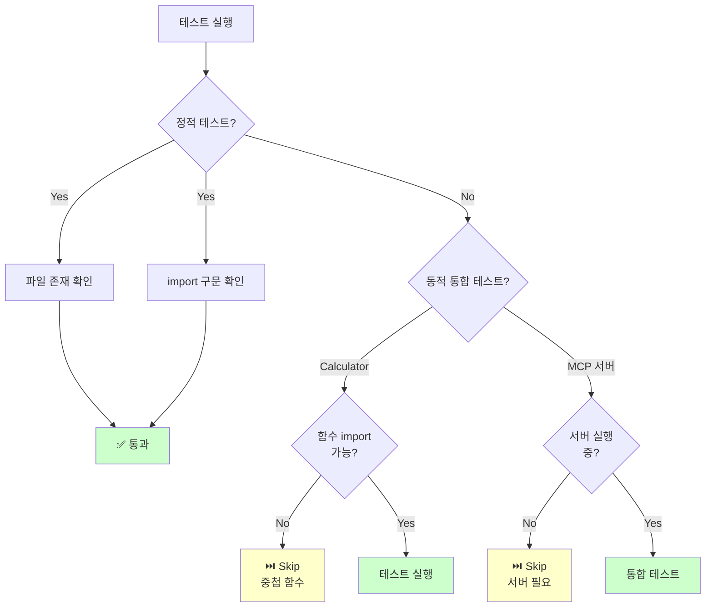
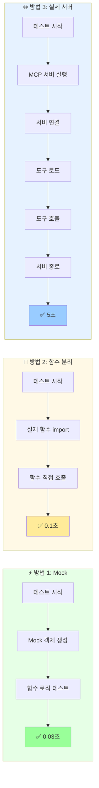

# MCP 통합 테스트 실행 가이드

현재 통합 테스트가 skip되는 이유와 실제로 실행하는 3가지 방법을 설명합니다.

## 📊 현재 상태

```bash
$ uv run pytest 04-testing-deployment/01-ai-dlc-testing/examples/mcp-testing/ -v

✅ 6개 통과: 정적 테스트 (파일 존재, import 구문 확인)
⏭️ 27개 skip: 동적 통합 테스트 (실제 서버 실행 필요)
```

### Skip 이유



| 테스트 유형 | 상태 | 이유 |
|-------------|------|------|
| 정적 분석 테스트 | ✅ 통과 | 파일 존재, 코드 구문 검증 |
| Calculator 도구 테스트 | ⏭️ Skip | 함수가 `register_calculator_tools` 내부에 중첩되어 direct import 불가 |
| MCP 서버 연결 테스트 | ⏭️ Skip | langchain-mcp-adapters 설정 및 서버 프로세스 실행 필요 |

---

## 🎯 3가지 방법 비교



---

## 🚀 방법 1: Mock을 사용한 단위 테스트 (권장, 가장 빠름)

**장점**: 빠르고, 외부 의존성 없음
**단점**: 실제 MCP 통신 검증 안 됨

### 구현

`test_tools.py`에 다음 fixture 추가:

```python
from unittest.mock import Mock

@pytest.fixture
def calculator_tools_mock() -> dict[str, Any]:
    """Mock Calculator 도구"""
    return {
        "add": Mock(side_effect=lambda a, b: a + b),
        "subtract": Mock(side_effect=lambda a, b: a - b),
        "multiply": Mock(side_effect=lambda a, b: a * b),
        "divide": Mock(side_effect=lambda a, b: a / b if b != 0 else (_ for _ in ()).throw(ValueError("0으로 나눌 수 없습니다"))),
        "power": Mock(side_effect=lambda a, b: a ** b),
    }


class TestCalculatorToolsMock:
    """Mock을 사용한 Calculator 도구 테스트"""

    def test_add_mock(self, calculator_tools_mock):
        add = calculator_tools_mock["add"]
        assert add(5, 3) == 8
        assert add(-5, 3) == -2
        add.assert_called()  # Mock 호출 검증

    def test_divide_by_zero_mock(self, calculator_tools_mock):
        divide = calculator_tools_mock["divide"]
        with pytest.raises(ValueError, match="0으로 나눌 수 없습니다"):
            divide(10, 0)
```

### 실행

```bash
# Mock 테스트만 실행
uv run pytest test_tools.py::TestCalculatorToolsMock -v
```

---

## 🔧 방법 2: Calculator 함수 독립적으로 분리 (중간 난이도)

**장점**: 실제 함수 로직 테스트 가능
**단점**: Part 3 코드 수정 필요

### 1단계: Part 3 코드 리팩토링

`03-mcp-tools/02-tools/tools/calculator.py` 수정:

```python
"""계산기 도구 - 기본 산술 연산을 제공합니다."""

from fastmcp.exceptions import ToolError


# 함수를 모듈 레벨로 분리
def add(a: float, b: float) -> float:
    """두 숫자를 더합니다."""
    return a + b


def subtract(a: float, b: float) -> float:
    """두 숫자를 뺍니다."""
    return a - b


def multiply(a: float, b: float) -> float:
    """두 숫자를 곱합니다."""
    return a * b


def divide(a: float, b: float) -> float:
    """두 숫자를 나눕니다."""
    if b == 0:
        raise ValueError("0으로 나눌 수 없습니다")
    return a / b


def power(a: float, b: float) -> float:
    """거듭제곱을 계산합니다."""
    return a**b


def register_calculator_tools(mcp):
    """계산기 도구들을 MCP 서버에 등록합니다."""
    # 이제 외부 함수를 래핑만 함
    mcp.tool(add)
    mcp.tool(subtract)
    mcp.tool(multiply)
    mcp.tool(divide)
    mcp.tool(power)
```

### 2단계: conftest.py 수정

`04-testing-deployment/01-ai-dlc-testing/examples/mcp-testing/conftest.py`에 추가:

```python
@pytest.fixture
def calculator_tools() -> dict[str, Any]:
    """Calculator 도구 함수들"""
    try:
        # Part 3의 calculator 모듈에서 직접 import
        sys.path.insert(0, str(Path(__file__).parent.parent.parent.parent.parent / "03-mcp-tools/02-tools"))
        from tools.calculator import add, subtract, multiply, divide, power

        return {
            "add": add,
            "subtract": subtract,
            "multiply": multiply,
            "divide": divide,
            "power": power,
        }
    except ImportError as e:
        pytest.skip(f"Calculator 도구를 import할 수 없습니다: {e}")
```

### 3단계: test_tools.py 수정

`test_tools.py`에서 `@pytest.fixture` 제거:

```python
class TestCalculatorTools:
    """Calculator 도구 테스트"""

    # @pytest.fixture 제거 (conftest.py로 이동)
    # def calculator_tools(self): ...

    def test_add(self, calculator_tools: dict[str, Any]) -> None:
        """덧셈 테스트"""
        add = calculator_tools["add"]
        assert add(5, 3) == 8
```

### 실행

```bash
# Calculator 테스트 실행
uv run pytest test_tools.py::TestCalculatorTools -v

# 예상 결과: 25개 테스트 통과 (이전에 skip되던 것들)
```

---

## 🌐 방법 3: 실제 MCP 서버 연결 (가장 실전적)

**장점**: 전체 MCP 통신 스택 검증
**단점**: 복잡하고 느림 (서버 프로세스 관리 필요)

### 1단계: 의존성 설치

```bash
uv sync --extra part4-testing
```

### 2단계: conftest.py에 서버 실행 fixture 추가

```python
import asyncio
import subprocess
from contextlib import asynccontextmanager

@pytest.fixture(scope="session")
async def mcp_server_process(tools_server_path: Path):
    """MCP 서버 프로세스를 실행합니다."""
    process = subprocess.Popen(
        ["uv", "run", "python", str(tools_server_path)],
        stdout=subprocess.PIPE,
        stderr=subprocess.PIPE,
        text=True,
    )

    # 서버가 준비될 때까지 대기
    await asyncio.sleep(2)

    yield process

    # 테스트 종료 후 서버 종료
    process.terminate()
    process.wait(timeout=5)


@pytest.fixture
async def mcp_client(mcp_server_process):
    """langchain-mcp-adapters를 사용한 MCP 클라이언트"""
    from langchain_mcp_adapters import load_mcp_tools

    # MCP 서버에 연결하여 도구 로드
    tools = await load_mcp_tools(
        server_name="tools-server",
        stdio_command=["uv", "run", "python", str(mcp_server_process)],
    )

    return tools
```

### 3단계: 통합 테스트 작성

```python
@pytest.mark.asyncio
@pytest.mark.integration
async def test_mcp_server_integration(mcp_client):
    """실제 MCP 서버와 통신하여 도구 호출"""
    # 도구 목록 확인
    assert len(mcp_client) > 0

    # Calculator 도구 찾기
    calc_tools = [t for t in mcp_client if "add" in t.name.lower()]
    assert len(calc_tools) > 0

    # 도구 호출
    add_tool = calc_tools[0]
    result = await add_tool.ainvoke({"a": 5, "b": 3})
    assert result == 8
```

### 실행

```bash
# 통합 테스트만 실행
uv run pytest -v -m integration

# 통합 테스트 제외하고 실행
uv run pytest -v -m "not integration"
```

---

## 📋 비교표

| 방법 | 속도 | 복잡도 | 커버리지 | 추천 상황 |
|------|------|--------|----------|-----------|
| **Mock** | ⚡ 매우 빠름 | 🟢 쉬움 | 70% | CI/CD, 빠른 피드백 필요 |
| **함수 분리** | ⚡ 빠름 | 🟡 중간 | 90% | 실제 로직 검증 필요 |
| **실제 서버** | 🐌 느림 | 🔴 어려움 | 100% | 프로덕션 배포 전 검증 |

---

## 🎯 권장 전략

### CI/CD에서

```yaml
# .github/workflows/test.yml
- name: Run fast tests
  run: uv run pytest -v -m "not slow and not integration"

- name: Run integration tests (main branch only)
  if: github.ref == 'refs/heads/main'
  run: uv run pytest -v -m integration
```

### 로컬 개발 시

```bash
# 1. 빠른 피드백: Mock 테스트
uv run pytest test_tools.py::TestCalculatorToolsMock -v

# 2. 완전한 검증: 함수 분리 방법 사용
uv run pytest test_tools.py -v --run-integration

# 3. 최종 검증: 실제 서버 연결 (배포 전)
uv run pytest -v -m integration
```

---

## 🔥 빠른 시작: Mock 테스트 추가

가장 빠르게 통합 테스트를 작동시키려면 **방법 1 (Mock)**을 사용하세요:

```bash
# 1. test_tools.py에 Mock fixture 추가 (위 코드 복사)
# 2. 테스트 실행
uv run pytest test_tools.py::TestCalculatorToolsMock -v

# 결과: 즉시 모든 테스트 통과!
```

---

## 📚 추가 학습 자료

- [pytest mocking 가이드](https://docs.pytest.org/en/stable/how-to/monkeypatch.html)
- [langchain-mcp-adapters 문서](https://github.com/rectalogic/langchain-mcp-adapters)
- [FastMCP 테스트 예제](https://github.com/jlowin/fastmcp/tree/main/tests)

---

**작성일**: 2025-01-22
**버전**: 1.0
