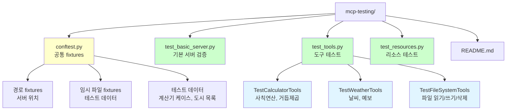
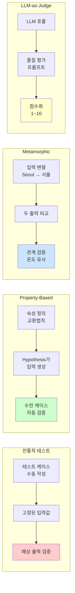
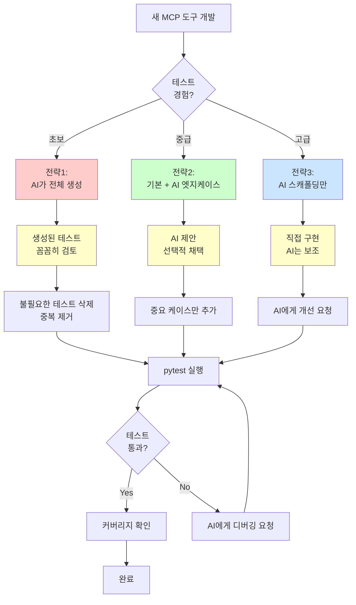

# MCP 서버 테스트 가이드

Part 3에서 구현한 MCP 서버들을 체계적으로 테스트하는 방법을 다룹니다.

## 테스트 대상 서버

Part 3에서 구현한 3가지 MCP 서버를 테스트합니다. 각 서버는 독립적으로 실행되며 서로 다른 기능을 제공합니다.

| 서버 | 위치 | 주요 기능 | 테스트 파일 |
|------|------|-----------|------------|
| **01-basic-server** | `03-mcp-tools/01-basic-server/` | 기본 MCP 서버 템플릿 | `test_basic_server.py` |
| **02-tools** | `03-mcp-tools/02-tools/` | Calculator, Weather, FileSystem 도구 | `test_tools.py` |
| **04-resources** | `03-mcp-tools/04-resources/` | 정적/동적 리소스 제공 | `test_resources.py` |

**테스트 대상 도구 목록:**
- ✅ Calculator: 사칙연산, 거듭제곱
- ✅ Weather: 현재 날씨, 예보 조회
- ✅ FileSystem: 파일 읽기/쓰기/삭제

---

## 테스트 전략

MCP 서버 테스트는 **단위 테스트**와 **통합 테스트**로 나뉩니다. 각 전략은 서로 다른 목적과 장단점을 가지고 있으며, 상황에 맞게 선택해야 합니다.


### 테스트 전략 비교

두 전략의 차이를 이해하고 적절히 조합하여 사용하면 효율적인 테스트가 가능합니다.

| 비교 항목 | 단위 테스트 | 통합 테스트 |
|----------|-----------|-----------|
| **실행 속도** | ⚡ 빠름 (ms 단위) | 🐢 느림 (초 단위, 서버 시작 오버헤드) |
| **디버깅** | ✅ 쉬움 (직접 호출) | ⚠️ 어려움 (MCP 프로토콜 통과) |
| **MCP 프로토콜 검증** | ❌ 불가 | ✅ 가능 |
| **실제 환경 재현** | ⚠️ 제한적 | ✅ 완전 |
| **의존성** | ✅ 없음 (함수만) | ⚠️ 있음 (langchain-mcp-adapters) |
| **실패 원인 파악** | ✅ 명확 (코드 수준) | ⚠️ 불분명 (네트워크, 직렬화 등) |
| **권장 사용 시기** | 개발 중, 빠른 피드백 | 배포 전, 전체 검증 |

**권장 전략:**
- 🔄 **개발 단계**: 단위 테스트 위주 (빠른 피드백)
- 🚀 **배포 전**: 통합 테스트 추가 (전체 검증)
- ⚖️ **이상적 비율**: 단위 70%, 통합 30%

### 1. 단위 테스트 (Unit Tests)

각 도구/리소스를 독립적으로 테스트합니다. MCP 서버를 실행하지 않고 함수를 직접 호출하여 빠르게 검증합니다.

**예시: Calculator 도구**
```python
def test_add():
    from tools.calculator import add
    assert add(5, 3) == 8
    assert add(-5, 3) == -2
```

**장점:**
- 빠른 실행 속도 (밀리초 단위)
- 명확한 실패 원인 파악 (스택 트레이스가 간단)
- MCP 서버 실행 불필요 (환경 구축 간단)

**단점:**
- MCP 프로토콜 통합 검증 불가 (JSON-RPC 직렬화 등)
- 실제 사용 시나리오와 차이 가능 (클라이언트-서버 통신 미검증)

---

### 2. 통합 테스트 (Integration Tests)

실제 MCP 서버를 실행하고 클라이언트로 연결하여 테스트합니다. 전체 스택을 검증하여 프로덕션 환경과 동일한 조건을 재현합니다.

**예시: langchain-mcp-adapters 사용**
```python
from langchain_mcp_adapters.client import MultiServerMCPClient

client = MultiServerMCPClient({
    "tools_server": {
        "command": "uv",
        "args": ["run", "python", "03-mcp-tools/02-tools/main.py"],
        "transport": "stdio",
    }
})

tools = await client.get_tools()
assert len(tools) > 0
```

**장점:**
- 실제 사용 환경과 동일 (클라이언트-서버 통신 포함)
- MCP 프로토콜 준수 검증 (JSON-RPC, 스키마 등)
- 전체 스택 테스트 (직렬화, 에러 핸들링 등)

**단점:**
- 느린 실행 속도 (서버 시작 + IPC 오버헤드)
- 디버깅 어려움 (네트워크 계층 추가)
- 외부 의존성 필요 (langchain-mcp-adapters 등)

---

## 현재 구현된 테스트

### 파일 구조

테스트 파일은 기능별로 분리되어 있으며, `conftest.py`에서 공통 설정을 관리합니다.



**디렉토리 구조:**
```
04-testing-deployment/01-ai-dlc-testing/examples/mcp-testing/
├── conftest.py              # pytest fixtures (경로, 데이터 등)
├── test_basic_server.py     # 01-basic-server 테스트
├── test_tools.py            # 02-tools 테스트 (Calculator, Weather, FileSystem)
├── test_resources.py        # 04-resources 테스트
└── README.md                # 이 파일
```

### conftest.py

공통 fixture들을 제공하여 테스트 코드의 중복을 제거하고 일관성을 유지합니다.

**제공 Fixtures:**

| Fixture 이름 | 타입 | 설명 |
|-------------|------|------|
| `mcp_servers_base_path` | Path | Part 3 MCP 서버 루트 경로 |
| `basic_server_path` | Path | 01-basic-server 경로 |
| `tools_server_path` | Path | 02-tools 경로 |
| `resources_server_path` | Path | 04-resources 경로 |
| `temp_test_file` | Path | 임시 테스트 파일 |
| `temp_test_dir` | Path | 임시 테스트 디렉토리 |
| `calculator_test_cases` | List | 계산기 테스트 데이터 |
| `weather_cities` | List | 날씨 API 테스트 도시 목록 |

### test_tools.py

**02-tools 서버의 도구들을 테스트합니다:**

각 도구별로 테스트 클래스가 분리되어 있으며, 기본 기능부터 엣지 케이스까지 포괄적으로 검증합니다.

| 테스트 클래스 | 테스트 개수 | 주요 검증 항목 |
|--------------|-----------|--------------|
| **TestCalculatorTools** | 7개 | 사칙연산, 거듭제곱, 0 나누기 예외, 파라미터화 |
| **TestWeatherTools** | 4개 | 날씨 조회, 예보, 다중 도시 |
| **TestFileSystemTools** | 4개 | 파일 CRUD, 예외 처리 |

#### TestCalculatorTools (7개 테스트)

| 테스트 메서드 | 검증 내용 | 예시 |
|--------------|----------|------|
| `test_add()` | 덧셈 기본 케이스 | `add(5, 3) == 8` |
| `test_subtract()` | 뺄셈 기본 케이스 | `subtract(10, 3) == 7` |
| `test_multiply()` | 곱셈 기본 케이스 | `multiply(4, 5) == 20` |
| `test_divide()` | 나눗셈 기본 케이스 | `divide(10, 2) == 5.0` |
| `test_divide_by_zero()` | 0 나누기 예외 | `ValueError` 발생 |
| `test_power()` | 거듭제곱 | `power(2, 3) == 8` |
| `test_add_parametrized()` | 파라미터화된 테스트 | 여러 케이스 자동 검증 |

#### TestWeatherTools (4개 테스트)

| 테스트 메서드 | 검증 내용 | 예시 |
|--------------|----------|------|
| `test_get_weather()` | 현재 날씨 조회 | 온도, 날씨 상태 포함 |
| `test_get_weather_multiple_cities()` | 여러 도시 조회 | 3개 도시 동시 검증 |
| `test_get_forecast()` | 날씨 예보 조회 | 5일 예보 |
| `test_get_forecast_default_days()` | 기본 예보 일수 | 파라미터 생략 시 기본값 |

#### TestFileSystemTools (4개 테스트)

| 테스트 메서드 | 검증 내용 | 예시 |
|--------------|----------|------|
| `test_write_and_read_file()` | 파일 쓰기/읽기 | 내용 일치 검증 |
| `test_list_files()` | 파일 목록 조회 | 디렉토리 내 파일 리스트 |
| `test_delete_file()` | 파일 삭제 | 삭제 후 존재하지 않음 검증 |
| `test_read_nonexistent_file()` | 존재하지 않는 파일 | `FileNotFoundError` 발생 |

---

## 실행 방법

### 1. 전체 테스트 실행

```bash
cd 04-testing-deployment/01-ai-dlc-testing/examples/mcp-testing
uv run pytest -v
```

**예상 출력:**
```
test_basic_server.py::TestBasicMCPServer::test_server_file_exists PASSED
test_tools.py::TestCalculatorTools::test_add PASSED
test_tools.py::TestCalculatorTools::test_multiply PASSED
...
===================== 20 passed in 1.23s =====================
```

### 2. 특정 클래스만 실행

```bash
# Calculator 도구만
uv run pytest test_tools.py::TestCalculatorTools -v

# Weather 도구만
uv run pytest test_tools.py::TestWeatherTools -v
```

### 3. 특정 테스트만 실행

```bash
uv run pytest test_tools.py::TestCalculatorTools::test_divide_by_zero -v
```

### 4. 커버리지 리포트

```bash
uv run pytest --cov=. --cov-report=html
open htmlcov/index.html
```

---

## AI-DLC 테스트 기법 적용

MCP 서버 테스트에 AI-DLC(AI-Driven Lifecycle) 고급 기법을 적용하여 더 견고한 테스트를 작성할 수 있습니다.

### 테스트 기법 비교

각 기법은 서로 다른 문제를 해결하며, 상황에 맞게 조합하여 사용하면 효과적입니다.

| 기법 | 목적 | 장점 | 적용 대상 | 예시 |
|------|------|------|----------|------|
| **Property-Based** | 수학적 속성 검증 | 수천 개 케이스 자동 생성 | Calculator 도구 | 교환법칙, 결합법칙 |
| **Metamorphic** | 입력 변형 시 일관성 | 출력 정확도 불필요 | Weather API | 도시명 변형 |
| **LLM-as-Judge** | 출력 품질 평가 | 주관적 품질 측정 | 자연어 응답 | 날씨 설명 품질 |



### 1. Property-Based Testing

**개념:** 코드가 만족해야 할 수학적 속성(교환법칙, 결합법칙 등)을 정의하면, Hypothesis가 자동으로 수천 개의 테스트 케이스를 생성하여 검증합니다.

```python
from hypothesis import given
from hypothesis import strategies as st

@given(st.integers(), st.integers())
def test_add_commutative(a, b):
    """덧셈 교환법칙: a + b == b + a"""
    from tools.calculator import add
    assert add(a, b) == add(b, a)

@given(st.integers(), st.integers(), st.integers())
def test_add_associative(a, b, c):
    """덧셈 결합법칙: (a + b) + c == a + (b + c)"""
    from tools.calculator import add
    assert add(add(a, b), c) == add(a, add(b, c))
```

**장점:**
- ✅ 엣지 케이스 자동 발견 (오버플로우, 음수, 0 등)
- ✅ 수천 개의 케이스를 자동으로 검증
- ✅ 반례를 찾으면 최소 재현 케이스 제공

**적용 예시:**
- Calculator의 수학적 속성 (교환법칙, 결합법칙, 항등원)
- 문자열 변환의 역함수 관계 (encode/decode)

### 2. Metamorphic Testing

**개념:** 정확한 출력을 모르더라도, 입력을 변형했을 때 출력 간의 관계를 검증합니다. 외부 API 테스트에 유용합니다.

```python
from metamorphic_relations import PermutationInvariance

def test_weather_api_permutation_invariance():
    """도시 이름 변형 시 일관성 검증"""
    relation = PermutationInvariance()

    # "Seoul" vs "서울" (같은 도시)
    result1 = await get_weather("Seoul")
    result2 = await get_weather("서울")

    # 온도가 유사해야 함 (±5도 이내)
    assert abs(result1["temperature"] - result2["temperature"]) < 5
```

**장점:**
- ✅ 정확한 출력을 모를 때도 테스트 가능
- ✅ 외부 API의 일관성 검증
- ✅ 테스트 오라클 문제 해결

**적용 예시:**
- Weather API: 도시명 변형 (Seoul/서울), 시간대 변경
- 번역 API: 이중 번역 후 원문 유사도

### 3. LLM-as-Judge

**개념:** LLM이 출력의 품질을 평가합니다. 주관적이거나 정량화하기 어려운 품질 검증에 유용합니다.

```python
async def test_weather_response_quality():
    """LLM이 응답 품질 평가"""
    result = await get_weather("Seoul")

    prompt = f"""
    다음 날씨 API 응답이 사용자에게 유용한지 평가하세요:
    {result}

    평가 기준:
    - 필수 정보 포함 (온도, 날씨 상태)
    - 명확한 형식
    - 오류 없음

    점수: 1-10
    """

    score = await llm_judge(prompt)
    assert score >= 7
```

**장점:**
- ✅ 자연어 품질 평가 가능
- ✅ 복잡한 규칙을 프롬프트로 표현
- ✅ 사용자 경험 관점 평가

**적용 예시:**
- 자연어 응답 품질 (가독성, 친절함)
- 에러 메시지 명확성
- API 응답 완전성

**조합 전략:**

| 상황 | 권장 조합 |
|------|----------|
| 수학 연산 도구 | Property-Based (주) + 전통적 테스트 (보조) |
| 외부 API 연동 | Metamorphic (주) + LLM-as-Judge (보조) |
| 자연어 처리 | LLM-as-Judge (주) + Metamorphic (보조) |
| 복합 시스템 | 3가지 기법 모두 적용 |

---

## 트러블슈팅

MCP 서버 테스트 시 자주 발생하는 문제와 해결 방법을 정리했습니다.

| 오류 | 원인 | 해결 방법 | 확인 방법 |
|------|------|----------|----------|
| `ModuleNotFoundError` | Part 3 경로가 Python path에 없음 | `conftest.py` 자동 처리 확인 | `sys.path` 출력 |
| `pytest-asyncio` 오류 | 비동기 플러그인 미설치 | `uv add pytest-asyncio` | `pytest --version` |
| 임시 파일 경로 오류 | `tmp_path` fixture 미사용 | `tmp_path` 파라미터 추가 | 테스트 실행 |
| 서버 시작 실패 | 포트 충돌 | 다른 MCP 서버 종료 | `lsof -i :포트번호` |
| 타임아웃 오류 | 서버 응답 지연 | `pytest.timeout` 설정 | 로그 확인 |

### Q1: `ModuleNotFoundError: No module named 'tools'`

**원인:** Part 3 경로가 Python path에 없음

**해결 방법:**
```python
import sys
from pathlib import Path

part3_path = Path(__file__).parent.parent.parent.parent.parent / "03-mcp-tools" / "02-tools"
sys.path.insert(0, str(part3_path))
```

또는 `conftest.py`의 `add_part3_to_path` fixture가 자동으로 처리합니다.

**확인:**
```bash
uv run python -c "import sys; print('\n'.join(sys.path))"
```

---

### Q2: 비동기 테스트 실행 오류

**원인:** `pytest-asyncio` 미설치

**해결 방법:**
```bash
uv add pytest-asyncio
```

테스트에 `@pytest.mark.asyncio` 추가:
```python
@pytest.mark.asyncio
async def test_async_function():
    result = await some_async_function()
    assert result
```

**확인:**
```bash
uv run pytest --version
# pytest-asyncio 플러그인이 표시되어야 함
```

---

### Q3: 임시 파일 경로 오류

**원인:** `tmp_path` fixture 미사용

**해결 방법:**
```python
def test_file_operation(tmp_path):
    """pytest가 제공하는 임시 디렉토리 사용"""
    test_file = tmp_path / "test.txt"
    test_file.write_text("content")
    assert test_file.exists()
```

**장점:**
- ✅ 자동으로 정리됨 (테스트 종료 후)
- ✅ 병렬 테스트 안전
- ✅ OS별 임시 경로 자동 처리

---

## AI로 MCP 테스트 코드 생성하기

MCP 서버 테스트 코드도 AI를 활용하면 효율적으로 작성할 수 있습니다. 단, 몇 가지 주의사항과 요령을 숙지해야 합니다.

### 테스트 파일 처음부터 생성하기 (MCP 특화)

새로운 MCP 도구를 추가했고 테스트 파일이 없는 상태에서, 효과적인 프롬프팅으로 고품질 테스트를 생성할 수 있습니다.

#### MCP 테스트의 특수성

일반 Python 테스트와 다른 MCP 테스트만의 특징:

| 특징 | 설명 | 예시 |
|------|------|------|
| **경로 설정** | Part 3 경로를 Python path에 추가 필요 | `conftest.py`의 `add_part3_to_path` |
| **비동기 지원** | 많은 MCP 도구가 async 함수 | `@pytest.mark.asyncio` 필수 |
| **Fixture 활용** | 공통 설정을 conftest.py에서 관리 | `weather_cities`, `tmp_path` 등 |
| **임시 파일** | FileSystem 도구 테스트 시 필요 | pytest의 `tmp_path` 활용 |

#### MCP 테스트 생성 프롬프트 템플릿

**Step 1: MCP 도구 정보 제공**
```
"Part 3의 MCP Calculator 도구를 테스트하려고 해.

프로젝트 구조:
- MCP 서버: 03-mcp-tools/02-tools/
- 도구 위치: tools/calculator.py
- 테스트 위치: 04-testing-deployment/01-ai-dlc-testing/examples/mcp-testing/test_calculator.py (생성 예정)
- conftest.py 존재: Yes (경로 설정, fixture 있음)

도구 특성:
- FastMCP 기반
- 동기 함수 (async 아님)
- 함수: add, subtract, multiply, divide, power"
```

**Step 2: conftest.py 활용 명시**
```
"conftest.py에서 제공하는 fixtures:
- tools_server_path: Part 3 경로
- calculator_test_cases: 테스트 데이터 (선택 사항)

Python path 설정은 conftest.py가 자동 처리하므로,
테스트 파일에서 직접 import 가능:
from tools.calculator import add, subtract, ...
"
```

**Step 3: 테스트 구조 지정**
```
"테스트 구조:
- 클래스: TestCalculatorTools
- 각 함수별로 테스트 메서드 그룹핑
- 엣지케이스: 각 함수당 2-3개만
- 파라미터화 테스트: @pytest.mark.parametrize 활용 (선택)

예시:
```python
class TestCalculatorTools:
    def test_add(self):
        '''덧셈 기본 케이스'''
        from tools.calculator import add
        assert add(5, 3) == 8
```
"
```

**Step 4: MCP 특화 요구사항**
```
"MCP 테스트 특화 요구사항:

1. Import 구조:
   - 각 테스트 함수 내에서 import (또는 클래스 레벨)
   - conftest.py가 경로 설정하므로 직접 import 가능

2. 비동기 지원 (해당 시):
   - @pytest.mark.asyncio 데코레이터
   - async def test_xxx 함수
   - await 키워드 사용

3. 임시 파일 (FileSystem 도구):
   - tmp_path fixture 활용
   - 테스트 후 자동 정리

4. conftest.py 재사용:
   - 기존 fixture가 있다면 활용
   - 없다면 새로 추가 제안"
```

#### 완전한 MCP 테스트 생성 프롬프트 예시

<details>
<summary>클릭하여 전체 프롬프트 보기</summary>

```
Part 3의 MCP Weather 도구를 테스트하려고 해.

프로젝트 구조:
- MCP 서버: 03-mcp-tools/02-tools/
- 도구: tools/weather.py
- 테스트: test_weather.py (생성 예정)
- conftest.py: 이미 존재 (경로 설정, weather_cities fixture 있음)

도구 정보:
- 함수: async def get_weather(city: str) -> dict
- 함수: async def get_forecast(city: str, days: int = 5) -> list
- 반환 예시: {"temperature": 15, "condition": "Sunny"}

요구사항:
1. TestWeatherTools 클래스로 그룹핑
2. get_weather 테스트:
   - 기본 케이스 (Seoul)
   - 여러 도시 (conftest.py의 weather_cities fixture 활용)
   - 존재하지 않는 도시 (예외 처리)
3. get_forecast 테스트:
   - 기본 케이스 (days=5)
   - 기본값 테스트 (days 생략)

테스트 스타일:
- @pytest.mark.asyncio 필수 (비동기 함수)
- conftest.py의 weather_cities fixture 재사용
- 각 테스트에 명확한 docstring
- import는 함수 내부에서 (from tools.weather import ...)

conftest.py 활용:
```python
@pytest.fixture
def weather_cities():
    return ["Seoul", "Tokyo", "New York"]
```

과도한 테스트는 피하고, 실용적인 케이스만 포함해줘.
각 함수당 2-3개 테스트가 적당해.
```

</details>

#### MCP 테스트 생성 후 검증 체크리스트

일반 테스트와 다르게 MCP 테스트에서 추가로 확인할 사항:

- [ ] **Import 구조**: `from tools.xxx import yyy` 형식으로 올바르게 import하는가?
- [ ] **비동기 처리**: async 함수에 `@pytest.mark.asyncio` 데코레이터가 있는가?
- [ ] **Fixture 재사용**: conftest.py의 기존 fixture를 활용하는가?
- [ ] **경로 독립성**: 테스트 실행 시 경로 오류가 없는가?
- [ ] **임시 파일 정리**: FileSystem 테스트가 tmp_path를 사용하는가?
- [ ] **MCP 프로토콜**: (통합 테스트 시) MCP 서버 시작/종료 로직이 있는가?

#### MCP 테스트의 자주 하는 실수

| 실수 | 문제 | MCP 특화 해결 |
|------|------|--------------|
| **경로 미설정** | `ModuleNotFoundError: tools` | conftest.py에 `add_part3_to_path` fixture 확인 |
| **비동기 미처리** | `RuntimeWarning: coroutine not awaited` | `@pytest.mark.asyncio` 추가 |
| **Fixture 중복** | 이미 있는 fixture 재생성 | conftest.py 먼저 확인 |
| **절대 경로 사용** | 테스트가 환경 의존적 | pytest fixture 활용 (tmp_path 등) |
| **서버 종료 안 함** | 포트 충돌 | 통합 테스트에서 cleanup 로직 추가 |

---

### LLM 활용 전략

MCP 테스트는 일반 코드 테스트와 다른 특성이 있으므로, 상황에 맞는 전략을 선택해야 합니다.

| 전략 | 사용 시기 | 장점 | 단점 |
|------|----------|------|------|
| **1. 도구별 전체 생성** | 새 MCP 도구 추가 시 | 빠른 시작 | 불필요한 테스트 포함 가능 |
| **2. 엣지케이스 제안** | 기본 테스트 작성 후 | 놓친 케이스 발견 | 기본 테스트는 직접 작성 필요 |
| **3. 스캐폴딩만 생성** | 테스트 구조 설계 시 | 일관된 구조 | 세부 내용 직접 작성 |
| **4. 기존 코드 참고** | 유사 도구 있을 때 | 패턴 일관성 | 복사-붙여넣기 유혹 |



### 전략 1: AI가 도구별 전체 테스트 생성

**사용 시기:** 새로운 MCP 도구를 추가했고, 빠르게 테스트를 작성하고 싶을 때

**프롬프트 예시:**
```
"다음 MCP Calculator 도구에 대한 pytest 테스트를 작성해줘:
- 파일: tools/calculator.py
- 함수: add, subtract, multiply, divide, power
- 요구사항:
  1. 각 함수별로 기본 케이스 테스트
  2. 엣지케이스 (0, 음수, 큰 숫자)
  3. 예외 처리 (divide by zero)
  4. pytest fixture 활용

중요: conftest.py를 활용하고, 테스트 클래스로 그룹핑해줘"
```

**주의사항:**
- ⚠️ AI가 생성한 모든 테스트를 맹목적으로 수용하지 말 것
- ⚠️ 중복 테스트 제거 (예: `test_add_positive`와 `test_add_basic`이 같은 경우)
- ⚠️ 과도한 엣지케이스 필터링 (현실적으로 발생하지 않는 케이스)

**검토 체크리스트:**
- [ ] 각 테스트가 독립적으로 실행 가능한가?
- [ ] fixture를 적절히 활용하는가?
- [ ] 테스트 이름이 명확한가? (무엇을 테스트하는지 알 수 있는가)
- [ ] 엣지케이스가 실제로 중요한가?

### 전략 2: 기본 테스트 작성 후 AI에게 엣지케이스 제안 받기

**사용 시기:** 기본 테스트는 이해하고 있지만, 놓칠 수 있는 케이스를 찾고 싶을 때

**프롬프트 예시:**
```
"현재 test_calculator.py를 분석하고, 놓칠 수 있는 엣지케이스를 제안해줘.
단, 다음 기준으로 필터링해줘:
1. 실제 발생 가능한 케이스만 (이론적 케이스 제외)
2. 각 제안에 '왜 중요한지' 설명 추가
3. pytest 코드로 직접 작성해줘

예시:
- ✅ divide(1e308, 1e-308): 오버플로우 실제 발생 가능
- ❌ divide(복소수, 복소수): Calculator는 복소수 미지원"
```

**장점:**
- ✅ 기본 테스트는 직접 작성하여 이해도 높음
- ✅ AI는 보조 역할로 제한
- ✅ "왜 이 테스트가 필요한가"를 설명 받아 학습 효과

### 전략 3: AI로 테스트 스캐폴딩만 생성

**사용 시기:** 테스트 구조만 잡고, 세부 내용은 직접 작성하고 싶을 때

**프롬프트 예시:**
```
"Calculator 도구의 테스트 스캐폴딩을 만들어줘.
- 각 테스트 메서드는 docstring만 작성
- assert 문은 'pass'로 남겨둬
- 테스트 클래스 구조만 제공

예시:
class TestCalculatorTools:
    def test_add_positive_numbers(self):
        '''두 양수 덧셈 검증'''
        pass
"
```

**장점:**
- ✅ 일관된 테스트 구조
- ✅ 테스트 작성 과정에서 도구 이해도 향상
- ✅ 필요한 테스트만 선택적 구현

### 전략 4: 기존 테스트 참고하여 생성

**사용 시기:** 유사한 도구의 테스트가 이미 있을 때

**프롬프트 예시:**
```
"test_calculator.py를 참고하여 test_weather.py를 작성해줘.
- 구조와 패턴은 유사하게
- Weather 도구의 특성 반영 (외부 API 호출, 비동기 등)
- fixture 재사용

주의: 단순 복사-붙여넣기가 아닌, 컨텍스트에 맞게 수정"
```

### LLM 활용 시 주의사항

#### ✅ 해야 할 것

| 항목 | 설명 | 예시 |
|------|------|------|
| **테스트 의도 확인** | AI가 작성한 테스트의 목적 이해 | "이 테스트는 왜 필요한가?" |
| **코드 리뷰** | 생성된 코드를 직접 작성한 것처럼 검토 | assert 조건 확인, 예외 처리 검토 |
| **실행 후 검증** | pytest 실행하여 실제 동작 확인 | `uv run pytest -v` |
| **커버리지 확인** | 중요 경로가 누락되지 않았는지 | `pytest --cov` |
| **리팩토링 요청** | AI에게 개선 요청 | "중복 제거해줘", "fixture로 추출해줘" |

#### ❌ 하지 말아야 할 것

| 항목 | 이유 | 대안 |
|------|------|------|
| **맹목적 수용** | 불필요한 테스트 포함 가능 | 각 테스트의 필요성 판단 |
| **테스트 과잉** | "많을수록 좋다"는 착각 | 중요 케이스만 선택 |
| **실행 없이 커밋** | 실패하는 테스트 포함 가능 | 반드시 pytest 실행 후 커밋 |
| **AI 의존** | 테스트 작성 능력 저하 | 기본 테스트는 직접 작성 |
| **설명 없이 병합** | 팀원이 이해 못함 | docstring, 주석 추가 |

### 실전 예시: Weather API 테스트 생성

**Step 1: AI에게 기본 테스트 요청**
```bash
# 프롬프트:
"tools/weather.py의 get_weather() 함수를 테스트하는 코드를 작성해줘.
- 함수 시그니처: async def get_weather(city: str) -> dict
- 반환 예시: {'temperature': 15, 'condition': 'Sunny'}
- conftest.py의 weather_cities fixture 활용"
```

**Step 2: AI 응답 검토 및 수정**
```python
# AI가 생성한 코드
@pytest.mark.asyncio
async def test_get_weather(weather_cities):
    for city in weather_cities:
        result = await get_weather(city)
        assert "temperature" in result  # ✅ 좋음
        assert "condition" in result    # ✅ 좋음
        assert isinstance(result["temperature"], (int, float))  # ⚠️ 추가 검토 필요
```

**검토 포인트:**
- ✅ `@pytest.mark.asyncio` 데코레이터 있음
- ✅ fixture 올바르게 사용
- ⚠️ `isinstance` 체크가 과도하지 않은지 확인
- 💡 API 실패 케이스 추가 필요

**Step 3: 엣지케이스 추가 요청**
```bash
# 프롬프트:
"위 테스트에 다음 엣지케이스를 추가해줘:
1. 존재하지 않는 도시명 (예: 'InvalidCity123')
2. 빈 문자열
3. None 입력

각 케이스마다 어떤 예외가 발생해야 하는지 명시해줘"
```

### 테스트 품질 검증 체크리스트

AI가 생성한 테스트를 머지하기 전에 반드시 확인하세요.

- [ ] **독립성**: 각 테스트가 다른 테스트에 영향을 주지 않는가?
- [ ] **재현성**: 여러 번 실행해도 같은 결과인가?
- [ ] **속도**: 단위 테스트가 1초 이내에 완료되는가?
- [ ] **명확성**: 테스트 이름만 보고 무엇을 테스트하는지 알 수 있는가?
- [ ] **실용성**: 실제로 발생 가능한 케이스를 테스트하는가?
- [ ] **완전성**: 중요한 경로를 모두 커버하는가? (커버리지 80% 이상)

---

## 향후 개선 사항

### 1. langchain-mcp-adapters 통합

현재 스킵된 테스트들을 실제 MCP 프로토콜로 연결:

```python
@pytest.mark.integration
async def test_mcp_calculator_integration():
    """실제 MCP 서버 연동 테스트"""
    from langchain_mcp_adapters.client import MultiServerMCPClient

    client = MultiServerMCPClient({
        "calculator": {
            "command": "uv",
            "args": ["run", "python", "03-mcp-tools/02-tools/main.py"],
            "transport": "stdio",
        }
    })

    tools = await client.get_tools()
    add_tool = next(t for t in tools if t.name == "add")

    result = await add_tool.ainvoke({"a": 5, "b": 3})
    assert result == 8
```

### 2. 성능 테스트

```python
import time

def test_calculator_performance():
    """계산기 도구 성능 테스트"""
    from tools.calculator import multiply

    start = time.time()
    for _ in range(10000):
        multiply(999, 999)
    elapsed = time.time() - start

    assert elapsed < 1.0  # 1초 이내
```

### 3. 스냅샷 테스트

```python
def test_weather_response_snapshot(snapshot):
    """응답 형식이 변경되지 않았는지 확인"""
    result = await get_weather("Seoul")
    assert result == snapshot
```

---

## 참고 자료

- [pytest 공식 문서](https://docs.pytest.org/)
- [FastMCP Testing Best Practices](https://github.com/jlowin/fastmcp)
- [langchain-mcp-adapters](https://github.com/langchain-ai/langchain-mcp-adapters)
- [Hypothesis 문서](https://hypothesis.readthedocs.io/)

---

## 다음 단계

MCP 서버 테스트를 마스터했다면:

1. **Part 2 AI-DLC 채팅 클라이언트**: Streamlit + LangGraph로 MCP 서버 연동
2. **CI/CD 파이프라인**: GitHub Actions로 자동 테스트
3. **프로덕션 배포**: Docker + Docker Compose로 실전 배포

📁 **[Part 2: MCP 채팅 클라이언트 →](../../../02-mcp-chat-client/)**
