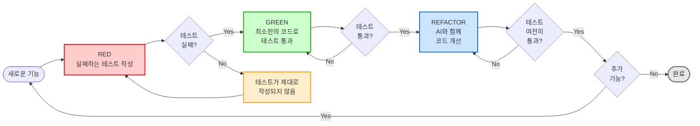
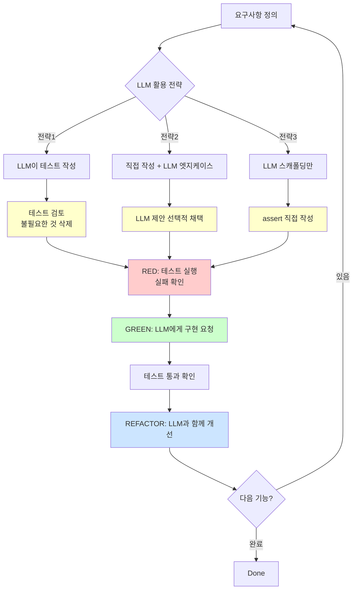

# TDD 예제: 계산기 구현

Test-Driven Development (TDD)를 AI 도구와 함께 경험하는 예제입니다.

## Red-Green-Refactor 사이클



### 사이클 설명

| 단계 | 색상 | 활동 | 검증 포인트 |
|------|------|------|------------|
| **RED** | 🔴 빨강 | 실패하는 테스트 작성 | 테스트가 실패하는가? |
| **GREEN** | 🟢 초록 | 최소한의 코드로 테스트 통과 | 테스트가 통과하는가? |
| **REFACTOR** | 🔵 파랑 | AI와 함께 코드 개선 | 리팩토링 후에도 통과하는가? |

**핵심 원칙:**
- RED 단계에서 테스트가 실패하지 않으면 → 테스트가 제대로 작성되지 않은 것
- GREEN 단계에서는 "최소한"의 코드만 작성 (과도한 설계 금지)
- REFACTOR 단계에서 테스트가 깨지면 → 리팩토링을 되돌리고 다시 시도

## 실행 방법

```bash
# 1. 테스트 실행 (처음에는 실패할 것)
uv run pytest test_calculator.py -v

# 2. calculator.py 구현 (AI 또는 직접)

# 3. 테스트 다시 실행 (이제 통과해야 함)
uv run pytest test_calculator.py -v

# 4. 커버리지 확인
uv run pytest test_calculator.py --cov=calculator --cov-report=term-missing
```

## 학습 포인트

### 1. AI가 도움이 되는 부분
- 테스트 스캐폴딩 자동 생성
- 엣지 케이스 제안 (예: `test_divide_by_zero_raises_error`)
- 리팩토링 제안

### 2. 사람이 확인해야 하는 부분
- 테스트 의도가 올바른지
- AI가 제안한 엣지 케이스가 실제로 중요한지
- 테스트가 과도하게 많지 않은지

## 테스트 파일 처음부터 생성하기 (with AI)

빈 프로젝트에서 테스트 파일을 처음 만들 때, 효과적인 프롬프팅 전략을 사용하면 고품질 테스트를 빠르게 얻을 수 있습니다.

### 나쁜 프롬프트 vs 좋은 프롬프트

| 나쁜 프롬프트 ❌ | 문제점 | 좋은 프롬프트 ✅ |
|----------------|--------|-----------------|
| "Calculator 테스트 작성해줘" | 너무 모호함 | "Calculator 클래스의 pytest 테스트를 작성해줘. TDD 방식으로 진행하며..." |
| "테스트 만들어줘" | 컨텍스트 부족 | "다음 요구사항을 만족하는 테스트를 작성해줘: 1) ... 2) ..." |
| "테스트 코드 생성" | 구조 불명확 | "TestCalculator 클래스로 그룹핑하고, setup_method 사용해줘" |

### 효과적인 프롬프팅 5단계 템플릿

빈 프로젝트에서 테스트 파일을 생성할 때 이 템플릿을 사용하세요.

#### Step 1: 컨텍스트 제공 (Context)

```
"새로운 Calculator 클래스를 TDD로 개발하려고 해.

프로젝트 구조:
- 파일: calculator.py (아직 비어있음)
- 테스트: test_calculator.py (생성 예정)
- 프레임워크: pytest
- Python 버전: 3.12+

목표: TDD Red-Green-Refactor 사이클로 개발"
```

**포함할 정보:**
- 대상 클래스/모듈 이름
- 현재 상태 (비어있음, 일부 구현됨 등)
- 사용할 테스트 프레임워크
- 프로젝트 컨텍스트

#### Step 2: 요구사항 명시 (Requirements)

```
"다음 기능을 테스트해야 해:

1. add(a, b): 두 수를 더함
   - 양수, 음수, 0 지원
   - 반환 타입: float

2. subtract(a, b): 두 수를 뺌
   - 결과가 음수일 수 있음

3. multiply(a, b): 두 수를 곱함
   - 0 곱하기 지원

4. divide(a, b): 두 수를 나눔
   - 0으로 나누기 시 ValueError 발생
   - 항상 float 반환"
```

**포함할 정보:**
- 각 함수의 시그니처
- 입력/출력 타입
- 예외 처리 요구사항
- 특수 케이스

#### Step 3: 엣지케이스 가이드라인 (Edge Cases)

```
"각 함수마다:
- 기본 케이스 1개 (정상 동작)
- 엣지케이스 1-2개 (음수, 0, 큰 숫자 등)
- 예외 처리 (해당 시)

중요 원칙:
- 과도한 테스트는 피하고, 실용적인 케이스만
- 실제 발생 가능한 시나리오 우선
- 테스트 이름은 명확하게 (무엇을 테스트하는지 알 수 있게)"
```

**지침:**
- 엣지케이스 개수 제한 (과도한 테스트 방지)
- 우선순위 명시 (중요한 케이스 먼저)
- 네이밍 컨벤션

#### Step 4: 코드 스타일 지정 (Style)

```
"pytest 스타일로 작성해줘:

구조:
- TestCalculator 클래스로 그룹핑
- setup_method()로 Calculator 인스턴스 생성
- 각 테스트는 독립적으로 실행 가능

스타일:
- assert 문만 사용 (unittest 스타일 말고)
- 예외: pytest.raises 사용
- 각 테스트에 명확한 docstring
- 타입 힌트는 불필요 (pytest는 런타임)

예시:
```python
class TestCalculator:
    def setup_method(self):
        self.calc = Calculator()

    def test_add_positive_numbers(self):
        '''두 양수를 더하면 올바른 결과 반환'''
        assert self.calc.add(2, 3) == 5
```
"
```

**명시할 사항:**
- 테스트 클래스 구조
- Fixture 사용 방식
- 코딩 컨벤션 (assert 스타일, docstring 등)
- 예시 코드 제공

#### Step 5: RED 단계 확인 요청 (Verification)

```
"중요: RED 단계 검증

생성된 test_calculator.py를 실행하면:
- 모든 테스트가 실패해야 함 (AttributeError 또는 NotImplementedError)
- calculator.py는 아직 빈 클래스이므로

테스트 파일 상단에 다음 주석 추가해줘:
# RED 단계: 이 테스트들은 모두 실패해야 함
# calculator.py에 빈 Calculator 클래스만 있는 상태

실행 방법도 주석으로 추가:
# uv run pytest test_calculator.py -v
"
```

**확인 사항:**
- RED 단계 명시
- 실행 명령어 포함
- 예상 실패 메시지

### 완전한 프롬프트 예시

<details>
<summary>클릭하여 전체 프롬프트 보기</summary>

```
새로운 Calculator 클래스를 TDD로 개발하려고 해.

프로젝트 구조:
- 파일: calculator.py (빈 클래스만 존재)
- 테스트: test_calculator.py (생성 예정)
- 프레임워크: pytest
- Python 버전: 3.12+

다음 기능을 테스트하는 pytest 테스트를 작성해줘:

1. add(a, b): 두 수를 더함
2. subtract(a, b): 두 수를 뺌
3. multiply(a, b): 두 수를 곱함
4. divide(a, b): 두 수를 나눔 (0으로 나누기 시 ValueError)

각 함수마다:
- 기본 케이스 1개
- 엣지케이스 1-2개 (음수, 0 등)
- 예외 처리 (해당 시)

코드 스타일:
- TestCalculator 클래스로 그룹핑
- setup_method()로 인스턴스 생성
- pytest.raises 사용
- 각 테스트에 명확한 docstring

중요:
- Calculator 클래스는 아직 비어있으므로 모든 테스트는 실패해야 함
- 파일 상단에 "RED 단계" 주석 추가
- 실행 명령어 주석으로 추가

과도한 테스트는 피하고, 실용적인 케이스만 포함해줘.
```

</details>

### 생성된 테스트 검증 체크리스트

AI가 생성한 테스트 파일을 받으면 다음을 확인하세요:

- [ ] **파일 구조**: 클래스로 그룹핑되어 있는가?
- [ ] **독립성**: 각 테스트가 독립적으로 실행 가능한가?
- [ ] **네이밍**: 테스트 이름만 보고 무엇을 테스트하는지 알 수 있는가?
- [ ] **Docstring**: 각 테스트의 의도가 명확한가?
- [ ] **엣지케이스**: 현실적인 케이스만 포함되었는가?
- [ ] **RED 확인**: 실제로 실행하면 모든 테스트가 실패하는가?

### 자주 하는 실수와 해결 방법

| 실수 | 문제 | 해결 |
|------|------|------|
| **"테스트 작성해줘"만 요청** | AI가 구조를 추측함 | 5단계 템플릿 사용 |
| **엣지케이스 제한 안 함** | 수십 개 테스트 생성 | "각 함수당 2-3개만" 명시 |
| **스타일 지정 안 함** | unittest 스타일 혼용 | pytest 스타일 명시 |
| **RED 확인 요청 안 함** | 통과하는 테스트 생성 | "실패해야 함" 강조 |
| **예시 없이 요청** | 원하는 스타일과 다름 | 예시 코드 제공 |

---

## AI와 함께 TDD 하는 방법

### 전략 1: LLM으로 실패하는 테스트 먼저 작성하기 (권장)

```bash
# Step 1: 빈 구현 파일 생성
cat > calculator.py << 'EOF'
class Calculator:
    pass
EOF

# Step 2: LLM에게 테스트 작성 요청 (실패하는 테스트!)
# Claude Code 프롬프트:
"다음 요구사항을 만족하는 pytest 테스트를 작성해줘:
- 기본 사칙연산 (add, subtract, multiply, divide)
- 0으로 나누기 예외 처리
- 부동소수점 지원
- 엣지케이스 포함

중요: Calculator 클래스는 아직 비어있으므로 테스트는 실패해야 함"

# Step 3: 테스트 실행 (RED 단계 확인)
uv run pytest test_calculator.py -v
# → 모든 테스트가 실패하는지 확인!

# Step 4: LLM에게 구현 요청 (GREEN 단계)
"test_calculator.py의 모든 테스트를 통과하는 Calculator 클래스를 구현해줘"

# Step 5: 테스트 통과 확인
uv run pytest test_calculator.py -v

# Step 6: 리팩토링 (REFACTOR 단계)
"calculator.py를 더 읽기 쉽게 리팩토링해줘. 단, 테스트는 계속 통과해야 함"
```

### 전략 2: LLM으로 엣지케이스만 제안받기

```bash
# Step 1: 기본 테스트 직접 작성
# test_calculator.py에 add, subtract 등 기본 테스트만 작성

# Step 2: LLM에게 엣지케이스 제안 요청
"현재 test_calculator.py를 분석하고, 놓친 엣지케이스가 있다면 제안해줘.
예시: 오버플로우, 언더플로우, None 입력 등"

# Step 3: LLM 제안 중 필요한 것만 선택하여 테스트 추가
"제안된 케이스 중 'None 입력 처리'와 '큰 숫자 계산'만 테스트에 추가해줘"
```

### 전략 3: LLM으로 테스트 스캐폴딩만 생성

```bash
# Step 1: LLM에게 테스트 구조만 요청
"Calculator 클래스의 테스트 스캐폴딩을 만들어줘.
각 테스트 메서드는 주석으로만 구성하고, assert는 pass로 남겨둬"

# 생성 예시:
# def test_add_positive_numbers():
#     """두 양수 덧셈"""
#     pass

# Step 2: 직접 assert 문 작성하며 테스트 완성
# → 테스트 의도를 명확히 이해하게 됨
```

### Claude Code 사용 예시 (실전)

```bash
# 1. 테스트 파일 작성 후
# 2. Claude Code에게 요청:
"test_calculator.py의 테스트를 통과하는 Calculator 클래스를 구현해줘"

# 3. AI가 구현한 코드 검토
# 4. pytest 실행하여 검증
# 5. 추가 엣지 케이스 발견 시:
"부동소수점 계산도 지원하도록 테스트와 구현을 업데이트해줘"
```

### LLM 활용 시 주의사항 ⚠️

| 해야 할 것 ✅ | 하지 말아야 할 것 ❌ |
|-------------|-------------------|
| LLM이 생성한 테스트를 이해하고 검증 | 맹목적으로 모든 테스트 수용 |
| 불필요한 테스트는 삭제 | 테스트가 많을수록 좋다고 생각 |
| 테스트 실패 → 구현 순서 준수 | 테스트와 구현을 동시에 생성 |
| 테스트 의도를 코드 리뷰하듯 확인 | "AI가 만들었으니까 맞겠지" 가정 |

## 실습: 실패하는 테스트 먼저 작성하기

### 연습 1: 제곱근 기능 TDD로 추가

```bash
# 1. 실패하는 테스트 작성 (RED)
cat >> test_calculator.py << 'EOF'

    def test_square_root(self):
        """양수의 제곱근을 계산"""
        result = self.calc.square_root(16)
        assert result == 4.0

    def test_square_root_of_zero(self):
        """0의 제곱근은 0"""
        result = self.calc.square_root(0)
        assert result == 0.0

    def test_square_root_negative_raises_error(self):
        """음수의 제곱근은 예외 발생"""
        with pytest.raises(ValueError, match="음수의 제곱근"):
            self.calc.square_root(-1)
EOF

# 2. 테스트 실패 확인 (RED)
uv run pytest test_calculator.py::TestCalculator::test_square_root -v
# AttributeError: 'Calculator' object has no attribute 'square_root'

# 3. LLM에게 구현 요청 (GREEN)
# "Calculator 클래스에 square_root 메서드를 추가해서 위 3개 테스트를 통과시켜줘"

# 4. 모든 테스트 통과 확인
uv run pytest test_calculator.py -v
```

### 연습 2: LLM으로 실패하는 테스트 생성

```bash
# 프롬프트 예시:
"Calculator 클래스에 power(base, exponent) 메서드를 추가하려고 해.
다음 케이스를 검증하는 pytest 테스트를 작성해줘:
1. 기본 거듭제곱 (2^3 = 8)
2. 0제곱은 항상 1
3. 음수 지수 지원 (2^-2 = 0.25)
4. 밑이 0이고 지수가 0인 경우 예외 발생

중요: Calculator 클래스에는 아직 power 메서드가 없으므로 테스트는 실패해야 함"
```

### 연습 3: 엣지케이스 발견하기

```bash
# LLM 프롬프트:
"현재 Calculator 클래스의 divide 메서드를 분석하고,
놓칠 수 있는 엣지케이스 3가지를 테스트 코드로 제안해줘.
각 테스트는 왜 중요한지 주석으로 설명해줘"

# 예상되는 LLM 응답:
# - test_divide_infinity: 매우 작은 수로 나누기
# - test_divide_precision: 부동소수점 정밀도 문제
# - test_divide_type_error: 문자열 입력 처리
```

## TDD + LLM 베스트 프랙티스 요약



### 워크플로우 설명

**1단계: 전략 선택**
- 상황과 경험에 따라 3가지 전략 중 하나 선택
- 초보자는 전략1(LLM 테스트 작성), 경험자는 전략2(엣지케이스만) 권장

**2단계: 검토 단계 (노란색)**
- LLM 결과물을 맹목적으로 수용하지 말고 반드시 검토
- 불필요한 테스트는 과감히 삭제
- "왜 이 테스트가 필요한가?" 질문하기

**3단계: TDD 사이클 진입**
- RED → GREEN → REFACTOR 순서 준수
- 각 단계에서 LLM을 적극 활용
- 완료 후 다음 기능으로 반복

**색상 의미:**
- 🟡 **노란색 (Review)**: 사람의 판단이 필요한 단계
- 🔴 **빨간색 (RED)**: 실패 확인 단계
- 🟢 **초록색 (GREEN)**: 구현 단계
- 🔵 **파란색 (REFACTOR)**: 개선 단계

## 다음 단계

- `test_calculator.py`에 새로운 테스트 추가해보기
  - 예: `test_power()`, `test_square_root()`
- AI에게 구현 요청하고 검증하기
- 위 3가지 전략을 각각 시도해보고 자신에게 맞는 방식 찾기
