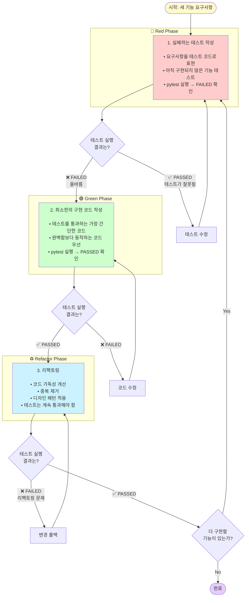

# 실습 1: TDD with AI - 문자열 처리기 구현

## 목표

TDD(Test-Driven Development) 방식으로 문자열 처리 유틸리티를 구현하면서, AI 코딩 어시스턴트를 활용한 테스트 우선 개발을 경험합니다.

## 학습 시간

30분

## 요구사항

다음 기능을 가진 `StringProcessor` 클래스를 구현하세요:

### 1. 단어 개수 세기
- 메서드명: `count_words(text: str) -> int`
- 기능: 문자열의 단어 개수를 반환
- 예시:
  - `"hello world"` → `2`
  - `"  hello   world  "` → `2` (공백 무시)
  - `""` → `0`

### 2. 회문 검사
- 메서드명: `is_palindrome(text: str) -> bool`
- 기능: 문자열이 회문(palindrome)인지 확인
- 대소문자 및 공백 무시
- 예시:
  - `"racecar"` → `True`
  - `"A man a plan a canal Panama"` → `True`
  - `"hello"` → `False`

### 3. 제목 케이스 변환
- 메서드명: `to_title_case(text: str) -> str`
- 기능: 각 단어의 첫 글자를 대문자로 변환
- 예시:
  - `"hello world"` → `"Hello World"`
  - `"the quick brown fox"` → `"The Quick Brown Fox"`

### 4. 문자 빈도 계산
- 메서드명: `char_frequency(text: str) -> dict[str, int]`
- 기능: 각 문자의 출현 빈도를 딕셔너리로 반환
- 대소문자 구분, 공백 무시
- 예시:
  - `"hello"` → `{"h": 1, "e": 1, "l": 2, "o": 1}`
  - `"AAbb"` → `{"A": 2, "b": 2}`

## TDD 워크플로우

### Red-Green-Refactor 사이클

TDD는 테스트를 먼저 작성하고, 이를 통과하는 코드를 구현한 후, 리팩토링하는 반복적인 사이클입니다.



**AI 활용 TDD 팁:**
- 🔴 Red: AI에게 엣지 케이스 제안 요청
- 🟢 Green: AI가 구현 코드 생성, 사람이 검증
- ♻️ Refactor: AI에게 리팩토링 제안 요청

## 실습 단계

### 단계 1: 테스트 파일 생성 (Red)

`exercises/test_string_processor.py` 파일을 생성하고, 첫 번째 기능(`count_words`)의 테스트를 작성하세요.

```python
import pytest
from string_processor import StringProcessor

class TestStringProcessor:
    def test_count_words_basic(self):
        processor = StringProcessor()
        assert processor.count_words("hello world") == 2

    def test_count_words_with_extra_spaces(self):
        processor = StringProcessor()
        assert processor.count_words("  hello   world  ") == 2

    def test_count_words_empty_string(self):
        processor = StringProcessor()
        assert processor.count_words("") == 0
```

### 단계 2: 테스트 실행 (확인: 실패해야 함)

```bash
cd 04-testing-deployment/01-ai-dlc-testing/exercises
pytest test_string_processor.py -v
```

**예상 결과**: `ModuleNotFoundError: No module named 'string_processor'` (Red 상태 확인)

### 단계 3: 구현 파일 생성 (Green)

`exercises/string_processor.py` 파일을 생성하고, 테스트를 통과하는 최소한의 코드를 작성하세요.

**💡 AI 활용 팁**: Claude Code나 Cursor에서 다음과 같이 요청하세요:
```
test_string_processor.py의 테스트를 통과하는 StringProcessor 클래스를 구현해줘.
count_words 메서드만 구현하면 돼.
```

### 단계 4: 테스트 재실행 (확인: 통과해야 함)

```bash
pytest test_string_processor.py -v
```

**예상 결과**: 모든 `test_count_words_*` 테스트 통과 (Green 상태)

### 단계 5: 리팩토링 (Refactor)

코드를 개선하되, 테스트가 계속 통과하는지 확인하세요.

예시:
- 변수명 명확화
- 엣지 케이스 처리 추가
- 주석 추가

### 단계 6: 나머지 기능 반복

위 단계를 반복하여 `is_palindrome`, `to_title_case`, `char_frequency` 메서드를 구현하세요.

## AI-DLC 실습 포인트

### 1. AI로 테스트 케이스 생성

**프롬프트 예시**:
```
회문 검사 함수를 테스트하기 위한 엣지 케이스를 5가지 제안해줘.
pytest 형식으로 작성해줘.
```

### 2. AI로 구현 코드 생성

**프롬프트 예시**:
```
다음 테스트를 통과하는 is_palindrome 메서드를 구현해줘:
[테스트 코드 붙여넣기]
```

### 3. AI로 리팩토링

**프롬프트 예시**:
```
이 코드를 더 pythonic하게 개선해줘. 테스트는 계속 통과해야 해.
```

## 검증 기준

다음 명령으로 모든 테스트가 통과하면 성공입니다:

```bash
pytest test_string_processor.py -v --cov=string_processor
```

**목표**:
- ✅ 테스트 커버리지 100%
- ✅ 모든 테스트 통과
- ✅ 각 메서드별 최소 3개 이상의 테스트 케이스

## 보너스 챌린지

1. **Parametrize 활용**: `@pytest.mark.parametrize`로 테스트 케이스를 간결하게 만들기
2. **예외 처리**: `None` 입력 시 `ValueError` 발생시키기
3. **성능 테스트**: 100만 글자 문자열 처리 시간 측정

## 참고 자료

- [pytest 공식 문서](https://docs.pytest.org/)
- [TDD with Python](https://testdriven.io/blog/modern-tdd/)
- [AI-Powered TDD 패턴](https://martinfowler.com/articles/ai-assisted-tdd.html)
