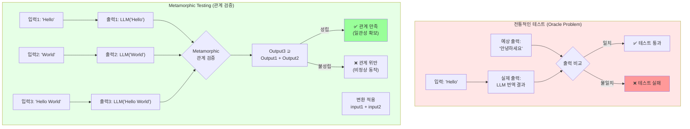

# 실습 2: Metamorphic Testing - LLM 출력 검증

## 목표

Metamorphic Testing 기법을 사용하여 LLM(Large Language Model) 출력의 일관성과 신뢰성을 검증하는 방법을 학습합니다.

## 학습 시간

40분

## 배경 지식

### Metamorphic Testing이란?

전통적인 테스트는 **입력 → 예상 출력**을 검증합니다. 하지만 LLM처럼 정확한 출력을 예측하기 어려운 경우, **입력 간의 관계 → 출력 간의 관계**를 검증하는 Metamorphic Testing이 유용합니다.

**예시**:
- 입력: `"summarize: The weather is nice today"`
- 예상 출력: 정확히 예측 불가능 ❌
- Metamorphic 관계: 입력을 2배 반복하면 출력도 유사한 내용 포함 ✅

#### 전통적인 테스트 vs Metamorphic Testing



**핵심 차이점:**
- 전통적인 테스트: "정답"을 알아야 함 → LLM처럼 비결정적 시스템에는 어려움
- Metamorphic Testing: "관계"만 검증 → 정답 없이도 일관성 확인 가능

### Metamorphic 관계 (MR, Metamorphic Relations)

| MR 유형 | 설명 | 예시 |
|---------|------|------|
| **순서 불변성** | 입력 순서를 바꿔도 결과 동일 | `sum([1,2,3])` = `sum([3,2,1])` |
| **중복 입력** | 입력 반복 시 출력도 관련 내용 포함 | `summarize(text * 2)` 길이 증가 |
| **역변환** | 변환 후 역변환 시 원본 복원 | `encrypt(decrypt(x))` = `x` |
| **추가성** | 입력 추가 시 출력에 반영 | `translate(A+B)` ⊃ `translate(A)` |

## 요구사항

Part 3의 MCP 서버 또는 임의의 LLM API를 사용하여 다음 Metamorphic 관계를 검증하는 테스트를 작성하세요.

### 1. 번역 일관성 (순서 불변성)

**MR**: 문장 순서를 바꿔서 번역한 후 재배열하면, 원본을 번역한 결과와 동일해야 함

```
원본: ["Hello", "World"]
MR: translate(["Hello", "World"])
    = reorder(translate(["World", "Hello"]))
```

### 2. 요약 길이 단조성

**MR**: 텍스트 길이가 증가하면 요약문 길이도 증가하거나 유지되어야 함

```
입력: text_short (100단어)
입력': text_long (1000단어)
MR: len(summary(text_long)) >= len(summary(text_short))
```

### 3. 감정 분석 대칭성

**MR**: 긍정문을 부정으로 변환하면 감정 점수도 반대가 되어야 함

```
입력: "This product is excellent"
입력': "This product is terrible"
MR: sentiment(positive_text) > 0.5
    and sentiment(negative_text) < 0.5
```

### 4. 키워드 추출 포함 관계

**MR**: 두 문서를 합친 텍스트의 키워드는 개별 키워드를 포함해야 함

```
입력: doc_A, doc_B
MR: keywords(doc_A + doc_B) ⊇ keywords(doc_A) ∪ keywords(doc_B)
```

## 실습 단계

### 단계 1: LLM 클라이언트 선택

다음 중 하나를 선택하세요:

**옵션 A**: Ollama 로컬 LLM (무료)
```bash
# Ollama 설치 및 모델 다운로드
ollama pull llama3.2
```

**옵션 B**: OpenAI API (유료, 테스트용 최소 비용)
```bash
export OPENAI_API_KEY="sk-..."
```

**옵션 C**: Part 3 MCP 서버 사용 (추천)

### 단계 2: 테스트 파일 생성

`exercises/test_llm_metamorphic.py` 파일을 생성하세요.

```python
import pytest
from typing import List
import ollama  # 또는 openai

class TestLLMMetamorphic:

    @pytest.fixture
    def llm_client(self):
        """LLM 클라이언트 초기화"""
        # Ollama 예시
        return ollama.Client()

    def translate(self, client, text: str, target_lang: str = "Korean") -> str:
        """텍스트 번역"""
        prompt = f"Translate to {target_lang}: {text}"
        response = client.generate(model="llama3.2", prompt=prompt)
        return response['response']

    def test_translation_order_invariance(self, llm_client):
        """MR1: 번역 순서 불변성"""
        sentences = ["Hello", "World", "Today"]

        # 원본 순서로 번역
        original_order = [
            self.translate(llm_client, s) for s in sentences
        ]

        # 역순으로 번역 후 재배열
        reversed_sentences = sentences[::-1]
        reversed_translations = [
            self.translate(llm_client, s) for s in reversed_sentences
        ]
        reordered = reversed_translations[::-1]

        # Metamorphic 관계 검증
        # (완전 동일하지 않을 수 있으므로 유사도로 검증)
        for orig, reord in zip(original_order, reordered):
            similarity = self._calculate_similarity(orig, reord)
            assert similarity > 0.7, f"번역 일관성 부족: {orig} vs {reord}"

    def _calculate_similarity(self, text1: str, text2: str) -> float:
        """간단한 자카드 유사도 계산"""
        set1 = set(text1.lower().split())
        set2 = set(text2.lower().split())
        intersection = set1 & set2
        union = set1 | set2
        return len(intersection) / len(union) if union else 0.0
```

### 단계 3: 나머지 MR 구현

위 예시를 참고하여 MR2, MR3, MR4의 테스트 메서드를 추가하세요.

**💡 AI 활용 팁**:
```
요약 길이 단조성을 검증하는 Metamorphic 테스트를 pytest로 작성해줘.
입력 텍스트 길이가 2배가 되면 요약문 길이도 증가하는지 확인하는 테스트야.
```

### 단계 4: 테스트 실행

```bash
cd 04-testing-deployment/01-ai-dlc-testing/exercises
pytest test_llm_metamorphic.py -v -s
```

**주의**: LLM 호출이 포함되므로 실행 시간이 길 수 있습니다 (30초~2분).

### 단계 5: 결과 분석

테스트 실패 시 다음을 확인하세요:
- LLM 응답의 비결정성 (같은 입력에도 다른 출력)
- MR 관계가 너무 엄격한지 (threshold 조정 필요)
- 프롬프트 엔지니어링 개선 필요 여부

## AI-DLC 실습 포인트

### 1. AI로 Metamorphic 관계 발견

**프롬프트 예시**:
```
텍스트 요약 기능을 테스트하기 위한 Metamorphic 관계를 5가지 제안해줘.
각 관계에 대한 pytest 테스트 코드도 함께 작성해줘.
```

### 2. AI로 유사도 함수 개선

**프롬프트 예시**:
```
자카드 유사도보다 정확한 텍스트 유사도 계산 방법을 추천해줘.
임베딩 모델을 사용하지 않고 구현 가능한 방법으로.
```

### 3. AI로 테스트 리포트 생성

**프롬프트 예시**:
```
이 Metamorphic 테스트 결과를 분석하고,
LLM의 신뢰성을 평가하는 리포트를 마크다운으로 작성해줘.
```

## 검증 기준

다음 조건을 만족하면 성공입니다:

- ✅ 4가지 MR 모두 구현
- ✅ 각 MR별 테스트 통과율 80% 이상
- ✅ 테스트 실행 시간 3분 이내

## 실전 활용 예시

### 프로덕션에서 Metamorphic Testing 사용

```python
# CI/CD 파이프라인에 추가
@pytest.mark.slow
@pytest.mark.production
def test_llm_consistency_in_production():
    """프로덕션 LLM 모델의 일관성 검증"""
    # 매일 자정 실행, 결과를 모니터링 대시보드에 전송
    pass
```

### 모델 업그레이드 시 회귀 테스트

```python
def test_model_upgrade_regression():
    """새 모델이 기존 MR을 여전히 만족하는지 검증"""
    old_model = "llama3.1"
    new_model = "llama3.2"

    # 동일한 MR로 두 모델 비교
    assert metamorphic_score(old_model) <= metamorphic_score(new_model)
```

## 보너스 챌린지

1. **통계적 검증**: 같은 입력을 10번 반복하여 MR 만족률 계산
2. **파라미터화**: `@pytest.mark.parametrize`로 다양한 언어/모델 테스트
3. **시각화**: Metamorphic 관계 만족도를 그래프로 표시

## 참고 자료

- [Metamorphic Testing for LLMs (arXiv)](https://arxiv.org/abs/2406.06864)
- [MT-Bench: LLM Evaluation](https://arxiv.org/abs/2306.05685)
- [LLM Testing Best Practices](https://www.databricks.com/blog/testing-llm-applications)
