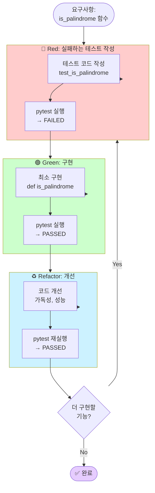
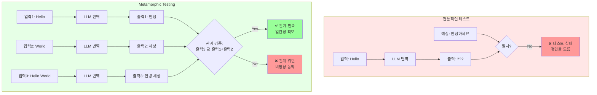

# 실습 해답

이 디렉토리에는 Part 4 AI-DLC 테스트 실습 문제의 해답 코드가 포함되어 있습니다.

## 📁 파일 구조

```
solutions/
├── README.md                      # 이 파일
├── string_processor.py            # Exercise 1: StringProcessor 구현
├── test_string_processor.py       # Exercise 1: 테스트 코드
└── test_llm_metamorphic.py        # Exercise 2: Metamorphic Testing 구현
```

## 🎯 Exercise 1: TDD with AI - 문자열 처리기

### 실행 방법

```bash
cd 04-testing-deployment/01-ai-dlc-testing/exercises/solutions

# 테스트 실행
uv run pytest test_string_processor.py -v

# 커버리지 포함 실행
uv run pytest test_string_processor.py -v --cov=string_processor

# 특정 테스트만 실행
uv run pytest test_string_processor.py::TestStringProcessor::test_count_words_basic -v
```

### 구현 내용

**`string_processor.py`**:
- `count_words()`: 문자열의 단어 개수 계산
- `is_palindrome()`: 회문 검사 (대소문자/공백 무시)
- `to_title_case()`: 제목 케이스 변환
- `char_frequency()`: 문자 빈도 계산

**`test_string_processor.py`**:
- 각 메서드별 5개 이상의 테스트 케이스
- `@pytest.mark.parametrize`를 활용한 파라미터화된 테스트
- fixture를 활용한 테스트 코드 간결화

### 학습 포인트



**핵심 원칙**:
1. **Red-Green-Refactor 사이클**: 테스트 → 구현 → 리팩토링 순서
2. **엣지 케이스 처리**: 빈 문자열, 공백, 단일 문자 등
3. **pytest 활용**: fixture, parametrize, assertion

## 🧪 Exercise 2: Metamorphic Testing - LLM 출력 검증

### 실행 방법

**⚠️ 사전 준비**: LLM 백엔드 설정 필요

**옵션 A: Ollama 사용 (무료)**

```bash
# 1. Ollama 설치 (https://ollama.ai)
ollama pull llama3.2

# 2. 테스트 실행
cd 04-testing-deployment/01-ai-dlc-testing/exercises/solutions
uv run pytest test_llm_metamorphic.py -v -s
```

**옵션 B: OpenAI 사용 (유료)**

```bash
# 1. API 키 설정
export OPENAI_API_KEY="sk-..."

# 2. 테스트 실행
cd 04-testing-deployment/01-ai-dlc-testing/exercises/solutions
uv run pytest test_llm_metamorphic.py -v -s
```

### 구현된 Metamorphic 관계

| MR | 이름 | 설명 | 검증 방법 |
|----|------|------|-----------|
| MR1 | 번역 순서 불변성 | 문장 순서를 바꿔도 개별 번역 결과는 동일 | 자카드 유사도 > 0.5 |
| MR2 | 요약 길이 단조성 | 입력 길이 증가 시 요약문 길이도 증가 | 단어 개수 비교 |
| MR3 | 감정 분석 대칭성 | 긍정문과 부정문의 점수는 반대 방향 | 점수 차이 > 0.2 |
| MR4 | 키워드 포함 관계 | 합친 문서의 키워드는 개별 키워드 포함 | 포함률 ≥ 40% |

### 학습 포인트



**핵심 원칙**:
1. **Metamorphic Testing의 필요성**: LLM처럼 정확한 출력을 예측하기 어려운 경우 유용
2. **관계 기반 검증**: 절대적 정답 대신 입력/출력 간의 관계를 검증
3. **임계값 설정**: 유사도, 포함률 등의 임계값을 적절히 조정하는 것이 중요

### 주의사항

- LLM 호출이 포함되어 실행 시간이 오래 걸립니다 (1~3분)
- `@pytest.mark.slow` 마커로 구분되어 있으며, 빠른 테스트만 실행하려면:
  ```bash
  pytest -v -m "not slow"
  ```
- LLM의 비결정성으로 인해 가끔 테스트가 실패할 수 있습니다. 이 경우:
  - 임계값 조정 (예: `similarity > 0.5` → `similarity > 0.4`)
  - 프롬프트 개선
  - 통계적 검증 (여러 번 실행하여 평균)

## 🚀 고급 활용

### 1. CI/CD에 통합

```yaml
# .github/workflows/test.yml
- name: Run TDD tests
  run: |
    uv run pytest 04-testing-deployment/01-ai-dlc-testing/exercises/solutions/test_string_processor.py

- name: Run Metamorphic tests (optional)
  run: |
    uv run pytest 04-testing-deployment/01-ai-dlc-testing/exercises/solutions/test_llm_metamorphic.py -m "not slow"
  continue-on-error: true  # LLM 호출 실패 시에도 계속 진행
```

### 2. 커버리지 목표 설정

```bash
# 커버리지 90% 이상 요구
uv run pytest test_string_processor.py --cov=string_processor --cov-fail-under=90
```

### 3. 성능 프로파일링

```bash
# 느린 테스트 찾기
uv run pytest test_string_processor.py --durations=10
```

## 📚 참고 자료

- [pytest 공식 문서](https://docs.pytest.org/)
- [Metamorphic Testing 논문](https://arxiv.org/abs/2406.06864)
- [AI-Powered TDD](https://martinfowler.com/articles/ai-assisted-tdd.html)

## ❓ 문제 해결

### "ModuleNotFoundError: No module named 'ollama'"

```bash
uv pip install ollama
```

### "LLM 백엔드가 설정되지 않았습니다"

- Ollama를 설치하거나 OpenAI API 키를 설정하세요

### "테스트가 너무 오래 걸려요"

```bash
# slow 마크가 붙은 테스트 제외
pytest -v -m "not slow"
```

### "Metamorphic 테스트가 가끔 실패해요"

- 정상입니다! LLM은 비결정적이므로 가끔 임계값을 벗어날 수 있습니다
- 여러 번 실행하여 통계적으로 검증하거나, 임계값을 조정하세요
