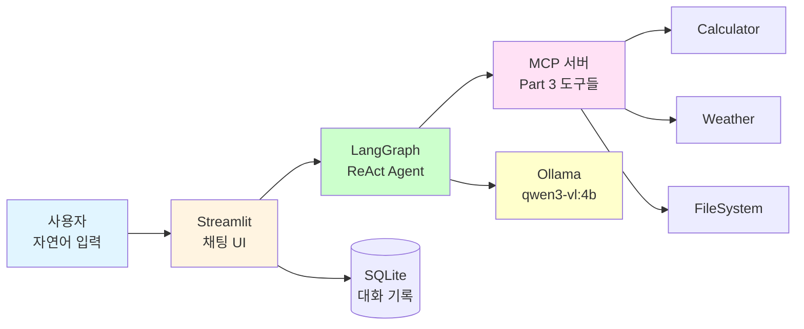
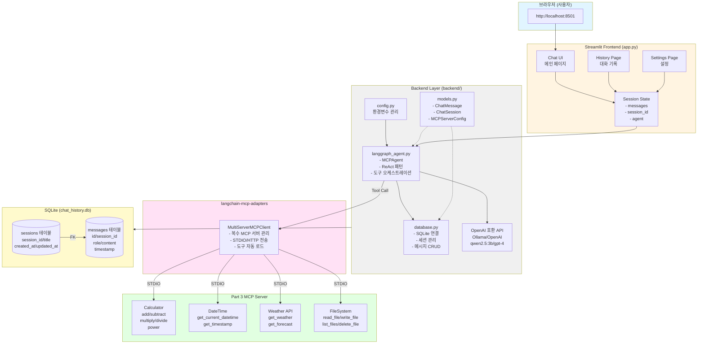
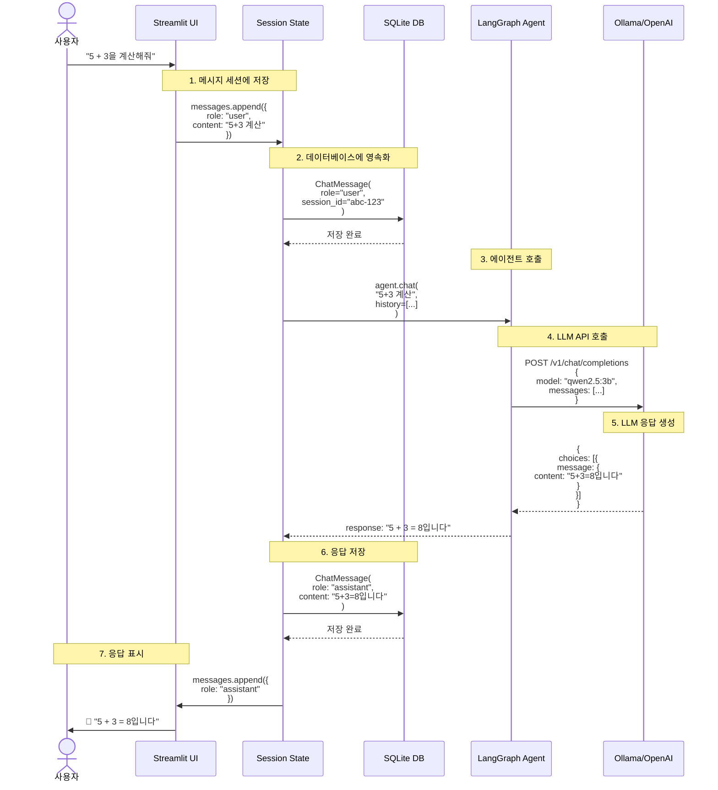
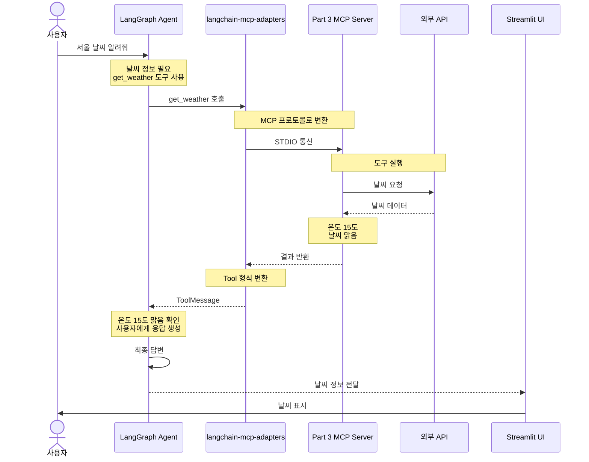

# 02: MCP 채팅 클라이언트

Streamlit과 LangGraph를 사용하여 Part 3 MCP 서버와 통신하는 채팅 애플리케이션을 구현합니다.

## 학습 시간

**50분** (구조 이해 20분 + 실습 30분)

## 학습 목표

- ✅ Streamlit으로 채팅 UI 구축
- ✅ LangGraph ReAct 에이전트 구현
- ✅ langchain-mcp-adapters로 MCP 서버 통합
- ✅ SQLite 대화 기록 저장

---

## 개요

### 무엇을 만드나요?

**사용자가 자연어로 MCP 도구를 사용할 수 있는 채팅 인터페이스**를 만듭니다.

```
사용자: "2 더하기 3은?"
  ↓
AI Agent: Calculator 도구 호출
  ↓
응답: "5입니다"
```

### 왜 필요한가요?

Part 3에서 만든 MCP 서버는 **도구 모음일 뿐**, 일반 사용자가 사용하기 어렵습니다.
- ❌ MCP 서버 단독: JSON-RPC로만 통신 가능
- ✅ 채팅 클라이언트: "계산해줘" 같은 자연어로 사용

### 핵심 구조



### 만드는 것

| 컴포넌트 | 역할 | 기술 스택 |
|----------|------|----------|
| **Frontend** | 사용자 인터페이스 | Streamlit |
| **Agent** | 도구 선택 및 실행 | LangGraph ReAct |
| **MCP Adapter** | MCP 프로토콜 통신 | langchain-mcp-adapters |
| **Database** | 대화 기록 저장 | SQLite |
| **LLM** | 자연어 이해 | Ollama (qwen3-vl:4b) |

### 실행 흐름 예시

```
1. 사용자: "서울 날씨 알려줘"
   ↓
2. Streamlit UI: 메시지 표시 및 Agent에 전달
   ↓
3. LangGraph Agent:
   - LLM에 질문 → "get_weather 도구 사용 필요"
   - MCP Adapter를 통해 Weather 도구 호출
   ↓
4. MCP 서버: OpenWeatherMap API 호출
   ↓
5. Agent: 결과 받아서 자연어 응답 생성
   ↓
6. UI: "서울은 현재 15도이고 맑습니다" 표시
   ↓
7. SQLite: 대화 내용 저장
```

---

## 전체 아키텍처

### 시스템 구성도



### 데이터 흐름 (Message Flow)



### MCP 도구 호출 흐름 (향후 통합)



---

## 빠른 시작

### 1. 환경 설정

```bash
# Part 4 의존성 설치
cd /path/to/fastmcp-example
uv sync --extra part4-testing

# 환경변수 설정 (Ollama 사용)
export OPENAI_API_BASE=http://localhost:11434/v1
export OPENAI_API_KEY=ollama

# 또는 .env 파일 생성
cp .env.example .env
# .env 파일 수정
```

### 2. Part 3 MCP 서버 시작

```bash
# 별도 터미널에서 MCP 서버 실행
cd ../../03-mcp-tools/02-tools
uv run python main.py

# 서버가 STDIO 모드로 실행되어야 함
```

### 3. 채팅 앱 실행

```bash
# 이 디렉토리로 돌아와서
cd 04-testing-deployment/02-mcp-chat-client
uv run streamlit run app.py

# 브라우저에서 http://localhost:8501 열기
```

---

## 프로젝트 구조

```
02-mcp-chat-client/
├── README.md                # 이 파일
├── app.py                   # Streamlit 메인 앱
├── .env.example             # 환경변수 예시
├── .streamlit/              # Streamlit 설정
│   └── config.toml
├── backend/                 # 백엔드 로직
│   ├── __init__.py
│   ├── config.py            # 설정 관리
│   ├── database.py          # SQLite 연결
│   ├── mcp_client.py        # MCP 클라이언트
│   ├── langgraph_agent.py   # LangGraph 에이전트
│   └── models.py            # 데이터 모델
├── pages/                   # Streamlit 페이지
│   ├── 1_Chat.py           # 채팅 페이지 (기본)
│   ├── 2_History.py        # 대화 기록
│   └── 3_Settings.py       # 설정
├── components/              # 재사용 컴포넌트
│   └── chat_message.py
└── tests/                   # 테스트
    ├── test_database.py
    └── test_mcp_client.py
```

---

## 핵심 구현

### 1. Streamlit 앱 (app.py)

간단한 Echo 봇부터 시작하여 점진적으로 기능 추가:

```python
import streamlit as st

st.title("MCP Chat Client")

# 세션 상태 초기화
if "messages" not in st.session_state:
    st.session_state.messages = []

# 메시지 히스토리 표시
for message in st.session_state.messages:
    with st.chat_message(message["role"]):
        st.markdown(message["content"])

# 사용자 입력
if prompt := st.chat_input("메시지를 입력하세요"):
    # 사용자 메시지 표시 및 저장
    st.session_state.messages.append({"role": "user", "content": prompt})
    with st.chat_message("user"):
        st.markdown(prompt)

    # AI 응답 (TODO: LangGraph 에이전트 연동)
    response = f"Echo: {prompt}"

    # 응답 표시 및 저장
    with st.chat_message("assistant"):
        st.markdown(response)
    st.session_state.messages.append({"role": "assistant", "content": response})
```

### 2. LangGraph 에이전트 (backend/langgraph_agent.py)

```python
from langgraph.prebuilt import create_react_agent
from langchain_openai import ChatOpenAI

def create_agent(tools, model_name="gpt-4o-mini"):
    """LangGraph ReAct 에이전트 생성"""
    llm = ChatOpenAI(model=model_name, temperature=0)
    agent = create_react_agent(llm, tools=tools)
    return agent

# 사용 예시:
# agent = create_agent(mcp_tools)
# response = agent.invoke({"messages": [{"role": "user", "content": "2+2 계산해줘"}]})
```

### 3. MCP 클라이언트 (backend/mcp_client.py)

```python
from langchain_mcp_adapters import load_mcp_tools
from mcp import ClientSession, StdioServerParameters

async def load_mcp_tools_from_server(server_command, server_args):
    """MCP 서버에서 도구 로드"""
    server_params = StdioServerParameters(
        command=server_command,
        args=server_args
    )

    async with ClientSession(server_params) as session:
        tools = await load_mcp_tools(session)
        return tools

# 사용 예시:
# tools = await load_mcp_tools_from_server(
#     "uv",
#     ["run", "python", "../../03-mcp-tools/02-tools/main.py"]
# )
```

---

## 단계별 구현 가이드

### Step 1: 기본 Echo 봇 (5분)

`app.py`에 위의 코드를 복사하고 실행:

```bash
uv run streamlit run app.py
```

브라우저에서 메시지를 입력하면 그대로 echo되는지 확인합니다.

---

### Step 2: LangGraph 통합 (15분)

1. **backend/langgraph_agent.py 작성** (위 예시 참조)
2. **app.py 업데이트**:

```python
from backend.langgraph_agent import create_agent
from langchain_core.messages import HumanMessage

# 에이전트 초기화 (세션 시작 시 한 번만)
if "agent" not in st.session_state:
    # TODO: MCP 도구 로드 후 전달
    st.session_state.agent = create_agent(tools=[])

# 사용자 입력 처리
if prompt := st.chat_input("메시지를 입력하세요"):
    # ... (사용자 메시지 표시)

    # LangGraph 에이전트 호출
    result = st.session_state.agent.invoke({
        "messages": st.session_state.messages
    })

    # 응답 추출
    last_message = result["messages"][-1]
    response = last_message.content

    # ... (응답 표시)
```

---

### Step 3: MCP 서버 연동 (20분)

1. **backend/mcp_client.py 작성** (위 예시 참조)
2. **app.py에서 MCP 도구 로드**:

```python
import asyncio
from backend.mcp_client import load_mcp_tools_from_server

@st.cache_resource
def get_mcp_tools():
    """MCP 서버에서 도구 로드 (캐싱)"""
    tools = asyncio.run(load_mcp_tools_from_server(
        "uv",
        ["run", "python", "../../03-mcp-tools/02-tools/main.py"]
    ))
    return tools

# 앱 시작 시 도구 로드
try:
    mcp_tools = get_mcp_tools()
    st.success(f"{len(mcp_tools)}개의 MCP 도구를 로드했습니다")
except Exception as e:
    st.error(f"MCP 서버 연결 실패: {e}")
    mcp_tools = []

# 에이전트에 도구 전달
if "agent" not in st.session_state:
    st.session_state.agent = create_agent(tools=mcp_tools)
```

---

### Step 4: SQLite 대화 기록 (선택사항)

**backend/database.py**:

```python
import sqlite3
from pathlib import Path

DB_PATH = Path(__file__).parent.parent / "data" / "chat.db"

def init_db():
    """데이터베이스 초기화"""
    DB_PATH.parent.mkdir(exist_ok=True)
    conn = sqlite3.connect(DB_PATH)
    cursor = conn.cursor()

    cursor.execute("""
        CREATE TABLE IF NOT EXISTS messages (
            id INTEGER PRIMARY KEY AUTOINCREMENT,
            session_id TEXT,
            role TEXT,
            content TEXT,
            timestamp DATETIME DEFAULT CURRENT_TIMESTAMP
        )
    """)

    conn.commit()
    conn.close()

def save_message(session_id, role, content):
    """메시지 저장"""
    conn = sqlite3.connect(DB_PATH)
    cursor = conn.cursor()

    cursor.execute(
        "INSERT INTO messages (session_id, role, content) VALUES (?, ?, ?)",
        (session_id, role, content)
    )

    conn.commit()
    conn.close()
```

**app.py에서 사용**:

```python
from backend.database import init_db, save_message
import uuid

# 앱 시작 시 DB 초기화
init_db()

# 세션 ID 생성
if "session_id" not in st.session_state:
    st.session_state.session_id = str(uuid.uuid4())

# 메시지 저장
if prompt := st.chat_input("메시지를 입력하세요"):
    save_message(st.session_state.session_id, "user", prompt)
    # ...
    save_message(st.session_state.session_id, "assistant", response)
```

---

## 환경변수 설정

**`.env.example`**:

```env
# OpenAI 호환 API 설정 (Ollama 또는 OpenAI)

# 옵션 1: Ollama (무료)
OPENAI_API_BASE=http://localhost:11434/v1
OPENAI_API_KEY=ollama
# Ollama 모델: qwen2.5:3b, llama3.2:3b 등

# 옵션 2: OpenAI (유료)
# OPENAI_API_BASE=https://api.openai.com/v1
# OPENAI_API_KEY=sk-proj-...

# MCP 서버 경로
MCP_SERVER_COMMAND=uv
MCP_SERVER_ARGS=run,python,../../03-mcp-tools/02-tools/main.py
```

---

## 실행 확인

### 1. Ollama 설정 (무료)

```bash
# 1. Ollama 설치
curl -fsSL https://ollama.com/install.sh | sh

# 2. 모델 다운로드
ollama pull qwen2.5:3b

# 3. Ollama 서버 실행 (자동으로 백그라운드 실행됨)
ollama serve
```

### 2. MCP 서버 시작

```bash
cd ../../03-mcp-tools/02-tools
uv run python main.py
```

### 3. 채팅 앱 실행

```bash
uv run streamlit run app.py
```

### 4. 테스트

브라우저에서 다음 메시지를 입력해보세요:

1. "2 + 2를 계산해줘" → 계산기 도구 호출
2. "서울의 날씨 알려줘" → 날씨 도구 호출
3. "README.md 파일 읽어줘" → 파일시스템 도구 호출

---

## 추가 기능 구현 (TODO)

시간이 있다면 다음 기능을 추가해보세요:

### 1. History 페이지 (`pages/2_History.py`)

```python
import streamlit as st
from backend.database import get_all_messages

st.title("대화 기록")

messages = get_all_messages()

for msg in messages:
    with st.chat_message(msg["role"]):
        st.markdown(msg["content"])
        st.caption(f"시간: {msg['timestamp']}")
```

### 2. Settings 페이지 (`pages/3_Settings.py`)

```python
import streamlit as st

st.title("설정")

# OpenAI API 설정
api_base = st.text_input("API Base URL", value="http://localhost:11434/v1")
api_key = st.text_input("API Key", value="ollama", type="password")

# MCP 서버 선택
mcp_servers = st.multiselect(
    "사용할 MCP 서버",
    ["계산기", "날씨", "파일시스템"],
    default=["계산기", "날씨"]
)

if st.button("저장"):
    # 설정 저장 로직
    st.success("설정이 저장되었습니다")
```

### 3. 스트리밍 응답

```python
# LangGraph 에이전트의 스트리밍 응답 표시
with st.chat_message("assistant"):
    message_placeholder = st.empty()
    full_response = ""

    for chunk in st.session_state.agent.stream({
        "messages": st.session_state.messages
    }):
        full_response += chunk.get("content", "")
        message_placeholder.markdown(full_response + "▌")

    message_placeholder.markdown(full_response)
```

---

## 문제 해결

### Q1: `ImportError: cannot import name 'load_mcp_tools'`

```bash
# langchain-mcp-adapters 설치 확인
uv pip list | grep langchain-mcp-adapters

# 없다면 설치
uv sync --extra part4-testing
```

### Q2: MCP 서버 연결 실패

```bash
# 1. MCP 서버가 실행 중인지 확인
ps aux | grep python | grep main.py

# 2. 서버 경로 확인
ls ../../03-mcp-tools/02-tools/main.py

# 3. 수동으로 서버 실행하여 오류 확인
cd ../../03-mcp-tools/02-tools
uv run python main.py
```

### Q3: Streamlit 포트 충돌

```bash
# 다른 포트로 실행
uv run streamlit run app.py --server.port 8502
```

---

## 참고 자료

- [Streamlit Chat Tutorial](https://docs.streamlit.io/develop/tutorials/llms/conversational-apps)
- [LangGraph ReAct Agent](https://langchain-ai.github.io/langgraph/how-tos/react-agent-from-scratch/)
- [langchain-mcp-adapters GitHub](https://github.com/langchain-ai/langchain-mcp-adapters)

---

## 다음 단계

- **[03-docker-deployment](../03-docker-deployment/)**: Docker로 배포하기
- **[04-ci-cd-pipeline](../04-ci-cd-pipeline/)**: GitHub Actions 자동화

---

**Happy Coding!** 🚀
