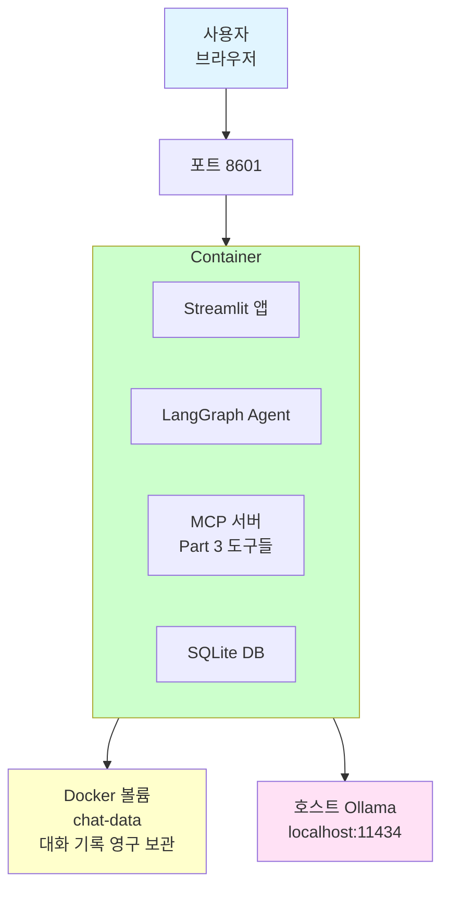
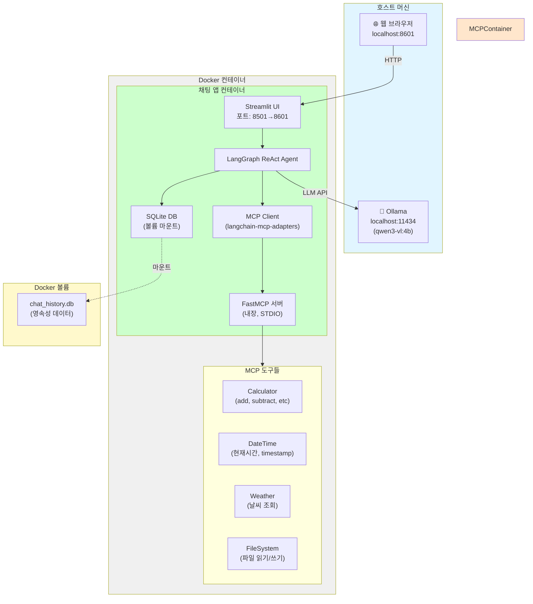
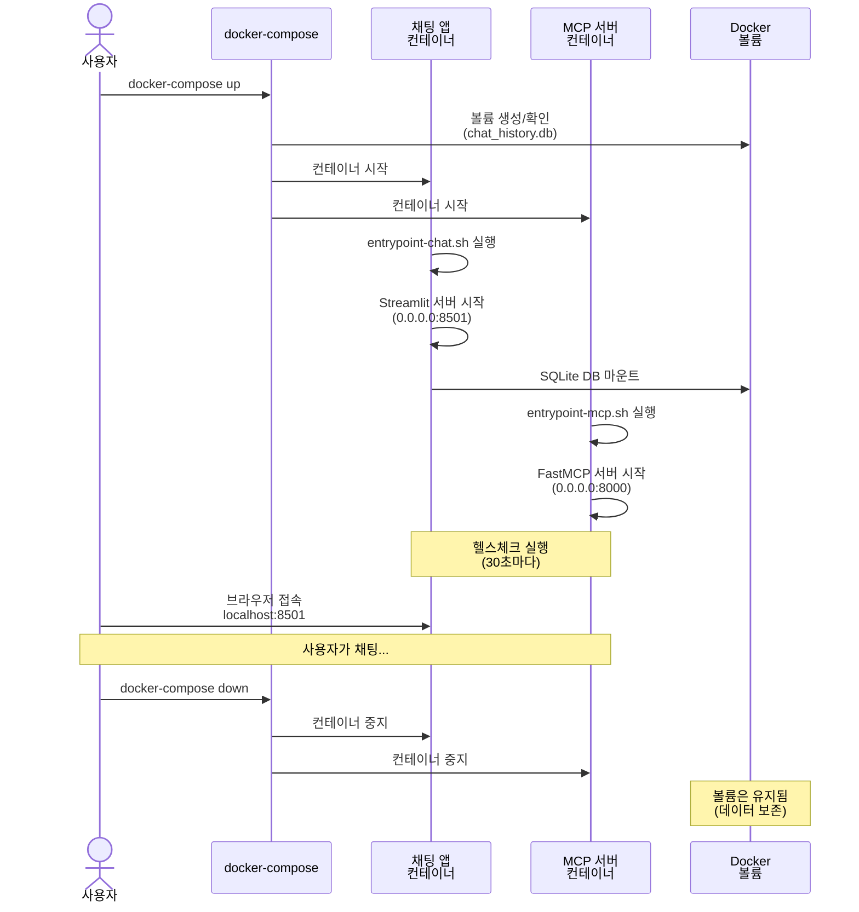

# Docker 배포

MCP 채팅 클라이언트를 Docker 컨테이너로 패키징하고 배포합니다.

## 개요

### 무엇을 하나요?

**Part 2에서 만든 MCP 채팅 클라이언트를 Docker 컨테이너로 패키징**합니다.

| 로컬 개발 환경 | Docker 컨테이너 |
|---------------|----------------|
| Python 3.12 필요 | ✅ 컨테이너 내장 |
| uv 패키지 관리자 | ✅ 컨테이너 내장 |
| Part 3 MCP 서버 | ✅ 컨테이너 포함 |
| Streamlit 앱 | ✅ 한 번에 실행 |
| 환경변수 설정 필요 | ✅ .env 파일로 관리 |

### 왜 Docker를 사용하나요?

| 문제 (로컬 실행) | 해결 (Docker) |
|------------------|--------------|
| ❌ "내 컴퓨터에서만 돌아요" | ✅ 어디서나 동일하게 실행 |
| ❌ Python 버전 충돌 | ✅ 독립된 환경 |
| ❌ 의존성 설치 복잡 | ✅ 이미지에 포함 |
| ❌ MCP 서버 별도 실행 필요 | ✅ 한 번에 시작 |
| ❌ 배포 과정 수동 | ✅ `docker-compose up` 한 줄 |

### 만드는 것

**Docker Compose 스택** (단일 컨테이너)



### 구성 요소

| 파일 | 역할 | 설명 |
|------|------|------|
| **Dockerfile.chat** | 이미지 빌드 | Streamlit + MCP 서버 포함 |
| **docker-compose.yml** | 컨테이너 실행 | 포트, 볼륨, 환경변수 설정 |
| **.env** | 환경변수 | Ollama 모델, API 키 등 |
| **config/chat-app.env** | 앱 설정 | Streamlit 설정 |

### 실행 흐름

```
1. docker-compose up
   ↓
2. Docker 이미지 빌드
   - Python 3.12 설치
   - uv로 의존성 설치
   - Part 2 + Part 3 코드 복사
   ↓
3. 컨테이너 시작
   - Streamlit 앱 실행 (포트 8501)
   - 호스트 8601로 포트 포워딩
   ↓
4. 브라우저에서 접속
   http://localhost:8601
   ↓
5. 채팅 사용
   - LLM: 호스트 Ollama 연결
   - MCP: 컨테이너 내부 서버 사용
   - DB: 볼륨에 영구 저장
```

---

## 빠른 시작

```bash
cd 04-testing-deployment/03-docker-deployment

# 환경변수 파일 생성
cp .env.docker.example .env

# Docker Compose 실행
docker-compose up -d
```

브라우저에서 http://localhost:8601 접속

---

## 아키텍처 개요

### Docker Compose 스택 구조



**주요 구성 요소:**
- 🌐 **채팅 앱 컨테이너**: Streamlit UI + LangGraph ReAct Agent + MCP 통합 + SQLite DB
- 🔧 **MCP 서버**: Part 3 MCP 서버 (컨테이너 내장, STDIO 통신)
- 🛠️ **MCP 도구들**: Calculator, DateTime, Weather, FileSystem
- 💾 **볼륨**: chat_history.db 영속성 저장

### 컨테이너 라이프사이클



---

## 파일 구조

```
03-docker-deployment/
├── docker-compose.yml    # 전체 스택 구성
├── Dockerfile.chat       # 채팅 앱 이미지
├── Dockerfile.mcp        # MCP 서버 이미지 (선택사항)
└── .env.docker          # Docker 환경변수
```

## 주요 명령어

```bash
# 스택 시작
docker-compose up

# 백그라운드 실행
docker-compose up -d

# 로그 확인
docker-compose logs -f

# 스택 중지
docker-compose down

# 볼륨까지 삭제
docker-compose down -v
```

## 환경 설정

`.env` 파일 수정:

```env
OPENAI_API_BASE=http://host.docker.internal:11434/v1
OPENAI_API_KEY=ollama
MODEL_NAME=qwen3-vl:4b  # Vision-Language 모델 (Tool calling 지원)
```

**추천 모델:**
- `qwen3-vl:4b`: Vision-Language 멀티모달 모델 (이미지 이해 가능, Tool calling 지원)
- `qwen2.5:3b`: 빠른 텍스트 전용 모델 (Tool calling 지원)
- `qwen2.5:7b`: 더 강력한 텍스트 모델

**Note:**
- Docker 컨테이너에서 호스트의 Ollama에 접속하려면 `host.docker.internal` 사용
- Tool calling 지원 모델이 필수입니다 (gemma3는 지원 안 함)

## 문제 해결

**Q: Ollama 연결 실패**
```bash
# macOS/Windows: host.docker.internal 사용
OPENAI_API_BASE=http://host.docker.internal:11434/v1

# Linux: host.docker.internal이 없으므로 호스트 IP 직접 지정
OPENAI_API_BASE=http://192.168.1.100:11434/v1
```

**Q: 포트 충돌**
```yaml
# docker-compose.yml에서 호스트 포트 변경
ports:
  - "8601:8501"  # 호스트:8601, 컨테이너:8501 (기본값)
  - "8602:8501"  # 다른 포트로 변경 가능
```

**Q: MCP 도구가 호출되지 않음**
- Tool calling 지원 모델 사용 확인 (qwen2.5, qwen3-vl 권장)
- 로그 확인: `docker compose logs chat-app | grep MCP`
- MCP 서버 경로가 `/app/03-mcp-tools/02-tools/main.py`로 설정되어 있는지 확인
