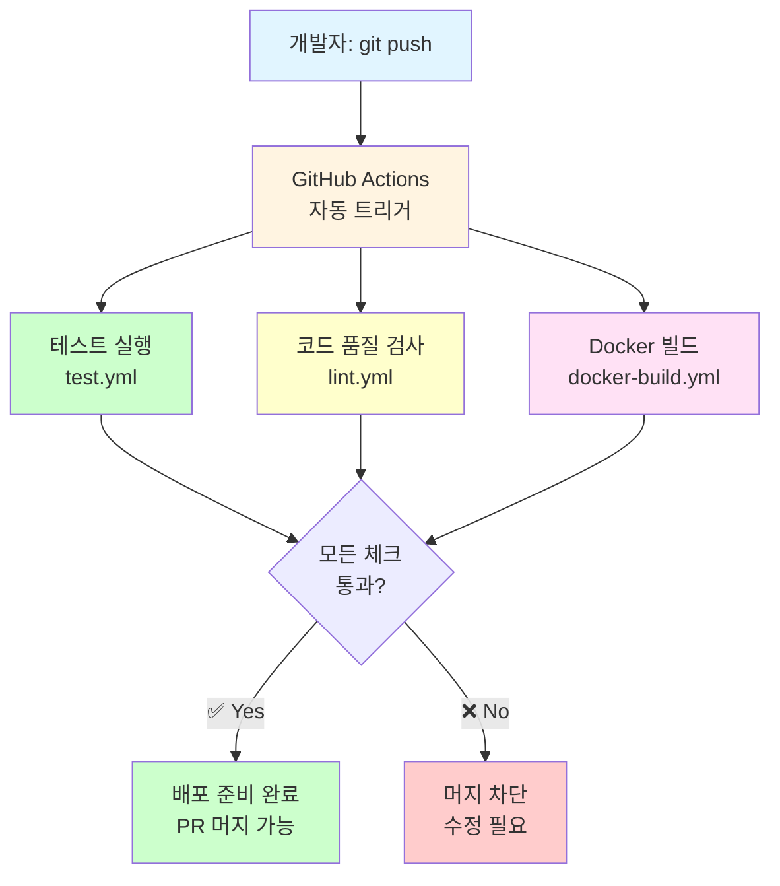
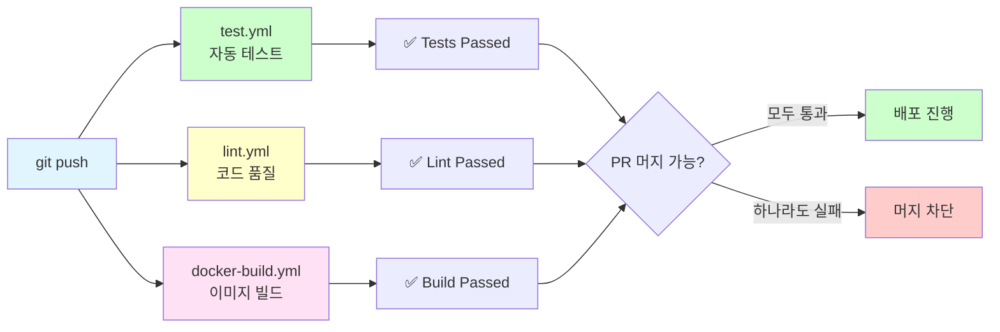
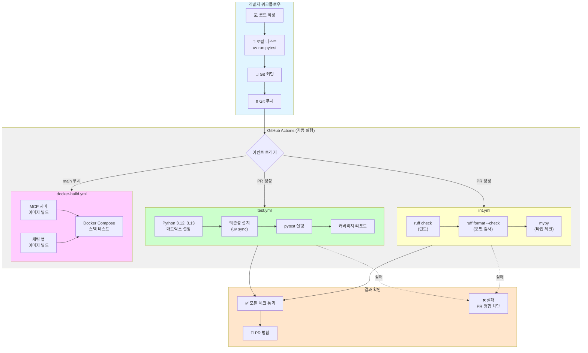
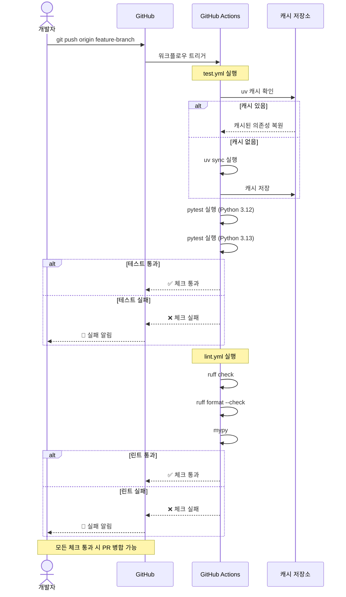

# CI/CD 파이프라인

GitHub Actions를 사용한 자동 테스트 및 빌드 파이프라인입니다.

## 개요

### 무엇을 하나요?

**코드를 푸시하면 자동으로 테스트, 린트, 빌드를 실행**하는 파이프라인을 만듭니다.



### 왜 CI/CD가 필요한가요?

| 문제 (수동 작업) | 해결 (CI/CD 자동화) |
|------------------|---------------------|
| ❌ 테스트 깜빡하고 안 돌림 | ✅ 푸시할 때마다 자동 실행 |
| ❌ Python 버전별 테스트 번거로움 | ✅ 매트릭스로 3.12, 3.13 동시 테스트 |
| ❌ 코드 스타일 불일치 | ✅ ruff, mypy 자동 검사 |
| ❌ Docker 이미지 수동 빌드 | ✅ 자동 빌드 및 태깅 |
| ❌ 버그가 프로덕션에 배포됨 | ✅ 테스트 실패 시 머지 차단 |

### 만드는 것

**3개의 GitHub Actions 워크플로우**



### 워크플로우 구성

| 워크플로우 | 파일 | 실행 조건 | 역할 |
|-----------|------|----------|------|
| **테스트** | `.github/workflows/test.yml` | PR, push to main | pytest, 커버리지 |
| **린트** | `.github/workflows/lint.yml` | PR, push to main | ruff, mypy |
| **Docker 빌드** | `.github/workflows/docker-build.yml` | PR, push to main | 이미지 빌드 |

### 실행 흐름 예시

```
1. 개발자: git push origin feature/add-calculator
   ↓
2. GitHub Actions 트리거
   ━━━━━━━━━━━━━━━━━━━━━━━━━━━━━━━━━━━━━━━━
   병렬 실행 (3개 워크플로우)
   ━━━━━━━━━━━━━━━━━━━━━━━━━━━━━━━━━━━━━━━━

   [test.yml]
   - Python 3.12 환경 설정
   - Python 3.13 환경 설정
   - uv sync 의존성 설치
   - pytest 실행
   - 커버리지 리포트 생성

   [lint.yml]
   - ruff check (린트)
   - ruff format --check (포맷)
   - mypy (타입 체크)

   [docker-build.yml]
   - Dockerfile.chat 빌드
   - docker-compose up --build
   - 헬스체크

   ↓
3. 결과 확인
   - ✅ 모든 체크 통과 → PR 머지 가능
   - ❌ 하나라도 실패 → PR 머지 차단
```

### GitHub Actions 뱃지

README에 추가할 수 있는 상태 뱃지:

```markdown


```

---

## CI/CD 파이프라인 개요

### 전체 워크플로우



### 각 워크플로우 상세



---

## 워크플로우

### 1. test.yml - 자동 테스트
```yaml
# PR 및 main push 시 자동 실행
- pytest 테스트
- Python 3.12, 3.13 매트릭스
- 커버리지 리포트
```

### 2. lint.yml - 코드 품질
```yaml
# PR 시 자동 실행
- ruff 린트
- ruff 포맷 검사
- mypy 타입 체크
```

### 3. docker-build.yml - Docker 이미지
```yaml
# main push 시 실행
- 채팅 앱 이미지 빌드
- 태그 생성
- (선택사항) 레지스트리 푸시
```

## 로컬 테스트

GitHub Actions 실행 전 로컬에서 테스트:

```bash
# pytest
uv run pytest 04-testing-deployment -v

# ruff
uv run ruff check .
uv run ruff format --check .

# mypy
uv run mypy 04-testing-deployment

# Docker 빌드
cd 04-testing-deployment/03-docker-deployment
docker-compose build
```

## 워크플로우 파일 위치

```
.github/workflows/
├── test.yml          # 자동 테스트
├── lint.yml          # 린트 및 타입 체크
└── docker-build.yml  # Docker 이미지 빌드
```

## 실행 결과 확인

GitHub 리포지토리의 "Actions" 탭에서 확인:
- https://github.com/your-username/your-repo/actions

## 참고

- [GitHub Actions 문서](https://docs.github.com/actions)
- [uv in CI](https://docs.astral.sh/uv/guides/integration/github/)
