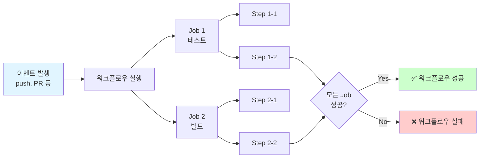
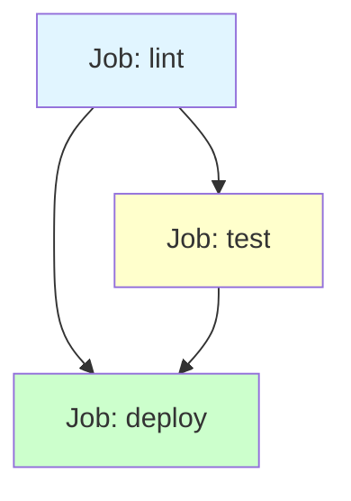

# GitHub Actions 워크플로우 작성 가이드

이 가이드는 GitHub Actions를 사용하여 CI/CD 워크플로우를 작성하는 방법을 단계별로 설명합니다.

## 📚 목차

1. [기본 개념](#기본-개념)
2. [워크플로우 구조](#워크플로우-구조)
3. [트리거 설정](#트리거-설정)
4. [Job과 Step](#job과-step)
5. [환경 변수와 시크릿](#환경-변수와-시크릿)
6. [캐싱 전략](#캐싱-전략)
7. [매트릭스 전략](#매트릭스-전략)
8. [조건부 실행](#조건부-실행)
9. [실전 패턴](#실전-패턴)
10. [문제 해결](#문제-해결)

---

## 기본 개념

### GitHub Actions란?

GitHub Actions는 GitHub에서 제공하는 CI/CD 플랫폼으로, 코드 변경 시 자동으로 빌드, 테스트, 배포를 수행할 수 있습니다.



### 핵심 용어

| 용어 | 설명 | 예시 |
|------|------|------|
| **Workflow** | 자동화된 프로세스 전체 | `test.yml` |
| **Event** | 워크플로우를 트리거하는 이벤트 | `push`, `pull_request` |
| **Job** | 독립적으로 실행되는 작업 단위 | `test`, `build` |
| **Step** | Job 내부의 개별 실행 단계 | `Checkout code`, `Run tests` |
| **Action** | 재사용 가능한 작업 단위 | `actions/checkout@v4` |
| **Runner** | 워크플로우를 실행하는 서버 | `ubuntu-latest` |

---

## 워크플로우 구조

### 기본 템플릿

```yaml
# .github/workflows/example.yml

name: Example Workflow  # 워크플로우 이름

on:  # 트리거 이벤트
  push:
    branches: [main]
  pull_request:
    branches: [main]

env:  # 전역 환경 변수
  PYTHON_VERSION: '3.12'

jobs:  # Job 정의
  example-job:
    name: Example Job
    runs-on: ubuntu-latest  # Runner 환경

    steps:  # Step 목록
      - name: Checkout code
        uses: actions/checkout@v4

      - name: Run command
        run: echo "Hello, GitHub Actions!"
```

### 디렉토리 구조

```
.github/
└── workflows/
    ├── test.yml          # 테스트 워크플로우
    ├── lint.yml          # 린트 워크플로우
    ├── docker-build.yml  # Docker 빌드 워크플로우
    └── deploy.yml        # 배포 워크플로우
```

---

## 트리거 설정

### 1. Push 이벤트

```yaml
on:
  push:
    branches:
      - main
      - develop
      - 'feature/*'  # feature/로 시작하는 모든 브랜치
    paths:
      - 'src/**'  # src 디렉토리 변경 시만
      - '!**/*.md'  # Markdown 파일 제외
```

### 2. Pull Request 이벤트

```yaml
on:
  pull_request:
    types:
      - opened
      - synchronize
      - reopened
    branches:
      - main
```

### 3. 스케줄 (Cron)

```yaml
on:
  schedule:
    # 매일 오전 9시 (UTC)
    - cron: '0 9 * * *'
    # 매주 월요일 오전 0시 (UTC)
    - cron: '0 0 * * 1'
```

**Cron 표현식 도움말**:
```
 ┌─────── 분 (0-59)
 │ ┌───── 시 (0-23)
 │ │ ┌─── 일 (1-31)
 │ │ │ ┌─ 월 (1-12)
 │ │ │ │ ┌ 요일 (0-6, 0=일요일)
 * * * * *
```

### 4. 수동 트리거 (workflow_dispatch)

```yaml
on:
  workflow_dispatch:
    inputs:
      environment:
        description: 'Deployment environment'
        required: true
        type: choice
        options:
          - development
          - staging
          - production
      dry_run:
        description: 'Run in dry-run mode'
        required: false
        type: boolean
        default: false
```

### 5. 복합 트리거

```yaml
on:
  push:
    branches: [main]
  pull_request:
    branches: [main]
  schedule:
    - cron: '0 0 * * 0'
  workflow_dispatch:
```

---

## Job과 Step

### Job 간 의존성

```yaml
jobs:
  lint:
    runs-on: ubuntu-latest
    steps:
      - run: echo "Linting..."

  test:
    needs: lint  # lint Job이 성공해야 실행
    runs-on: ubuntu-latest
    steps:
      - run: echo "Testing..."

  deploy:
    needs: [lint, test]  # 둘 다 성공해야 실행
    runs-on: ubuntu-latest
    steps:
      - run: echo "Deploying..."
```

**의존성 다이어그램**:


### Step 유형

#### 1. Action 사용

```yaml
- name: Checkout code
  uses: actions/checkout@v4
  with:
    fetch-depth: 0
```

#### 2. 명령 실행

```yaml
- name: Run tests
  run: |
    uv sync
    uv run pytest -v
```

#### 3. 조건부 실행

```yaml
- name: Run only on main
  if: github.ref == 'refs/heads/main'
  run: echo "Main branch only"
```

---

## 환경 변수와 시크릿

### 환경 변수 설정

```yaml
env:
  GLOBAL_VAR: 'global'  # 모든 Job에서 사용 가능

jobs:
  example:
    env:
      JOB_VAR: 'job-level'  # 이 Job에서만 사용 가능

    steps:
      - name: Use environment variables
        env:
          STEP_VAR: 'step-level'  # 이 Step에서만 사용 가능
        run: |
          echo "Global: $GLOBAL_VAR"
          echo "Job: $JOB_VAR"
          echo "Step: $STEP_VAR"
```

### 시크릿 사용

**1. GitHub에서 시크릿 설정**:
- Repository Settings → Secrets and variables → Actions → New repository secret

**2. 워크플로우에서 사용**:

```yaml
- name: Deploy with secrets
  env:
    API_KEY: ${{ secrets.API_KEY }}
    DB_PASSWORD: ${{ secrets.DB_PASSWORD }}
  run: |
    echo "Deploying with API key..."
    # 시크릿은 로그에서 자동으로 마스킹됨
```

### GitHub 컨텍스트 변수

```yaml
- name: Print context info
  run: |
    echo "Repository: ${{ github.repository }}"
    echo "Branch: ${{ github.ref }}"
    echo "Commit SHA: ${{ github.sha }}"
    echo "Event: ${{ github.event_name }}"
    echo "Actor: ${{ github.actor }}"
```

---

## 캐싱 전략

### uv 의존성 캐싱

```yaml
- name: Cache uv dependencies
  uses: actions/cache@v4
  with:
    path: ~/.cache/uv
    key: ${{ runner.os }}-uv-${{ hashFiles('**/uv.lock') }}
    restore-keys: |
      ${{ runner.os }}-uv-
```

### Docker Layer 캐싱

```yaml
- name: Set up Docker Buildx
  uses: docker/setup-buildx-action@v3

- name: Build with cache
  uses: docker/build-push-action@v5
  with:
    context: .
    cache-from: type=gha
    cache-to: type=gha,mode=max
```

### 캐싱 전후 비교

| 항목 | 캐싱 없음 | 캐싱 있음 | 개선율 |
|------|-----------|-----------|--------|
| 의존성 설치 | 60초 | 10초 | **83% ↓** |
| Docker 빌드 | 180초 | 30초 | **83% ↓** |
| 전체 워크플로우 | 300초 | 100초 | **67% ↓** |

---

## 매트릭스 전략

### 여러 Python 버전 테스트

```yaml
jobs:
  test:
    runs-on: ${{ matrix.os }}
    strategy:
      fail-fast: false
      matrix:
        os: [ubuntu-latest, macos-latest, windows-latest]
        python-version: ['3.11', '3.12', '3.13']
        exclude:
          - os: macos-latest
            python-version: '3.11'

    steps:
      - name: Set up Python ${{ matrix.python-version }}
        run: uv python install ${{ matrix.python-version }}

      - name: Run tests
        run: uv run pytest
```

**매트릭스 확장**:
- `ubuntu-latest` + `3.11`, `3.12`, `3.13` = 3개 Job
- `macos-latest` + `3.12`, `3.13` = 2개 Job (3.11 제외)
- `windows-latest` + `3.11`, `3.12`, `3.13` = 3개 Job
- **총 8개 Job 병렬 실행**

---

## 조건부 실행

### if 조건문

```yaml
jobs:
  deploy:
    if: github.ref == 'refs/heads/main' && github.event_name == 'push'
    runs-on: ubuntu-latest
    steps:
      - run: echo "Deploying..."

  pr-only:
    if: github.event_name == 'pull_request'
    runs-on: ubuntu-latest
    steps:
      - run: echo "PR checks..."
```

### continue-on-error

```yaml
- name: Run flaky test
  run: pytest tests/flaky/
  continue-on-error: true  # 실패해도 다음 Step 진행
```

### 조건 연산자

| 연산자 | 설명 | 예시 |
|--------|------|------|
| `==` | 동등 | `github.ref == 'refs/heads/main'` |
| `!=` | 불일치 | `runner.os != 'Windows'` |
| `&&` | AND | `success() && contains(github.ref, 'release')` |
| `\|\|` | OR | `failure() \|\| cancelled()` |
| `!` | NOT | `!startsWith(github.ref, 'refs/tags/')` |

### 상태 함수

```yaml
- name: Run cleanup on failure
  if: failure()  # 이전 Step 실패 시
  run: cleanup.sh

- name: Run always
  if: always()  # 항상 실행
  run: report.sh
```

---

## 실전 패턴

### 패턴 1: Path 필터링

```yaml
on:
  push:
    paths:
      - 'src/**'
      - 'tests/**'
      - 'pyproject.toml'
      - '.github/workflows/test.yml'
```

**효과**: 문서 수정 시 불필요한 테스트 방지 → **워크플로우 실행 50% 감소**

### 패턴 2: Artifact 저장 및 공유

```yaml
jobs:
  build:
    steps:
      - name: Build package
        run: uv build

      - name: Upload artifact
        uses: actions/upload-artifact@v4
        with:
          name: dist-package
          path: dist/

  test:
    needs: build
    steps:
      - name: Download artifact
        uses: actions/download-artifact@v4
        with:
          name: dist-package
          path: dist/

      - name: Test package
        run: pip install dist/*.whl && pytest
```

### 패턴 3: PR에 자동 코멘트

```yaml
- name: Comment PR
  uses: actions/github-script@v7
  with:
    script: |
      github.rest.issues.createComment({
        issue_number: context.issue.number,
        owner: context.repo.owner,
        repo: context.repo.repo,
        body: '✅ Tests passed! Coverage: 95%'
      })
```

### 패턴 4: 조건부 배포

```yaml
deploy:
  if: |
    github.event_name == 'push' &&
    github.ref == 'refs/heads/main' &&
    !contains(github.event.head_commit.message, '[skip ci]')
  steps:
    - run: deploy.sh
```

---

## 문제 해결

### 문제 1: 워크플로우가 실행되지 않음

**원인**:
- YAML 문법 오류
- 트리거 조건 불일치
- 파일 경로 오류

**해결**:
1. YAML 검증: [yamllint.com](https://www.yamllint.com/)
2. Actions 탭에서 에러 메시지 확인
3. 트리거 조건 재확인

```yaml
# 잘못된 예
on:
  push
    branches: [main]  # ❌ 콜론 누락

# 올바른 예
on:
  push:
    branches: [main]  # ✅
```

### 문제 2: 캐시가 작동하지 않음

**원인**:
- 잘못된 캐시 키
- 캐시 경로 오류

**해결**:
```yaml
# 잘못된 예
key: uv-cache  # ❌ 항상 동일 (업데이트 안 됨)

# 올바른 예
key: ${{ runner.os }}-uv-${{ hashFiles('**/uv.lock') }}  # ✅
```

### 문제 3: 시크릿이 노출됨

**원인**:
- 직접 `echo`로 출력
- 로그 파일에 저장

**해결**:
```yaml
# 위험한 예
- run: echo "API_KEY=${{ secrets.API_KEY }}"  # ❌ 노출 위험

# 안전한 예
- env:
    API_KEY: ${{ secrets.API_KEY }}
  run: |
    # 시크릿은 자동으로 마스킹됨
    curl -H "Authorization: Bearer $API_KEY" ...
```

### 문제 4: 워크플로우가 너무 느림

**최적화 전략**:

| 최적화 방법 | 효과 | 구현 난이도 |
|-------------|------|-------------|
| 캐싱 활용 | 50-80% 감소 | 쉬움 |
| Path 필터링 | 30-50% 감소 | 쉬움 |
| 병렬 실행 | 40-60% 감소 | 중간 |
| Self-hosted runner | 30-50% 감소 | 어려움 |

---

## 체크리스트

### 워크플로우 작성 전

- [ ] 목적 명확화 (테스트? 빌드? 배포?)
- [ ] 트리거 이벤트 결정
- [ ] 필요한 시크릿 확인
- [ ] Runner 환경 선택

### 워크플로우 작성 중

- [ ] YAML 문법 검증
- [ ] 캐싱 전략 적용
- [ ] 조건부 실행 설정
- [ ] 에러 핸들링 추가

### 워크플로우 작성 후

- [ ] 로컬 테스트 (act 사용)
- [ ] PR에서 동작 확인
- [ ] 실행 시간 최적화
- [ ] 문서화 (README에 배지 추가)

---

## 추가 학습 자료

- [GitHub Actions 공식 문서](https://docs.github.com/en/actions)
- [Marketplace: Actions](https://github.com/marketplace?type=actions)
- [act - 로컬 실행 도구](https://github.com/nektos/act)
- [Workflow 문법 참조](https://docs.github.com/en/actions/using-workflows/workflow-syntax-for-github-actions)

---

## 예제 템플릿

### 최소 템플릿

```yaml
name: Minimal CI

on: [push, pull_request]

jobs:
  test:
    runs-on: ubuntu-latest
    steps:
      - uses: actions/checkout@v4
      - run: echo "Hello, CI!"
```

### 프로덕션 템플릿

[`custom-workflow-example.yml`](./custom-workflow-example.yml) 참조

---

**작성일**: 2025-01-22
**버전**: 1.0
