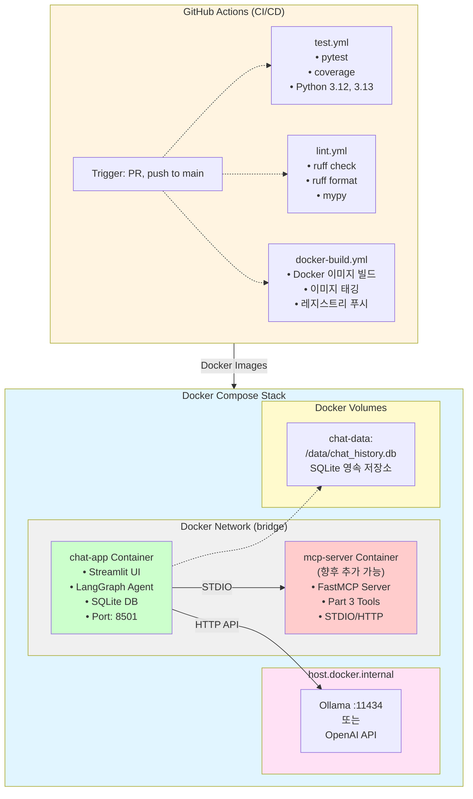
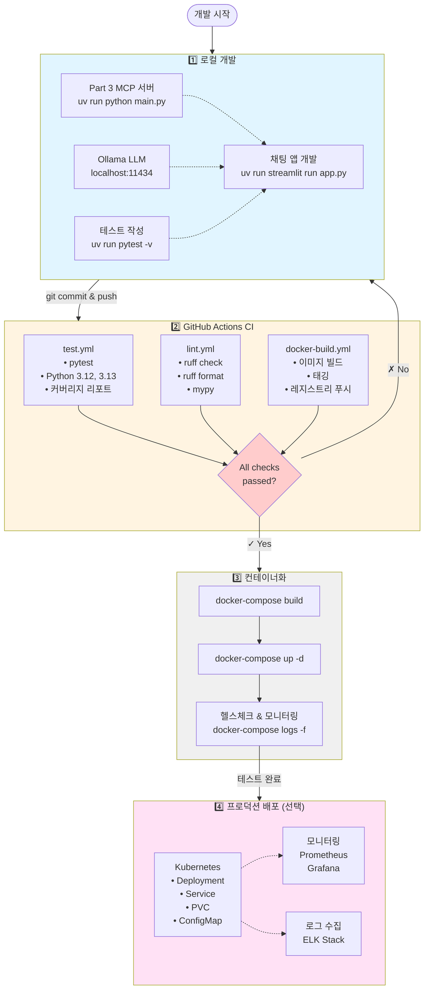
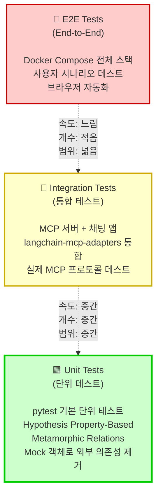

# Part 4: 테스트 및 배포

바이브코딩(Agentic AI 기반 개발)으로 생성된 코드를 검증하고 프로덕션 환경에 배포하는 전체 파이프라인을 학습합니다. AI-DLC (AI-Driven Development Life Cycle) 테스트 방법론부터 Docker 기반 배포, CI/CD 자동화까지 실전 개발 사이클을 경험합니다.

## 학습 시간

**총 2시간** (이론 40분 + 실습 80분)

## 선수 지식

- Part 3 (MCP 툴 구현) 완료 필수
- Python 기초 문법 및 비동기 프로그래밍
- Docker 기본 개념 (선택사항 - 실습 중 학습 가능)
- Git/GitHub 사용 경험

## 학습 목표

이 파트를 완료하면 다음 능력을 갖추게 됩니다:

- ✅ AI-DLC 테스트 방법론 이해 및 적용
  - TDD/BDD with AI, Metamorphic Testing, Property-Based Testing
  - LLM 생성 코드 검증 기법
- ✅ LangGraph와 MCP 통합 실습
  - Streamlit 기반 채팅 클라이언트 구현
  - langchain-mcp-adapters를 통한 MCP 서버 연동
- ✅ Docker 기반 멀티 컨테이너 배포
  - Dockerfile 작성 및 이미지 빌드
  - Docker Compose 오케스트레이션
- ✅ GitHub Actions CI/CD 자동화
  - 자동 테스트, 린트, Docker 이미지 빌드

## 파트 구성

| 예제 | 주제 | 시간 | 난이도 |
|------|------|------|--------|
| [01-ai-dlc-testing](./01-ai-dlc-testing/) | AI-DLC 테스트 방법론 | 40분 | ⭐⭐ |
| [02-mcp-chat-client](./02-mcp-chat-client/) | Streamlit + LangGraph 채팅 앱 | 50분 | ⭐⭐⭐ |
| [03-docker-deployment](./03-docker-deployment/) | Docker 컨테이너화 및 Compose | 20분 | ⭐⭐ |
| [04-ci-cd-pipeline](./04-ci-cd-pipeline/) | GitHub Actions 워크플로우 | 10분 | ⭐ |

---

## 전체 아키텍처

### 프로덕션 스택 구성도

Part 4에서 구축하는 전체 시스템의 구조는 다음과 같습니다:



### 개발 워크플로우 (로컬 → 프로덕션)



### AI-DLC 테스트 피라미드



**테스트 계층별 특성:**

| 계층 | 속도 | 개수 | 범위 | 실행 시기 |
|------|------|------|------|-----------|
| **Unit Tests** | 🟢 빠름 (초 단위) | 🟢 많음 (100+) | 🔴 좁음 (함수/클래스) | 로컬 개발, CI 매 커밋 |
| **Integration Tests** | 🟡 중간 (분 단위) | 🟡 중간 (20-30) | 🟡 중간 (모듈 간) | CI PR 시 |
| **E2E Tests** | 🔴 느림 (분-시간) | 🔴 적음 (5-10) | 🟢 넓음 (전체 시스템) | CI main push, 배포 전 |

### 주요 컴포넌트

1. **AI-DLC 테스트 (01)**
   - TDD/BDD with AI
   - Metamorphic Testing (LLM 출력 일관성 검증)
   - Property-Based Testing (불변 속성 자동 테스트)
   - Part 3 MCP 서버 테스트 예제

2. **MCP 채팅 클라이언트 (02)**
   - Streamlit 기반 채팅 UI
   - LangGraph ReAct 에이전트
   - langchain-mcp-adapters로 Part 3 MCP 서버 연동
   - SQLite 대화 기록 저장

3. **Docker 배포 (03)**
   - MCP 서버 & 채팅 앱 Dockerfile
   - Docker Compose 멀티 컨테이너 스택
   - 네트워킹 & 볼륨 관리

4. **CI/CD (04)**
   - GitHub Actions 워크플로우
   - 자동 테스트 & 린트
   - Docker 이미지 빌드

---

## 빠른 시작 (Quick Start)

### 1. 의존성 설치

```bash
# Part 4 의존성 설치 (langgraph, streamlit, langchain-mcp-adapters 등)
uv sync --extra part4-testing

# 또는 전체 의존성 설치
uv sync --all-extras
```

### 2. 첫 번째 테스트 실행 (5분)

```bash
# Part 3 MCP 서버 테스트
cd 04-testing-deployment/01-ai-dlc-testing/examples/mcp-testing
uv run pytest -v

# 기대 결과: Part 3 서버들이 정상적으로 테스트되어야 합니다
```

### 3. 채팅 앱 실행 (10분)

```bash
# Ollama 로컬 실행 (무료)
# 1. Ollama 설치: https://ollama.com/
# 2. 모델 다운로드
ollama pull qwen2.5:3b

# 3. Part 3 MCP 서버 시작 (별도 터미널)
cd 03-mcp-tools/02-tools
uv run python main.py

# 4. 채팅 앱 시작 (새 터미널)
cd 04-testing-deployment/02-mcp-chat-client
export OPENAI_API_BASE=http://localhost:11434/v1
export OPENAI_API_KEY=ollama
uv run streamlit run app.py

# 브라우저에서 http://localhost:8501 열기
```

### 4. Docker Compose 실행 (선택사항)

```bash
cd 04-testing-deployment/03-docker-deployment
docker-compose up

# 브라우저에서 http://localhost:8501 열기
```

---

## 상세 학습 가이드

### 01-ai-dlc-testing: AI-DLC 테스트 방법론

AI가 생성한 코드를 어떻게 검증할 것인가? 전통적인 TDD/BDD부터 최신 Metamorphic Testing, Property-Based Testing까지 다룹니다.

**핵심 개념:**
- **TDD with AI**: Red-Green-Refactor 사이클을 AI 도구와 함께 적용
- **Metamorphic Testing**: 입력 변환 시 출력 관계 검증 (LLM 특화)
- **Property-Based Testing**: hypothesis로 불변 속성 자동 테스트
- **Self-Healing Tests**: UI 변화에 자동 적응 (보너스)
- **LLM-as-Judge**: AI로 코드 품질 평가 (보너스)

**실습 내용:**
- pytest 기반 테스트 작성
- Part 3 MCP 서버 통합 테스트
- Metamorphic Relations 정의 및 검증

📁 **[상세 가이드 바로가기](./01-ai-dlc-testing/)**

---

### 02-mcp-chat-client: Streamlit + LangGraph 채팅 앱

Part 3의 MCP 서버와 실제로 통신하는 채팅 애플리케이션을 구현합니다. LangGraph ReAct 에이전트가 MCP 도구를 호출하고, Streamlit UI로 대화를 표시합니다.

**핵심 기술:**
- **Streamlit**: Python 전용 웹 UI 프레임워크
- **LangGraph**: ReAct 에이전트 오케스트레이션
- **langchain-mcp-adapters**: MCP ↔ LangChain 통합
- **SQLite**: 대화 기록 영속화

**아키텍처:**
```
사용자 입력
    ↓
Streamlit UI (st.chat_message)
    ↓
LangGraph Agent (create_react_agent)
    ↓
langchain-mcp-adapters (load_mcp_tools)
    ↓
Part 3 MCP 서버 (STDIO/HTTP)
    ↓
계산기, 날씨, 파일시스템 등 도구 실행
```

**주요 기능:**
- 실시간 채팅 UI (메시지 히스토리 표시)
- OpenAI 호환 API 선택 (Ollama 무료 / OpenAI 유료)
- MCP 도구 자동 로드 및 호출
- SQLite 대화 기록 저장

📁 **[상세 가이드 바로가기](./02-mcp-chat-client/)**

---

### 03-docker-deployment: Docker 컨테이너화

로컬에서 실행 중인 MCP 서버와 채팅 앱을 Docker 컨테이너로 패키징하고, Docker Compose로 멀티 컨테이너 스택을 구성합니다.

**학습 내용:**
- **Dockerfile 작성**: uv 기반 Python 이미지 빌드
- **Docker Compose**: 서비스 정의, 네트워킹, 볼륨 마운트
- **환경변수 관리**: .env 파일로 설정 분리
- **헬스체크**: 컨테이너 상태 모니터링

**Docker Compose 스택:**
```yaml
services:
  mcp-server:    # Part 3 FastMCP 서버
  chat-app:      # Streamlit + LangGraph
  # SQLite는 볼륨으로 마운트 (컨테이너 재시작 시 데이터 유지)
```

**주요 명령어:**
```bash
docker-compose up      # 스택 시작
docker-compose down    # 스택 중지
docker-compose logs -f # 로그 실시간 확인
```

📁 **[상세 가이드 바로가기](./03-docker-deployment/)**

---

### 04-ci-cd-pipeline: GitHub Actions

코드를 GitHub에 push하면 자동으로 테스트, 린트, Docker 이미지 빌드가 실행되도록 CI/CD 파이프라인을 구성합니다.

**워크플로우:**
1. **test.yml**: pytest 자동 실행 (Python 3.12, 3.13 매트릭스)
2. **lint.yml**: ruff, mypy 코드 품질 검증
3. **docker-build.yml**: Docker 이미지 빌드 및 태깅

**주요 기능:**
- PR 생성 시 자동 테스트
- main 브랜치 push 시 전체 파이프라인 실행
- uv 캐싱으로 빌드 시간 단축
- Docker layer 캐싱 최적화

📁 **[상세 가이드 바로가기](./04-ci-cd-pipeline/)**

---

## 실습 환경 설정

### 필수 요구사항

| 항목 | 버전 | 설치 방법 |
|------|------|-----------|
| **Python** | 3.12+ | [python.org](https://www.python.org/) |
| **uv** | 최신 | `curl -LsSf https://astral.sh/uv/install.sh \| sh` |
| **Docker** | 최신 | [docker.com](https://www.docker.com/get-started) (선택사항) |
| **Ollama** | 최신 | [ollama.com](https://ollama.com/) (무료 LLM) |

### OpenAI 호환 API 선택

Part 4 채팅 앱은 OpenAI 호환 API를 사용합니다. 두 가지 옵션 중 선택할 수 있습니다:

#### 옵션 1: Ollama (무료, 로컬 실행)

```bash
# 1. Ollama 설치
curl -fsSL https://ollama.com/install.sh | sh

# 2. 모델 다운로드 (3B 파라미터, 빠르고 가벼움)
ollama pull qwen2.5:3b

# 3. 환경변수 설정
export OPENAI_API_BASE=http://localhost:11434/v1
export OPENAI_API_KEY=ollama
```

**장점**: 완전 무료, 인터넷 불필요, 개인정보 보호
**단점**: 성능이 OpenAI보다 낮음, GPU 권장

#### 옵션 2: OpenAI (유료, 클라우드)

```bash
# 1. OpenAI API 키 발급 (https://platform.openai.com/)

# 2. 환경변수 설정
export OPENAI_API_BASE=https://api.openai.com/v1
export OPENAI_API_KEY=sk-proj-...  # 실제 키로 대체
```

**장점**: 고품질 응답, 빠른 속도
**단점**: 비용 발생 (~$0.01/1K tokens)

---

## 학습 순서

### 권장 경로 (2시간)

```
01-ai-dlc-testing (40분)
    → pytest 기본 사용법
    → Metamorphic Testing 실습
    → Part 3 MCP 서버 테스트

02-mcp-chat-client (50분)
    → Streamlit 채팅 UI 구조 이해
    → LangGraph 에이전트 구현
    → langchain-mcp-adapters 통합
    → 로컬 실행 및 테스트

03-docker-deployment (20분)
    → Dockerfile 작성
    → Docker Compose 설정
    → 로컬 스택 실행

04-ci-cd-pipeline (10분)
    → GitHub Actions 워크플로우 설정
    → 자동 테스트 확인
```

### 시간이 부족한 경우 (1시간)

**핵심만 빠르게:**
1. 01-ai-dlc-testing - TDD 예제만 (15분)
2. 02-mcp-chat-client - 빠른 시작 가이드 (30분)
3. 03-docker-deployment - Docker Compose 실행만 (10분)
4. 04-ci-cd-pipeline - README 읽기만 (5분)

---

## 문제 해결

### 자주 발생하는 문제

**Q1: Ollama 연결 오류 (`Connection refused`)**
```bash
# Ollama 서버가 실행 중인지 확인
ollama serve

# 다른 터미널에서 테스트
curl http://localhost:11434/api/tags
```

**Q2: MCP 서버 찾을 수 없음**
```bash
# Part 3 서버가 실행 중인지 확인
cd 03-mcp-tools/02-tools
uv run python main.py

# 채팅 앱에서 MCP 서버 경로 확인
# 02-mcp-chat-client/mcp_servers/server_config.json
```

**Q3: Docker Compose 네트워크 오류**
```bash
# 기존 컨테이너 정리
docker-compose down -v

# 다시 시작
docker-compose up --build
```

**Q4: pytest 테스트 실패**
```bash
# Part 3 의존성 확인
cd 03-mcp-tools
uv run pytest -v

# Part 4 테스트만 실행
cd 04-testing-deployment/01-ai-dlc-testing
uv run pytest -v
```

**Q5: Streamlit 포트 충돌 (8501)**
```bash
# 다른 포트로 실행
uv run streamlit run app.py --server.port 8502
```

---

## 추가 자료

### 공식 문서
- [AWS AI-DLC](https://aws.amazon.com/blogs/devops/ai-driven-development-life-cycle/) - AI 중심 개발 생명주기
- [LangGraph Docs](https://langchain-ai.github.io/langgraph/) - LangGraph 공식 문서
- [langchain-mcp-adapters](https://github.com/langchain-ai/langchain-mcp-adapters) - MCP 어댑터
- [Streamlit Docs](https://docs.streamlit.io/) - Streamlit 공식 문서
- [Docker Docs](https://docs.docker.com/) - Docker 문서
- [GitHub Actions](https://docs.github.com/actions) - CI/CD 문서

### 테스트 방법론 참고 자료
- [AI-Powered TDD 2025](https://www.nopaccelerate.com/test-driven-development-guide-2025/)
- [Metamorphic Testing for LLMs](https://arxiv.org/abs/2406.06864)
- [Vibe Coding vs Agentic Coding](https://arxiv.org/html/2505.19443v1)
- [LLM Testing Methods](https://www.confident-ai.com/blog/llm-testing-in-2024-top-methods-and-strategies)

---

## 다음 단계

Part 4를 완료했다면:

- **Part 5: A2A 에이전트** - Agent-to-Agent 통신 및 mem0 메모리 시스템
- **프로젝트 확장**: 자신만의 MCP 서버 개발 및 배포
- **프로덕션 배포**: AWS, GCP, Azure로 실제 서비스 런칭

---

**Happy Testing & Deploying!** 🚀

문의사항이나 피드백은 언제든지 환영합니다!
