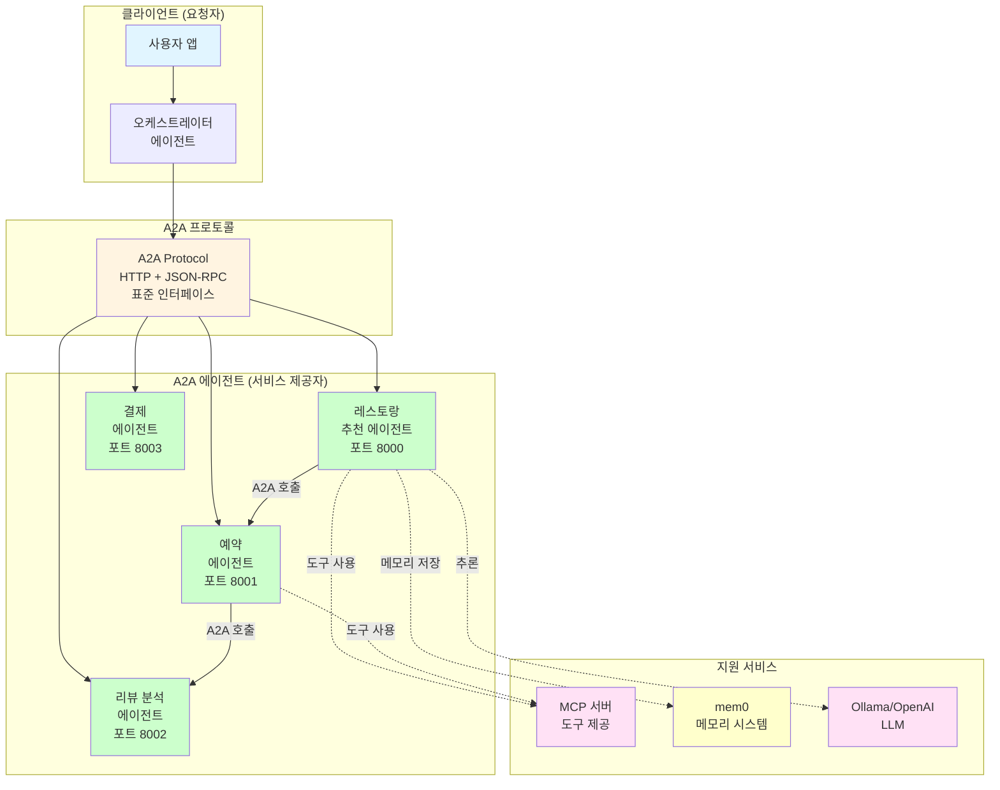
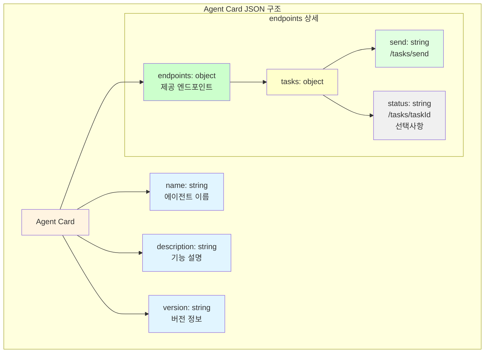
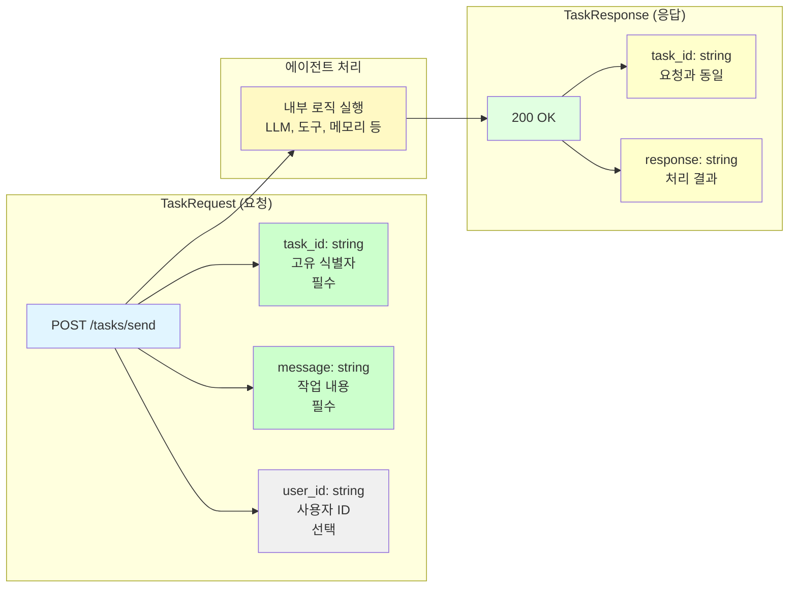
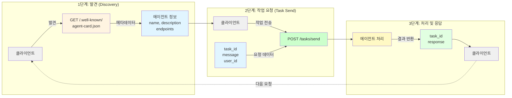
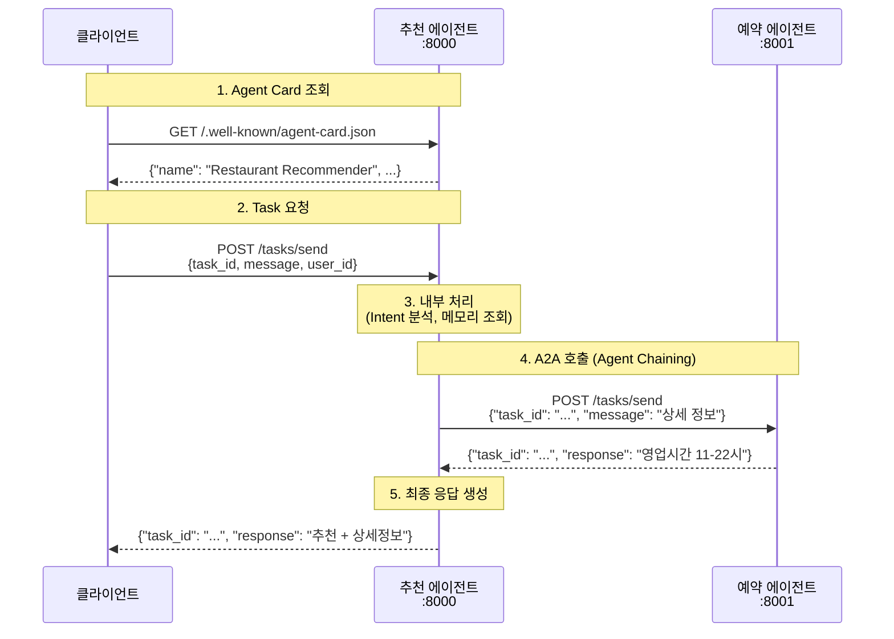
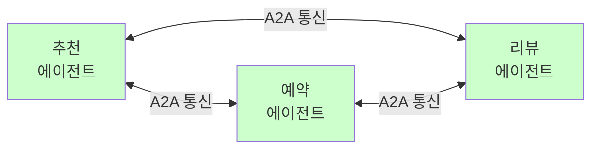
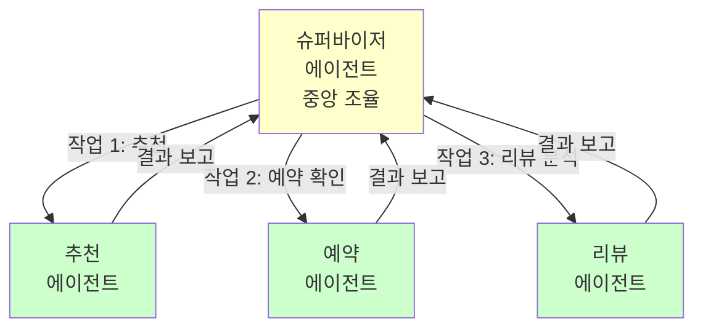
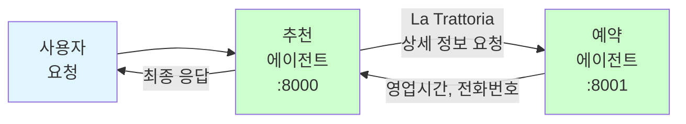
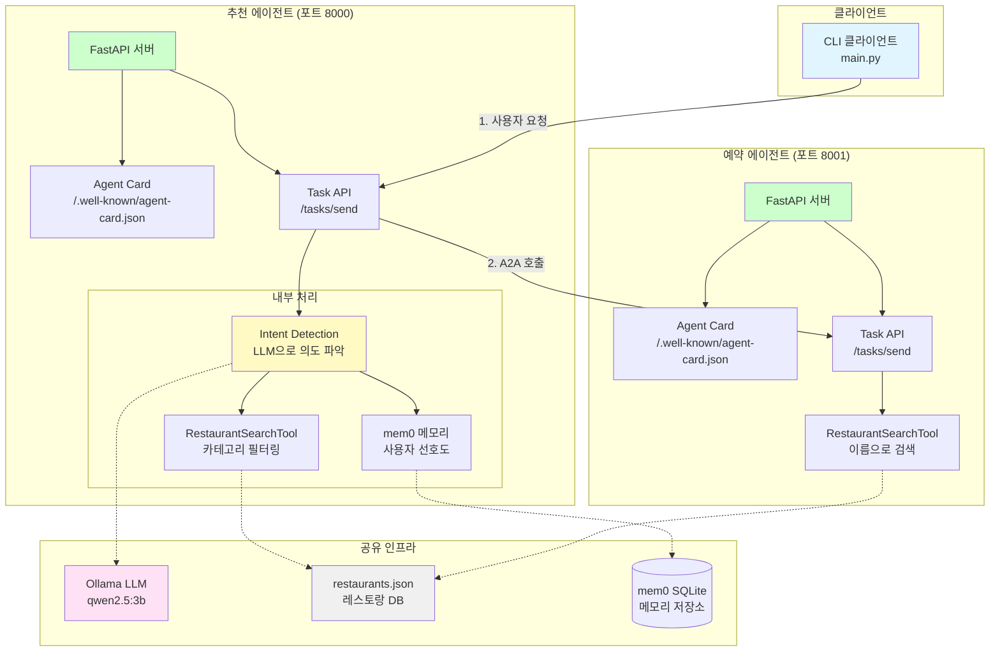
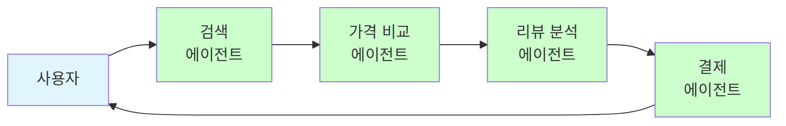

# Part 5-1: A2A 아키텍처 개요

## A2A 프로토콜 소개

### A2A란?

**A2A(Agent2Agent Protocol)**는 서로 다른 벤더와 프레임워크로 구축된 AI 에이전트들이 안전하고 표준화된 방법으로 협력할 수 있도록 하는 오픈 소스 프로토콜입니다.

#### 탄생 배경

**개발사**: [Google](https://www.google.com/) → [Linux Foundation](https://www.linuxfoundation.org/)
**공개일**: 2025년 4월 9일 (Google 발표) → 2025년 6월 (Linux Foundation 이관)
**목적**: 대규모 다중 에이전트 시스템 배포에서 식별된 에이전트 간 상호운용성 문제 해결

#### 왜 만들어졌나요?

A2A는 AI 에이전트 생태계의 근본적인 문제를 해결하기 위해 탄생했습니다. 아래 표는 A2A 도입 전후의 차이를 보여줍니다.

| 구분 | A2A 이전 (❌ 문제점) | A2A 이후 (✅ 해결책) |
|------|-------------------|------------------|
| **상호운용성** | 각 벤더마다 다른 통신 방식<br/>→ 에이전트 간 협력 불가능 | 단일 표준 프로토콜<br/>→ 모든 에이전트가 동일한 방식으로 통신 |
| **확장성** | 새 에이전트 추가 시 커스텀 통합 필요<br/>→ 개발 비용 증가 | 표준 프로토콜 준수만으로 통합<br/>→ 개발 비용 절감 |
| **보안** | 에이전트별 보안 구현<br/>→ 일관성 없는 보안 수준 | 프로토콜 수준의 보안 기능<br/>→ 표준화된 보안 |
| **멀티모달** | 텍스트 중심 통신<br/>→ 제한된 데이터 교환 | 텍스트, 오디오, 비디오 지원<br/>→ 풍부한 데이터 교환 |
| **장기 작업** | 동기 요청-응답만 지원<br/>→ 짧은 작업만 가능 | 비동기 작업 지원<br/>→ 시간/일 단위 작업 가능 |

**핵심 메시지:**
A2A는 "AI 에이전트 협업"을 **Wi-Fi처럼 표준화**하여, 개발자가 한 번 만든 에이전트를 모든 시스템에서 사용할 수 있게 합니다.

#### A2A의 비전

> "A2A는 AI 에이전트를 위한 **범용 통신 표준**입니다.
> Wi-Fi가 무선 통신을 표준화했듯이, A2A는 에이전트 간 협력을 표준화합니다."

**산업 지원:**
- 50+ 기술 파트너 (Atlassian, Salesforce, SAP 등)
- Linux Foundation 주도 오픈 소스 프로젝트
- MCP와 함께 AI 에이전트 생태계의 양대 표준

#### A2A 생태계

A2A는 다양한 에이전트들이 표준화된 방식으로 협력할 수 있는 생태계를 만듭니다.



#### A2A의 5가지 설계 원칙

Google이 A2A를 설계할 때 따른 핵심 원칙입니다:

| 원칙 | 설명 | 구현 방법 |
|------|------|----------|
| **1. 에이전트 기능 활성화** | 에이전트가 자신의 역할과 능력을 명확히 선언 | Agent Card (에이전트 메타데이터) |
| **2. 기존 표준 기반** | 검증된 웹 표준 활용으로 학습 곡선 최소화 | HTTP, JSON-RPC, SSE (Server-Sent Events) |
| **3. 기본 보안 기능** | 프로토콜 수준에서 보안 보장 | 인증, 권한 부여, 데이터 암호화 |
| **4. 장기 실행 작업** | 몇 초에서 며칠까지 걸리는 작업 지원 | 비동기 Task API, 진행 상태 추적 |
| **5. 멀티모달 지원** | 텍스트 외 다양한 데이터 타입 지원 | 오디오, 비디오, 이미지 스트리밍 |

**본 워크샵에서는:**
- **원칙 1-2**를 집중 학습 (Agent Card, HTTP/JSON 기반 통신)
- **원칙 3-5**는 개념 소개 (실습은 간소화된 버전 사용)

#### A2A 프로토콜 핵심 구성 요소

A2A 프로토콜의 기술적 사양은 다음 두 가지 핵심 요소로 구성됩니다:

##### 1. Agent Card (`.well-known/agent-card.json`)

**역할**: 에이전트가 자신의 정체성, 능력, 엔드포인트를 선언하는 메타데이터 문서

**위치**: HTTP 서버의 표준 경로 (`/.well-known/agent-card.json`)

**Agent Card 구조**:



**필수 필드**:

| 필드 | 타입 | 설명 | 예시 |
|------|------|------|------|
| `name` | string | 에이전트 이름 | "Restaurant Recommender" |
| `description` | string | 에이전트 기능 설명 | "Recommends restaurants based on user preferences" |
| `version` | string | 에이전트 버전 | "1.0.0" |
| `endpoints` | object | 제공하는 API 엔드포인트 목록 | `{"tasks": {"send": "/tasks/send"}}` |

**실제 예시** (레스토랑 추천 에이전트):

```json
{
  "name": "Restaurant Recommender",
  "description": "Recommends restaurants based on user preferences using mem0 memory",
  "version": "1.0.0",
  "endpoints": {
    "tasks": {
      "send": "/tasks/send"
    }
  }
}
```

**클라이언트 사용 예시**:

```bash
# 추천 에이전트 정보 확인
curl http://localhost:8000/.well-known/agent-card.json

# 예약 에이전트 정보 확인
curl http://localhost:8001/.well-known/agent-card.json
```

##### 2. Task API (`/tasks/send`)

**역할**: 에이전트 간 작업 요청 및 응답을 처리하는 표준 엔드포인트

**HTTP 메서드**: `POST`

**Task API 요청/응답 구조**:



**⚠️ 워크샵 간소화 버전 안내**

> 아래 형식은 **Google A2A 공식 규격을 기반으로 교육용으로 간소화한 버전**입니다.
> 실제 A2A 프로토콜은 메타데이터, 컨텍스트, 권한 등 더 많은 필드를 지원합니다.
> 워크샵에서는 핵심 개념 학습에 집중하기 위해 최소한의 필드만 사용합니다.

**요청 형식** (`TaskRequest` - 워크샵 버전):

| 필드 | 타입 | 필수 | 설명 | 비고 |
|------|------|------|------|------|
| `task_id` | string | ✅ | 작업 고유 식별자 (UUID 권장) | 워크샵 필수 |
| `message` | string | ✅ | 작업 내용 (자연어 또는 구조화된 데이터) | 워크샵 필수 |
| `user_id` | string | ⚠️ | 사용자 식별자 (선택, 메모리 관리용) | 워크샵 선택 |

**A2A 공식 규격 추가 필드** (워크샵에서는 미사용):
- `context`: 작업 실행 컨텍스트 정보
- `metadata`: 추가 메타데이터
- `auth`: 인증/권한 정보
- `priority`: 작업 우선순위
- `timeout`: 타임아웃 설정

**응답 형식** (`TaskResponse` - 워크샵 버전):

| 필드 | 타입 | 설명 | 비고 |
|------|------|------|------|
| `task_id` | string | 요청과 동일한 작업 ID | 워크샵 필수 |
| `response` | string | 작업 처리 결과 | 워크샵 필수 |

**A2A 공식 규격 추가 필드** (워크샵에서는 미사용):
- `status`: 작업 상태 (`completed`, `in_progress`, `failed`)
- `result`: 구조화된 결과 데이터
- `error`: 오류 정보 (실패 시)
- `metadata`: 응답 메타데이터

**실제 예시** (A2A 호출):

```python
# 추천 에이전트 → 예약 에이전트 호출
import httpx

async def call_booking_agent(restaurant_name: str):
    async with httpx.AsyncClient() as client:
        response = await client.post(
            "http://localhost:8001/tasks/send",
            json={
                "task_id": "booking-123",
                "message": f"{restaurant_name} 상세 정보 알려줘",
                "user_id": "alice"
            }
        )
        data = response.json()
        return data["response"]
```

##### 3. A2A 통신 흐름

**전체 흐름 개요**:



**상세 시퀀스 다이어그램**:



##### 4. 프로토콜 규격 요약

| 요소 | 경로/메서드 | 목적 | 필수 여부 |
|------|------------|------|----------|
| **Agent Card** | `GET /.well-known/agent-card.json` | 에이전트 메타데이터 제공 | ✅ 필수 |
| **Task Send** | `POST /tasks/send` | 작업 수신 및 처리 | ✅ 필수 |
| **Task Status** | `GET /tasks/{task_id}` | 작업 상태 조회 (비동기) | ⚠️ 선택 (장기 작업용) |
| **Task Cancel** | `DELETE /tasks/{task_id}` | 작업 취소 | ⚠️ 선택 |

**본 워크샵에서는:**
- Agent Card + Task Send만 구현 (핵심 2개 엔드포인트)
- 간소화된 동기 작업 처리 (비동기 Task Status는 개념만 소개)

---

## A2A 아키텍처 패턴

### 에이전트 협업 패턴

A2A 시스템에서 에이전트들이 협업하는 방식은 크게 3가지 패턴으로 나뉩니다:

#### 1. Swarm 패턴 (평등한 협업)

**특징**: 모든 에이전트가 동등한 위치에서 필요 시 서로 호출



| 항목 | 설명 |
|------|------|
| **장점** | • 유연한 협업<br/>• 새 에이전트 추가 용이<br/>• 단일 실패 지점 없음 |
| **단점** | • 복잡한 흐름 추적 어려움<br/>• 무한 루프 위험<br/>• 디버깅 복잡 |
| **사용 예시** | OpenAI Swarm, 동적 협업 시스템 |

#### 2. Supervisor 패턴 (계층형)

**특징**: 중앙 조율 에이전트가 작업을 분배하고 결과를 통합



| 항목 | 설명 |
|------|------|
| **장점** | • 명확한 제어 흐름<br/>• 중앙 집중식 로깅<br/>• 예측 가능한 동작 |
| **단점** | • 슈퍼바이저가 병목<br/>• 단일 실패 지점<br/>• 확장성 제한 |
| **사용 예시** | LangGraph Supervisor, 복잡한 워크플로우 |

#### 3. Chaining 패턴 (순차 처리) ⭐

**특징**: 작업이 에이전트를 순차적으로 거치며 처리 (본 워크샵 사용)



| 항목 | 설명 |
|------|------|
| **장점** | • **단순하고 예측 가능** (초급자 적합)<br/>• 디버깅 용이<br/>• 선형적 흐름 |
| **단점** | • 유연성 낮음<br/>• 병렬 처리 어려움 |
| **사용 예시** | **본 워크샵 레스토랑 추천 시스템** |

**본 워크샵 선택 이유:**
- 초급 학습자에게 가장 이해하기 쉬움
- A2A 핵심 개념 (Agent Card, Task API)에 집중 가능
- 실습 시간 단축

### 워크샵 예제 상세 아키텍처

본 워크샵에서 구현하는 레스토랑 추천 시스템의 전체 구조입니다:



**핵심 플로우 설명:**

1. **사용자 요청 → 추천 에이전트**
   - CLI에서 "배고파" 메시지 전송
   - `POST localhost:8000/tasks/send`

2. **Intent Detection (LLM 사용)**
   - 사용자 메시지 분석
   - 의도 분류: `save_preference`, `recommend`, `book`

3. **메모리 조회 (mem0)**
   - 사용자 선호도 검색 (예: "이탈리안 좋아함")

4. **레스토랑 검색 (Tool)**
   - 카테고리로 필터링
   - 추천 리스트 생성

5. **A2A 호출 (추천 → 예약)**
   - 첫 번째 레스토랑 상세 정보 요청
   - `POST localhost:8001/tasks/send`

6. **최종 응답**
   - 추천 + 상세 정보 통합
   - 사용자에게 반환

### 실제 사용 사례

#### Google Purchasing Concierge

Google이 발표한 A2A 기반 쇼핑 도우미 시스템:



**에이전트 역할:**
- **검색 에이전트**: 상품 검색 및 필터링
- **가격 비교 에이전트**: 최저가 탐색
- **리뷰 분석 에이전트**: 상품 평가 종합
- **결제 에이전트**: 구매 처리

#### Tyson Foods (식품 생산 최적화)

생산 공정 최적화를 위한 멀티 에이전트 시스템:

| 에이전트 | 역할 | 데이터 소스 |
|---------|------|------------|
| **수요 예측 에이전트** | 시장 수요 분석 | 판매 데이터, 시장 트렌드 |
| **재고 관리 에이전트** | 원자재 재고 최적화 | 창고 데이터, 공급망 정보 |
| **생산 계획 에이전트** | 공정 스케줄링 | 수요 예측, 재고 현황 |
| **물류 에이전트** | 배송 최적화 | 생산 계획, 배송 경로 |

**효과:**
- 생산 효율 25% 향상
- 재고 비용 15% 절감
- 납기 준수율 98% 달성

---

#### MCP vs A2A: 역할 구분

| 항목 | MCP (Model Context Protocol) | A2A (Agent2Agent Protocol) |
|------|----------------------------|---------------------------|
| **목적** | LLM과 도구/데이터 연결 | 에이전트 간 협력 |
| **개발사** | Anthropic | Google → Linux Foundation |
| **주요 기능** | 도구 제공, 리소스 접근 | 에이전트 간 작업 위임 및 협력 |
| **통신 대상** | LLM ↔ MCP 서버 | 에이전트 ↔ 에이전트 |
| **사용 예시** | "Claude가 파일을 읽고 날씨를 조회" | "추천 에이전트가 예약 에이전트에게 작업 위임" |
| **워크샵 파트** | Part 3: MCP 툴 구현 | Part 5: A2A 에이전트 |

**상호보완적 관계:**
- MCP: 에이전트가 **무엇을 할 수 있는지** (도구 제공)
- A2A: 에이전트가 **어떻게 협력하는지** (통신 규약)

---

## 학습 목표

이 섹션에서는 Agent-to-Agent (A2A) 통신의 핵심 개념과 구현 방법을 학습합니다.

- **A2A 개념 이해**: 여러 에이전트가 협업하여 복잡한 작업을 수행하는 방법
- **Google A2A 프로토콜 소개**: 산업 표준 A2A 프로토콜의 구조와 핵심 구성 요소
- **구현 방법 비교**: python-a2a, CrewAI, LangGraph, AutoGen의 장단점 비교
- **python-a2a 선택 이유**: 초급 학습자에게 가장 적합한 구현 방법 이해

## 학습 시간

약 10분

## 학습 순서

1. [**개념 문서**](concepts.md) - A2A의 정의, 필요성, 역할 분담 패턴
2. [**구현 방법 비교**](comparison.md) - python-a2a vs 다른 프레임워크

## 선수 지식

- Part 3: MCP 도구 서버 개념
- Python 기초 (FastAPI 경험 권장)
- HTTP REST API 기본 개념

## 다음 단계

개념을 이해한 후, [Part 5-2: mem0 메모리 시스템](../02-mem0-integration/)에서 에이전트 메모리 관리를 학습합니다.

## 참고 자료

### A2A 프로토콜 공식 문서
- [Announcing the Agent2Agent Protocol (A2A)](https://developers.googleblog.com/en/a2a-a-new-era-of-agent-interoperability/) - Google Developers Blog
- [Linux Foundation Launches the Agent2Agent Protocol Project](https://www.linuxfoundation.org/press/linux-foundation-launches-the-agent2agent-protocol-project-to-enable-secure-intelligent-communication-between-ai-agents)
- [A2A GitHub Repository](https://github.com/a2aproject/A2A) - 공식 프로토콜 사양

### A2A vs MCP 비교
- [A2A and MCP: Start of the AI Agent Protocol Wars?](https://www.koyeb.com/blog/a2a-and-mcp-start-of-the-ai-agent-protocol-wars) - Koyeb Blog

### 산업 동향
- [Agent2Agent protocol (A2A) is getting an upgrade](https://cloud.google.com/blog/products/ai-machine-learning/agent2agent-protocol-is-getting-an-upgrade) - Google Cloud Blog
- [Google Launches A2A Protocol](https://www.efficientlyconnected.com/google-announces-agent2agent-a2a-protocol-to-enable-secure-ai-agent-interoperability/)
