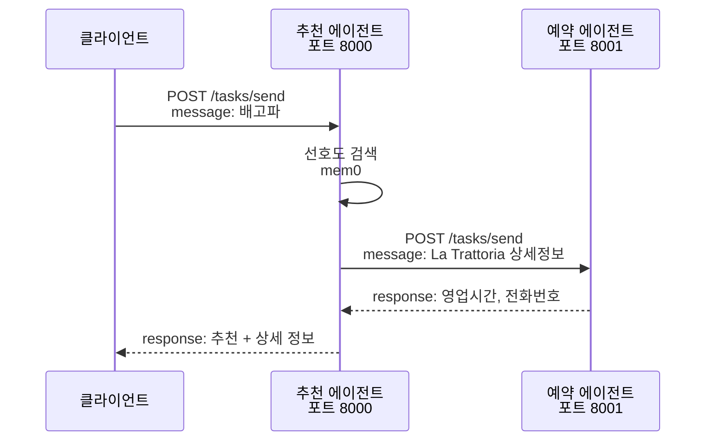
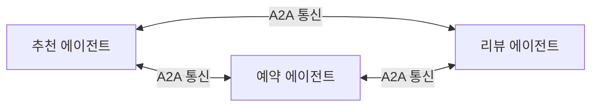
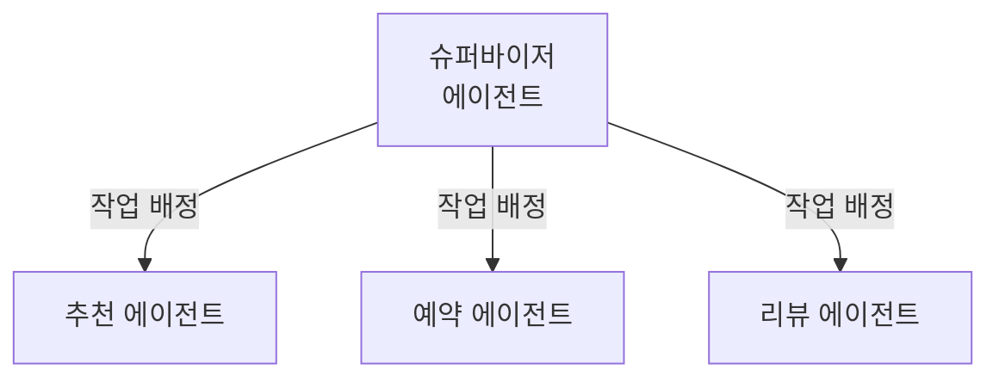
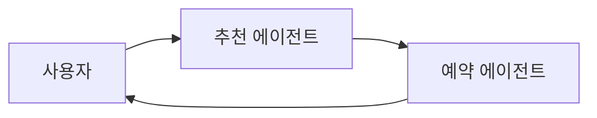

# A2A 개념: Agent-to-Agent 통신

## A2A란 무엇인가?

**Agent-to-Agent (A2A)** 통신은 여러 개의 AI 에이전트가 서로 협력하여 복잡한 작업을 수행하는 아키텍처 패턴입니다.

### 기존 방식 vs A2A

| 측면 | 단일 에이전트 | A2A 멀티 에이전트 |
|------|-------------|----------------|
| **작업 처리** | 하나의 에이전트가 모든 작업 수행 | 여러 에이전트가 역할 분담 |
| **복잡도** | 에이전트 로직이 복잡해짐 | 각 에이전트는 단순한 역할에 집중 |
| **확장성** | 새 기능 추가 시 전체 수정 필요 | 새 에이전트 추가로 확장 |
| **유지보수** | 모놀리식, 수정 영향 범위 큼 | 마이크로서비스, 독립적 수정 |
| **예시** | ChatGPT (하나의 모델) | Google Gemini 2.0 Flash Multimodal |

## 왜 A2A가 필요한가?

### 1. 전문화 (Specialization)

각 에이전트가 특정 도메인에 집중하여 더 나은 결과를 제공합니다.

**예시: 레스토랑 추천 시스템**
- **추천 에이전트**: 사용자 선호도 분석 및 레스토랑 추천에 집중
- **예약 에이전트**: 레스토랑 상세 정보 및 예약 처리에 집중

### 2. 확장성 (Scalability)

새로운 기능은 새로운 에이전트로 추가합니다.

**예시: 리뷰 분석 에이전트 추가**
```
기존 시스템: 추천 → 예약
확장 시스템: 추천 → 리뷰 분석 → 예약
```

### 3. 독립 개발 및 배포

각 에이전트는 독립적으로 개발, 테스트, 배포됩니다.

## A2A 통신 메커니즘

### HTTP 기반 통신 (FastAPI)

본 워크샵에서는 가장 간단한 HTTP REST API 방식을 사용합니다.



### 핵심 구성 요소

#### 1. Agent Card (에이전트 명함)

각 에이전트는 자신의 능력을 JSON으로 공개합니다.

```python
# GET http://localhost:8000/.well-known/agent-card.json
{
    "name": "Restaurant Recommender",
    "description": "Recommends restaurants based on user preferences",
    "version": "1.0.0",
    "endpoints": {
        "tasks": {
            "send": "/tasks/send"
        }
    }
}
```

#### 2. Task Send 엔드포인트

에이전트 간 작업 전달을 위한 표준 API입니다.

```python
# POST http://localhost:8000/tasks/send
# 요청
{
    "id": "task_123",
    "message": "배고파, 레스토랑 추천해줘",
    "user_id": "alice"
}

# 응답
{
    "task_id": "task_123",
    "response": "추천: La Trattoria, Pasta House (이탈리안)"
}
```

## 역할 분담 패턴

### 1. Swarm 패턴 (평등한 협업)

모든 에이전트가 동등한 위치에서 필요 시 서로 호출합니다.



**장점**: 유연한 협업, 새 에이전트 추가 용이
**단점**: 복잡한 흐름 추적 어려움

### 2. Supervisor 패턴 (계층형)

중앙 조율 에이전트가 작업을 분배합니다.



**장점**: 명확한 흐름, 중앙 제어
**단점**: 슈퍼바이저가 병목

### 3. Chaining 패턴 (순차 처리)

작업이 에이전트를 순차적으로 거칩니다.



**장점**: 단순하고 예측 가능
**단점**: 유연성 낮음

**본 워크샵에서는 Chaining 패턴을 사용합니다** (가장 간단함).

## 실제 사용 사례

### Google Purchasing Concierge

Google이 발표한 A2A 시스템으로, 여러 에이전트가 협력하여 쇼핑을 도와줍니다.

- **검색 에이전트**: 상품 검색
- **가격 비교 에이전트**: 최저가 탐색
- **리뷰 분석 에이전트**: 상품 평가
- **결제 에이전트**: 구매 처리

### Tyson Foods (식품 생산)

생산 공정 최적화를 위한 A2A 시스템:

- **수요 예측 에이전트**: 시장 수요 분석
- **재고 관리 에이전트**: 원자재 재고 최적화
- **생산 계획 에이전트**: 공정 스케줄링
- **물류 에이전트**: 배송 최적화

## 다음 단계

[구현 방법 비교 문서](comparison.md)에서 python-a2a, CrewAI, LangGraph, AutoGen의 차이점을 학습합니다.
