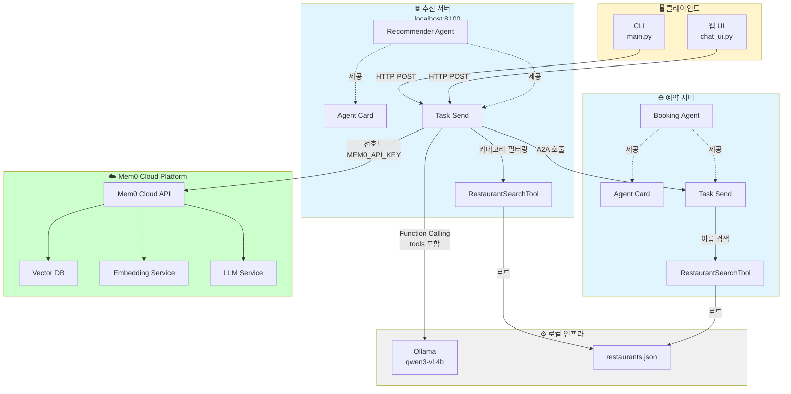
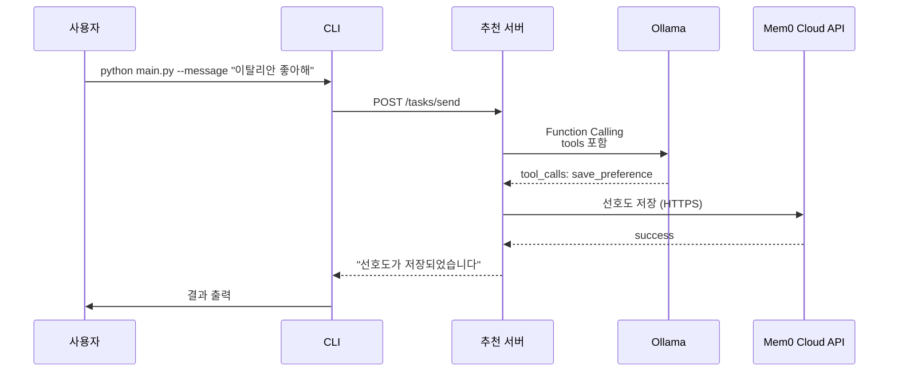
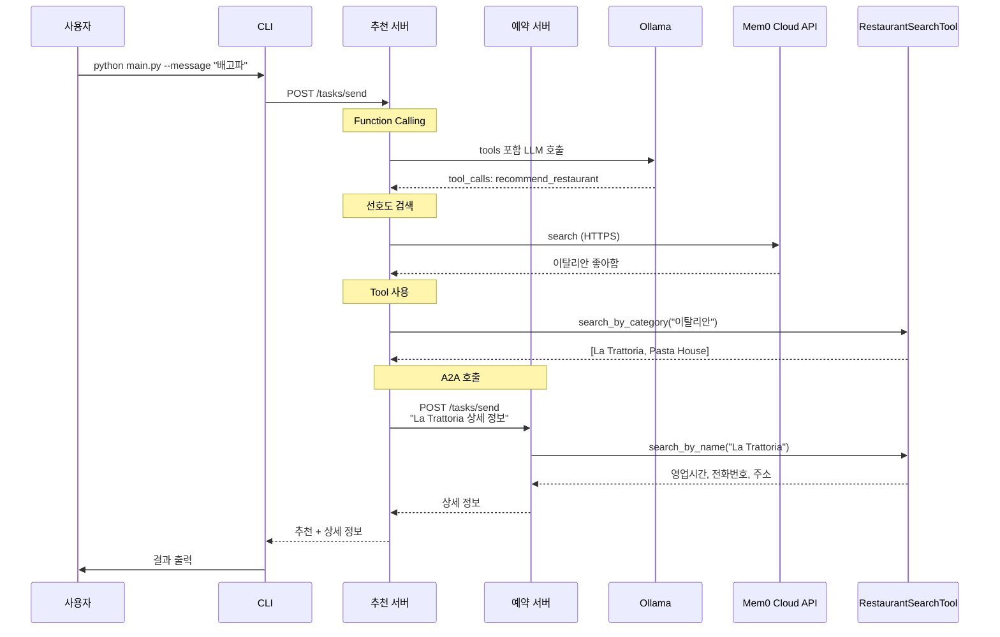
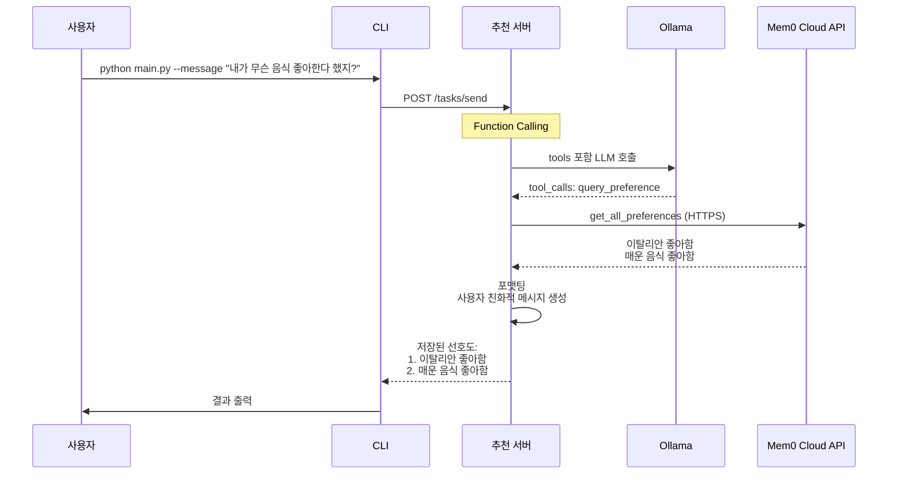

# Part 5-3: 레스토랑 추천 시스템 (A2A Agents)

## 시스템 소개

2개의 독립 FastAPI 서버가 HTTP 통신으로 협업하여 레스토랑 추천 및 예약 정보를 제공하는 A2A 시스템입니다.

### 주요 기능

- **추천 에이전트** (포트 8100): mem0 메모리 기반 개인화된 레스토랑 추천
- **예약 에이전트** (포트 8101): 레스토랑 상세 정보 제공 (영업시간, 전화번호, 주소)
- **Agent Chaining**: 추천 에이전트가 자동으로 예약 에이전트 호출 (A2A)
- **Function Calling**: LLM이 자동으로 적절한 함수 선택 (선호도 저장/조회, 추천, 예약)
- **웹 채팅 UI**: Streamlit 기반 실시간 채팅 인터페이스

## 아키텍처

### 시스템 구조



### 통신 흐름 (Agent Chaining)

#### 씬 1: 선호도 저장



#### 씬 2: 레스토랑 추천 (A2A Chaining)



#### 씬 3: 선호도 조회 (신규 기능)



### Function Calling 구조

추천 에이전트는 4개의 함수를 정의하고, LLM이 자동으로 적절한 함수를 선택합니다:

| 함수명 | 설명 | 파라미터 |
|--------|------|----------|
| `save_preference` | 선호도 저장 | `content`: 선호도 내용 |
| `query_preference` | 선호도 조회 | 없음 |
| `recommend_restaurant` | 레스토랑 추천 | 없음 |
| `get_booking_info` | 예약 정보 조회 | `query`: 질문 내용 |

**장점:**
- ✅ LLM이 자동으로 적절한 함수 선택
- ✅ 새 기능 추가 시 tool만 정의하면 됨
- ✅ 자연스러운 질문 처리 가능
- ✅ 확장성 및 유지보수 용이

## 빠른 시작

### 1. 사전 준비

#### 1.1 Mem0 Cloud API 키 발급 ⭐ 필수

mem0는 사용자 선호도를 저장하고 검색하는 메모리 시스템입니다.

```bash
# 1. API 키 발급 (무료 티어: 1000 메모리/월)
# 🔗 https://app.mem0.ai/ 에서 회원가입 및 API 키 생성 (1-2분 소요)

# 2. 환경 변수 설정
cp .env.example .env

# 3. .env 파일에 API 키 입력
# MEM0_API_KEY=m0-...
```

**Mem0 Cloud 장점:**
- ⚡ 즉시 사용 가능 (로컬 설치 불필요)
- ⚡ 빠른 벡터 검색 (<0.3초)
- 🔧 간단한 설정 (환경 변수 1개)
- 🌐 멀티유저 지원

#### 1.2 LLM 제공자 선택 (Function Calling용)

**옵션 A: Ollama (로컬, 무료)** ⭐ 권장

```bash
# Ollama 설치 (https://ollama.ai)
# macOS/Linux:
curl -fsSL https://ollama.ai/install.sh | sh

# 모델 다운로드
ollama pull qwen3-vl:4b       # Intent Detection LLM

# Ollama 서버 실행 (백그라운드)
ollama serve
```

**옵션 B: OpenAI API (클라우드, 유료)**

```bash
# 1. OpenAI API 키 발급 (https://platform.openai.com/api-keys)

# 2. .env 파일 수정:
# LLM_PROVIDER=openai
# OPENAI_API_KEY=sk-...
```

#### 1.3 의존성 설치

```bash
# 루트에서 한 번만 실행
uv sync
```

### 2. 서버 실행

#### 방법 1: 스크립트 사용 (권장)

```bash
cd 05-a2a-agents/03-restaurant-agent
./run_servers.sh
```

#### 방법 2: 수동 실행 (터미널 2개)

```bash
# 터미널 1: 추천 에이전트
cd 05-a2a-agents/03-restaurant-agent
uv run python agents/recommender_agent.py

# 터미널 2: 예약 에이전트
cd 05-a2a-agents/03-restaurant-agent
uv run python agents/booking_agent.py
```

### 3. Agent Card 확인

```bash
# 추천 에이전트 카드
curl http://localhost:8100/.well-known/agent-card.json

# 예약 에이전트 카드
curl http://localhost:8101/.well-known/agent-card.json
```

### 4. 클라이언트 실행 (옵션 선택)

#### 옵션 A: 웹 UI (권장) 🌐

```bash
# 새 터미널에서
cd 05-a2a-agents/03-restaurant-agent
uv run streamlit run chat_ui.py

# 브라우저에서 자동으로 열림 (http://localhost:8501)
```

**웹 UI 기능:**
- 💬 실시간 채팅 인터페이스
- 👤 사용자 ID 변경 가능
- 📊 서버 상태 실시간 확인
- 🗑️ 대화 초기화
- 📖 사용 가이드 제공

#### 옵션 B: CLI

```bash
# 새 터미널에서
cd 05-a2a-agents/03-restaurant-agent
export PYTHONPATH="$(pwd):$PYTHONPATH"

# 1단계: 선호도 저장
uv run python main.py --user-id alice --message "이탈리안 좋아해"

# 2단계: 레스토랑 추천 (A2A 호출 발생)
uv run python main.py --user-id alice --message "배고파"

# 대화형 모드
uv run python main.py --user-id alice
```

## 메모리 관리

### 웹 UI에서 관리

웹 UI의 "전체 메모리 보기" 버튼을 클릭하여 메모리 뷰어 페이지로 이동:
- 📋 저장된 모든 메모리 조회
- 🗑️ 개별 메모리 삭제
- 🗑️ 전체 메모리 초기화

### API로 관리

**1. 메모리 조회 (간단)**
```bash
curl http://localhost:8100/memories/alice
```

**2. 메모리 조회 (ID 포함)**
```bash
curl http://localhost:8100/memories/alice/details
```

**3. 특정 메모리 삭제**
```bash
curl -X DELETE http://localhost:8100/memories/alice/mem_001
```

**4. 전체 메모리 초기화**
```bash
curl -X DELETE http://localhost:8100/memories/alice
```

## 테스트 시나리오

### 시나리오 1: 선호도 저장 및 추천

```bash
# Alice의 선호도 저장
python main.py --user-id alice --message "이탈리안 음식을 좋아해"
# 출력: ✅ 선호도가 저장되었습니다.

# 추천 요청 (A2A Chaining 발생)
python main.py --user-id alice --message "배고파, 레스토랑 추천해줘"
# 출력:
# ✅ 선호도(이탈리안)를 기반으로 추천합니다:
# 1. La Trattoria
# 2. Pasta House
#
# La Trattoria 상세 정보:
# - 영업시간: 11:00-22:00
# - 전화번호: 02-1234-5678
# - 주소: 서울 강남구 논현동 123
```

### 시나리오 2: 다른 사용자

```bash
# Bob의 선호도 저장
python main.py --user-id bob --message "한식이 좋아"

# Bob의 추천
python main.py --user-id bob --message "점심 먹을 곳 추천해줘"
# 출력: 한식 레스토랑 추천 (Seoul Grill, Hanok Kitchen 등)
```

### 시나리오 3: 직접 예약 정보 요청

```bash
python main.py --user-id alice --message "La Trattoria 영업시간 알려줘"
# 출력: 예약 에이전트로 직접 전달 (A2A)
```

## 확장 가이드

### 3번째 에이전트 추가 (리뷰 분석 에이전트)

**1. 새 FastAPI 서버 작성**

```python
# agents/review_agent.py
from fastapi import FastAPI

app = FastAPI(title="Restaurant Review Agent")

@app.get("/.well-known/agent-card.json")
async def get_agent_card():
    return {
        "name": "Restaurant Review Analyzer",
        "description": "Analyzes restaurant reviews and ratings"
    }

@app.post("/tasks/send")
async def receive_task(task: dict):
    # 리뷰 분석 로직
    return {"response": "리뷰 분석 결과"}
```

**2. config.py 업데이트**

```python
REVIEW_PORT: int = 8002
REVIEW_URL: str = f"http://localhost:{REVIEW_PORT}"
```

**3. 추천 에이전트에서 A2A 호출**

```python
# recommender_agent.py에 추가
async with httpx.AsyncClient() as client:
    response = await client.post(
        f"{settings.REVIEW_URL}/tasks/send",
        json={"message": f"{restaurant_name} 리뷰 분석"}
    )
```

**4. 서버 실행**

```bash
uv run python agents/review_agent.py
```

## 문제 해결

### 1. Mem0 API 키 오류

**증상**: `❌ MEM0_API_KEY 환경 변수가 필요합니다`

**해결**:
```bash
# 1. API 키 발급 확인
# 🔗 https://app.mem0.ai/ 에서 로그인 → API Keys 메뉴

# 2. .env 파일 확인
cat .env | grep MEM0_API_KEY

# 3. API 키 입력 (m0-로 시작)
echo "MEM0_API_KEY=m0-your-api-key-here" >> .env
```

### 2. Mem0 API 인증 실패

**증상**: `❌ Mem0 API 키가 유효하지 않습니다`

**해결**:
```bash
# API 키 재생성
# 🔗 https://app.mem0.ai/ → API Keys → Regenerate

# .env 파일 업데이트
# MEM0_API_KEY=m0-new-key
```

### 3. 네트워크 연결 오류

**증상**: `❌ 네트워크 연결에 실패했습니다`

**해결**:
```bash
# 인터넷 연결 확인
curl https://api.mem0.ai/v1/health

# 프록시 설정 확인 (회사 방화벽 등)
echo $HTTP_PROXY
echo $HTTPS_PROXY
```

### 4. Ollama 연결 실패

**증상**: `❌ Ollama에 연결할 수 없습니다`

**해결**:
```bash
# Ollama 실행 확인
curl http://localhost:11434/api/tags

# 실행 안 됨 -> Ollama 시작
ollama serve
```

### 5. 서버 포트 충돌

**증상**: `Address already in use`

**해결**:
```bash
# 포트 8100 사용 중인 프로세스 확인
lsof -i :8100

# 프로세스 종료
kill -9 <PID>

# 또는 config.py에서 포트 변경
```

## 다음 단계

- [Part 5 전체 README](../README.md)로 돌아가기
- 확장 가이드: [ADVANCED.md](../ADVANCED.md) (3번째 에이전트 추가, 실제 API 연동)
