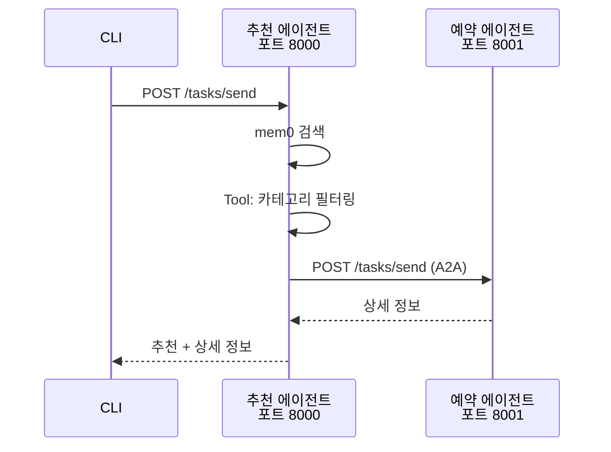

# Part 5: A2A 에이전트 (Agent-to-Agent Communication)

## 개요

Part 5에서는 여러 AI 에이전트가 협업하여 복잡한 작업을 수행하는 **Agent-to-Agent (A2A)** 통신을 학습합니다.

단일 에이전트가 모든 작업을 처리하는 대신, 각 에이전트가 전문 분야에 집중하고 HTTP 통신으로 협업하는 마이크로서비스 아키텍처를 구현합니다.

## 학습 목표

- ✅ **A2A 개념 이해**: 여러 에이전트 간 통신 및 협업 패턴
- ✅ **Google A2A 프로토콜**: 산업 표준 A2A 프로토콜 학습
- ✅ **python-a2a + FastAPI**: 가장 쉬운 A2A 구현 방법
- ✅ **mem0 메모리 시스템**: 에이전트 장기 메모리 통합
- ✅ **실전 구현**: 레스토랑 추천 시스템 (2개 독립 서버)

## 왜 A2A인가?

### 기존 방식의 한계

```python
# 단일 에이전트 (모놀리식)
agent = ChatAgent()
agent.recommend_restaurant()  # 모든 로직이 하나에 집중
agent.book_restaurant()       # 복잡도 증가
agent.analyze_reviews()       # 유지보수 어려움
```

### A2A 방식의 장점

```python
# A2A 멀티 에이전트 (마이크로서비스)
recommender = RecommenderAgent()  # 추천 전문
booking = BookingAgent()          # 예약 전문
reviews = ReviewAgent()           # 리뷰 분석 전문

# HTTP로 서로 호출 (독립 서버)
recommender.call_agent(booking, ...)
```

| 측면 | 단일 에이전트 | A2A 멀티 에이전트 |
|------|-------------|----------------|
| **복잡도** | 에이전트 로직 복잡 | 각 에이전트 단순 |
| **확장성** | 전체 수정 필요 | 새 에이전트 추가 |
| **유지보수** | 모놀리식 | 독립적 수정 가능 |
| **배포** | 전체 재배포 | 개별 에이전트 배포 |

## 학습 시간

약 1시간

- Part 5-1: A2A 아키텍처 개념 (10분)
- Part 5-2: mem0 메모리 시스템 (10분)
- Part 5-3: 레스토랑 추천 시스템 구현 (40분)

## 선수 지식

- Part 3: MCP 도구 서버 (Tools 개념)
- Python 기초 (FastAPI 경험 권장)
- HTTP REST API 기본 개념

## 구조

```
05-a2a-agents/
├── README.md                    # 이 파일
├── 01-a2a-architecture/         # A2A 개념 및 프레임워크 비교
│   ├── README.md
│   ├── concepts.md              # A2A 정의, 필요성, 역할 분담 패턴
│   └── comparison.md            # python-a2a vs CrewAI vs LangGraph
├── 02-mem0-integration/         # mem0 메모리 시스템
│   ├── README.md
│   ├── quickstart.py            # mem0 기본 사용법
│   └── agent_memory.py          # 에이전트 메모리 예제
└── 03-restaurant-agent/         # 레스토랑 추천 시스템 (메인 실습)
    ├── README.md
    ├── agents/
    │   ├── recommender_agent.py # FastAPI 서버 (포트 8000)
    │   └── booking_agent.py     # FastAPI 서버 (포트 8001)
    ├── tools/
    │   └── restaurant_search.py # RestaurantSearchTool
    ├── memory/
    │   └── mem0_client.py       # mem0 클라이언트
    ├── data/
    │   └── restaurants.json     # 레스토랑 데이터
    ├── main.py                  # CLI 클라이언트
    ├── config.py                # 설정
    ├── run_servers.sh           # 서버 실행 스크립트
    └── tests/                   # 테스트
```

## 빠른 시작

### 1. 의존성 설치

```bash
# Part 5 A2A 의존성 설치
uv sync --extra part5-a2a

# 또는 개별 설치
pip install fastapi uvicorn mem0ai httpx openai
```

### 2. Ollama 설치 및 실행

```bash
# Ollama 설치 (https://ollama.ai)
curl -fsSL https://ollama.ai/install.sh | sh

# 모델 다운로드
ollama pull qwen-vl:4b

# Ollama 서버 실행
ollama serve
```

### 3. 학습 순서

#### Step 1: A2A 개념 학습 (10분)

```bash
cd 05-a2a-agents/01-a2a-architecture

# 문서 읽기
# - README.md
# - concepts.md (A2A 정의, 필요성, 패턴)
# - comparison.md (python-a2a vs 다른 프레임워크)
```

#### Step 2: mem0 메모리 시스템 (10분)

```bash
cd 05-a2a-agents/02-mem0-integration

# Quickstart 실행
python quickstart.py

# 에이전트 메모리 예제 (Ollama 필요)
python agent_memory.py
```

#### Step 3: 레스토랑 추천 시스템 (40분)

```bash
cd 05-a2a-agents/03-restaurant-agent

# 1. 서버 실행 (터미널 2개 필요)
# 터미널 1: 추천 에이전트
uv run python agents/recommender_agent.py

# 터미널 2: 예약 에이전트
uv run python agents/booking_agent.py

# 2. Agent Card 확인
curl http://localhost:8000/.well-known/agent-card.json
curl http://localhost:8001/.well-known/agent-card.json

# 3. CLI 클라이언트 실행 (터미널 3)
# 선호도 저장
python main.py --user-id alice --message "이탈리안 좋아해"

# 레스토랑 추천 (A2A Chaining 발생!)
python main.py --user-id alice --message "배고파"
```

## 핵심 개념

### Google A2A 프로토콜

**Agent Card**: 각 에이전트가 자신의 능력을 공개

```json
{
  "name": "Restaurant Recommender",
  "description": "Recommends restaurants based on user preferences",
  "endpoints": {
    "tasks": {"send": "/tasks/send"}
  }
}
```

**Task Send**: 에이전트 간 작업 전달 표준 API

```python
# POST http://localhost:8000/tasks/send
{
  "task_id": "task_001",
  "message": "배고파, 레스토랑 추천해줘",
  "user_id": "alice"
}
```

### Agent Chaining 패턴



## 실습 예제

### 예제 1: 선호도 저장

```bash
python main.py --user-id alice --message "이탈리안 음식을 좋아해"
# 출력: ✅ 선호도가 저장되었습니다.
```

### 예제 2: 레스토랑 추천 (A2A Chaining)

```bash
python main.py --user-id alice --message "배고파"
# 출력:
# ✅ 선호도(이탈리안)를 기반으로 추천합니다:
# 1. La Trattoria
# 2. Pasta House
#
# La Trattoria 상세 정보:
# - 영업시간: 11:00-22:00
# - 전화번호: 02-1234-5678
# - 주소: 서울 강남구 논현동 123
```

**A2A 호출 순서**:
1. CLI → 추천 서버 (포트 8000)
2. 추천 서버 → mem0 (선호도 검색)
3. 추천 서버 → RestaurantSearchTool (카테고리 필터링)
4. 추천 서버 → 예약 서버 (포트 8001, A2A 호출)
5. 예약 서버 → RestaurantSearchTool (이름으로 검색)
6. 추천 서버 → CLI (최종 응답)

## 다음 단계

### 3번째 에이전트 추가

리뷰 분석 에이전트를 추가하여 3개 에이전트 시스템으로 확장:

```python
# agents/review_agent.py (포트 8002)
@app.post("/tasks/send")
async def receive_task(task: dict):
    # 레스토랑 리뷰 분석
    return {"response": "리뷰 분석 결과"}
```

### 실제 API 연동

- Google Places API
- Naver 지역 검색 API
- 카카오 맵 API

### 다른 프레임워크 시도

- CrewAI: 복잡한 멀티 에이전트 시스템
- LangGraph: 세밀한 상태 관리
- AutoGen: 대화 기반 협업

## FAQ

### Q1. Ollama가 설치되지 않아요

```bash
# macOS
brew install ollama

# Linux
curl -fsSL https://ollama.ai/install.sh | sh

# Windows
# https://ollama.ai/download에서 설치 파일 다운로드
```

### Q2. mem0 메모리가 저장되지 않아요

```bash
# SQLite DB 경로 확인
ls ~/.mem0/index.db

# 없으면 디렉토리 생성
mkdir -p ~/.mem0
```

### Q3. 서버 포트 충돌이 발생해요

```bash
# 포트 8000 사용 중인 프로세스 확인
lsof -i :8000

# 프로세스 종료
kill -9 <PID>

# 또는 config.py에서 포트 변경 후
uv run python agents/recommender_agent.py
```

### Q4. A2A 호출이 실패해요

```bash
# 두 서버가 모두 실행 중인지 확인
curl http://localhost:8000/.well-known/agent-card.json
curl http://localhost:8001/.well-known/agent-card.json

# 로그 확인 (서버 실행 시 자동 출력)
```

## 참고 자료

- [Google A2A 프로토콜](https://github.com/google/a2a)
- [python-a2a 라이브러리](https://github.com/google/python-a2a)
- [mem0 공식 문서](https://docs.mem0.ai)
- [FastAPI 공식 문서](https://fastapi.tiangolo.com)
